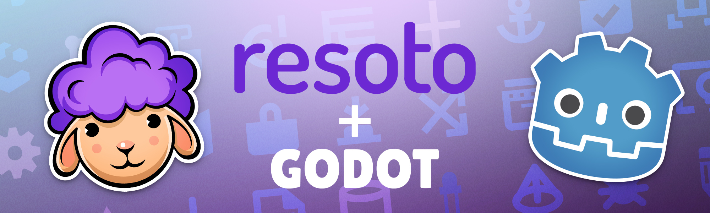
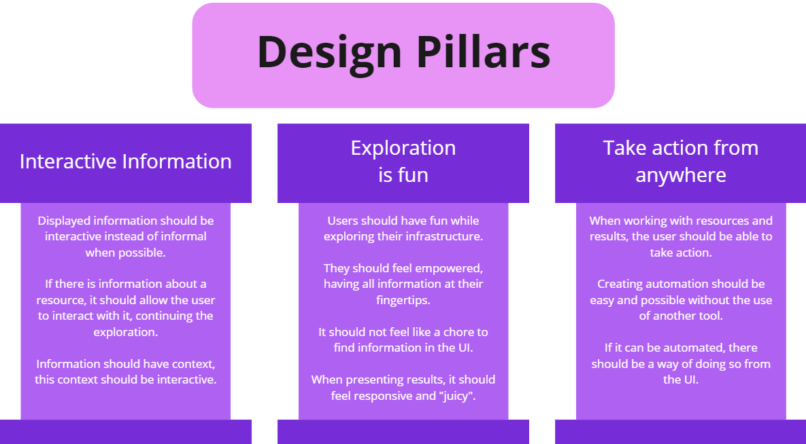
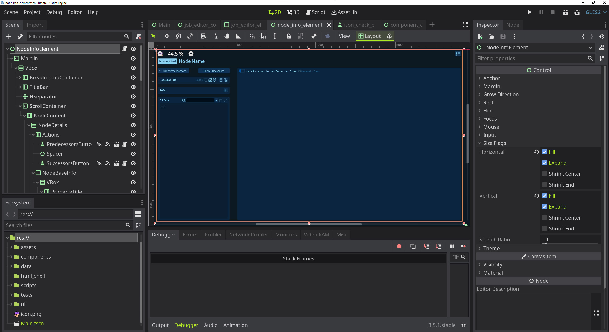
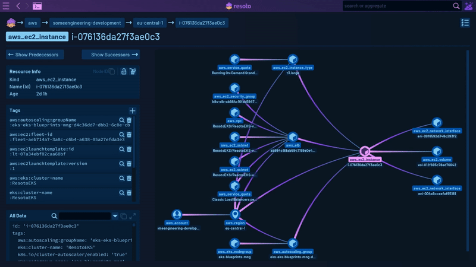

# Why We Built Resoto UI Using a Game Engine

In this blog post, I'll share the reasoning behind some of the tech stack decisions for the [Resoto UI](/docs/getting-started/explore-resoto/ui). Our goal from the outset was to build an interesting and fun UI that encourages users to explore their cloud in new and exciting ways.

<!--truncate-->

## Challenges in Building Resoto UI

One of the key challenges we faced was working with a [directed graph](/docs/edge/concepts/asset-inventory-graph), the internal data structure used by Resoto.

**We wanted to build a UI that could help users navigate this graph and discover more about their cloud infrastructure.**

:::note

While this feature is not yet available, the [Resoto UI prototype branch](https://github.com/someengineering/resoto-ui/tree/prototype) includes proof-of-concept builds that display information in a graph-based navigation component.

https://youtu.be/AVAU2JjvHug

:::

## Resoto UI Design Pillars and Goals

To establish how the UI should work and what the user experience should look like, we created three design pillars:

We also extracted a few requirements:

- Displaying large amounts of data, eventually in 3D.
- Building a sophisticated UI with reusable components.
- Remaining flexible in how our UI will work.
- Releasing a native application at some point.
- Using tools that work with our license model.

**To meet these goals, we decided to use the [Godot Engine](https://godotengine.org) to build the UI.** While there are other options available, we felt that Godot provided the best fit for our needs, especially given my familiarity with the engine.

## What Is the Godot Engine?

[Godot Engine](https://godotengine.org) is a multi-purpose game engine maintained on [GitHub](https://github.com/godotengine/godot) under the MIT license.

You build applications in Godot by combining building blocks called nodes in reusable and combinable scenes.

## Why Godot?

### Display Large Amounts of Data

Resoto is designed to work with digital infrastructures that can have hundreds of thousands of resources connected in various ways.

Displaying such large amounts of information is no easy task. However, with Godot's support for shaders, compute shaders (Godot 4), and multi-mesh instances, the engine can display hundreds of thousands of elements on the screen.

This makes Godot an ideal choice for Resoto UI, in which we plan to display large amounts of data. Although we are still working on this feature, we are already impressed with the depth, amount of information, and navigation possibilities in 3D.

### Build a Sophisticated UI with Reusable Components

Godot works with so-called _scenes_, a text-based format to save information about the used classes and nodes. The design philosophy behind it is that things are built composited and aggregated from scenes. Scenes can also be inherited, making it perfect to build new features from shareable components.

For example, Resoto Shell Lite is a main feature in the UI, but there is also a popup using the same component. Another example is the use of the Dashboards table widget to display information in the Aggregate View.

### Maintain Flexibility

**Godot scene composition helps the team stay flexible.**

With our reusable components in combination with Godot's available nodes (text edit boxes, buttons, different layout containers, tree navigation components, etc.), we can quickly prototype and experiment as continually work to improve the UX in response to user feedback.

Translating the UI to different languages is also easy, as Godot comes with a nice localization system. While Godot code can be written in different languages, [GDScript](https://gdscript.com) is easy to work with and allows quick iterations of features.

### Release a Native Application

**It is easy to release for different platforms using Godot.**

While there are still challenges, we can release and export for HTML/WASM, Windows, Linux/X11, Mac OS X, iOS, Android, and more.

Running Resoto UI as a native application gives the best performance, which is particularly important when viewing larger graphs or calculating graph layouts in quick C++ or C#.

An advantage of using Resoto as a native application is also not having to care about CORS issues—you can connect to your Resoto Core from anywhere using an application.

### Compatibility with Resoto's License Model

Resoto is open source, which works perfectly with Godot's MIT license.

## Conclusion

In conclusion, building Resoto UI with Godot was a natural choice for the team, given the engine's ability to display large amounts of data, build a sophisticated UI with reusable components, stay flexible, and release native applications for various platforms.

With Godot's support for scenes, the team can build new features from shareable components and prototype quickly using available nodes. The engine's MIT license also aligns well with Resoto's open-source approach.

**Godot has allowed us to build a UI for Resoto that is engaging, functional, and highly adaptable.**

We're excited to continue exploring the possibilities of Godot as we develop Resoto further!

## Further Reading

- [Resoto UI](/docs/getting-started/explore-resoto/ui)
- [Resoto UI repository](https://github.com/someengineering/resoto-ui)
