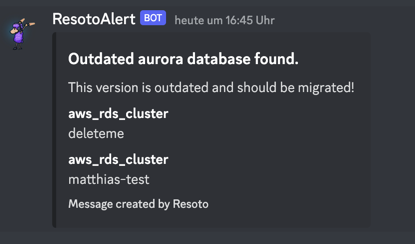

# Automation

## Command Line Interface

The heart of automation in Resoto is the [command line interface (CLI)](../../reference/cli/index.md) that allows you to interact with the system. The commands are executed server side inside Resoto - nothing is required on the client side.

Many commands are available out of the box that can be categorized into the following groups:

- search, filter and traverse the resource graph with [search commands](../../reference/cli/search-commands/index.md)
- define how the result should be rendered in with [format commands](../../reference/cli/format-commands/index.md)
- change the state of the resource graph or the resources with [action commands](../../reference/cli/action-commands/index.md)
- setup and configure the system with [setup commands](../../reference/cli/setup-commands/index.md)
- all commands that are not part of the above groups are [miscellaneous commands](../../reference/cli/miscellaneous-commands/index.md)

Several commands can be combined by piping the output of one command into the input of another command. The combination of commands allows you to create more complex and powerful actions that do exactly what you need. Several command lines can be passed to the CLI as a single unit, separated by a semicolon.

The CLI in Resoto is also extensible: you can define [custom commands](../../reference/cli#custom-commands) or extend the list of existing commands with your own [extension command](https://some.engineering/blog/2022/12/09/resoto-at-your-command).

### Example

AWS has announced end of support for its RDS Aurora PostgreSQL 10.x version ([AWS announcement](https://repost.aws/questions/QU0ligxMlJSJWhzzgKbKgytQ/announcement-amazon-aurora-postgre-sql-10-x-end-of-support-is-january-31-2023)). Let's find out if we have instances of this version in any of our accounts. We will use the [`search`](../../reference/cli/search-commands/search.md) command to filter the relevant data. All results falling out of this search are instances we need to take action on.

```shell
> search is(aws_rds_cluster) and db_type=aurora-postgresql and db_version~11
kind=aws_rds_cluster, name=deleteme, db_type=aurora-postgresql, db_version=11.13, age=7d8h
kind=aws_rds_cluster, name=matthias-test, db_type=aurora-postgresql, db_version=11.9, age=35min15s
```

Migrating databases should be a conscious task and includes good testing. We want to inform the responsible team about the upcoming end of support and give them time to plan the migration. Since our company uses Discord we use the [`discord`](../../how-to-guides/alerting/send-discord-notifications) command to send a message to a specific channel. For that to work we pipe the result of the search command into the `discord` command.

```shell
> search is(aws_rds_cluster) and db_type=aurora-postgresql and db_version~11 |
  discord title="Outdated aurora database found." message="This version is outdated and should be migrated!"
1 requests with status 204 sent.
```

which then shows this message in the related Discord channel:



### Resource Actions

We send a message to a Discord channel in our example above. There would have been a plenty of other options to take action on the result of the search command. I would like to highlight the [`http` and `https` commands](../../reference/cli/action-commands/http.md) that allows you to call any HTTP endpoint and is the preferred way to interface with any external system.

Here is a list of possible actions we could perform:

- tag the resource with the [`tag`](../../reference/cli/action-commands/tag/index.md) command

  ```shell title="Example"
  # set the tag 'owner' to 'team-cumulus' on any resource that matches the search criteria
  > search ... | tag update owner=team-cumulus
  # delete the tag 'costcenter' from on any resource that matches the search criteria
  > search ... | tag delete costcenter
  ```

- clean up the resource via the [`clean`](../../reference/cli/action-commands/clean.md) command
  ```shell title="Example"
  # mark resources for cleanup. Matching resources will be deleted during the next cleanup run.
  > search ... | clean "Reason for cleanup"
  ```
- create an alert in Pagerduty via the [`pagerduty`](../../how-to-guides/alerting/create-pagerduty-alert/index.md) command
  ```shell title="Example"
  # Create an alert in pagerduty
  > search ... | pagerduty summary="Reason for the alert" dedup_key="xyz"
  ```
- create a Jira ticket with the [`jira`](../../how-to-guides/alerting/create-jira-issues/index.md) command
  ```shell title="Example"
  # Create a ticket in Jira
  > search ... | jira title="Title of the ticket" username="..." token="..." project_id="123" reporter_id="xyz"
  ```
- send an alert to Alertmanager via [`alertmanager`](../../how-to-guides/alerting/send-prometheus-alertmanager-alerts/index.md)

  ```shell title="Example"
  # Create an alert in alertmanager
  > search ... | alertmanager name="Description of the alert"
  ```

- send a message to Slack via the [`slack`](../../how-to-guides/alerting/send-slack-notifications/index.md) command
  ```shell title="Example"
  # Send a message to Slack
  > search ... | slack title="Description of the alert"
  ```
- send a message to Discord via the [`discord`](../../how-to-guides/alerting/send-discord-notifications/index.md) command

  ```shell title="Example"
  # Send a message to Discord
  > search ... | discord title="Description of the alert"
  ```

- you can call the [`aws`](https://some.engineering/blog/2022/12/09/resoto-at-your-command) command on AWS resources. It allows all options the AWS CLI offers to change your AWS resource in any way you need.

  ```shell title="Example"
  # Stop running ec2 instances
  > search is(aws_ec2_instance) and instance_status=running and ... | aws ec2 stop-instances --instance-ids {id}
  # Start stopped ec2 instances
  > search is(aws_ec2_instance) and instance_status=stopped and ... | aws ec2 start-instances --instance-ids {id}
  ```

- send a message to an external webhook via the [`http` or `https`](../../reference/cli/action-commands/http.md) command
  ```shell title="Example"
  # Break the results of the search into chunks of 50 and send them to a webhook.
  > search ... | chunk 50 | http POST my.node.org/handle
  ```
- ensure that a resource is protected from cleanup via the [`protect`](../../reference/cli/action-commands/protect.md) command
  ```shell title="Example"
  # Protect resources from cleanup
  > search ... | protect
  ```
- adjust the metadata associated with a resource via the [`set_metadata`](../../reference/cli/action-commands/set_metadata.md) command
  ```shell title="Example"
  # Set the metadata 'owner' to 'team-cumulus' on any resource that matches the search criteria
  > search ... | set_metadata owner=team-cumulus
  ```
- adjust the desired data associated with a resource via the [`set_desired`](../../reference/cli/action-commands/set_metadata.md) command
  ```shell title="Example"
  # Set the desired data clean=false on any resource that matches the search criteria
  > search ... | set_desired clean=false
  ```

Please note: This list is not exhaustive and never will be since you can combine several commands in different ways, create your own custom commands or extend the list of existing commands with your own [extension command](https://some.engineering/blog/2022/12/09/resoto-at-your-command).

## Automate your command lines

A command line can be executed manually on the shell by a human being. It is also possible to automate the execution of commands. To automate a command line, Resoto needs to know the command line to execute and the trigger condition that defines when it should be executed. If we add a name to this construct, we have an automated command line, that is called Job in Resoto.

### Trigger

Jobs can be triggered in two ways:

1. By time: execute the command in a specific time interval. <br/> The frequency is described by a [cron expression](https://crontab.guru).

   ```bash title="Example Triggers"
   # Execute every 5 minutes
   */5 * * * *
   # Execute every day at 3am
   0 3 * * *
    # Execute every Monday at 4am
   0 4 * * MON
    # Execute on New Year's Eve one minute before midnight
   59 23 31 12 *
   ```

2. By event: execute the command when a specific event happens. Events are emitted by Resoto under certain conditions. Jobs can react to those events and execute a command line. Resoto regularly updates the state of resources and follows those four phases:

   - `collect`: in this phase all resources from all cloud providers are collected. Once this phase is done, the graph database contains the latest state of all resources.
   - `cleanup_plan`: based on the latest state of resources, Resoto will compute which resources should be cleaned up.
   - `cleanup`: in this phase all resources marked for cleanup get deleted in the correct order.
   - `generate_metrics`: after the cleanup is done, netrics are generated and provided to the Time Series Database.

   Following events are emitted by Resoto for each phase:

   | Phase | Event | Description |
   | --- | --- | --- |
   | collect | collect | All resource collectors are listening to this event and will collect the latest state of available resources. |
   |  | pre_collect | Emitted before collect is started. |
   |  | merge_outer_edges | Emitted after collect is done. |
   |  | post_collect | Emitted after collect and all outer edges have been merged. **Custom logic that wants to react to resource changes, should use this event to hook into the system.** |
   | cleanup_plan | cleanup_plan | Main event all cleanup planning actors are listening to plan the cleanup. Most cleanup plugins bundled with Resoto use this event to plan the cleanup. This event will be emitted after the collect phase. |
   |  | pre_cleanup_plan | Trigger event to hook into the system before the cleanup is planned. |
   |  | post_cleanup_plan | Trigger event to hook into the system after the cleanup is planned. |
   | cleanup | cleanup | Main event for all resource collectors to perform the cleanup. All resources marked for cleanup will be deleted. This event will be emitted after the cleanup_plan phase. |
   |  | pre_cleanup | Trigger event to hook into the system before the cleanup is performed. |
   |  | post_cleanup | Trigger event to hook into the system before the cleanup is performed. |
   | generate_metrics | generate_metrics | This event is used to generate metrics. This event will be emitted after the cleanup phase. |
   |  | pre_generate_metrics | Trigger event to hook into the system before the generate_metrics is performed. |
   |  | post_generate_metrics | Trigger event to hook into the system before the generate_metrics is performed. |

### Define Jobs

If you made it this far, you know how to interact with the CLI and what a trigger is. Now we can combine both to define a job.

The [`jobs`](../../reference/cli/action-commands/jobs) command is used to create, update, delete and list jobs.

In our example above we used a search to find deprecated AWS RDS instances and send a message to Discord, so people can migrate to a supported engine version. While this is a good start, it is not very useful if we have to execute the command line manually in a recurring fashion. In this specific case, we do not want to spam our Discord channel with messages too often. Hence we define a trigger that executes the command line only once a week on Monday mornings. The relevant teams will then have enough time to migrate the database to a supported engine version. If they forget about it, they get a reminder the next week.

```shell title="Send a Discord message every Monday Morning and inform about deprecated RDS instances"
> jobs add
  --id outdated_aurora
  --schedule "0 9 * * 1" 'search is(aws_rds_instance) and db_type=aurora-postgresql and db_version~11
  | discord title="Outdated Aurora databases found." message="This version is outdated and should be migrated!"'
```

This job will be stored inside Resoto and executed every Monday morning at 9am. You might want to update this job whenever AWS declares end of life for a specific engine version, but you do not need to worry that such a database will be missed in the future.

The example job above used a time trigger. For checks that are more critical, you want to raise an alert as soon as the condition is met. In this case, you can use an event trigger. The following example will raise a pagerduty alert if a database is created or updated, that is public to the internet. Publicly accessible databases could expose sensitive data to bad actors and should be avoided.

```shell title="Raise a Pagerduty alert if a database is created or updated that is public to the internet"
> jobs add
  --id alert_public_dbs
  --wait-for-event post_collect
  'search is(database) and db_publicly_accessible==true
  | pagerduty summary="Databases found that are public to the internet" dedup_key="dbs_publicly_accessible"'
```

Every job is active by default. You can deactivate a job via `jobs deactivate <job_id>`. In this case the trigger of the job still exists but will not fire if the condition is met. This can be useful when you want to temporarily disable a job.

The `jobs` command has multiple subcommands that allow you to create, update, manipulate or delete jobs. You can use `help jobs` to get an overview of all available subcommands.

## Conclusion

The CLI is a powerful way to interact with your resources. Jobs take this ability one step further and allow you to automate your command lines.
