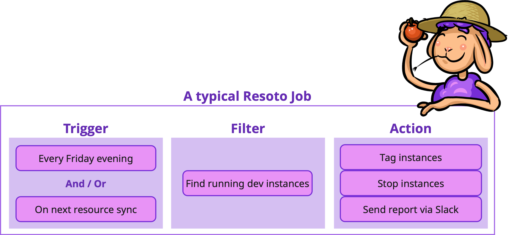

# Automation

Maintaining a sound cloud infrastructure includes tasks that need to be performed regularly. Resoto can help you automate many of these tasks by defining jobs.

Examples of these tasks include:

- enforcing company policies (e.g., [tagging](../../how-to-guides/cleanup/clean-up-untagged-resources.md)),
- sending notifications about critical infrastructure changes (e.g., to [Slack](../../how-to-guides/alerting/send-slack-notifications/index.md), [Discord](../../how-to-guides/alerting/send-discord-notifications/index.md), or [PagerDuty](../../how-to-guides/alerting/create-pagerduty-alerts/index.md)), and
- cleaning up unused resources in your development accounts.

## Jobs

**A job is a sequence of commands or command lines that is executed by Resoto at a specific time interval or when a specific event is emitted.**

Jobs in Resoto are similar to Unix cron jobs. However, while cron jobs run only on a specific schedule, Resoto jobs can also be triggered based by events.



The typical structure of a job has three parts: a [trigger](#job-triggers), an optional [filter](#job-filter), and an [action](#job-actions).

### Job Triggers

The job trigger defines when a job is executed. There are three types of job triggers:

- **Schedule Trigger**

  A schedule trigger executes a job at a specific time interval described by a [cron expression](https://crontab.guru).

  <details>
  <summary>Examples</summary>
  <div>

  - Every 5 minutes
    ```bash
    */5 * * * *
    ```
  - Every day at 3:00am
    ```bash
    0 3 * * *
    ```
  - Every Monday at 4:00am
    ```bash
    0 4 * * MON
    ```
  - Every New Year's Eve at 11:59pm
    ```bash
    59 23 31 12 *
    ```

  </div>
  </details>

- **Event Trigger**

  An event trigger executes a job when a specific event is emitted by Resoto.

  Resoto emits events whenever things happen in your system. See [Cloud Data Sync and Actions](../cloud-data-sync/index.md) that describes which event is emitted at which point in time.

  <details>
  <summary>Example</summary>
  <div>

  - `collect_done` is emitted when the latest state of resources is collected and available. This event is useful if you want to perform an action on the latest state of resources.
  - `cleanup_plan` is emitted to start the process of planning the cleanup. This event is useful if you want to mark resources for cleanup based on your cleanup policy.

  </div>
  </details>

- **Combined Schedule + Event Trigger**

  A combined trigger combines a schedule trigger with an event trigger, and executes a job when a specific event is emitted after a schedule trigger is fired.

  Combined triggers are useful if you want to perform an action on a specific schedule, but only after a specific event is fired.

  <details>
  <summary>Example</summary>
  <div>

  Let's say you want to clean up development accounts at the end of each week.

  ```bash title="Schedule trigger"
  0 22 * * FRI
  ```

  You could define both a [schedule trigger](#schedule-trigger) (e.g., every Friday at 10pm) that combines with a `cleanup_plan` [event trigger](#event-trigger).

  ```bash title="Event trigger"
  cleanup_plan
  ```

  The combination of the two triggers ensures that you execute the job based on the latest state of resources after 10pm each Friday.

  </div>
  </details>

### Job Filter & Actions

When a job trigger fires the job needs to perform an action on the resources of interest. So we need to define two things for a job:

- **Job Filter** is a [search command](../../reference/search/index.md) that returns the resources of interest. Only resources matching the filter will be processed by the job.

  <details>
  <summary>Example</summary>
  <div>

  ```bash title="Instances without an owner tag in the dev or playground accounts"
  search is(instance) and tag.owner==null and /ancestors.account.reported.name in ["dev", "playground"]
  ```

  </div>
  </details>

- **Job Actions** are [action commands](../../reference/cli/action-commands/index.md) performed on resources matching the [filter](#job-filters).

  <details>
  <summary>Examples</summary>
  <div>

  - Update resource tags using the [`tag update` command](../../reference/cli/action-commands/tag/update.md)
    ```bash
    > search ... | tag update owner=team-cumulus
    ```
  - Delete resource tags using the [`tag delete` command](../../reference/cli/action-commands/tag/delete.md)
    ```bash
    > search ... | tag delete costcenter
    ```
  - Clean up resources using the [`clean` command](../../reference/cli/action-commands/clean.md)
    ```bash
    > search ... | clean "Reason for cleanup"
    ```
  - [Create PagerDuty alerts](../../how-to-guides/alerting/create-pagerduty-alerts/index.md) using the `pagerduty` [custom command](../../reference/cli/index.md#custom-commands)
    ```bash
    > search ... | pagerduty summary="Reason for the alert" dedup_key="xyz"
    ```
  - [Send Prometheus Alertmanager alerts](../../how-to-guides/alerting/send-prometheus-alertmanager-alerts/index.md) using the `alertmanager` [custom command](../../reference/cli/index.md#custom-commands)
    ```bash
    > search ... | alertmanager name="Description of the alert"
    ```
  - [Send Slack notifications](../../how-to-guides/alerting/send-slack-notifications/index.md) the `slack` [custom command](../../reference/cli/index.md#custom-commands)
    ```bash
    > search ... | slack title="Description of the alert"
    ```
  - [Send Discord notifications](../../how-to-guides/alerting/send-discord-notifications/index.md) the `discord` [custom command](../../reference/cli/index.md#custom-commands)
    ```bash
    > search ... | discord title="Description of the alert"
    ```
  - Modify AWS resources using the `aws` command
    ```bash
    # Stop running ec2 instances
    > search is(aws_ec2_instance) and instance_status=running and ... | aws ec2 stop-instances --instance-ids {id}
    # Start stopped ec2 instances
    > search is(aws_ec2_instance) and instance_status=stopped and ... | aws ec2 start-instances --instance-ids {id}
    ```
  - Send data to a webhook server using the [`http` command](../../reference/cli/action-commands/http.md)
    ```bash
    # Break the results of the search into chunks of 50 and send them to a webhook.
    > search ... | chunk 50 | http POST my.node.org/handle
    ```
  - Protect resources from cleanup using the [`protect` command](../../reference/cli/action-commands/protect.md)
    ```bash
    > search ... | protect
    ```
  - Edit resource metadata using the [`set_metadata` command](../../reference/cli/action-commands/set_metadata.md)
    ```bash
    > search ... | set_metadata owner=team-cumulus
    ```

  </div>
  </details>

Filter and Action can be combined by piping the output of the filter command into one or more action commands building a command line. If a more complex process is required, you can also define multiple command lines (multiple filter & actions) separated by a semicolon. Resoto will execute each command line in order, once the related job trigger is fired.

### Combining Triggers, Filters & Actions

The combination of triggers, filters and actions is called a Job. There is a [`jobs`](../../reference/cli/action-commands/jobs/index.md) command that allows you to create, update, delete and list jobs.

<details>
<summary>Example</summary>
<div>

```bash title="Create a job that sends a discord message for compute instances without an owner tag"
> jobs add --id no_owner_tag_in_dev --wait-for-event collect_done
  'search is(instance) and tag.owner==null and /ancestors.account.reported.name in ["dev", "playground"]
   | discord --title "[DEV] Compute instances without owner tag"
             --message "There are compute instances in the dev accounts without owner tag:"'
```

```bash title="Create a job that marks all compute instances without an owner tag for cleanup on Friday evening"
> jobs add --id no_owner_mark_cleanup --schedule "0 22 * * FRI" --wait-for-event cleanup_plan
  'search is(instance) and tag.owner==null and /ancestors.account.reported.name in ["dev", "playground"]
   | clean "Compute instances without owner tag"'
```

```bash title="List all available jobs"
> jobs list
id: no_owner_tag_in_dev
command: search is(instance) and tag.owner==null and /ancestors.account.reported.name
  in ["dev", "playground"] | discord --title "[DEV] Compute instances without owner tag"
  --message "There are compute instances in the dev accounts without owner tag:"
active: true
trigger:
  message_type: collect_done

---
id: no_owner_mark_cleanup
command: search is(instance) and tag.owner==null and /ancestors.account.reported.name
  in ["dev", "playground"] | clean "Compute instances without owner tag"
active: true
trigger:
  cron_expression: 0 22 * * FRI
wait:
  message_type: cleanup_plan
```

</div>
</details>

Jobs are persisted in the Resoto database. Resoto will ensure to run the job once one of the trigger conditions fires.

## Related How-To Guides

- [How to Create an Event-Based Job](../../how-to-guides/automation/create-an-event-based-job.md)
- [How to Create a Scheduled Job](../../how-to-guides/automation/create-a-scheduled-job.md)

## Further Reading

- [Jobs Command](../../reference/cli/action-commands/jobs/index.md)
- [Cloud Data Sync](../cloud-data-sync/index.md)
- [Command-Line Interface](../../reference/cli/index.md)
