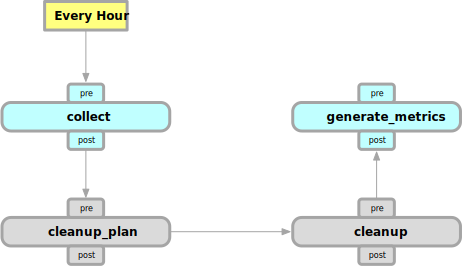
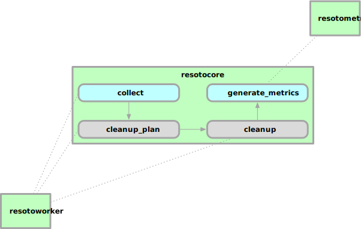

# Workflow

A workflow is a set of steps that implements a finite state machine, where every step performs a specific action.

Workflows can be triggered on a schedule or by an event.

While we want to enable users to create and manipulate workflows on their own, there is currently only one hardcoded workflow that ships with Resoto, which is illustrated in the following diagram:

This workflow is triggered by time and runs every hour.

According to this workflow, the following actions are performed every full hour:

- `collect` All configured cloud providers are triggered to collect the available cloud resources.

  The collected resources are given to the core and update the internal database.
  After this step is done, all cloud resources should be available to Resoto.

- `cleanup_plan` This step allows selection of resources that should be cleaned up.

  Out of the box, Resoto will select expired resources if `resotoworker` is started with the relevant command-line flag (`--cleanup-expired`). Users can hook into this step to select resources, that they think should be cleaned up.
  After this step is done, all resources that should be cleaned up are marked internally in resotocore.

- `cleanup` When cleanup is enabled in resotoworker (`--cleanup`), this step will select all resources that are marked for cleanup and will delete them.

  After this step is done, all resources that were marked for cleanup are handled.

- `generate_metrics` This step will perform several queries to get updated metrics. Since the incoming data only changes during the next collect run, the metrics can be safely generated here and cached until the next collect run.

:::note
Every step shown in this diagram has an additional `pre` and `post` action. Those actions exist, to allow additional customization. If you want to trigger functionality after `collect` is done, it would be possible to react on the `post_collect` action for example.
:::

The following diagram shows how `resotoworker` and `resotometrics` use the default workflow.

- `resotoworker` waits for the `collect` action. Once this is received, it will run all configured cloud providers to collect the available cloud resources. It will also listen to the `cleanup_plan` action in case expired resources should be cleaned up.
- _resotometrics_ will wait for the `generate_metrics` action. Since this action is performed after the collect step, the metrics operate on the latest available snapshot of data.

