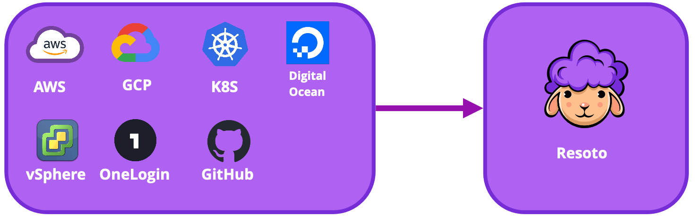
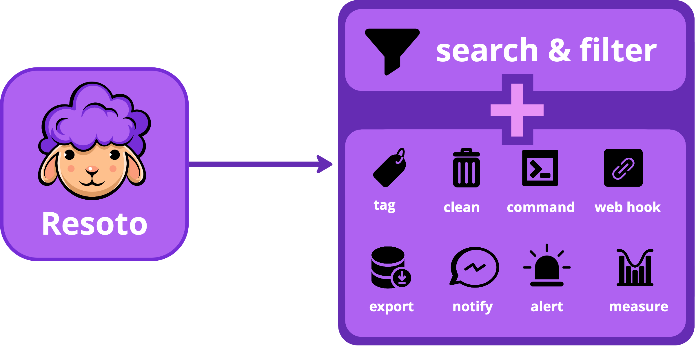

# Cloud Data Sync

In today's fast-paced and ever-changing cloud infrastructure, keeping track of the large number of resources in your infrastructure can be challenging. This is especially true for organizations with multiple teams and engineers working in multiple cloud accounts and regions.

Resoto's cloud data sync runs continuously in the background, collecting information about your cloud resources and triggering actions in response to changes. The cloud data sync process is a [workflow](../../reference/workflows/index.mdx) that runs every hour.

## Resource Collection

Resoto routinely extracts and transforms infrastructure data from cloud provider and SaaS APIs, storing snapshots of your infrastructure in its [asset inventory graph database](../asset-inventory-graph/index.mdx).

A complete view of your infrastructure is the foundation for insights, metrics, and [automation](../automation/index.mdx), as it allows you to understand the current state of your infrastructure and identify issues. Costly security vulnerabilities, compliance issues, and unused resources can be monitored by Resoto.

Resoto's pluggable architecture allows it to collect data from multiple [cloud providers](../../getting-started/configure-resoto/index.mdx).

Each collector plugin includes logic to extract data from the cloud provider API and map it to Resoto's [unified data model](../../reference/unified-data-model/index.mdx). This mapping allows you to interact with resources across cloud providers in a consistent fashion. Each resource has `id`, `name`, `kind`, `tags`, `created_at`, and `updated_at` properties, in addition to `cloud`, `account`, and `region` data denoting the location of the resource.

Resource collector plugins not only index your infrastructure, but also gather data about resource relationships to connect resources in the [asset inventory graph](../asset-inventory-graph/index.mdx).

Collectors are designed to be run in parallel, which allows for fast and efficient data collection. Each collector reports the latest state of your resources to Resoto, which then writes the data to the internal graph database.

## Reacting to Infrastructure Changes

After resource collection is complete, the [asset inventory graph database](../asset-inventory-graph/index.mdx) contains a complete and up-to-date view of your infrastructure available.

Resoto can monitor your infrastructure using the data in the graph and automatically perform specified actions when conditions are met.

### Metrics Generation

[Resoto Metrics](../../reference/components/metrics.mdx) calculates configured metrics at this point and stores them in a time-series database.

Resoto ships with a set of predefined metrics, but you can also define your own metrics for custom dashboards and alerts.

### Resource Management

Resoto has built-in action plugins for [resource management](../resource-management/index.mdx) that also run in this phase of the cloud data sync process.

These plugins can be activated via the [Resoto Worker configuration](../../reference/configuration/worker.mdx).

:::tip

See [Plugins](../../reference/components/plugins/index.mdx) for a full list of available plugins.

:::

### Custom Automations

Last but not least, you can define your rules and actions in this phase. [Jobs](../automation/index.mdx#jobs) can be triggered at specific points in the cloud data sync process with an [event trigger](../automation/index.mdx#event-trigger), or on a schedule using a [schedule trigger](../automation/index.mdx#schedule-trigger).

## Further Reading

- [Events](../../reference/events/index.mdx)
- [Workflows](../../reference/workflows/index.mdx)
