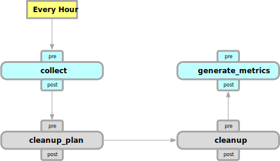

# Collect and Cleanup

Resoto scrapes your infrastructure on regular schedule and ensures, that you always have the latest information about your cloud resources. Time series metrics are derived from the snapshot data, which also require the latest state of things at all time. Resoto has the concept of automated jobs, that will be triggered as part of the collect and cleanup cycle.

The collect and cleanup cycle is implemented as a set of steps, that are executed in a specific order. In Resoto we call this set of steps a workflow. There is also a related [`workflows`](../../reference/cli/action-commands/workflows) command in the [command-line interface](../../reference/cli/action-commands/workflows) command, that can be used to inspect and run workflows on demand.

:::note

The available workflows in Resoto are currently hardcoded. This means, that you cannot create or modify workflows on your own.

:::

By default Resoto triggers a single workflow once every hour. This workflow is called `collect_and_cleanup` and is defined as follows:

:::note

Every step shown in this diagram has an additional `pre` and `post` action. Those actions exist, to allow additional customization. If you want to trigger functionality after `collect` is done, it would be possible to react on the `post_collect` action for example.

:::

The following steps are executed in this order:

- `collect` All configured cloud providers are triggered to collect the available cloud resources.

  The collected resources get synchronized with the internal graph. After this step is done, all cloud resources are up to date and available to the user.

- `cleanup_plan` This step allows selection of resources that should be cleaned up.

  Resoto has a set of predefined cleanup plugins, that can be enabled in the `resoto.worker` configuration. Those plugins will select resources that should be cleaned up. Please refer to the related plugin to get more information about the selection criteria. Resoto will also allow Users to hook into this step to select resources, that they think should be cleaned up. This is usually done via an [automated job](../automation/index.md) that is triggered by the `cleanup_plan` event. After this step is done, all resources that should be cleaned up are marked as such in the graph.

- `cleanup` When cleanup is enabled in resotoworker (default: disabled), this step will select all resources that are marked for cleanup and will delete them.

  After this step is done, all resources that were marked for cleanup are handled.

- `generate_metrics` This step will perform several queries to get updated metrics. Since the incoming data only changes during the next collect run, the metrics can be safely generated here and cached until the next collect run.

  You can adjust the metrics that should be generated by editing the `resoto.metrics` configuration.
