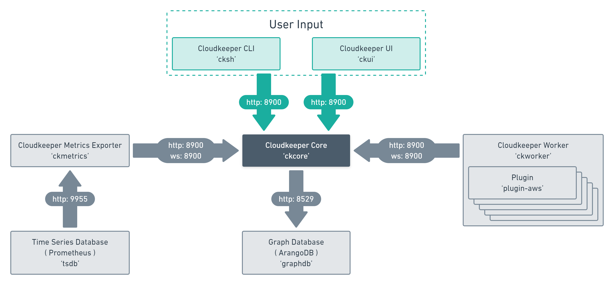

```mdx-code-block
import { useCurrentSidebarCategory } from '@docusaurus/theme-common';
import DocCardList from '@theme/DocCardList';
```

# Components

- [Resoto Core](./core.md) maintains the [directed multigraph](<https://en.wikipedia.org/wiki/Multigraph#Directed_multigraph_(edges_with_own_identity)>).
- [Resoto Worker](./worker.md) loads [plugins](https://github.com/someengineering/resoto/tree/main/plugins) to perform collect and cleanup operations.
- [Resoto Shell](./shell.md) allows for interactions with `resotocore`.
- [Resoto Metrics](./metrics.md) is a [Prometheus exporter](https://prometheus.io/docs/instrumenting/exporters).



<DocCardList items={useCurrentSidebarCategory().items}/>
