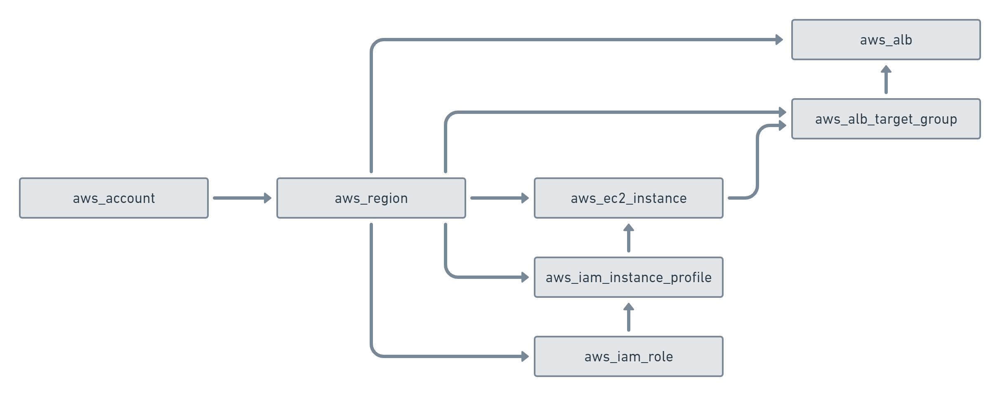

# Graph Edge

Nodes in the graph are connected via edges. Edges in the graph are directed, starting from a node pointing to a node.

In order to traverse the graph in a meaningful way, it is important to understand the structure of the graph. The following model is only a subset of the graph model you will find in Resoto, but illustrates how we can "walk" edges in the graph:

All of the resources in AWS are placed in a region. The region is one node in the graph.

If we want to find all resources in the graph, we need to walk _outbound_  (following the edges in direction of the arrow).

If we want to know the account of a specific resource, we need to walk _inbound_  (following the edge in reverse direction of the arrow) in the graph until we find an account.
