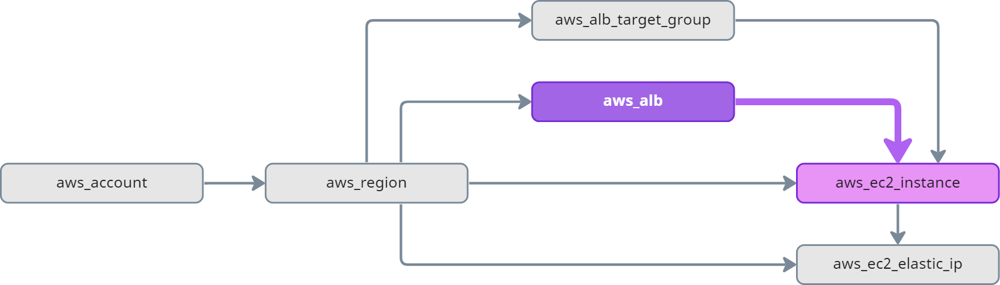

# Graph Edge

Nodes in the graph are connected via edges. Edges in the graph are directed, starting from a node pointing to a node.

## Traversing the Graph

In order to traverse the graph in a meaningful way, it is important to understand the structure of the graph. The following model is only a subset of the graph model you will find in Resoto, but illustrates how we can "walk" edges in the graph:

All resources in AWS are placed in a region. The region is a node in the graph.

If we want to find all resources in the graph, we need to walk _outbound_ (following the edges in direction of the arrow).

If we want to know the account of a specific resource, we need to walk _inbound_ (following the edge in reverse direction of the arrow) in the graph until we find an account.

## Traversal Terminology

### Successor

**Successor nodes are _directly_ connected to the current node in an _outbound_ direction.**

[Descendants](#descendant) are a subset of successors (descendants are successors at depth 1).

:::tip Example

`aws_ec2_instance` is a **successor** of `aws_alb`:

:::

### Descendant

**Descendant nodes are _directly or indirectly_ connected to the current node in an _outbound_ direction (at any depth).**

Descendants are a subset of [successors](#successor) (descendants are successors at depth 1).

:::tip Example

`aws_ec2_instance` and `aws_ec2_elastic_ip` are **ancestors** of `aws_alb`:

:::

### Predecessor

**Predecessor nodes are _directly_ connected to the current node in an _inbound_ direction.**

Predecessors are a subset of [ancestors](#ancestor) (predecessors are ancestors at depth 1).

:::tip Example

`aws_region`, `aws_alb`, and `aws_alb_target_group` are **predecessors** of `aws_ec2_instance`:

:::

### Ancestor

**Ancestor nodes are _directly or indirectly_ connected to the current node in an _inbound_ direction (at any depth).**

[Predecessors](#predecessor) are a subset of ancestors (predecessors are ancestors at depth 1).

:::tip Example

`aws_region`, `aws_alb`, `aws_alb_target_group`, and `aws_account` are **ancestors** of `aws_ec2_instance`:

:::

## Further Reading

- [Search Traversals](../../reference/search/traversals.md)
- [`ancestors` Command](../../reference/cli/search-commands/ancestors.md)
- [`descendants` Command](../../reference/cli/search-commands/descendants.md)
- [`predecessors` Command](../../reference/cli/search-commands/predecessors.md)
- [`successors` Command](../../reference/cli/search-commands/successors.md)
