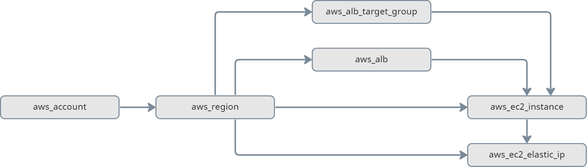
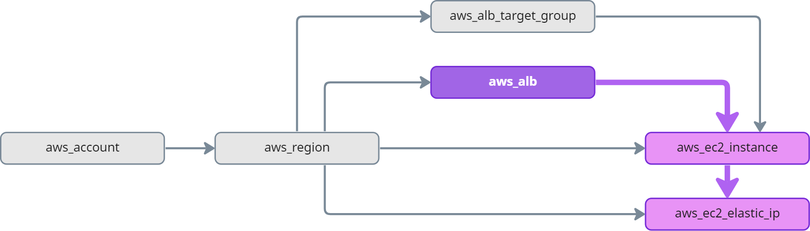
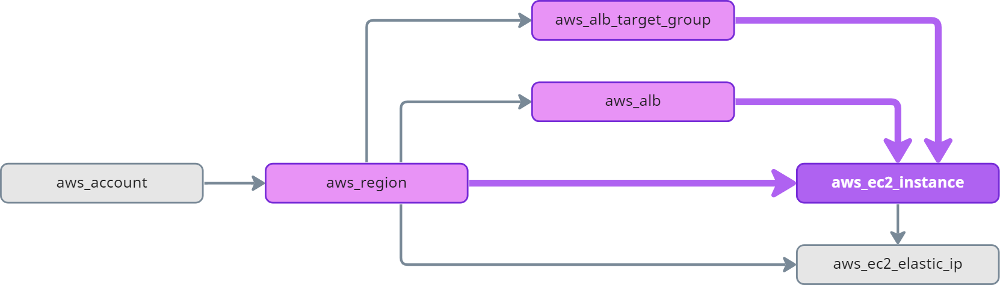
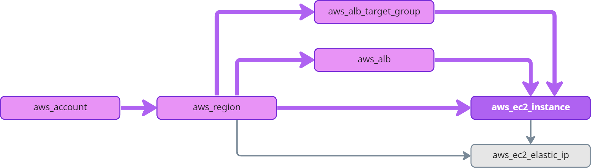

# Asset Inventory Graph

```mdx-code-block
import ZoomPanPinch from '@site/src/components/ZoomPanPinch';
```

Resoto scrapes resources from your cloud providers. This data is the source of truth for all of Resoto's features. All resources from all cloud providers, accounts, regions and all resource types become nodes in the graph.

Resoto also knows how resources relate to each other. For example, a compute instance might have a volume and is attached to a network interface. The same compute instance might be the target of a load balancer, which is inside a security group, which itself is inside a VPC. All of these relationships are encoded as edges in the graph.

The superpower of Resoto is the ability to provide a complete picture of your cloud assets and how they relate to each other.

## Nodes

Every resource that is collected is a node in the graph. The information is encoded as a JSON document with a well-defined structure. Resoto ensures, that you can expect the following properties on every resource:

| Property | Type     | Description                                                                                                      |
| -------- | -------- | ---------------------------------------------------------------------------------------------------------------- |
| `id`     | string   | The cloud providers unique ID of a resource. This identifier might not be unique over different cloud providers. |
| `kind`   | string   | The kind of the resource. See [Resource Kinds](#resource-kinds) for more information.                            |
| `name`   | string   | The name of the resource. Resoto tries its best to map the relevant property for that matter.                    |
| `ctime`  | datetime | The time the resource has been created.                                                                          |
| `mtime`  | datetime | The time the resource has been modified the last time.                                                           |
| `atime`  | datetime | The time the resource has been accessed the last time.                                                           |

Resources have a lot more properties which are available in the JSON document. The structure of the JSON document is defined by the resource kind.

## Resource Kinds

There is a plethora of resource types. Resoto captures all of this information and makes it available to you. To ensure you get consistent data, Resoto defines a set of resource kinds. Every resource type is mapped to one of these kinds. Resoto will ensure that the data you get for a specific kind adheres to the schema defined for that kind. The kind of resource is defined in the `kind` property of the resource. See the list of all resource kinds in our [data model reference section](../../reference/data-models/index.md).

<ZoomPanPinch>


</ZoomPanPinch>

The same resource can adhere to multiple resource kinds. This makes it possible to allow to view the same resource in more than one way. For example, an AWS EC2 volume can be viewed as `aws_ec2_volume`, as compute `volume`, as `aws_resource` and as `resource`. This ability can be powerful, if you want to search the graph using more abstract concepts. For example, it allows to select all volumes, regardless of the cloud provider.

The Resoto CLI comes with the [`kinds`](../../reference/cli/search-commands/kinds.md) command, which allows you to list all resource kinds and their properties.

## Edges

Resoto also captures the relationships between resources. This is done by encoding the relationships as edges in the graph. This makes it possible to traverse the graph and walk from one resource to another based on a specific relationship. The relationship itself does not have any additional properties.

The list of possible edges are also defined explicitly in our [data model reference section](../../reference/data-models/index.md). Another option is the [`kinds`](../../reference/cli/search-commands/kinds.md) command to get the same information on the command line.

<ZoomPanPinch>


</ZoomPanPinch>

This documentation describes how a resource might be connected. This does not mean that every relationship has to exist. For example, a compute instance might not have a volume attached to it. In this case, there is no edge between the compute instance and the volume.

## Traversing the Graph

In order to traverse the graph in a meaningful way, it is important to understand the structure. The following diagram serves as an example graph you will find in Resoto to illustrates how we can "walk" edges in a graph:



All resources in AWS are placed in a region. The region is a node in the graph. If we want to find all resources in the graph, we need to walk _outbound_ (following the edges in direction of the arrow). If we want to know the account of a specific resource, we need to walk _inbound_ (following the edge in reverse direction of the arrow) in the graph until we find an account.

### Successor

**Successor nodes are _directly_ connected to the current node in an _outbound_ direction.**

`aws_ec2_instance` is a **successor** of `aws_alb`:


### Descendant

**Descendant nodes are _directly or indirectly_ connected to the current node in an _outbound_ direction (at any depth).**

`aws_ec2_instance` and `aws_ec2_elastic_ip` are **ancestors** of `aws_alb`:



### Predecessor

**Predecessor nodes are _directly_ connected to the current node in an _inbound_ direction.**

`aws_region`, `aws_alb`, and `aws_alb_target_group` are **predecessors** of `aws_ec2_instance`:



### Ancestor

**Ancestor nodes are _directly or indirectly_ connected to the current node in an _inbound_ direction (at any depth).**

`aws_region`, `aws_alb`, `aws_alb_target_group`, and `aws_account` are **ancestors** of `aws_ec2_instance`:



## Further Reading

- [Search Traversals](../../reference/search/traversals.md)
- [`ancestors` Command](../../reference/cli/search-commands/ancestors.md)
- [`descendants` Command](../../reference/cli/search-commands/descendants.md)
- [`predecessors` Command](../../reference/cli/search-commands/predecessors.md)
- [`successors` Command](../../reference/cli/search-commands/successors.md)
