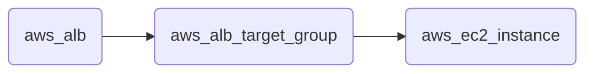

# `with` Search Clause

The `with` clause can be useful, in case you want to select elements and ensure a certain "position" in the graph, meaning that you want to make sure there are specific edges existent to specific other nodes.

The `with` clause enables us to ensure defined relationships or positions in the graph without selecting their related nodes.

:::tip Example



Let's say we want to select all ALB target groups where there is no EC2 instance using the ALB:

```bash
> search is(aws_alb_target_group) with (empty, --> is(aws_ec2_instance))
```

1. The `is(aws_alb_target_group)` part selects all aws_alb_target_groups.
2. The `with` part filters this list by ensuring a defined graph structure.
3. The defined graph structure is described by `(empty, <-- is(aws_ec2_instance))` and says:
   - traverse the graph inbound and filter all aws_ec2_instances
   - count the resulting nodes
   - select the aws_alb_target_group if there are no resulting nodes for this node
   - the result will not have any data from the graph traversal of the with clause

:::

## Criteria

The `with` clause has three forms:

### Empty Match

No result is allowed in order to select the node.

:::tip Example

```bash
<filter> with (empty, <navigation> [filter])
```

:::

The first filter will select elements. With every element a graph traversal is done following the navigation and filter in the with clause.

### At Least One Match

The `with` clause needs to select at least one matching node in order to select the filtered node.

:::tip Example

```bash
<filter> with (any, <navigation> [filter])
```

:::

### Exact Number of Matches

The `with` clause needs to select the specified amount of matching nodes in order to select the filtered node.

:::tip Example

```bash
<filter> with (count==3, <navigation> [filter])
```

:::

## Nesting

The `with` clause can be nested.

Inside a with clause, you can use another with clause for nested expectations. The outermost element is filtered only if the outermost with clause holds, which includes that all inner with clauses have to match as well.

This is a powerful construct to define queries to match a defined graph structure or to select nodes which are not in a predefined graph structure.
