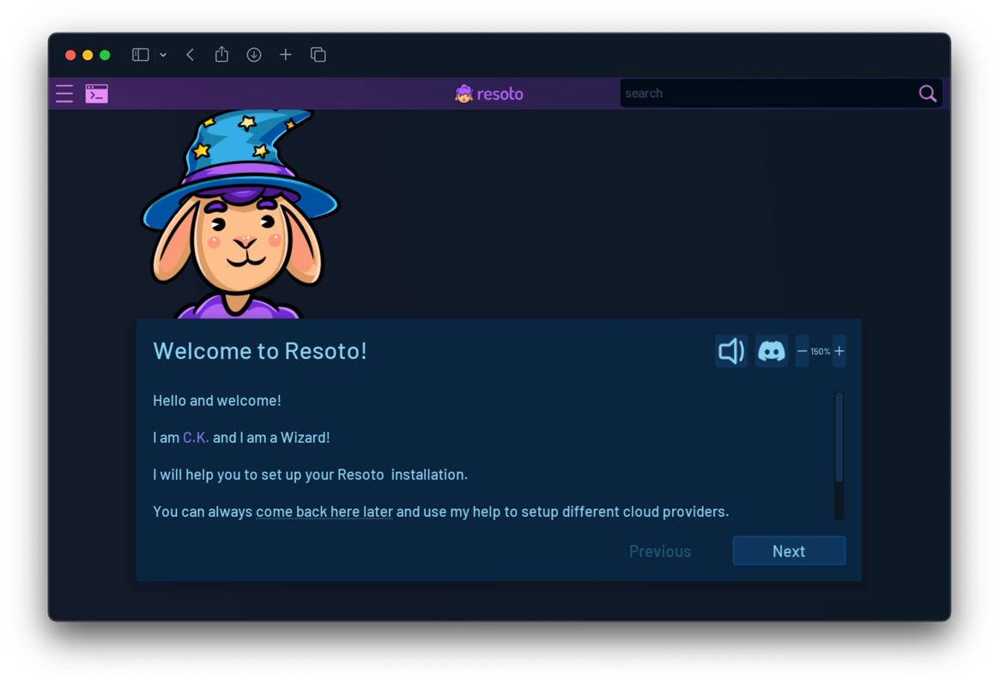
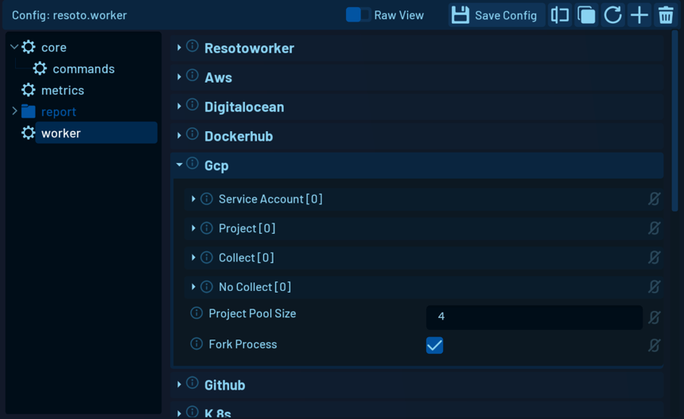

# Configure Resoto

```mdx-code-block
import DocCardList from '@theme/DocCardList';
import TabItem from '@theme/TabItem';
import Tabs from '@theme/Tabs';
```

Resoto needs to be configured to authenticate with your cloud providers so it can access your resources.

## Cloud Provider specific setup

<Tabs groupId="cloud-providers">
<TabItem value="aws" label="AWS">

Resoto requires a [set of required permissions](../../reference/permissions/aws.md) to access your AWS resources. We provide a CloudFormation template that creates a role with the required permissions. You can use this template to roll out the permissions to your entire organization. See [How to Roll Out Resoto AWS Permissions with CloudFormation](../../how-to-guides/configuration/roll-out-resoto-aws-permissions-with-cloudformation/index.md) for a step-by-step guide.

</TabItem>
</Tabs>

## Resoto Setup Wizard

When you open ResotoUI for the first time, you will see a Setup Wizard that will guide you through the initial setup of Resoto. The Setup Wizard allows you to configure one or more cloud providers. Each cloud provider has their own way of authentication, so you will need to follow the instructions for each provider.



After you completed the setup wizard, you can start using Resoto.

## Resoto Detailed Configuration (optional)

The setup wizard is a simplified version of the more complex Resoto configuration and helps with the initial setup.

Every detail in Resoto can be adjusted at any time using the [Configuration Editor](../../reference/user-interface/configuration-editor.md).

You can find detailed information about the configuration options for each cloud provider in the [Cloud Provider Reference](../../reference/configuration/cloudprovider/index.md).


