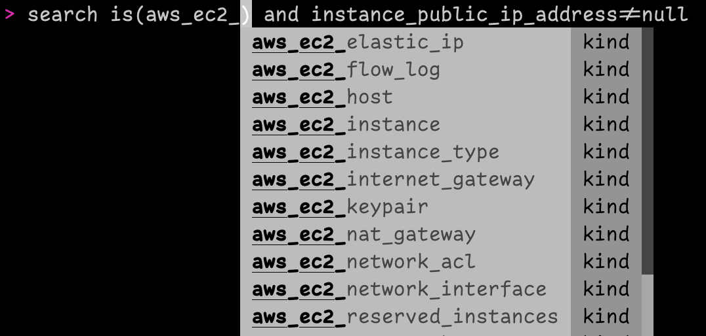

# Resoto Shell

Resoto Shell is Resoto's command-line interface.

## `help` Command

Use the `help` command to list all available commands, or `help <command name>` to view information about a specific command.

## Tab Completion

Resoto Shell has auto-complete functionality for command and resource kind names, making it much easier to create commands and queries.

## Further Reading

- [Command-Line Interface](../../../reference/cli/index.mdx)
