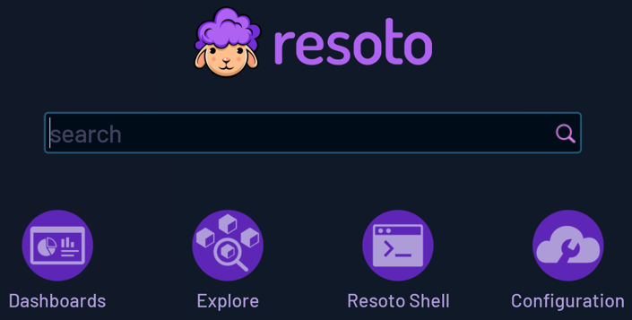
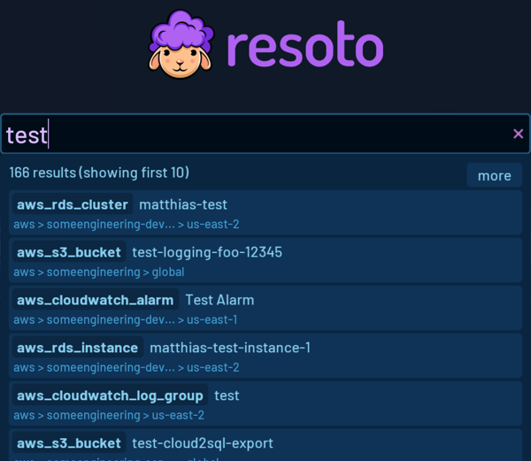
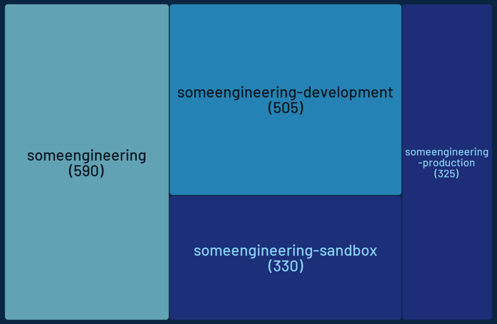
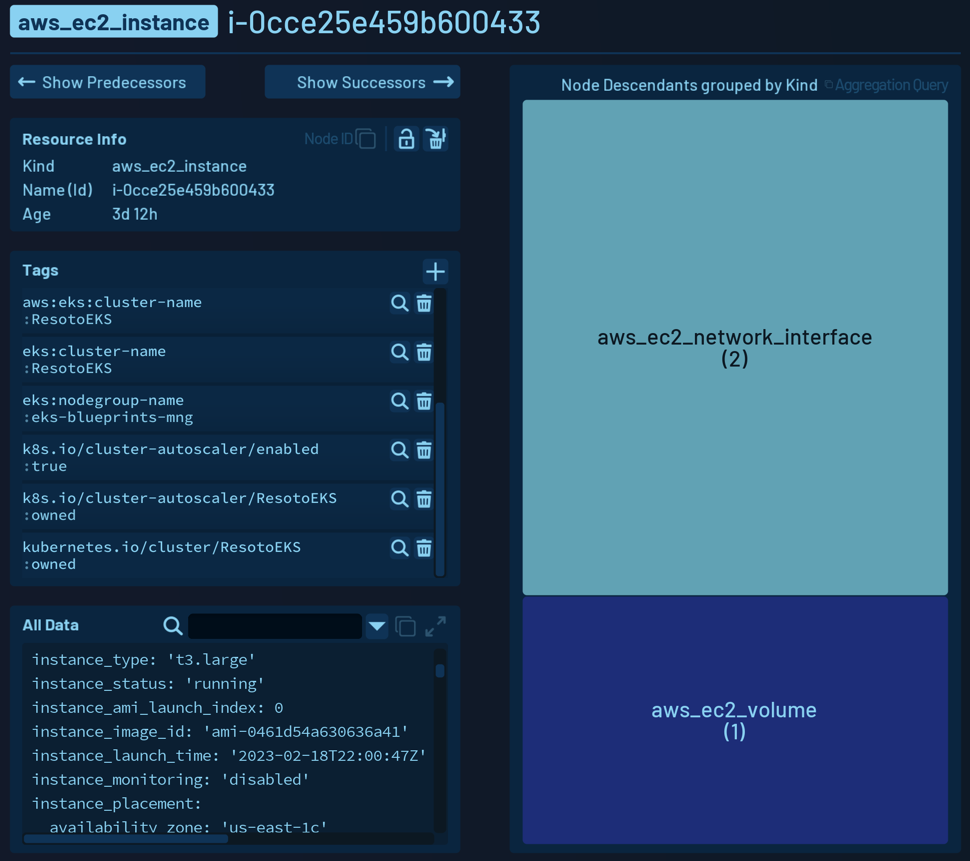
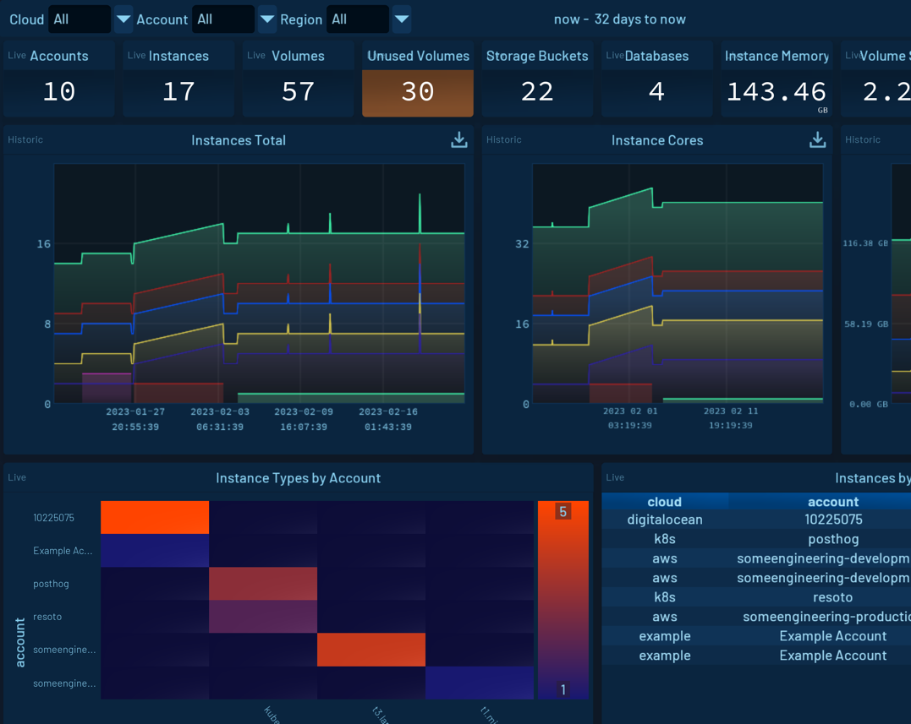
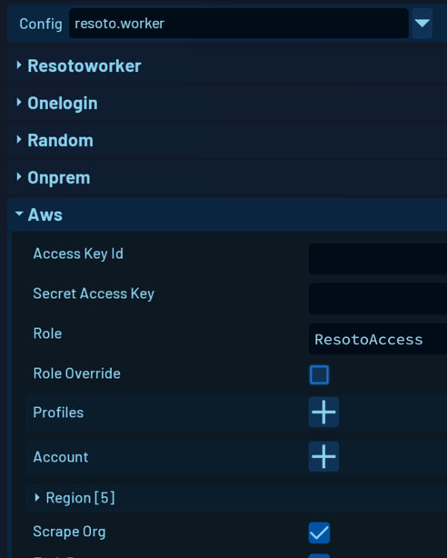

# Resoto UI

```mdx-code-block
import TabItem from '@theme/TabItem';
import Tabs from '@theme/Tabs';
```

Resoto UI is a user-friendly web interface that simplifies managing and exploring your cloud infrastructure.

https://youtu.be/_odyE3scPGg

## Setup Wizard

If it is your first time starting Resoto UI, the setup wizard will appear and help you configure Resoto.


## Start Page

After completing setup, you will be redirected to the start page:



## Search

### Keyword Search

The **Search** function allows you to perform a keyword search on your entire cloud infrastructure. All properties of resources in every indexed region, account, and cloud are searchable.



For example, assume there is an IP address used by different components of your infrastructure. You can search for this IP address to find all resources where it is used.

Another use case is finding all traces of a specific user in your infrastructure by searching for the user's name.

### Search Filters

Resoto's powerful [search syntax](../../../reference/search/index.mdx) also supports various [filters](../../../reference/search/filters.mdx).

You can search for all resources with a specific tag or a specific tag value, and filter the results to resources of a specific type or with a particular status.

For example, `search is(instance) and instance_status=running and tag.owner~".*test.*"` will return currently running compute instances with `owner` tag value matching the regular expression `.*test.*`.

## Explore

**Explore** allows you to explore your infrastructure by navigating clouds, accounts, and regions. You can see a tree view that shows all clouds, accounts, and regions where the number of resources defines the size of the related item.



This view allows you to quickly navigate to accounts with many resources or to regions that are not used anymore.

## Resource Details

Here, you can see detailed information about a resource, including its properties, tags, and relationships.



- **Resource Info** displays the kind, name, and age of the resource.
- All tags are listed in the **Tags** section.
- **All Data** is a YAML representation of all the resource properties. This view can be expanded and filtered to view specific properties of interest.
- Using the **Show Predecessors** and **Show Successors** buttons, you can "walk" the dependencies of this resource.

## Dashboard

Dashboards offer a way to visualize and share data.

You can create and customize dashboards with various types of widgets. Dashboards are accessible to anyone who has access to your Resoto install.


### Dashboard Data Sources

Resoto dashboards support the following data sources:

- **Current data based on the most recent [cloud data sync](../../../concepts/cloud-data-sync/index.mdx)**

  You can use the Resoto [search](../../../reference/search/index.mdx) capability to show exactly the details you are interested in, or you use the [aggregation](../../../reference/search/aggregation.mdx) feature to show aggregated data.

- **Historical data from the time-series database**

  You can query Resoto's Prometheus time-series database using the [PromQL](https://prometheus.io/docs/prometheus/latest/querying/basics) query language. Available metrics are defined in the Resoto Metrics configuration.

### Default Dashboard

Resoto ships with a default dashboard that serves as a good starting point for creating your own dashboards.



## Configuration

**Configuration** allows you to modify the configuration of your Resoto installation.

You can configure various settings, such as:

- Cloud data sync providers in the `resoto.worker` configuration
- Metrics to collect in the `resoto.metrics` configuration


