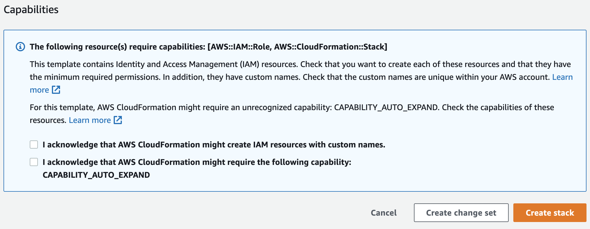
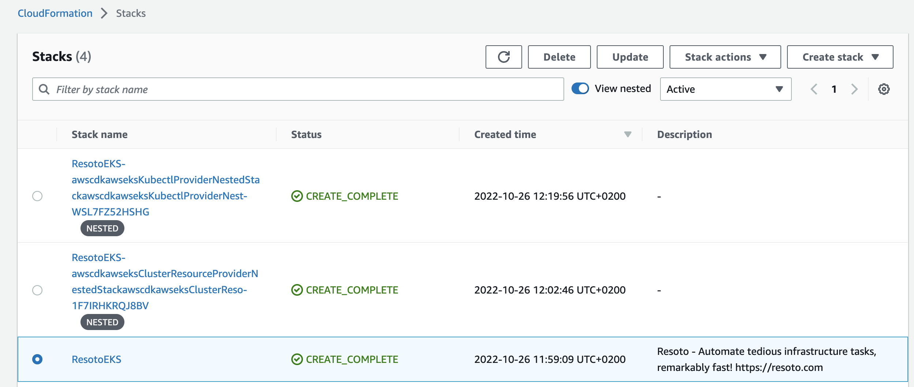

# Install Resoto on AWS

We support two ways of installing resoto in AWS. The first is using the AWS CloudFormation template via the [quick create link](https://eu-central-1.console.aws.amazon.com/cloudformation/home?region=eu-central-1#/stacks/create/review?templateURL=https://resoto-cdk.s3.eu-central-1.amazonaws.com/Resoto_EKS.template&stackName=ResotoEKS). This is the most direct way to get a production-grade setup. The second is to use the [Resoto CDK Construct](https://github.com/someengineering/resoto-cdk). It is a bit more involved but gives you more control over the setup.

Let's start with the CloudFormation template.

## Installation using the CloudFormation template

### Prerequisites

- [AWS account](https://aws.amazon.com/) (it must have permission to IAM roles)
- [Kubectl](https://kubernetes.io/docs/tasks/tools/)

### Deploying resoto to AWS

To get started with AWS quick setup, you need to have an AWS account and be logged into the AWS Management Console. Once you're logged in, follow the [quick setup link](https://eu-central-1.console.aws.amazon.com/cloudformation/home?region=eu-central-1#/stacks/create/review?templateURL=https://resoto-cdk.s3.eu-central-1.amazonaws.com/Resoto_EKS.template&stackName=ResotoEKS).

You will see the quick create form:


Here you can configure the stack name, number, and types of nodes for the nodes for Resoto EKS cluster, and the version of resoto to install.

:::note

Resoto performs CPU-intensive graph operations. In a production setup, we recommend at least four cores and 16 gigabytes of RAM. See [Configuring Resoto Worker](../../reference/configuration/worker.md#multi-core-machines) for more information.

:::

Once you're done, mark the checkboxes and click on the "Create Stack" button.



This will trigger the CloudFormation stack creation. It will create an EKS cluster and install the [Resoto Helm chart](https://github.com/someengineering/helm-charts) in it. You can follow the progress in the "Events" tab of the CloudFormation console. The deployment will take about 30 minutes.

### Configuring kubectl

Once the stack creation is completed, you will need to set up access to the newly created EKS cluster. To do that, you need to open the **Outputs** tab of the CloudFormation stack and copy the value of the output key that starts with `resotoeksstackConfigCommand`:


Then run that command in the terminal. It should look like this:

```bash
aws eks update-kubeconfig --name resoto-eks-stack --region eu-central-1 --role-arn arn:aws:iam::12345679:role/ResotoEKS-resotoeksstackMastersRoleD49105D4-AN5CV68ZORFZ
```

### Launching the Command-Line Interface

The `resh` command is used to interact with [`resotocore`](../../concepts/components/core.md).

Simply execute the following to access the [Resoto Shell](../../concepts/components/shell.md) interface:

```bash
kubectl exec -it service/resoto-resotocore -- resh
```


### Destroying the stack

If you want to completely remove the resoto deployment and all the resources associated with it, you can delete the CloudFormation stack. To do that, open the CloudFormation console and select the stack you created. Then click on the "Delete" button:



:::warning

Deleting the resoto stack will delete all the data stored in the resoto database. Make sure you have a backup of the data before deleting the stack.

:::

## Installing Resoto using CDK Construct

### Prerequisites

- [git](https://git-scm.com/)
- [AWS account](https://aws.amazon.com/) (it must have permission to IAM roles)
- [Kubectl](https://kubernetes.io/docs/tasks/tools/)
- [Node.js](https://nodejs.org/en/), we tested the construct on Nodejs 18.x. You can install Node.js using [nvm](https://github.com/nvm-sh/nvm).

### Installing the CDK

To install the CDK, run the following commands:

```bash
git clone git@github.com:someengineering/resoto-cdk.git
cd resoto-cdk
npm ci
```

### Deploying resoto to AWS using CDK

To deploy resoto to AWS, run the following command:

```bash
npm run cdk deploy
```

You will be prompted with the change list. You can review it and confirm the deployment. If it is the first time you deploy the stack, CDK will ask you to perform the bootstrap. You can do it by running the following command:

```bash
npm run cdk bootstrap
```

It is possible to override the cloud formation parameters in the construct:

`npm run cdk deploy -- --parameters ResotoTag=2.4.4 --parameters MngInstanceType=t3.large`

Note that we should separate the cdk arguments via `--` to avoid confusion with the arguments of the `npm run` command.

The following parameters can be customized:

- `ResotoTag`: The tag of the Resoto image to use. The default value is `2.4.3`.
- `MngMaxSize`: The maximum number of instances in the k8s managed node group. The default value is `3`.
- `MngMinSize`: The minimum number of instances in the k8s managed node group. The default value is `1`.
- `MngDesiredSize`: The desired number of instances in the k8s managed node group. The default value is `1`.
- `MngInstanceType`: The instance type of the k8s managed node group. The default value is `t3.medium`.

Once you confirmed the deployment, CDK will create an EKS cluster and install the [Resoto Helm chart](https://github.com/someengineering/helm-charts) in it. The progress will be printed in the terminal.

The deployment will take about 30 minutes.

Once it is completed, you will see a similar output:

```bash
Outputs:
east-test-1.easttest1ClusterName8D8E5E5E = east-test-1
east-test-1.easttest1ConfigCommand25ABB520 = aws eks update-kubeconfig --name east-test-1 --region us-east-1 --role-arn <ROLE_ARN>
east-test-1.easttest1GetTokenCommand337FE3DD = aws eks get-token --cluster-name east-test-1 --region us-east-1 --role-arn <ROLE_ARN>

Stack ARN:
arn:aws:cloudformation:us-east-1:115717706081:stack/east-test-1/e1b9e6a0-d5f6-11eb-8498-0a374cd00e27e
```

### Configuring kubectl

To connect to the cluster, you need to set up access to the newly created EKS cluster. To do that, you need to copy the value in the outputs section in your terminal that starts with `aws eks update-kubeconfig`.

Then run that command in the terminal. It should look like this:

```bash
aws eks update-kubeconfig --name resoto-eks-stack --region eu-central-1 --role-arn arn:aws:iam::12345679:role/ResotoEKS-resotoeksstackMastersRoleD49105D4-AN5CV68ZORFZ
```

### Launching the Command-Line Interface

The `resh` command is used to interact with [`resotocore`](../../concepts/components/core.md).

Simply execute the following to access the [Resoto Shell](../../concepts/components/shell.md) interface:

```bash
kubectl exec -it service/resoto-resotocore -- resh
```


### Destroying the stack

If you want to completely remove the resoto deployment and all the resources associated with it, you can delete the CloudFormation stack. To do that, run `cdk destroy` command in your terminal.

:::warning

Deleting the resoto stack will delete all the data stored in the resoto database. Make sure you have a backup of the data before deleting the stack.

:::
