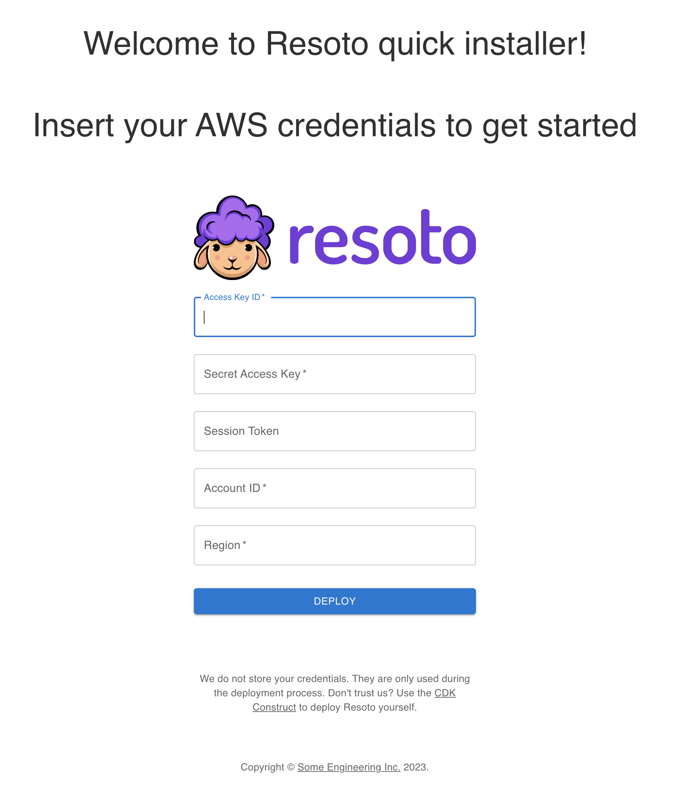
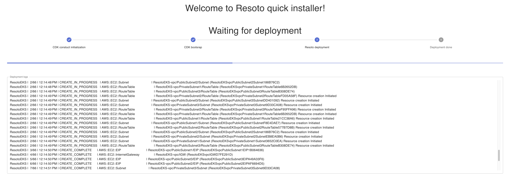
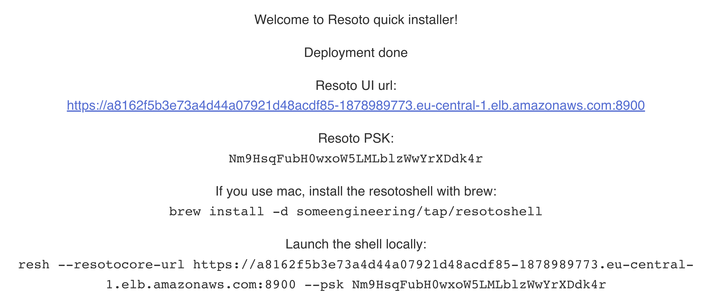
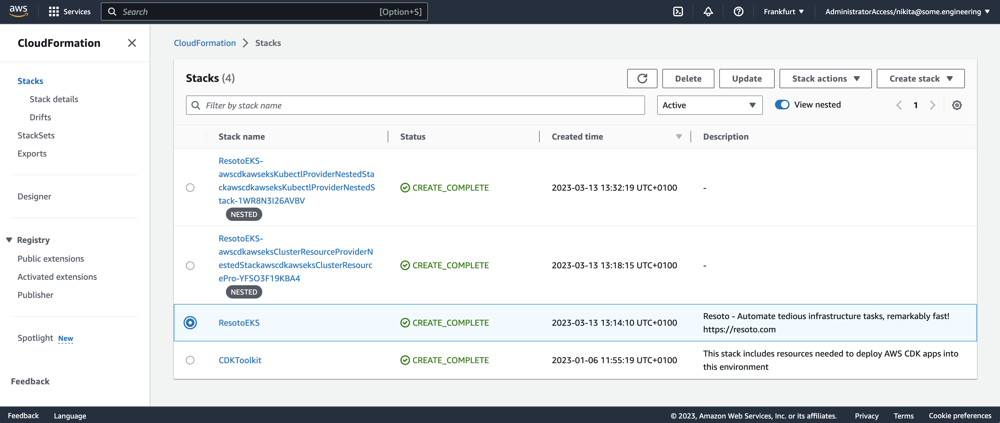

# Deploy Resoto to Amazon Web Services using Resoto Web Installer

We provide a Resoto Web installer to allow one button deployment of Resoto to AWS.

:::tip

When deploying Resoto, we will only use your AWS credentials for that specific deployment and will not keep them afterward. If you're not comfortable sharing your credentials, you can use the [CDK](../cdk.md) to deploy Resoto from your own machine.

:::

## Resoto Deployment Process

To deploy Resoto, follow these steps:

1. Click on the installer link: https://install.resoto.com/.
2. Enter your AWS credentials. 
3. Wait until the deployment process is complete. 
4. Once the deployment is successful, take note of the credentials required to connect to your Resoto cluster. Please keep them in a safe place as they will not be displayed again. 

## Removing the Resoto Deployment

To remove the Resoto deployment and all associated resources, open your AWS console, select the region where you deployed Resoto and go to the CloudFormation service.

Then, select the `ResotoEKS` stack and click `Delete` button.

:::warning

Removing the Resoto stack will also delete all data stored in the Resoto database.

:::
