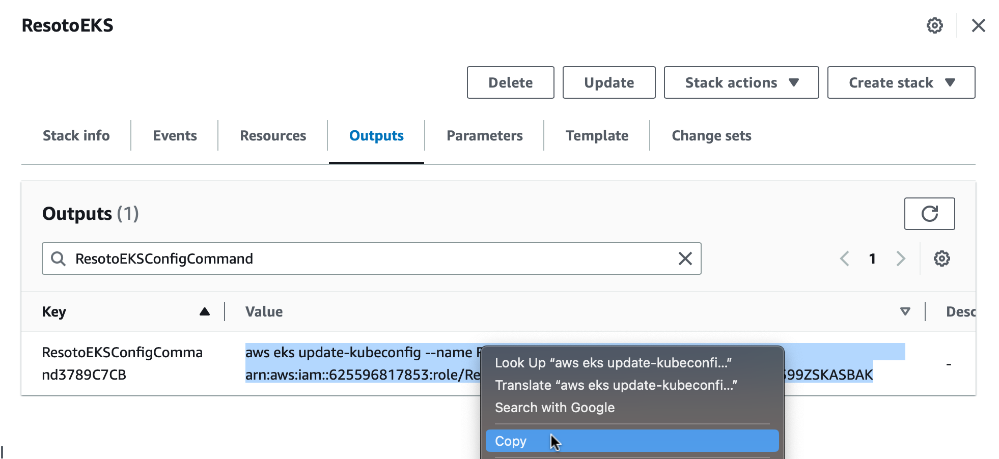
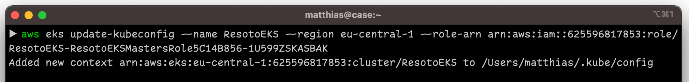

# Deploy Resoto to AWS with Cloud Development Kit

We provide a <abbr title="Cloud Development Kit">CDK</abbr> construct to simplify the deployment of Resoto to AWS.

:::tip

The [Resoto web installer](../web-installer/index.md) is the easiest way to get a production-grade setup, whereas the CDK construct is a bit more involved but gives you more control over the setup and does not require you to send us your cloud credentials.

:::

## Prerequisites

- [Git](https://git-scm.com)
- [<abbr title="Amazon Web Services">AWS</abbr>](https://aws.amazon.com) account with IAM role permissions
- [AWS command-line interface](https://aws.amazon.com/cli)
- [`kubectl` command-line tool](https://kubernetes.io/docs/reference/kubectl)
- [Node.js](https://nodejs.org)

## Deploying Resoto

1. Run the following commands in the terminal:

   ```bash
   $ git clone git@github.com:someengineering/resoto-cdk.git
   $ cd resoto-cdk
   $ npm ci
   ```

2. Then, deploy Resoto with the following command:

   ```bash
   $ npm run cdk deploy -- --parameters ResotoTag={{imageTag}}
   ```

   :::note

   If this is your first CDK deployment, you will need to bootstrap your AWS account. You can do so with the following command:

   ```bash
   $ npm run cdk bootstrap
   ```

   :::

   :::info

   It is possible to override the default CloudFormation parameter values:

   ```bash
   $ npm run cdk deploy -- --parameters ResotoTag={{imageTag}} --parameters MngInstanceType=r5a.xlarge
   ```

   | Parameter         | Description                                                   | Default Value     |
   | ----------------- | ------------------------------------------------------------- | ----------------- |
   | `ResotoTag`       | The Resoto image tag to use                                   | <LatestRelease /> |
   | `MngMaxSize`      | The maximum number of instances in the k8s managed node group | `3`               |
   | `MngMinSize`      | The minimum number of instances in the k8s managed node group | `1`               |
   | `MngDesiredSize`  | The desired number of instances in the k8s managed node group | `1`               |
   | `MngInstanceType` | The instance type of the k8s managed node group               | `r5a.xlarge`      |

   :::

3. Confirm the deployment. This will trigger CDK to create an EKS cluster and install the [Resoto Helm chart](https://github.com/someengineering/helm-charts).

   :::info

   **The deployment will take approximately 30 minutes.** You can follow the progress in the terminal.

   Once deployment is complete, you will see output similar to the following:

   ```bash
   Outputs:
   ResotoEKS.ResotoEKSConfigCommandXXXX = aws eks update-kubeconfig ...
   ResotoEKS.ResotoPskSecret = kubectl get secrets ...
   ResotoEKS.ResotoUI = https://a3xxxxxx.us-east-1.elb.amazonaws.com:8900

   Stack ARN:
   arn:aws:cloudformation:us-east-1:115717706081:stack/ResotoEKS/e1b9e6a0-d5f6-11eb-8498-0a374cd00e27e
   ```

   :::

4. The value of `ResotoEKS.ResotoEKSConfigCommandXXXX` in **Outputs** is a command to configure `kubectl` to connect to the EKS cluster. Copy the command and paste it into your terminal.

## Updating Resoto

1. Log in to the [AWS CloudFormation console](https://console.aws.amazon.com/cloudformation).

2. Click **Stacks**.

3. Enter `ResotoEKS` into the search box, and click on the stack you would like to upgrade.

   

4. Click the **Outputs** tab.

5. Enter `ResotoEKSConfigCommand` into the search box. There should be exactly one entry. Copy the value (`aws eks ...`).

   

6. Open a terminal and execute the copied command.

   

7. List installed Helm charts:

   ```bash
   $ helm list
   ​NAME  	NAMESPACE	CHART       	APP VERSION
   ​resoto	resoto   	resoto-0.7.4	3.3.1
   ```

   :::note

   The `APP VERSION` column displays the currently installed version of Resoto.

   :::

8. Add the [Some Engineering Helm chart repository](https://helm.some.engineering):

   ```bash
   $ helm repo add someengineering https://helm.some.engineering
   ```

9. Update cached chart information:

   ```bash
   $ helm repo update
   ```

10. Upgrade the `resoto` chart:

    ```bash
    $ helm upgrade resoto someengineering/resoto --atomic --reuse-values --set image.tag={{imageTag}}
    ```

## Removing Resoto

To remove the Resoto deployment and all associated resources, run the following command in the terminal:

```bash
$ cdk destroy
```

:::warning

Removing the Resoto stack will also delete all data stored in the Resoto database.

:::
