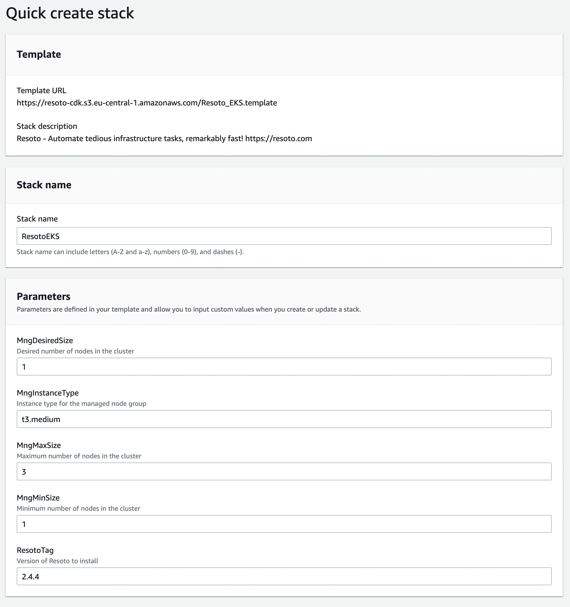
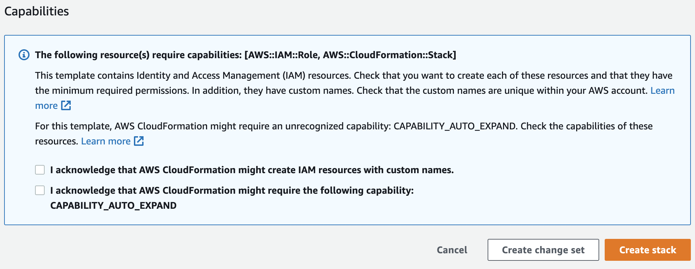
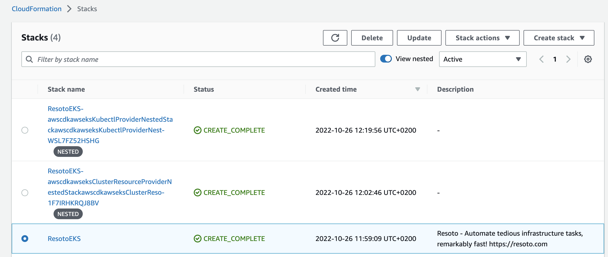

# Deploy Resoto with AWS CloudFormation

```mdx-code-block
import CloudFormationButton from '@site/src/components/CloudFormationButton';
```

The Resoto CloudFormation template is the easiest way to get a production-grade setup.

## Prerequisites

- [<abbr title="Amazon Web Services">AWS</abbr>](https://aws.amazon.com) account with IAM role permissions
- [`kubectl`](https://kubernetes.io/docs/reference/kubectl) command-line tool

## Deploying Resoto

1. Log into the [AWS Management Console](https://console.aws.amazon.com).

2. Click this button to open the **Quick create stack** page:

   <CloudFormationButton />

3. Configure the stack name, node type, and node count:

   

   :::note

   Resoto performs CPU-intensive graph operations. In a production setup, we recommend at least four cores and 16 gigabytes of RAM. See [Configuring Resoto Worker](../../../reference/configuration/worker.md#multi-core-machines) for more information.

   :::

4. Tick the checkboxes and click the orange **Create stack** button:

   

   This will trigger the CloudFormation stack creation. It will create an EKS cluster and install the [Resoto Helm chart](https://github.com/someengineering/helm-charts).

   :::info

   **The deployment will take approximately 30 minutes.** You can follow the progress in the CloudFormation console **Events** tab.

   :::

5. Once the stack creation is completed, you need to configure access to the newly created EKS cluster. Open the **Outputs** tab of the CloudFormation stack and copy the value of the `resotoeksstackConfigCommand` key:

   

6. Execute the copied command in the terminal.

## Launching the Command-Line Interface

The `resh` command is used to interact with [`resotocore`](../../../concepts/components/core.md).

Simply execute the following to access the [Resoto Shell](../../../concepts/components/shell.md) interface:

```bash
$ kubectl exec -it service/resoto-resotocore -- resh
```


## Removing the Resoto Deployment

To remove the Resoto deployment and all associated resources, you can delete the CloudFormation stack.

1. Open the CloudFormation console and select the stack you wish to delete:

   

2. Click the **Delete** button at the top of the page.

:::warning

Removing the Resoto stack will also delete all data stored in the Resoto database.

:::
