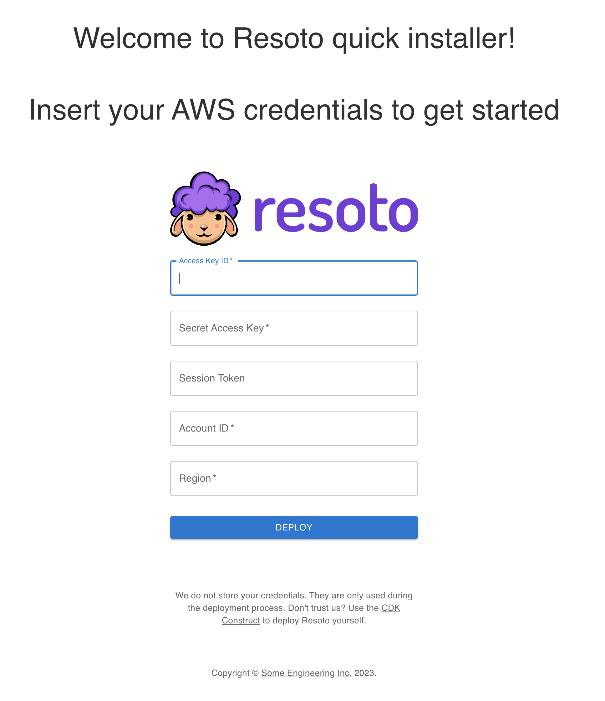
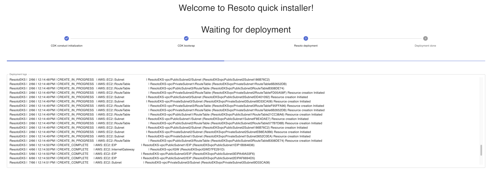
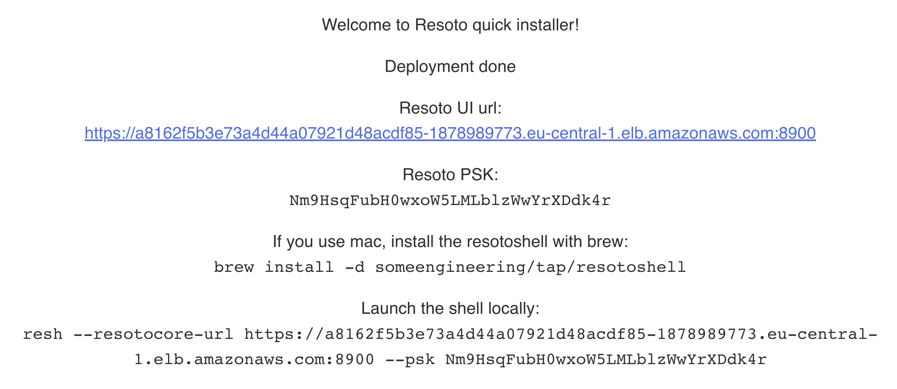
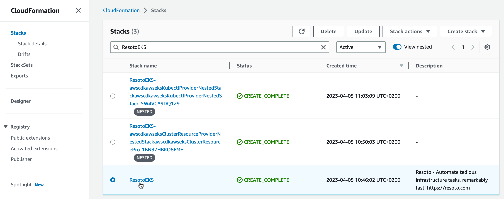
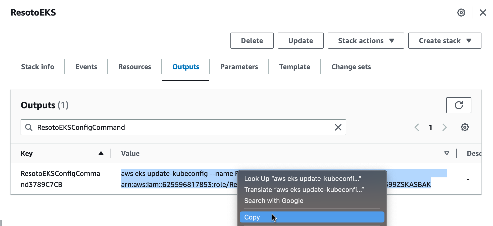
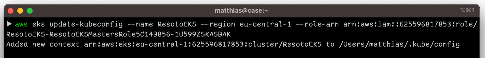
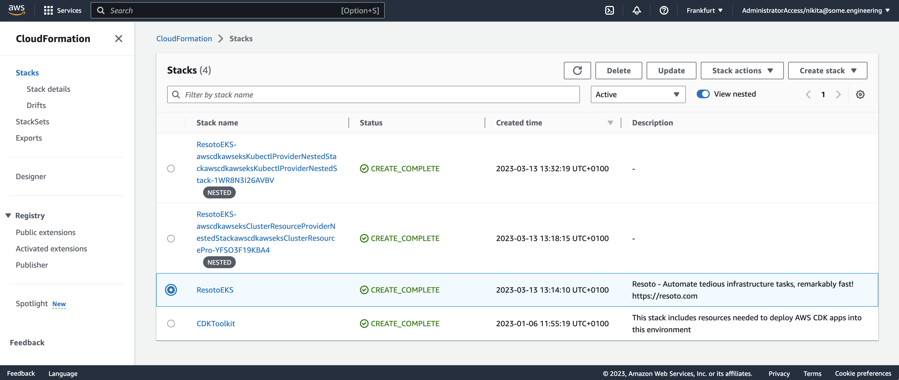

# Deploy Resoto to AWS Using the Resoto Web Installer

We provide a web installer for one-click deployment of Resoto to <abbr title="Amazon Web Services">AWS</abbr>.

:::tip

When deploying Resoto, we only use provided AWS credentials for the deployment. Credentials are not stored or retained after the deployment is complete.

If you are not comfortable sharing your credentials, you can alternatively use the [CDK construct](../cdk.md) to deploy Resoto.

:::

## Deploying Resoto

1. Open the [Resoto web installer](https://install.resoto.com).

2. Enter your AWS credentials.

   

3. Wait until the deployment process is complete.

   

4. Once the deployment is successful, take note of the credentials required to connect to your Resoto cluster. Please keep them in a safe place as they will not be displayed again.

   

## Updating Resoto

1. Log in to the [AWS CloudFormation console](https://console.aws.amazon.com/cloudformation).

2. Click **Stacks**.

3. Enter `ResotoEKS` into the search box, and click on the stack you would like to upgrade.

   

4. Click the **Outputs** tab.

5. Enter `ResotoEKSConfigCommand` into the search box. There should be exactly one entry. Copy the value (`aws eks ...`).

   

6. Open a terminal and execute the copied command.

   

7. List installed Helm charts:

   ```bash
   $ helm list
   ​NAME  	NAMESPACE	CHART       	APP VERSION
   ​resoto	resoto   	resoto-0.7.4	3.3.1
   ```

   :::note

   The `APP VERSION` column displays the currently installed version of Resoto.

   :::

8. Add the [Some Engineering Helm chart repository](https://helm.some.engineering):

   ```bash
   $ helm repo add someengineering https://helm.some.engineering
   ```

9. Update cached chart information:

   ```bash
   $ helm repo update
   ```

10. Upgrade the `resoto` chart:

    ```bash
    $ helm upgrade resoto someengineering/resoto --atomic --reuse-values --set image.tag={{imageTag}}
    ```

## Removing Resoto

To remove the Resoto deployment and all associated resources:

1. Log in to the [AWS console](https://console.aws.amazon.com).

2. Select the region where you deployed Resoto, and open the CloudFormation service.

3. Select the `ResotoEKS` stack and click **Delete** button.

   

:::warning

Removing the Resoto stack will also delete all data stored in the Resoto database.

:::
