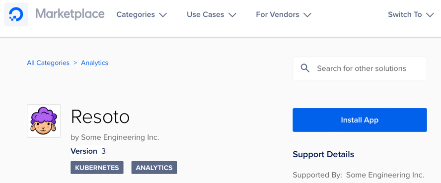
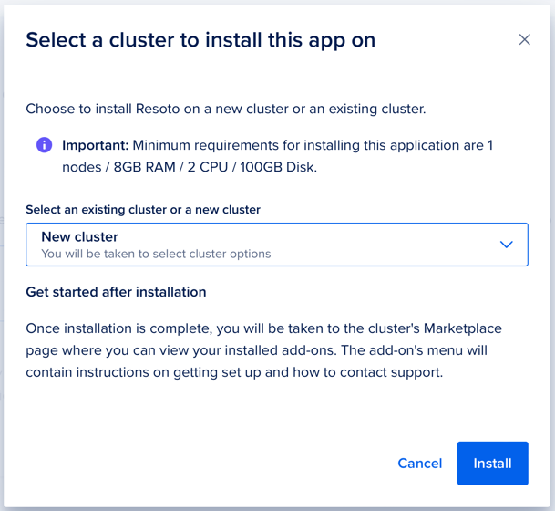

# Deploy Resoto to Digital Ocean

Resoto is listed in the Digital Ocean Marketplace. You can deploy Resoto to Digital Ocean in a few clicks.

<a href="https://marketplace.digitalocean.com/apps/resoto" target="_blank"></img></a>

The above link will bring you to the Digital Ocean Marketplace. Click the _Install App_ button to start the process. 

You can now select an existing Kubernetes cluster or create a new one. Resoto will be installed into the selected cluster.



Once the installation is done, Resoto is exposed via an externally available service address. With configured access to the Kubernetes cluster, you can get the address using this command:

```bash
export SERVICE_ADDRESS=$(kubectl get --namespace resoto service resoto-resotocore -o jsonpath="{.status.loadBalancer.ingress[0].ip}")
echo "Visit https://$SERVICE_ADDRESS:8900 to use Resoto."
```

You can now enter the printed address in your browser and start using Resoto.
