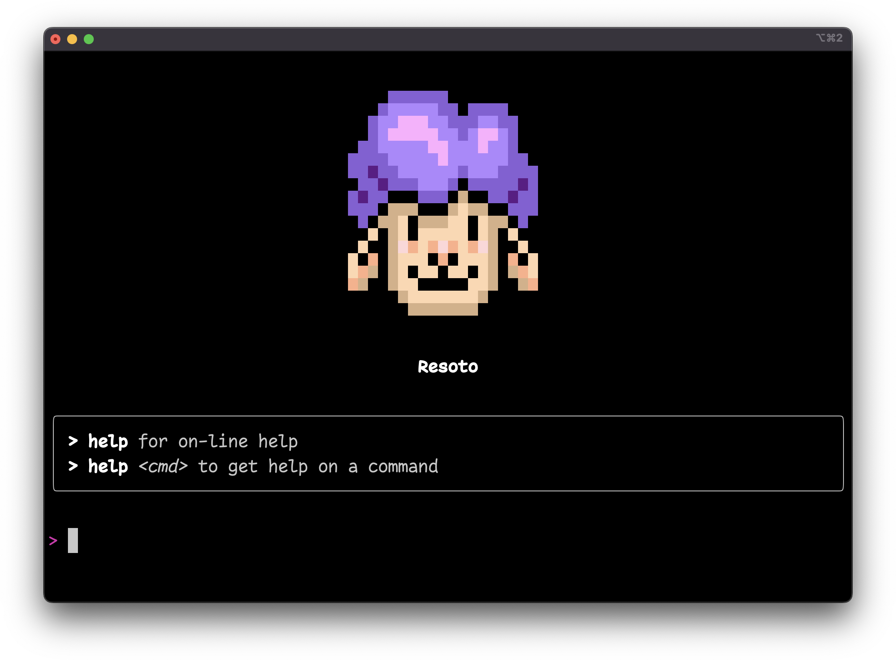

# Install Resoto with Docker

```mdx-code-block
import LatestRelease from '@site/src/components/LatestRelease';
import TabItem from '@theme/TabItem';
import Tabs from '@theme/Tabs';
```

[Docker](https://docker.com) provides the ability to run an application in a loosely isolated environment called a [container](https://docs.docker.com/get-started/overview#containers). For more information on Docker, please see the [official Docker documentation](https://docs.docker.com).

## Prerequisites

- [Docker](https://docs.docker.com/get-started#download-and-install-docker)
- [Docker Compose](https://docs.docker.com/compose/install/)
- At least 2 CPU cores and 8 GB of RAM

:::note

Resoto performs CPU-intensive graph operations. In a production setup, we recommend at least four cores and 16 gigabytes of RAM. See [Configuring Resoto Worker](../../reference/configuration/worker.md#multi-core-machines) for more information.

:::

## Installing Resoto

https://youtu.be/U5L4z71WI-w

Resoto consists of multiple [components](../../concepts/components/index.md) published as individual Docker images:

1. [`somecr.io/someengineering/resotocore`](https://hub.docker.com/repository/docker/someengineering/resotocore) maintains the infrastructure graph.
2. [`somecr.io/someengineering/resotoworker`](https://hub.docker.com/repository/docker/someengineering/resotoworker) collects infrastructure data from the cloud provider APIs.
3. [`somecr.io/someengineering/resotometrics`](https://hub.docker.com/repository/docker/someengineering/resotometrics) exports metrics in Prometheus format.
4. [`somecr.io/someengineering/resotoshell`](https://hub.docker.com/repository/docker/someengineering/resotoshell) provides the [command-line interface](../../reference/cli/index.md) used to interact with Resoto.

To install Resoto using [Docker Compose](https://docs.docker.com/compose), first fetch the required files from the [`someengineering/resoto` GitHub repository](https://github.com/someengineering/resoto):

<Tabs>
<TabItem value="curl" label="Using curl">

```bash
$ mkdir -p resoto/dockerV2
$ cd resoto
$ curl -o docker-compose.yaml https://raw.githubusercontent.com/someengineering/resoto/{{latestRelease}}/docker-compose.yaml
$ curl -o dockerV2/prometheus.yml https://raw.githubusercontent.com/someengineering/resoto/{{latestRelease}}/dockerV2/prometheus.yml
$ docker compose up -d
```

</TabItem>
<TabItem value="git" label="Using git">

```bash
$ git clone https://github.com/someengineering/resoto.git
$ cd resoto
$ git checkout tags/{{latestRelease}}
$ docker compose up -d
```

</TabItem>
</Tabs>

Upon execution of `docker compose up -d`, Docker Compose will start all components and set up the system. This process takes approximately 1-3 minutes, depending on your machine and internet connection.

The following command will wait for Resoto Core's initialization process to complete and display a message when the Resoto API is ready for use:

```bash
$ docker compose logs --since 15m -f resotocore | grep "Initialization done. Starting API."
```

:::note

[Docker Compose V2 integrated compose functions in to the Docker platform.](https://docs.docker.com/compose/#compose-v2-and-the-new-docker-compose-command)

In Docker Compose V1, the command is `docker-compose` (with a hyphen) instead of `docker compose`.

:::

:::info

Resoto publishes packages for both x86 and ARM architectures for stable releases, but `edge` versions are only available for x86.

If you have an Apple Silicon or other ARM-based machine, please use the latest stable release (<LatestRelease /> or `latest`).

:::

## Launching the Command-Line Interface

The `resh` command starts an interactive shell session with Resoto. To access the [Resoto Shell](../../concepts/components/shell.md) interface using Docker compose, simply execute:

```bash
$ docker compose run --rm resotoshell
```


