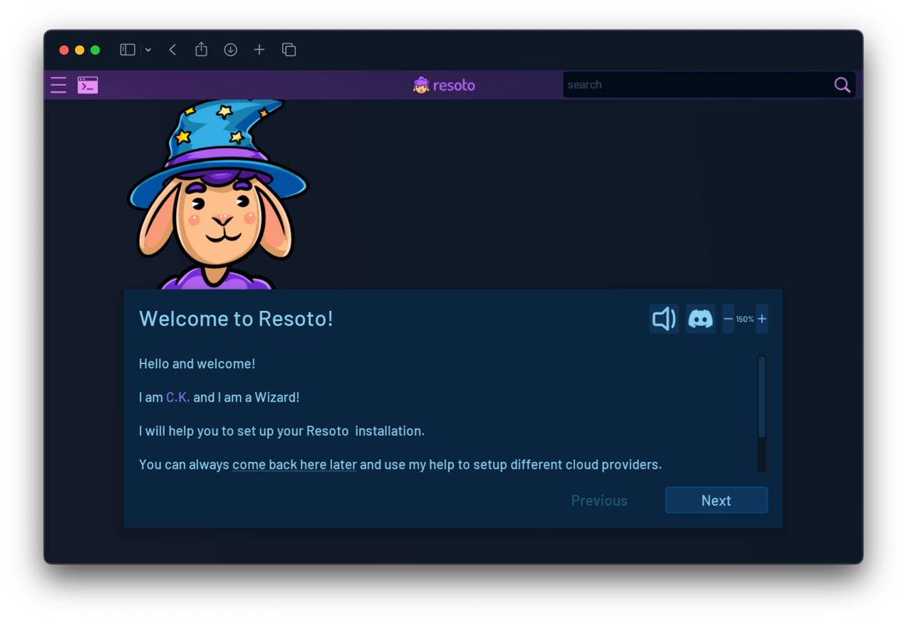

# Install Resoto with pip

```mdx-code-block
import LatestRelease from '@site/src/components/LatestRelease';
import VersionOnly from '@site/src/components/VersionOnly';
import TabItem from '@theme/TabItem';
import Tabs from '@theme/Tabs';
```

[pip](https://pip.pypa.io) is the package installer for [Python](https://www.python.org) and allows for easy installation of [Python](https://www.python.org) packages in Linux environments.

<VersionOnly allowed="current">

:::info

**The `edge` version of Resoto is not installable with [pip](https://pip.pypa.io).**

The below instructions will install the latest stable version of Resoto (<LatestRelease />).

:::

</VersionOnly>

## Prerequisites

- [Python](https://python.org) 3.9+ (3.10 is recommended)
- [ArangoDB](https://arangodb.com) 3.8.4+
- [Prometheus](https://prometheus.io) 2.35.0+
- At least 2 CPU cores and 8 GB of RAM

## Installing Resoto

Resoto consists of multiple [components](../../concepts/components/index.md) that are published as individual Python packages:

1. [📦](https://pypi.org/project/resotocore/) `resotocore` maintains the infrastructure graph.
2. [📦](https://pypi.org/project/resotoworker/) `resotoworker` collects infrastructure data from the cloud provider APIs.
3. [📦](https://pypi.org/project/resotometrics/) `resotometrics` exports metrics in Prometheus format.
4. [📦](https://pypi.org/project/resotoshell/) `resotoshell` is the command-line interface (CLI) used to interact with Resoto.
5. A list of collector plugins. In this guide we will install the most prominent collector plugins. See this [list](https://github.com/someengineering/resoto/tree/main/plugins) for an overview of all available plugins.
   1. [📦](https://pypi.org/project/resoto-plugin-aws/) `resoto-plugin-aws` collects data from AWS.
   1. [📦](https://pypi.org/project/resoto-plugin-gcp/) `resoto-plugin-gcp` collects data from GCP.
   1. [📦](https://pypi.org/project/resoto-plugin-k8s/) `resoto-plugin-k8s` collects data from Kubernetes.
   1. [📦](https://pypi.org/project/resoto-plugin-digitalocean/) `resoto-plugin-digitalocean` collects data from DigitalOcean.

```bash title="Installing Resoto using pip"
$ mkdir -p ~/resoto
$ cd ~/resoto
$ python3 -m venv resoto-venv      # Create a virtual Python environment.
$ source resoto-venv/bin/activate  # Activate the virtual Python environment.
$ python -m ensurepip --upgrade    # Ensure pip is available.
$ pip install -U resotocore=={{nonEdgeImageTag}} resotoworker=={{nonEdgeImageTag}} resotometrics=={{nonEdgeImageTag}} resotoshell=={{nonEdgeImageTag}} resoto-plugin-aws=={{nonEdgeImageTag}} resoto-plugin-gcp=={{nonEdgeImageTag}} resoto-plugin-k8s=={{nonEdgeImageTag}} resoto-plugin-digitalocean=={{nonEdgeImageTag}}
# Generate two random passphrases. One to secure the graph database and one to secure resotocore with.
$ echo $(LC_ALL=C tr -dc _A-Z-a-z-0-9 < /dev/urandom | head -c 20) > .graphdb-password
$ echo $(LC_ALL=C tr -dc _A-Z-a-z-0-9 < /dev/urandom | head -c 20) > .pre-shared-key
$ chmod 600 .graphdb-password .pre-shared-key
```

## Installing ArangoDB

Follow [the ArangoDB installation instructions](https://www.arangodb.com/docs/stable/getting-started-installation.html) for your Linux distribution. Also read the [Linux Operating System Configuration](https://www.arangodb.com/docs/stable/installation-linux-osconfiguration.html) guide for optimal database performance.

A copy'paste ready snippet that worked at the time of writing this documentation:

```bash
$ mkdir -p ~/resoto/arangodb ~/resoto/data
$ cd ~/resoto
$ curl -L -o arangodb3.tar.gz https://download.arangodb.com/arangodb39/Community/Linux/arangodb3-linux-3.9.1.tar.gz
$ tar xzf arangodb3.tar.gz --strip-components=1 -C arangodb
$ rm -f arangodb3.tar.gz
$ arangodb/bin/arangod --database.directory ~/resoto/data
```

This will start ArangoDB on the current shell which is useful for testing. Once Resoto Core starts it will automatically secure the ArangoDB installation using the password provided in the `.graphdb-password` file (unless explicitly turned off using the `--graphdb-bootstrap-do-not-secure` flag).

Read the section [Securing ArangoDB](../../reference/security.md#custom-certificates) for details on how to generate certificates and encrypt the connection between Resoto Core and the graph database.

## Installing the WebUI

A copy'paste ready snippet to download an extract the UI locally.

```bash
$ mkdir -p ~/resoto/ui
$ cd ~/resoto
$ curl -L -o ui.tar.gz https://cdn.some.engineering/resoto-ui/releases/3.0.2.tar.gz
$ tar xzf ui.tar.gz -C ui
$ rm -f ui.tar.gz
```

## Running Resoto

Create multiple shells/tabs and run each component in a separate shell:

<Tabs>
<TabItem value="resotocore" label="resotocore">

```bash
$ graphdb_password=$(< ~/resoto/.graphdb-password)
$ pre_shared_key=$(< ~/resoto/.pre-shared-key)
$ source ~/resoto/resoto-venv/bin/activate
$ resotocore --graphdb-password "$graphdb_password" --graphdb-server http://localhost:8529 --psk "$pre_shared_key" --ui-path ~/resoto/ui
```

[Resoto Core](../../concepts/components/core.md) only listens on `localhost:8900` by default. [Resoto Core](../../concepts/components/core.md) can be [configured to listen on all interfaces](../../reference/configuration/core.md#network-interfaces) if desired.

</TabItem>
<TabItem value="resotoworker" label="resotoworker">

```bash
$ pre_shared_key=$(< ~/resoto/.pre-shared-key)
$ source ~/resoto/resoto-venv/bin/activate
$ resotoworker --resotocore-uri https://localhost:8900 --psk "$pre_shared_key"
```

</TabItem>
<TabItem value="resotometrics" label="resotometrics">

```bash
$ pre_shared_key=$(< ~/resoto/.pre-shared-key)
$ source ~/resoto/resoto-venv/bin/activate
$ resotometrics --resotocore-uri https://localhost:8900 --psk "$pre_shared_key"
```

Resoto now exposes Prometheus metrics at `https://localhost:9955/metrics`. Follow [the Prometheus Getting Started guide](https://prometheus.io/docs/prometheus/latest/getting_started) to install and configure a Prometheus server.

</TabItem>
</Tabs>

## Launching the Web UI

1. Resoto UI listens on port `8900` by default. You can access it by opening <https://localhost:8900> in your browser.

   :::note

   The SSL certificate is self-signed, but you can safely ignore any browser warnings.

   :::

2. If it is your first time starting Resoto UI, the setup wizard will appear and help you configure Resoto:

   

## Launching the Command-Line Interface

The `resh` command is used to interact with [`resotocore`](../../concepts/components/core.md).

Simply execute the following to access the [Resoto Shell](../../concepts/components/shell.md) interface:

```bash
$ pre_shared_key=$(< ~/resoto/.pre-shared-key)
$ source ~/resoto/resoto-venv/bin/activate
$ resh --resotocore-uri https://localhost:8900 --psk "$pre_shared_key"
```


