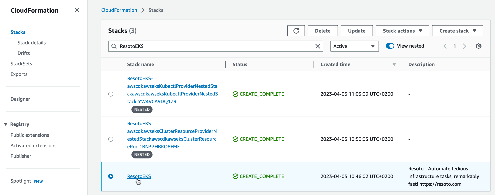
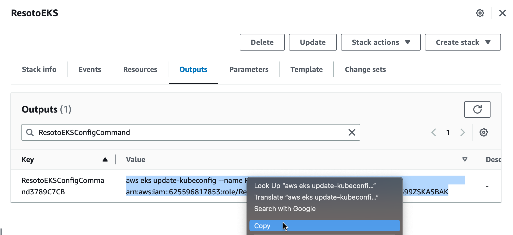
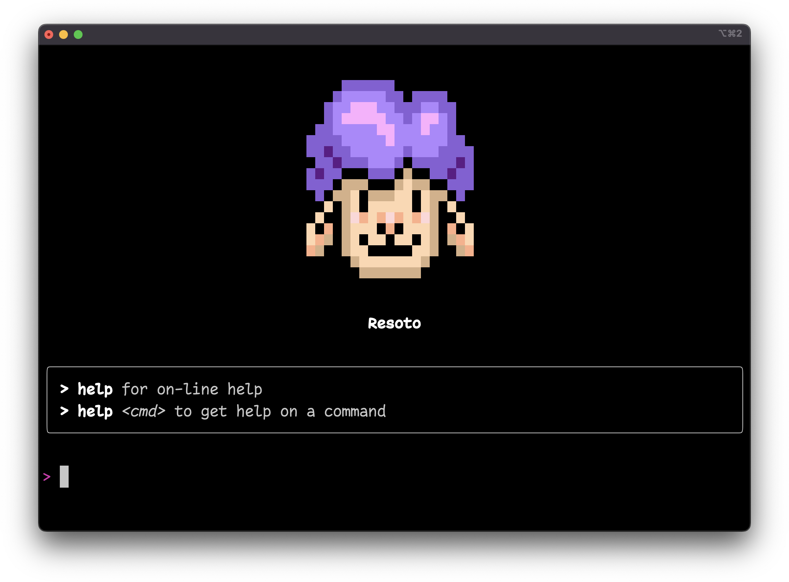

# Launch Resoto

```mdx-code-block
import TabItem from '@theme/TabItem';
import Tabs from '@theme/Tabs';
```

Resoto allows you to manage and explore your cloud infrastructure via a web or shell interface.

## Launching Resoto UI

Resoto UI is a user-friendly web interface that simplifies managing and exploring your cloud infrastructure.

The steps to launch Resoto UI depend on how you installed Resoto.

<Tabs groupId="install-method">
<TabItem value="aws" label="Amazon Web Services">

1. You already got the URL to access Resoto UI and the PSK token required to authenticate in the previous step. Once Resoto UI is loaded it will ask for the PSK token. Enter the token and click on the "Connect" button.

   :::note

   The SSL certificate is self-signed, but you can safely ignore any browser warnings.

   :::

2. Resoto UI will start and guide you through the configuration. If it is your first time starting Resoto UI, the setup wizard will appear and help you configure Resoto:

</TabItem>
<TabItem value="docker" label="Docker">

1. Resoto UI listens on port `8900` by default. You can access it by opening <https://localhost:8900> in your browser.

   :::note

   The SSL certificate is self-signed, but you can safely ignore any browser warnings.

   :::

2. If it is your first time starting Resoto UI, the setup wizard will appear and help you configure Resoto:

</TabItem>
<TabItem value="k8s" label="Kubernetes">

1. Resoto provides a service that exposes Resoto UI on port `8900`. We recommend configuring an [Ingress](https://kubernetes.io/docs/concepts/services-networking/ingress) with a valid certificate for UI access, but you can port-forward the service as a temporary solution:

   ```bash
   $ kubectl port-forward services/resoto-resotocore 8900
   ```

2. Open <https://localhost:8900> in your browser to access Resoto UI.

   :::note

   The SSL certificate is self-signed, but you can safely ignore any browser warnings.

   :::

3. If it is your first time starting Resoto UI, the setup wizard will appear and help you configure Resoto:

</TabItem>
<TabItem value="pip" label="pip">

1. Resoto UI listens on port `8900` by default. You can access it by opening <https://localhost:8900> in your browser.

   :::note

   The SSL certificate is self-signed, but you can safely ignore any browser warnings.

   :::

2. If it is your first time starting Resoto UI, the setup wizard will appear and help you configure Resoto:

</TabItem>
</Tabs>


## Launching Resoto Shell (optional)

Resoto Shell is Resoto's command-line interface.

The steps to launch Resoto Shell depend on how you installed Resoto.

<Tabs groupId="install-method">
<TabItem value="aws" label="Amazon Web Services">

1. Go to the [AWS CloudFormation](https://console.aws.amazon.com/cloudformation/home) console and select the ResotoEKS stack. 
2. In the outputs section, copy the value of the `ResotoEKSConfigCommandXXX` output. 
3. Paste the value in your terminal and execute it. 
4. Execute the following in your terminal to access the [Resoto Shell](../../reference/components/shell.md) interface:

   ```bash
   $ kubectl exec -it service/resoto-resotocore -- resh
   ```

</TabItem>
<TabItem value="docker" label="Docker">

Execute the following to access the [Resoto Shell](../../reference/components/shell.md) interface:

```bash
$ docker exec -it resotoshell resh
```

</TabItem>
<TabItem value="k8s" label="Kubernetes">

1. Make sure that the deployment is available:

   ```bash
   $ kubectl wait --for=condition=available deployment/resoto-resotocore
   ```

2. Execute the following to access the [Resoto Shell](../../reference/components/shell.md) interface:

   ```bash
   $ kubectl exec -it service/resoto-resotocore -- resh
   ```

</TabItem>
<TabItem value="pip" label="pip">

Execute the following to access the [Resoto Shell](../../reference/components/shell.md) interface:

```bash
$ resh
```

</TabItem>
</Tabs>


