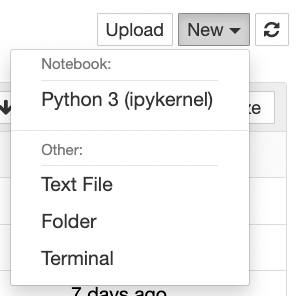
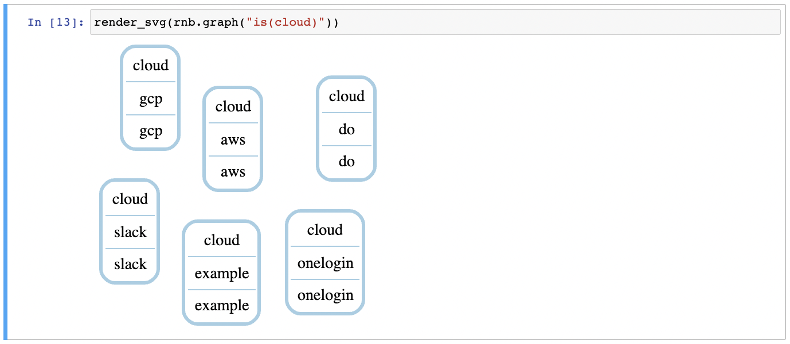
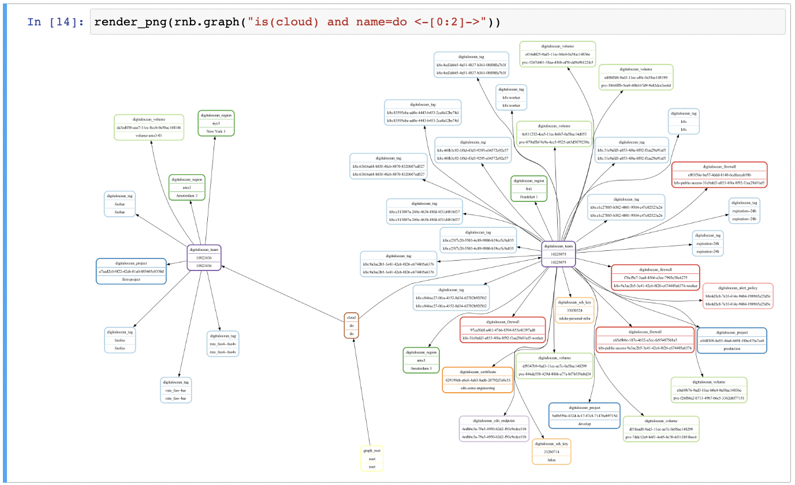
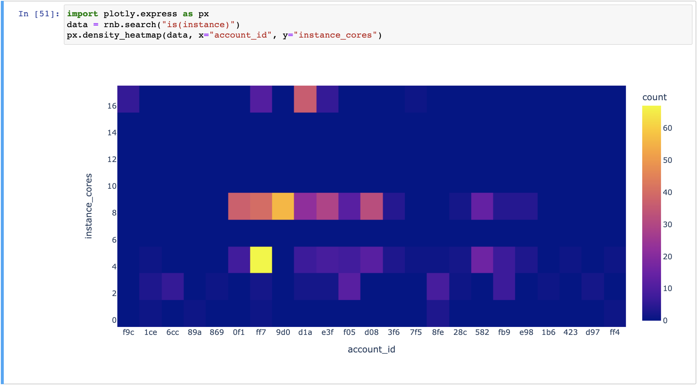
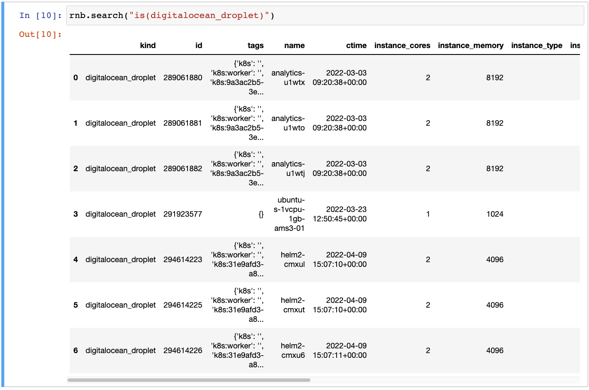
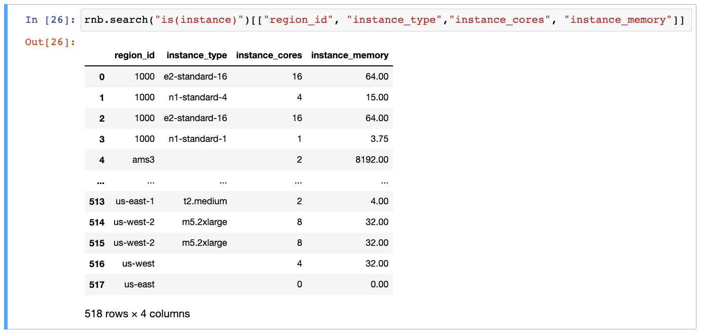
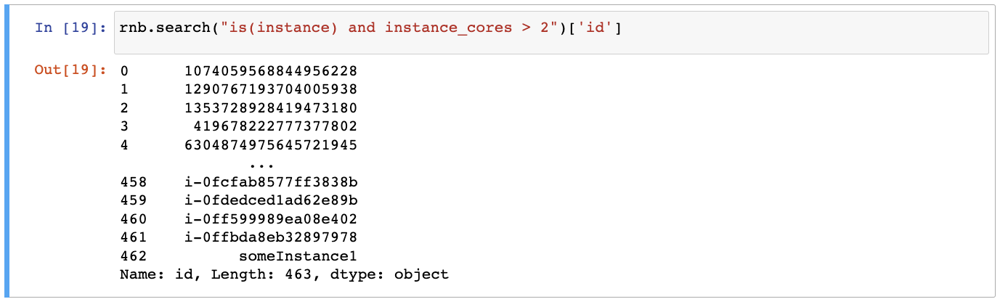
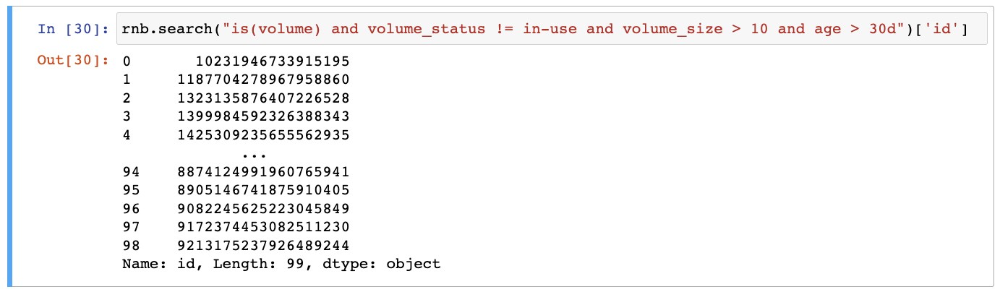
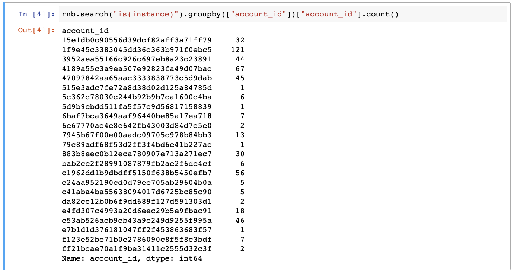
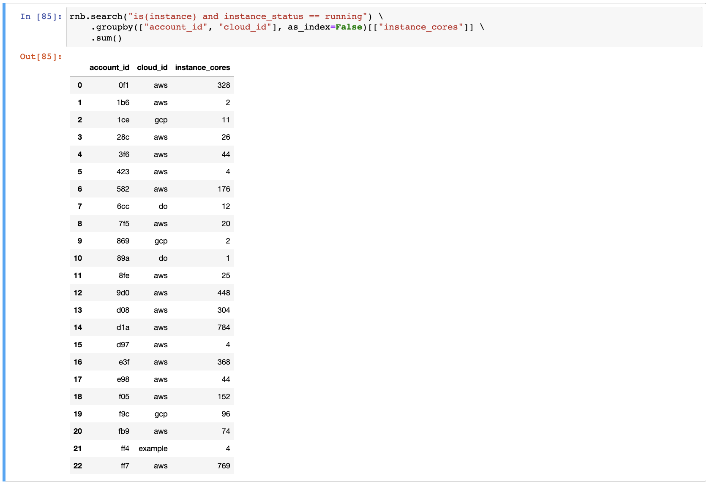

# Resotonotebook

Resotonotebook is a library that allows you to interact with a resotocore using a [jupyter notebook](https://jupyter.org/). Jupyter notebook is a web-based interactive python shell. It is a powerful tool for interactive data analysis and visualization.

Let's dive in!

## Installation

Before we get started, I assume that you have access to a running resotocore. If you don't, please follow the [getting started instructions](https://resoto.com/docs/getting-started) first.

Once the resotocore is up and running, we can install the resotonotebook together with jupyter notebook:

```bash
pip install notebook resotonotebook
```

Start the jupyter notebook:

```bash
jupyter notebook
```

And that's it!

## Usage examples

Now let's dive in and see what can be done using resoto notebook.

First, we should create a new notebook by clicking `New` -> `Python 3` in the jupyper tab:



Then, we need an instance of the `ResotoNotebook` object, which needs a URL of resotocore and optionally a PSK if it was configured:

```python
from resotonotebook import ResotoNotebook
rnb = ResotoNotebook("https://localhost:8900", psk=None)
```

### Visualization

Visualizing the dependencies between resources as a graph can be useful to understand what's running in your cloud. Here are some examples:

Render the accounts as an svg graph:

```python
from IPython.display import display_png as render_png, display_svg as render_svg
render_svg(rnb.graph("is(cloud)"))
```



Make a graph of all clouds with name do and their successors one level deep and render it as a PNG image:

```python
render_png(rnb.graph("is(cloud) and name=do <-[0:2]->"))
```



Show the instances/cores/account heatmap, to see which accounts use a lot of expensive instances:

```python
import plotly.express as px
data = rnb.search("is(instance)")
px.density_heatmap(data, x="account_id", y="instance_cores")
```



### Full text search:

Search all resources for a properties with values `digitalocean` and `foobar`. Full text search is useful when you have a keyword, e.g. e-mail address or name, and you want to find all resources related to it:

```python
rnb.search('"digitalocean" and "foobar"')
```


### Counting

Get number of all collected instances by kind:

```python
rnb.search("is(instance)").groupby(["kind"])["kind"].count()
```


### Searching by kind

Get list of all the DigitalOcean droplets:

```python
rnb.search("is(digitalocean_droplet)")
```



### Selecting properties

Get list of name, type, cores, and memory for each instance:

```python
rnb.search("is(instance)")[["region_id", "instance_type","instance_cores", "instance_memory"]]
```



### Filtering

Get list of all compute instances with more than two CPU cores:

```python
rnb.search("is(instance) and instance_cores > 2")['id']
```



Get list volumes that are not in use, larger than 10GB, older than 30 days.

```python
rnb.search("is(volume) and volume_status != in-use and volume_size > 10 and age > 30d")['id']
```



### Aggregation

Count the number of instances by account ID:

```python
rnb.search("is(instance)").groupby(["account_id"])["account_id"].count()
```



Aggregate CPU cores data grouped by account and cloud. This is useful for identifying the most expensive accounts:

```python
rnb.search("is(instance) and instance_status == running") \
    .groupby(["account_id", "cloud_id"], as_index=False)[["instance_cores"]] \
    .sum()
```



## Next steps

You can find the examples from this page in the [resotonotebook repository](https://github.com/someengineering/resotonotebook/blob/main/examples/example.ipynb).

That's it for now. Happy exploring!
