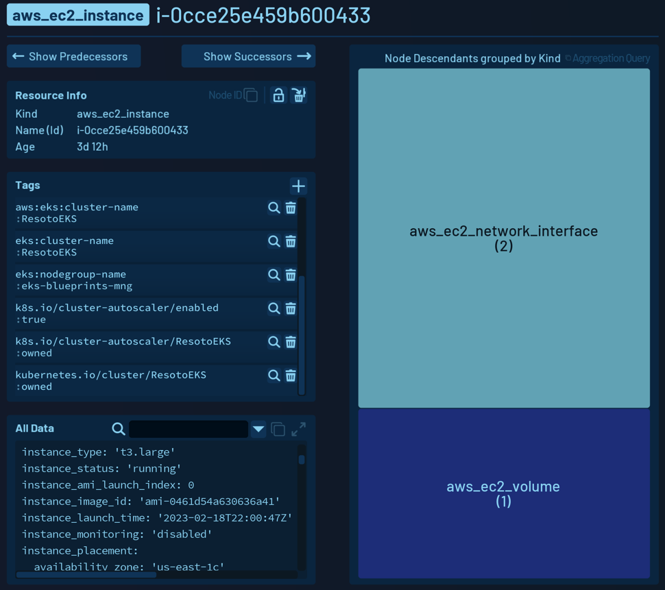

# Get to know the Resoto user interface

Resoto is a cloud infrastructure management tool that allows you to manage and explore your cloud infrastructure using either a web interface or a terminal interface. This guide will walk you through the Resoto user interface and show you how to use it to manage your cloud infrastructure.

## Using the Resoto User Web Interface

https://youtu.be/_odyE3scPGg

Resoto offers a user-friendly web interface that dramatically simplifies managing and exploring your cloud infrastructure. Let's look at the different parts of the Resoto user interface.

### Start Page

After you installed Resoto and finished the Setup Wizard, you will be redirected to the Start Page, which looks like this:

This page offers a search to quickly find the resource you are looking for and links to essential pages of the Resoto UI.

### Search

The search function allows you to search your entire cloud infrastructure using a keyword search. The search function works like Google search, making finding the specific resource or service you seek easy. All properties of all resources in all regions, accounts, and clouds are indexed and searchable.

Assume you have an IP address that is used by different components of your infrastructure. You can search for this IP address and find all resources where this IP address is used. Another good example is finding all traces of a specific user in your infrastructure by searching for the user's name.

Resoto offers a powerful [search syntax](../../reference/search/index.md) that empowers you to define filters as complex as you need. For example, you can search for all resources with a specific tag or a specific value of a tag combined with other filters.

You can use such a search by prefixing it with `search`. For example, `search is(instance) and instance_status=running and tag.owner~".*test.*"` will find all compute instances that are currently running and tagged with `owner` that matches the regular expression `.*test.*`.

### Explore

The Explore Page allows you to explore your infrastructure by navigating clouds, accounts, and regions. You can see a tree view that shows all clouds, accounts, and regions where the number of resources defines the size of the related item.

This view allows you to quickly navigate to accounts with many resources or to regions that are not used anymore.

### Resource Details

Multiple ways lead to the same view: the resource details page. Here you can see all details of a resource, including all properties, tags, and relationships.

The `Resource Info` section shows the kind, name, and age of the resource. All tags are visible in the `Tags` section. The `AllData` section shows a YAML representation of all the resource properties. This view can be expanded and filtered to show only the properties you are interested in. Using the `Predecessors` and `Successors` buttons, you can walk the dependencies of this resource inbound and outbound. We already saw the tree view in the explore section, and it also has the same meaning: all transitive dependencies of this resource are counted and shown.

### Dashboard

Dashboards are a great and easy way to visualize the facts you are interested in. Resoto allows you to define your dashboards and add widgets to them. The dashboards you create are stored inside Resoto and accessible to anyone who has access to Resoto.

Resoto can make use of different data sources:

- live data from the most recent data that has been collected.

  You can use the Resoto [search](../../reference/search/index.md) capability to show exactly the details you are interested in, or you use the [aggregation](../../reference/search/aggregation.md) feature to show aggregated data.

- historical time series data from the past.

  Resoto uses Prometheus as a time series database. You can query the data using the [PromQL](https://prometheus.io/docs/prometheus/latest/querying/basics/) query language. The metrics that are available in the time series database can be defined in the Resoto Metrics configuration.

Resoto has a predefined dashboard that makes sense for most users and should give you a good starting point for your dashboards.

### Configuration UI

The configuration UI allows you to adapt and change the configuration of your Resoto installation. You can configure various settings such as:

- Cloud data sync using the `resoto.worker` configuration
- Metrics to collect using the `resoto.metrics` configuration

## Using the Resoto Shell

Another way to use Resoto is the Resoto shell - a command line interface to interact with your resources.

Use the `help` command to get a list of all available commands or use `help <command>` to get help for a specific command.

The Resoto shell has command completion for all commands and all resource kinds, making it much easier to create commands and queries.

There is a lot of analogy to the Unix command line, allowing you to pipe the output of one command into another and create the desired action you want to perform.
