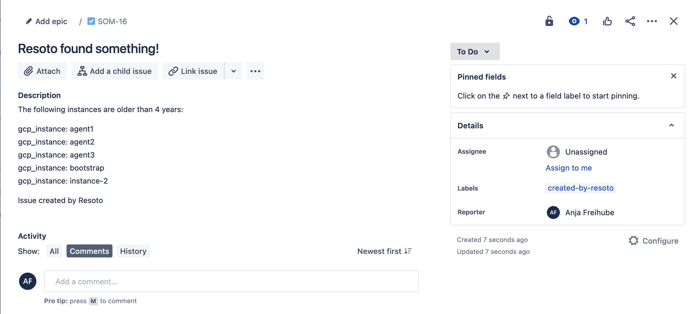

# How to Create Jira Issues

Resoto constantly monitors your infrastructure, and can alert you to any detected issues.

One way to receive these alerts is via [Jira](https://atlassian.com/software/jira). In this guide, we will configure Resoto to create Jira issues when defined criteria is true.

## Prerequisites

This guide assumes that you have already [installed](../../../getting-started/install-resoto/index.mdx) and configured Resoto to [collect your cloud resources](../../../getting-started/configure-resoto/index.mdx).

## Directions

1. [Create an API token](https://id.atlassian.com/manage-profile/security/api-tokens) in Jira.

2. Define search criteria. For example, let's say instances that are older than 4 years are not permitted:

   ```bash
   > search is(instance) and age>4yr
   ```

3. Now that we've defined the alert trigger, we will simply pipe the result of the search query to the `jira` [custom command](../../../reference/cli/index.mdx#custom-commands), replacing the `title` with your desired issue title and `url` with your Jira URL. You also need to provide your credentials (username and API token), the project ID, and the reporting user ID:

   ```bash
   > search is(instance) and age>4yr | jira title="Resoto found something!" message="The following instances are older than 4 years:" url="https://your-domain.atlassian.net" username="you@your-team.com" token="xxxxxxxxx" project_id="12345" reporter_id="1111111111111"
   ```

   If the defined condition is currently true, you should see a new issue in Jira:

   

:::warning

We do not recommend creating a [job](../../../concepts/automation/index.mdx#jobs) using the `jira` command at this time, as this will result in the creation of a new ticket each hour while the search condition remains true.

:::

:::tip

For all parameters mentioned above you can specify defaults in the `jira` custom command configuration, so that you can simply execute `jira title="..."`.

:::

## Further Reading

- [Search](../../../reference/search/index.mdx)
- [Automation](../../../concepts/automation/index.mdx)
- [Command-Line Interface](../../../reference/cli/index.mdx)
