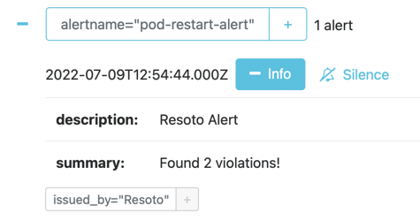

# How to Send Prometheus Alertmanager Alerts

Resoto constantly monitors your infrastructure, and can alert you to any detected issues. [Prometheus Alertmanager](https://prometheus.io/docs/alerting/latest/alertmanager) is a tool to manage and escalate alerts. In this guide, we will configure Resoto to send alerts to Alertmanager with a [custom command](../../../reference/cli/index.md).

## Prerequisites

This guide assumes that you have already [installed](../../../getting-started/install-resoto/index.md) and configured Resoto to [collect your cloud resources](../../../getting-started/configure-cloud-provider-access/index.md).

You will also need a running installation of [Alertmanager](https://prometheus.io/docs/alerting/latest/alertmanager).

## Directions

1. Open the `resoto.core.commands` configuration by executing the following command in [Resoto Shell](../../../concepts/components/shell.md):

   ```bash
   > config edit resoto.core.commands
   ```

2. Add the following command definition to the configuration, replacing `http://localhost:9093` with the URL of your [Alertmanager](https://prometheus.io/docs/alerting/latest/alertmanager) instance:

   ```yaml
   ​custom_commands:
   ​  commands:
   # highlight-start
       - info: 'Send result of a search to alertmanager'
         name: 'alertmanager'
         parameters:
           - name: 'duration'
             description: 'Alert duration'
             default: '3h'
           - name: 'description'
             description: 'Alert message'
             default: 'Resoto Alert'
           - name: 'name'
             description: 'Globally unique alert name'
             default: null
           - name: 'alertmanager_url'
             description: 'Alertmanager URL'
             default: 'http://localhost:9093'
         template: 'aggregate sum(1) as count | jq --no-rewrite "if (.count // 0)==0 then [] else [.count | tostring] end" | flatten | jq --no-rewrite [{status: "firing", labels: {alertname: "{{name}}", issued_by: "Resoto"}, annotations: {summary: ("Found "+.+ " violations!"), "description": "{{description}}"}{{#duration}}, startAt:"{{now}}", endsAt:"{{duration.from_now}}"{{/duration}}}] | http POST {{alertmanager_url}}/api/v1/alerts'
   # highlight-end
   ```

3. Save and quit the editing interface.

   We now have a custom command `alertmanager` with the following parameters:

   | Parameter          | Description                | Default Value           |
   | ------------------ | -------------------------- | ----------------------- |
   | `name`             | Globally unique alert name | `null`                  |
   | `description`      | Alert description          | `Resoto Alert`          |
   | `duration`         | Alert duration             | `3h`                    |
   | `alertmanager_url` | Alertmanager URL           | `http://localhost:9093` |

   The [`help` command](../../../reference/cli/help.md) can also be used to access this information in the [command-line interface](../../../reference/cli/index.md):

   ```bash
   > help alertmanager
   ```

4. Define search criteria that will trigger an alert. For example, let's say we want to send alerts whenever we find a [Kubernetes Pod](https://kubernetes.io/docs/concepts/workloads/pods) updated in the last hour with a restart count greater than 20:

   ```bash
   > search is(kubernetes_pod) and pod_status.container_statuses[*].restart_count > 20 and last_update<1h
   # highlight-next-line
   ​kind=kubernetes_pod, name=db-operator-mcd4g, restart_count=[42], age=2mo5d, last_update=23m, cloud=k8s, account=prod, region=kube-system
   ```

5. Now that we've defined the alert trigger, we will simply pipe the result of the search query to the `alertmanager` command, replacing the `name` with your desired alert name:

   ```bash
   > search is(kubernetes_pod) and pod_status.container_statuses[*].restart_count > 20 and last_update<1h | alertmanager name=pod-restart-alert
   ```

   If the defined condition is currently true, you should see a new alert in [Alertmanager](https://prometheus.io/docs/alerting/latest/alertmanager):

   

6. Finally, we want to automate checking of the defined alert trigger and send alerts to [Alertmanager](https://prometheus.io/docs/alerting/latest/alertmanager) whenever the result is true. We can accomplish this by creating a [job](/docs/concepts/automation/job):

   ```bash
   > jobs add --id alert_on_pod_failure--wait-for-event post_collect 'search is(kubernetes_pod) and pod_status.container_statuses[*].restart_count > 20 and last_update<1h | alertmanager name=pod-restart-alert'
   ```

## Further Reading

- [Search](../../../concepts/search/index.md)
- [Job](../../../concepts/automation/job.md)
- [Command-Line Interface](../../../reference/cli/index.md)
