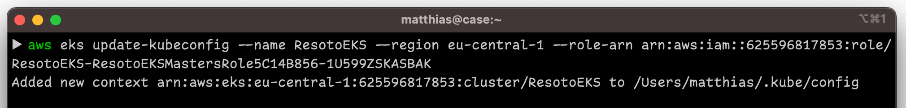

# How to Update Resoto

We regularly release [new versions of Resoto](/releases) with bug fixes and new features, and recommend keeping your Resoto installation up to date.

:::tip

Don't want to manage your own Resoto installation? Check out **[Fix](https://fix.security)**, an all-in-one security dashboard built on top of Resoto.

:::

<Tabs groupId="install-method" querystring>
<TabItem value="docker" label="Docker" default>

## Prerequisites

- [Docker](https://docs.docker.com/get-started#download-and-install-docker)

- [Docker Compose >= 1.29](https://docs.docker.com/compose/install)

## Directions

1.  Fetch the `docker-compose.yaml` file for the latest Resoto version. See the [list of versions](https://github.com/someengineering/resoto/releases) if you want to use a specific version.

    ```bash
    $ curl -Lo docker-compose.yaml {{dockerComposeUrl}}
    ```

2.  Restart the services defined in the `docker-compose.yaml` file:

    ```bash
    $ docker-compose up -d
    ```

    :::note

    [Docker Compose V2 integrated compose functions in to the Docker platform.](https://docs.docker.com/compose/#compose-v2-and-the-new-docker-compose-command)

    In Docker Compose V2, the command is `docker compose` (no hyphen) instead of `docker-compose`.

    :::

    <VersionOnly allowed="current">

    :::info

    Resoto publishes packages for both x86 and ARM architectures for stable releases, but `edge` versions are only available for x86.

    If you have an Apple Silicon or other ARM-based machine, please use the latest stable release (<LatestRelease /> or `latest`).

    :::

    </VersionOnly>

</TabItem>
<TabItem value="aws" label="AWS">

:::warning Deprecation notice

The Resoto AWS <abbr title="Cloud Development Kit">CDK</abbr> construct is no longer actively maintained. We recommend [running Resoto using Docker](../../getting-started/install-resoto/index.mdx).

:::

## Prerequisites

- [AWS command-line interface](https://aws.amazon.com/cli)

- [Helm](https://helm.sh) (version 3 or above)

## Directions

1.  Log in to the [AWS CloudFormation console](https://console.aws.amazon.com/cloudformation).

2.  Click **Stacks**.

3.  Enter `ResotoEKS` into the search box, and click on the stack you would like to upgrade.

    

4.  Click the **Outputs** tab.

5.  Enter `ResotoEKSConfigCommand` into the search box. There should be exactly one entry. Copy the value (`aws eks ...`).

    

6.  Open a terminal and execute the copied command.

    

7.  List installed Helm charts:

    ```bash
    $ helm list
    ​NAME  	NAMESPACE	CHART       	APP VERSION
    ​resoto	resoto   	resoto-0.7.4	3.3.1
    ```

    :::note

    The `APP VERSION` column displays the currently installed version of Resoto.

    :::

8.  Add the [Some Engineering Helm chart repository](https://helm.some.engineering):

    ```bash
    $ helm repo add someengineering https://helm.some.engineering
    ```

9.  Update cached chart information:

    ```bash
    $ helm repo update
    ```

10. Upgrade the `resoto` chart:

    ```bash
    $ helm upgrade resoto someengineering/resoto --atomic --reuse-values --set image.tag={{imageTag}}
    ```

</TabItem>
<TabItem value="kubernetes" label="Kubernetes">

:::warning Deprecation notice

The Resoto Helm chart is no longer actively maintained. We recommend [running Resoto using Docker](../../getting-started/install-resoto/index.mdx).

:::

## Prerequisites

- [Helm](https://helm.sh) (version 3 or above)

## Directions

1.  List installed Helm charts:

    ```bash
    $ helm list
    ​NAME  	NAMESPACE	CHART       	APP VERSION
    ​resoto	resoto   	resoto-0.7.4	3.3.1
    ```

    :::note

    The `APP VERSION` column displays the currently installed version of Resoto.

    :::

2.  Add the [Some Engineering Helm chart repository](https://helm.some.engineering):

    ```bash
    $ helm repo add someengineering https://helm.some.engineering
    ```

3.  Update cached chart information:

    ```bash
    $ helm repo update
    ```

4.  Upgrade the `resoto` chart:

    ```bash
    $ helm upgrade resoto someengineering/resoto --atomic --reuse-values --set image.tag={{imageTag}}
    ```

</TabItem>
</Tabs>
