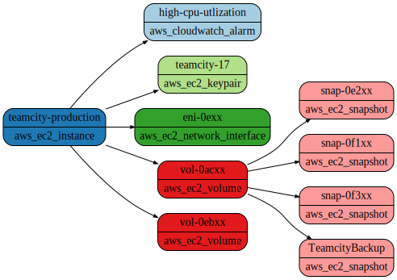

# How to Visualize the Blast Radius of a Resource

Resoto builds a cloud asset inventory by collecting resource metadata and relationships.

Resoto uses resource relationship data to traverse not only the direct dependencies of a resource, but also transitive dependencies (the dependencies of dependent resources).

Transitive dependencies show the "blast radius" of a resource, giving an overview how a resource is connected to other resources. In the event that a resource becomes compromised, the blast radius can provide a complete view of affected resources.

## Prerequisites

This guide assumes that you have already [installed](../../../getting-started/install-resoto/index.md) and configured Resoto to [collect your cloud resources](../../../getting-started/configure-cloud-provider-access/index.md).

## Directions

1. Execute the [`search` command](../../../reference/cli/search-commands/search.md) in [Resoto Shell](../../../concepts/components/shell.md) to get the resource for which we want to see the blast radius:

   ```bash
   > search is(aws_ec2_instance) and name=teamcity-production
   # highlight-next-line
   ​kind=aws_ec2_instance, id=i-1xx, name=teamcity-production, age=1yr7mo, cloud=aws, account=prod, region=us-west-2​
   ```

   The above example searches for an AWS EC2 instance with name `teamcity-production`.

   :::note

   Make sure the search only returns a single result, the resource we are interested in.

   :::

2. Add `-[0:]->` to the end of the search query to instruct Resoto to traverse dependencies outbound:

   ```bash
   > search is(aws_ec2_instance) and name=teamcity-production -[0:]->
   # highlight-start
    ​kind=aws_ec2_instance, id=i-1xx, name=teamcity-production, age=1yr7mo, cloud=aws, account=prod, region=us-west-2
    ​kind=aws_cloudwatch_alarm, id=high-cpu-utlization, name=high-cpu-utlization, age=1yr7mo, last_update=1yr7mo, cloud=aws, account=prod, region=us-west-2
    ​kind=aws_ec2_keypair, id=key-07xx, name=teamcity-17, age=4mo13d, cloud=aws, account=prod, region=us-west-2
    ​kind=aws_ec2_network_interface, id=eni-0exx, name=eni-0exx, age=4mo13d, cloud=aws, account=prod, region=us-west-2
    ​kind=aws_ec2_snapshot, id=snap-0e2xx, name=snap-0e2xx, age=7mo25d, cloud=aws, account=prod, region=us-west-2
    ​kind=aws_ec2_snapshot, id=snap-0f1xx, name=snap-0f1xx, age=8mo15d, cloud=aws, account=prod, region=us-west-2
    ​kind=aws_ec2_snapshot, id=snap-0f3xx, name=snap-0f3xx, age=6mo14d, cloud=aws, account=prod, region=us-west-2
    ​kind=aws_ec2_snapshot, id=snap-00dxx, name=TeamcityBackup, age=9mo19d, cloud=aws, account=prod, region=us-west-2
    ​kind=aws_ec2_volume, id=vol-0acxx, name=vol-0acxx, age=1yr7mo, cloud=aws, account=prod, region=us-west-2
    ​kind=aws_ec2_volume, id=vol-0ebxx, name=vol-0ebxx, age=1yr7mo, cloud=aws, account=prod, region=us-west-2
    # highlight-end
   ```

3. Export the results in [Graphviz DOT format](https://graphviz.org/doc/info/lang.html):

   ```bash
   > search --with-edges is(aws_ec2_instance) and name=teamcity-production -[0:]-> | format --dot | write blast-radius.dot
   # highlight-next-line
   ​Received a file blast-radius.dot, which is stored to ./blast-radius.dot.
   ```

   The resulting file is outputted to the [Resoto Shell](../../../concepts/components/shell.md) download directory, which defaults to the current working directory. Use a [Graphviz](https://graphviz.org) tool to visualize the results:

   ```bash
   $ dot -Tsvg blast-radius.dot -o blast-radius.svg
   ```

   The above outputs an image in SVG format:

   

## Further Reading

- [Search](../../../concepts/search/index.md)
- [Command-Line Interface](../../../reference/cli/index.md)
