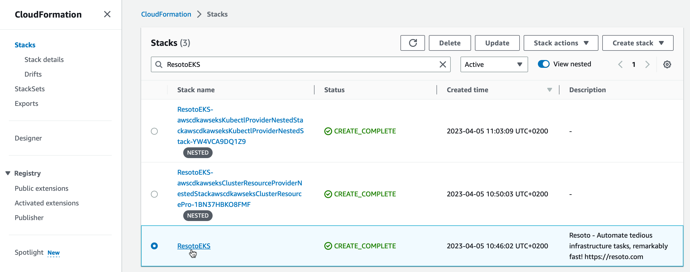
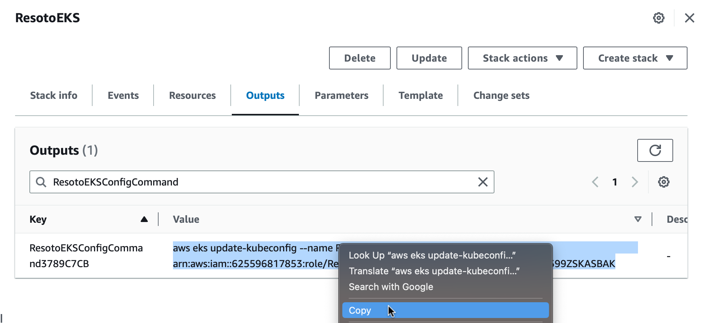
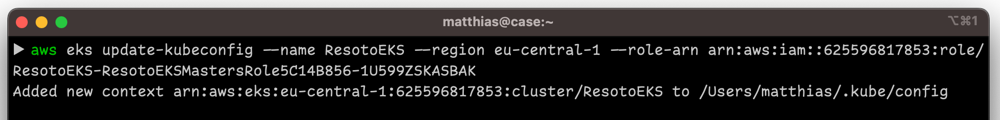

# Update an AWS CDK based Resoto installation

The AWS CDK based installation creates an EKS Kubernetes cluster. A [helm chart](https://github.com/someengineering/helm-charts/tree/main/someengineering/resoto) is deployed inside this cluster. We use [`helm upgrade`](https://helm.sh/docs/helm/helm_upgrade/) to upgrade Resoto.

## Prerequisites

- Access to the Cloudformation Stack
- AWS [CLI](https://aws.amazon.com/cli/)
- [Helm](https://helm.sh) (version 3 or above)

## Directions

1. Go to AWS CloudFormation -> Stacks. Filter for `ResotoEKS` and click on the stack. 
2. Go to the `Outputs` tab of the Stack details. Type `ResotoEKSConfigCommand` into the search box. There should be exactly one entry with this name with a suffix that makes this entry unique. Copy the Value (starts with `aws eks ...`). 
3. Open a terminal, paste the copied command and press enter. Now you have access to the k8s cluster. 
4. Make sure you have access to your Resoto installation.

   ```bash
   $ helm list
   ​NAME  	NAMESPACE	CHART       	APP VERSION
   ​resoto	resoto   	resoto-0.7.4	3.3.1
   ```

   The `APP Version` reflects the currently installed version of Resoto.

5. Make sure that the [Some Engineering Helm chart repository](https://helm.some.engineering) is available:
   ```bash
   $ helm repo add someengineering https://helm.some.engineering
   ```
6. Update cached chart information:

   ```bash
   $ helm repo update
   ```

7. Install the latest available Resoto release.
   ```bash
   $ helm upgrade resoto someengineering/resoto --atomic --reuse-values --set image.tag={{imageTag}}
   ```
