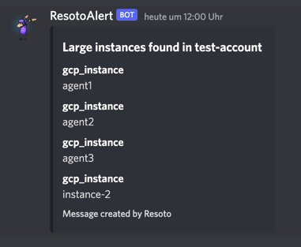

# How to Send Discord Notifications

## Introduction

Resoto constantly monitors your infrastructure, and can alert you to any detected issues.

One way to receive these notifications is via [Discord](https://discord.com). In this guide, we will configure Resoto to send alerts to a Discord text channel.

## Prerequisites

This guide assumes that you have already [installed](../../getting-started/installation/index.md) and configured Resoto to [collect your cloud resources](../../getting-started/configuration/cloud-providers/index.md).

You will also need the **Manage Webhooks** permission for the target text channel in your Discord server.

## Sending Alerts

1. [Create a webhook](https://support.discord.com/hc/en-us/articles/228383668-Intro-to-Webhooks) in your Discord server. Be sure to select the channel to which you want Resoto to send alerts.

   :::tip

   Customize the webhook name and avatar to make it easier to distinguish multiple webhooks for different alerts or services.

   :::

2. Define search criteria that will trigger an alert. For example, let's say we have a test account `test-account` where instances with more than 4GB of RAM are not permitted:

   ```bash
   > search is(instance) and instance_memory>4 and /ancestors.account.reported.name==test-account
   ```

3. Now that we've defined the alert trigger, we will simply pipe the result of the search query to the `discord` [custom command](../../reference/cli/index.md#custom-commands), replacing the `title` with your desired alert text and `webhook` with your Discord webhook URL:

   ```bash
   > search is(instance) and instance_memory>4 and /ancestors.account.reported.name==test-account | discord title="Large instances found in test-account" webhook="https://discord.com/api/webhooks/..."
   ```

   If the defined condition is currently true, you should see a new message in the specified Discord text channel:

   

4. Finally, we want to automate checking of the defined alert trigger and send alerts to Discord whenever the result is true. We can accomplish this by creating a [job](/docs/concepts/automation/job):

   ```bash
   > jobs add --id notify_large_test_instances --wait-for-event post_collect 'search is(instance) and instance_memory>4 and /ancestors.account.reported.name==test-account | discord title="Large instances found in test-account" webhook="https://discord.com/api/webhooks/..."'
   ```

## Considerations

If you have a default webhook to send notifications to, you can also define it as default value for webhook url in the custom command configuration. This way you can simply call `discord title="..."`. It is still possible to specify the `webhook` parameter explicitly to send the message to another channel.
