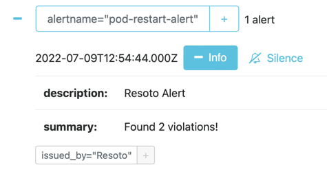

# Set Up Alertmanager Alerts

## Introduction

Resoto constantly monitors your infrastructure, and can alert you to any detected issues. [Alertmanager](https://prometheus.io/docs/alerting/latest/alertmanager/) is a tool to manage and escalate alerts. In this guide, we will configure Resoto to send alerts to Alertmanager.

## Prerequisites

This guide assumes that you have already [installed](../../getting-started/installation/index.md) and configured Resoto to [collect your cloud resources](../../getting-started/configuration/cloud-providers/index.md).

We will create a custom command for Alertmanager to send alerts. It is highly recommended to read the [how to create a custom command](..//automation/create-a-custom-command) guide first.

You will also need a running installation of Alertmanager.

## Create a custom command `alertmanager`

In Resotoshell configure your custom commands via:

```shell
> config edit resoto.core.commands
```

This will open the editor you configured via the `EDITOR` environment variable. Add the following lines to the list of commands and replace the `alertmanager_url.default` with the URL of your Alertmanager instance:

```yaml
custom_commands:
  commands:
    - info: 'Send result of a search to alertmanager'
      name: 'alertmanager'
      parameters:
        - name: 'duration'
          description: 'The duration of this alert in alertmanager.'
          default: '3h'
        - name: 'description'
          description: 'User defined message of the post.'
          default: '🔥🔥🔥 Resoto found stuff! 🔥🔥🔥'
        - name: 'name'
          description: 'The globally unique name of this alert.'
          default: null
        - name: 'alertmanager_url'
          description: 'The complete url to alertmanager.'
          default: 'http://localhost:9093'
      template: 'aggregate sum(1) as count | jq --no-rewrite "if (.count // 0)==0 then [] else [.count | tostring] end" | flatten | jq --no-rewrite [{status: "firing", labels: {alertname: "{{name}}", issued_by: "Resoto"}, annotations: {summary: ("Found "+.+ " violations!"), "description": "{{description}}"}{{#duration}}, startAt:"{{now}}", endsAt:"{{duration.from_now}}"{{/duration}}}] | http POST {{alertmanager_url}}/api/v1/alerts'
```

Save and quit the editor. We just created a new command called `alertmanager` that can be used anywhere in Resoto.

```bash
> help alertmanager
```

Will give you an explanation and usage of our new command.

Let's revisit the properties that we have just created. Please note: all default values of our command can be overridden explicitly while the `alertmanager` command is invoked:

- `duration`: Every alert in Alertmanager will be automatically removed after this duration. The default value is `3h`.
- `description`: The description of the alert. This description is visible in Alertmanager.
- `alertmanager_url`: The complete url to alertmanager.
- `name`: The name of the alert. This name has to be unique in Alertmanager. This is the only mandatory property a user needs to specify explicitly, since all other properties have default values.

## Sending Alerts

1. Define search criteria that will trigger an alert. For example, let's say we want to raise an alert, if we find a Kubernetes Pod that has been updated in the last hour and restarts over and over again.

```bash
> search is(kubernetes_pod) and pod_status.container_statuses[*].restart_count > 20 and last_update<1h

​kind=kubernetes_pod, name=db-operator-mcd4g, restart_count=[42], age=2mo5d, last_update=23m, cloud=k8s, account=prod, region=kube-system
```

2. Now that we've defined the alert trigger, we will simply pipe the result of the search query to the `alertmanager` command, replacing the `name` with your desired alert name:

```bash
> search is(kubernetes_pod) and pod_status.container_statuses[*].restart_count > 20 and last_update<1h | alertmanager name=pod-restart-alert
```

3. Finally, we want to automate checking of the defined alert trigger and send alerts to Alertmanager whenever the result is true. We can accomplish this by creating a [job](/docs/concepts/automation/job):

   ```bash
   > jobs add --id alert_on_pod_failure--wait-for-event post_collect 'search is(kubernetes_pod) and pod_status.container_statuses[*].restart_count > 20 and last_update<1h | alertmanager name=pod-restart-alert'
   ```

4. In case Resoto will find a pod that has been updated in the last hour and fails more than 20 times, we will see an alert in Alertmanager.

   
