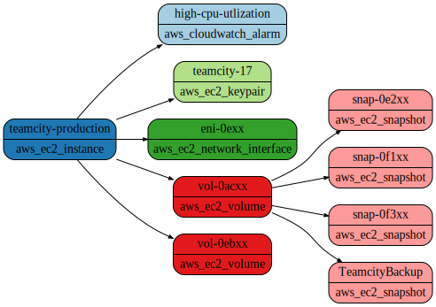

# How to reveal the blast radius of a resource

## Introduction

Resoto maintains an asset inventory of your infrastructure metadata. It not only collects the metadata of your resources, but also assembles the relationship between them.
We use this information to traverse not only direct dependencies, but also dependencies of dependant resources - transitive dependencies.
This information shows the "impact" of a radius, that we call the "blast radius".

Examples where this information might be helpful:

- Get an overview how a resource is connected to other resources.
- Get a list of affected resources when one or more resources are compromised. 

## Prerequisites

This guide assumes that you have already [installed](../../getting-started/installation/index.md) and configured Resoto to [collect your cloud resources](../../getting-started/configuration/cloud-providers/index.md).

## Show the blast radius of a resource

1. Open ResotoShell:

   Depending on your installation method this action might differ.

   - Docker Compose:

    ```bash
    $ docker compose run --rm resotoshell
    ```

   - Local Installation:
    ```bash
    $ resh --resotocore-uri https://<host and port to resoto> --psk <private shared key>
    ```

2. Use the search command to get the resource you are interested in:

   For this example we want to know the blast radius of an AWS EC2 instance with name `teamcity-production`.

   ```bash
   > search is(aws_ec2_instance) and name=teamcity-production
   kind=aws_ec2_instance, id=i-1xx, name=teamcity-production, age=1yr7mo, cloud=aws, account=prod, region=us-west-2
   ​
   ```
   With this step we made sure, that we only found exactly the resource in question.

3. Get the blast radius of this resource:

   We use exactly the same search command and add the following traversal definition: `-[0:]->`. You can read it as: traverse the dependencies outbound (same direction as the dependency) starting from the current node until the end of the graph (`[0:]`).

   ```bash
   > search is(aws_ec2_instance) and name=teamcity-production -[0:]->
    ​kind=aws_ec2_instance, id=i-1xx, name=teamcity-production, age=1yr7mo, cloud=aws, account=prod, region=us-west-2
    ​kind=aws_cloudwatch_alarm, id=high-cpu-utlization, name=high-cpu-utlization, age=1yr7mo, last_update=1yr7mo, cloud=aws, account=prod, region=us-west-2
    ​kind=aws_ec2_keypair, id=key-07xx, name=teamcity-17, age=4mo13d, cloud=aws, account=prod, region=us-west-2
    ​kind=aws_ec2_network_interface, id=eni-0exx, name=eni-0exx, age=4mo13d, cloud=aws, account=prod, region=us-west-2
    ​kind=aws_ec2_snapshot, id=snap-0e2xx, name=snap-0e2xx, age=7mo25d, cloud=aws, account=prod, region=us-west-2
    ​kind=aws_ec2_snapshot, id=snap-0f1xx, name=snap-0f1xx, age=8mo15d, cloud=aws, account=prod, region=us-west-2
    ​kind=aws_ec2_snapshot, id=snap-0f3xx, name=snap-0f3xx, age=6mo14d, cloud=aws, account=prod, region=us-west-2
    ​kind=aws_ec2_snapshot, id=snap-00dxx, name=TeamcityBackup, age=9mo19d, cloud=aws, account=prod, region=us-west-2
    ​kind=aws_ec2_volume, id=vol-0acxx, name=vol-0acxx, age=1yr7mo, cloud=aws, account=prod, region=us-west-2
    ​kind=aws_ec2_volume, id=vol-0ebxx, name=vol-0ebxx, age=1yr7mo, cloud=aws, account=prod, region=us-west-2
   ```

4. Create a diagram of the blast radius
   
   It is easily possible to create a diagram of the blast radius. We again take the same search as the last step. This time we ask Resoto to include the relationship data in the output and to format the result in a graphviz [dot](https://graphviz.org/doc/info/lang.html).
   
   ```bash
   > search --with-edges is(aws_ec2_instance) and name=teamcity-production -[0:]-> | format --dot | write blast-radius.dot
   ​Received a file blast-radius.dot, which is stored to ./blast-radius.dot.
   ```
   
   A file is downloaded and is stored in the resoto shell download directory, which defaults to the current directory. You can use one of the many online graphviz tools to visualize the result or use a local installation of graphviz.
   
   ```bash
    $ dot -Tsvg blast-radius.dot -o blast-radius.svg
    ```

    The result is an SVG file. Above data would show this blast radius:
    
