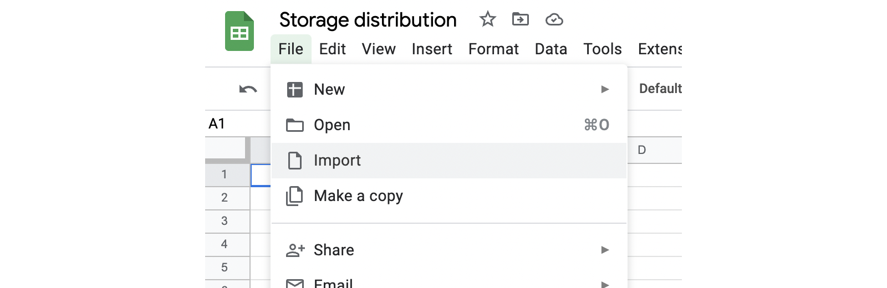
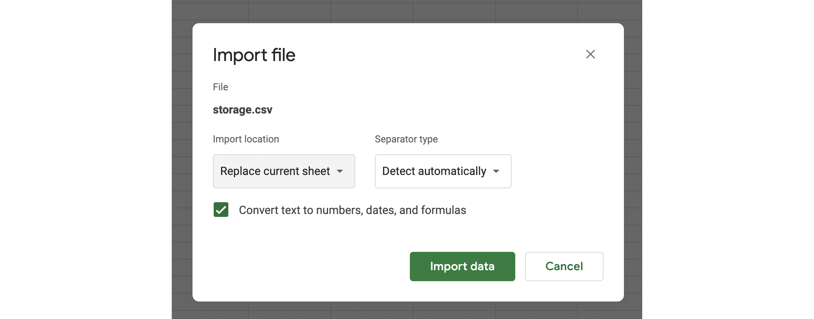
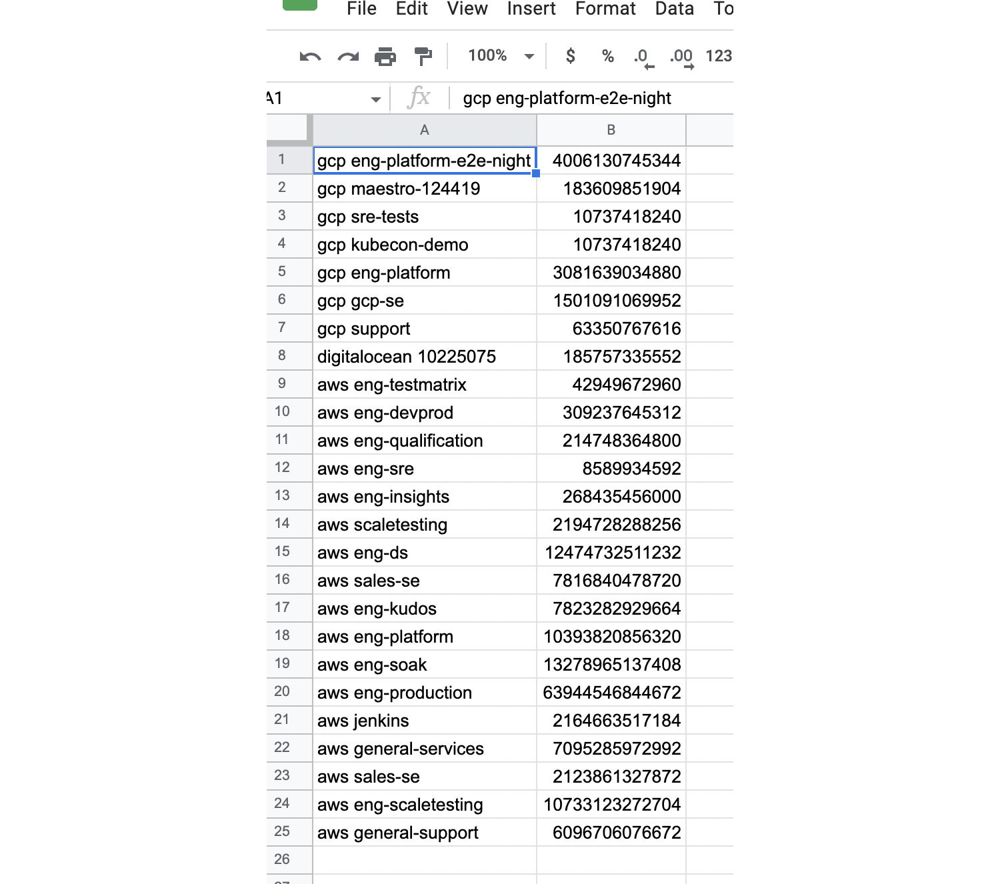
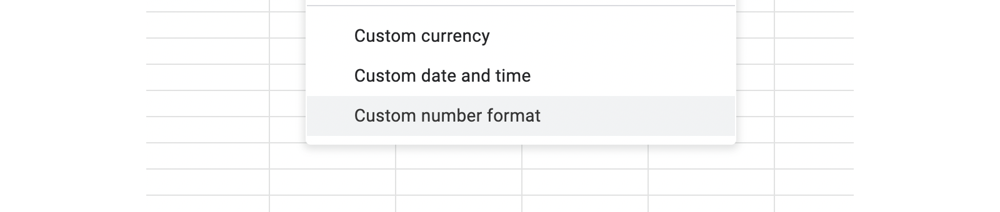
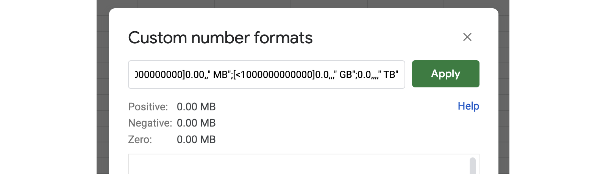
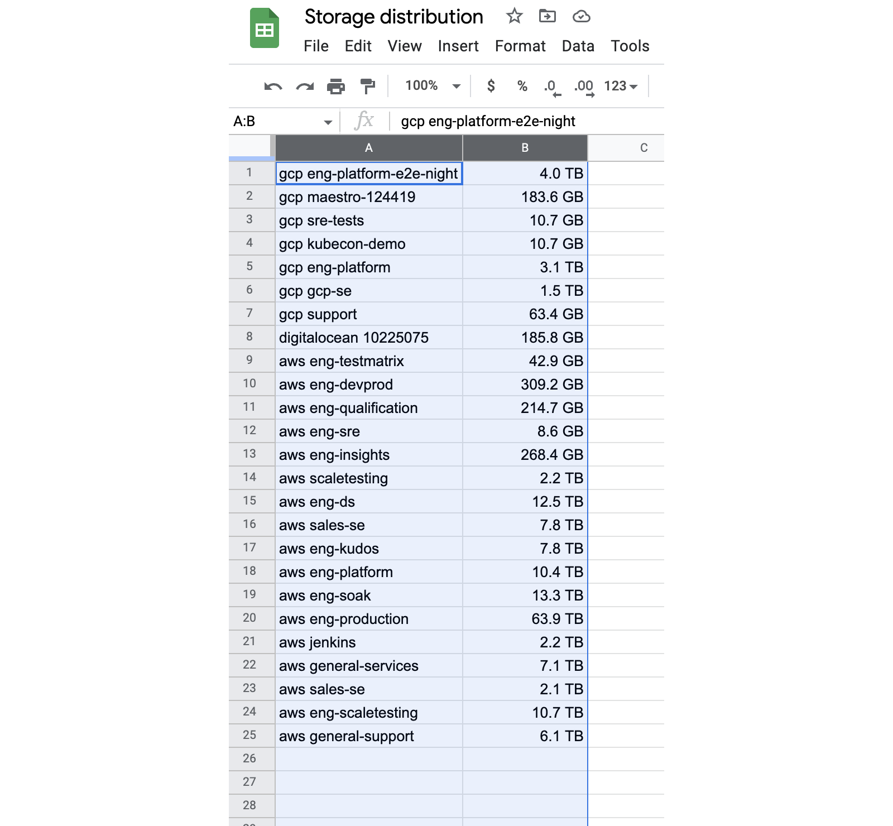
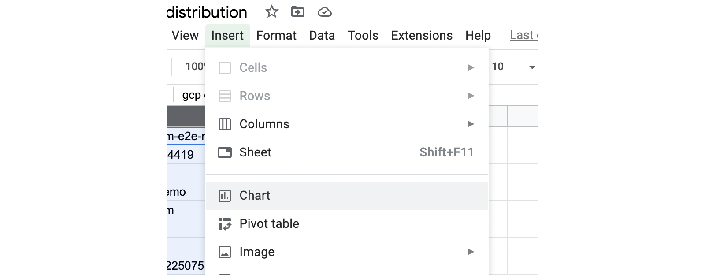
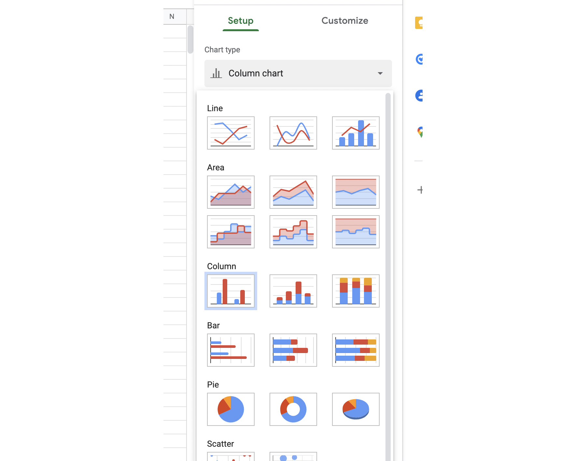
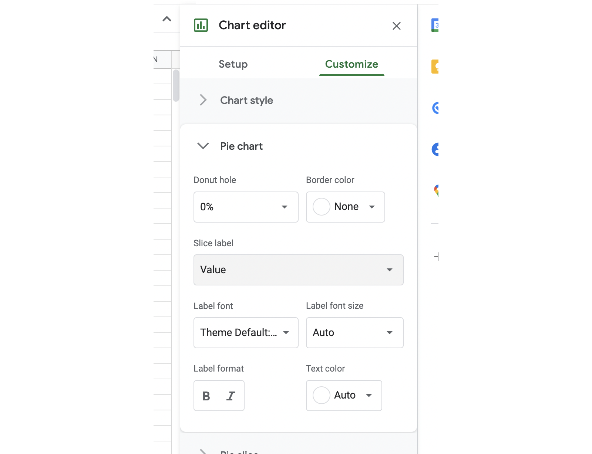

# Exporting data from Resoto to Google Sheets

## Introduction

The final result of this how-to is a chart showing which cloud account has what proportion of our total storage allocated. 

## Steps

- We first perform a search that aggregates all storage volumes across all clouds and accounts and returns the total size of all volumes per account.
- We then pipe the aggregated result into the `format` command to flatten the data into rows and columns and export those as a CSV file.
- Lastly we import the CSV into Google Sheets and create a pie chart showing the distribution of storage across accounts.

## Performing the search

In [Resoto Shell](../../concepts/components/shell.md) execute the following [aggregate search](../../reference/cli/aggregate.md):

```
> search aggregate(/ancestors.cloud.reported.name as cloud, /ancestors.account.reported.name as account: sum(volume_size * 1024 * 1024 * 1024) as volume_bytes): is(volume)
```

The resulting output looks similar to this:

```
---
group:
  cloud: aws
  account: sales-demo
volume_bytes: 2123861327872

---
group:
  cloud: aws
  account: eng-scaletesting
volume_bytes: 10733123272704

---
group:
  cloud: aws
  account: general-support
volume_bytes: 6096706076672
```

## Formating the data and writing a CSV file

Next we pipe the complex data structure into the command `format {/group.cloud} {/group.account},{/volume_bytes}` to flatten it into rows and columns, resulting in an output like this:

```
aws sales-demo,2123861327872
aws eng-scaletesting,10733123272704
aws general-support,6096706076672
```

Using the `write storage.csv` command we then write the output to a CSV file on our local disk.

```bash title="Execute in Resoto Shell (use this code box's copy button ⧉)"
> search aggregate(/ancestors.cloud.reported.name as cloud, /ancestors.account.reported.name as account: sum(volume_size * 1024 * 1024 * 1024) as volume_bytes): is(volume) | format {/group.cloud} {/group.account},{/volume_bytes} | write storage.csv
# highlight-next-line
​Received a file storage.csv, which is stored to ./storage.csv.
```

The resulting CSV now contains a list of cloud providers and their associated account names and storage sizes.

```csv title="storage.csv"
gcp eng-platform-e2e-night,4006130745344
gcp maestro-124419,183609851904
gcp sre-tests,10737418240
gcp kubecon-demo,10737418240
gcp eng-platform,3081639034880
gcp gcp-se,1501091069952
gcp support,63350767616
digitalocean 10225075,185757335552
aws eng-testmatrix,42949672960
aws eng-devprod,309237645312
aws eng-qualification,214748364800
aws eng-sre,8589934592
aws eng-insights,268435456000
aws scaletesting,2194728288256
aws eng-ds,12474732511232
aws sales-se,7816840478720
aws eng-kudos,7823282929664
aws eng-platform,10393820856320
aws eng-soak,13278965137408
aws eng-production,63944546844672
aws jenkins,2164663517184
aws general-services,7095285972992
aws sales-se,2123861327872
aws eng-scaletesting,10733123272704
aws general-support,6096706076672
```

## Import the CSV in Google Sheets

Create a new Google Sheet and give it a name like "Storage distribution".

Now from the File menu click "Import" and select the "Upload" tab. 

Drag and drop the previously generated `storage.csv` file onto the "Drag a file here" field. 

In the import location settings select "Replace current sheet" and click "Import data". 

The imported data will be displayed in the sheet. 

Select column B 

From the Format->Number menu select "Custom number format" 

As custom format enter `[<1000000000]0.00,," MB";[<1000000000000]0.0,,," GB";0.0,,,," TB"` and click apply. 

The size column should now be formatted as MB, GB or TB. 

Select columns A and B. 

Click on Insert->Chart 

Double click on the chart to open the chart settings. For chart type select "Pie". 

In the "Customize" tab open "Pie chart" and choose "Value" for "Slice label". 

The final result is a chart showing us how storage usage is distributed between our cloud accounts. 
