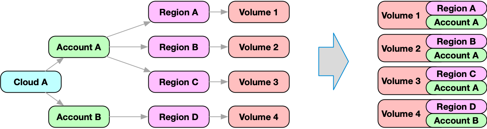
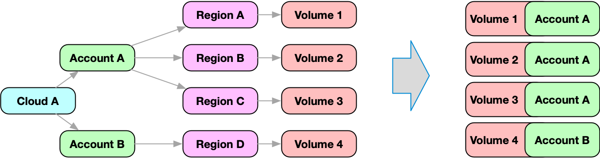

# Subqueries

While it is possible to query and retrieve a filtered part of the graph, it is sometimes helpful to retrieve structural graph data as part of the node.

This approach merges multiple nodes in a graph into one node. This combined node can simplify processing the node.



The merge node feature allows for subqueries, that are executed for every node in the result. The result of the subquery is then merged with the node data.

:::tip Example

Most cloud resources are maintained in an account. Accounts are modeled as [nodes](../../../concepts/graph/node.md) in Resoto.

Resources reference the region node, while the region node references the account node. In order to retrieve the account, the graph has to be traversed inbound from the resource node until the account node is found. While this is possible, it might be more convenient to get the account information as part of the node!

In this example, we query nodes of kind `volume`. For every element that is returned, a subquery is executed, which will traverse the graph inbound until it finds a node of kind `account`.

```bash
$> query is(volume) { account: <-[0:]- is(account) } limit 1 | dump
// highlight-start
reported:
    .
    .
account:
    reported:
        .
        .
// highlight-end
```

The result of this subquery is merged with the volume node on root level under the name account.

The complete information about the account is then available as part of the volume node:



:::

A subquery is a complete, standalone query and can use the features of any other query.

The result of a subquery is merged with the original node under the given merge name.

If the merge name is a simple literal, zero or one result of the subquery is expected. This also means, that the graph traversal of the subquery stops, when the first matching element is found.

If the expected result of the subquery is a list, than the merge name has to be defined with square brackets.

:::tip Example

The following query will traverse inbound on every element and collect all predecessors under the name `predecessors`).

```bash
$> query is(volume) { predecessors[]: <-- all } limit 1 | dump
// highlight-start
reported:
    .
    .
predecessors:
- reported:
    .
    .
- reported:
    .
    .
// highlight-end
```

:::

It is also possible to define multiple merge queries in one query statement.

:::tip Example

```bash
$> query is(volume) { account: <-[0:]- is(account), region: <-[0:]- is(region) } limit 1 | dump
// highlight-start
reported:
    .
    .
account:
    reported:
        .
        .
region:
    reported:
        .
        .
// highlight-end
```


:::

A subquery can even be defined using subqueries:

```bash
$> query = <pre_filter> { <merge_name_1>: <query>, .., <merge_name_n>: <query> } <post_filter>
```

:::note

Be aware that a subquery is executed for every node of the original query and might be expensive and time intensive to compute.

:::
