# Amazon Web Services Resources

:::info

Please refer to [Configure Amazon Web Services Access](../../getting-started/configure-cloud-provider-access/aws.md) for details on how to set up Resoto to collect [Amazon Web Services (AWS)](https://aws.amazon.com) resources.

:::

## `aws_account`

**Relationships in the graph that shows predecessors and successors of `aws_account`:**

## `aws_alb`

**Relationships in the graph that shows predecessors and successors of `aws_alb`:**

## `aws_alb_target_group`

**Relationships in the graph that shows predecessors and successors of `aws_alb_target_group`:**

## `aws_api_gateway_authorizer`

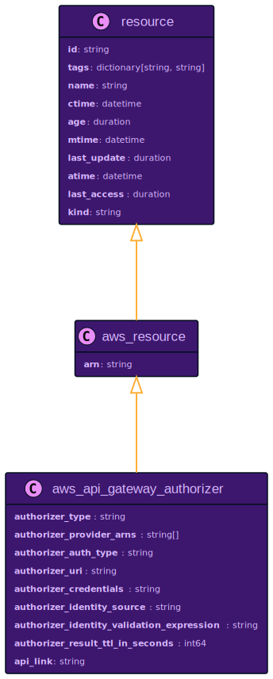

**Relationships in the graph that shows predecessors and successors of `aws_api_gateway_authorizer`:**

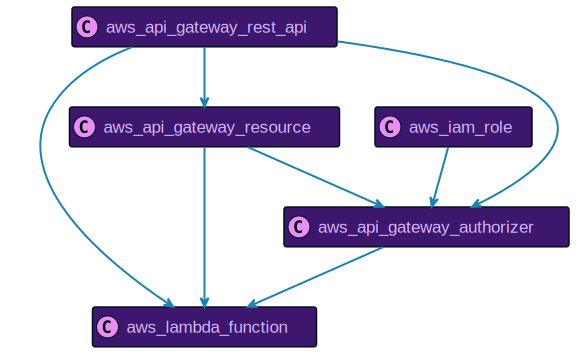

## `aws_api_gateway_deployment`

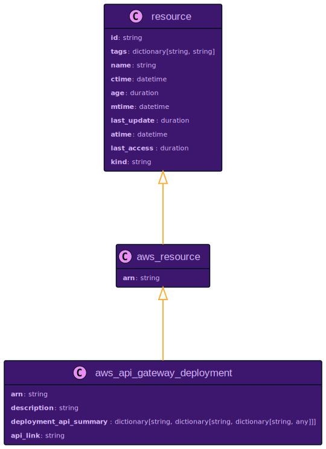

**Relationships in the graph that shows predecessors and successors of `aws_api_gateway_deployment`:**

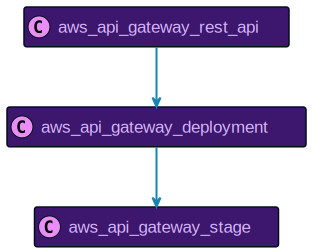

## `aws_api_gateway_domain_name`

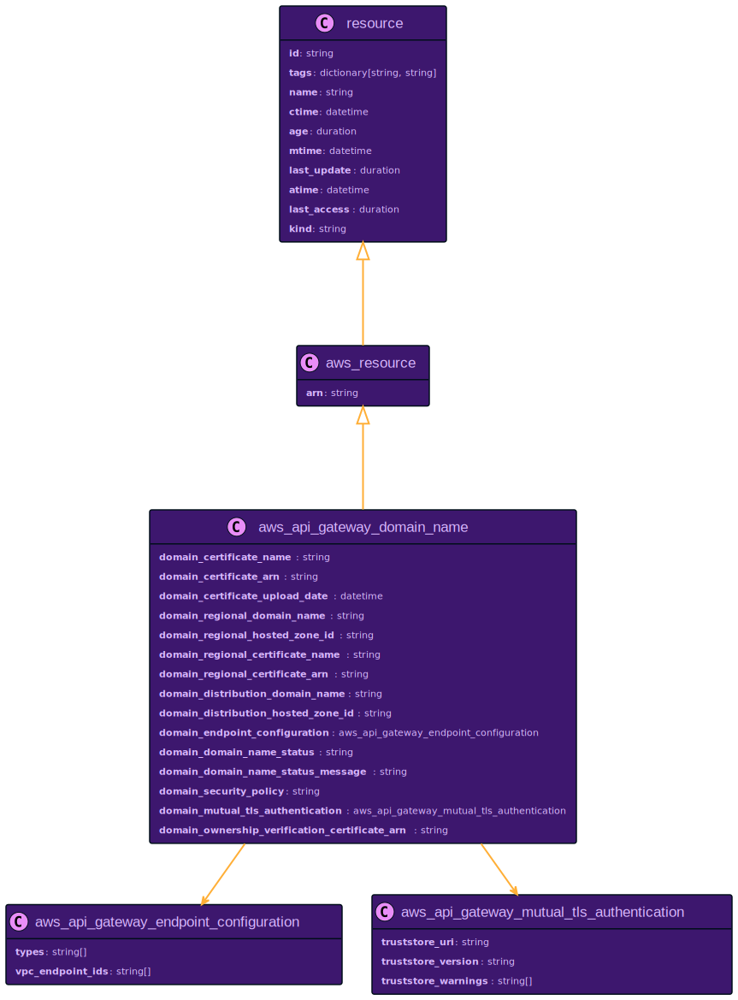

**Relationships in the graph that shows predecessors and successors of `aws_api_gateway_domain_name`:**

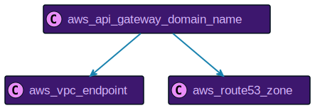

## `aws_api_gateway_resource`

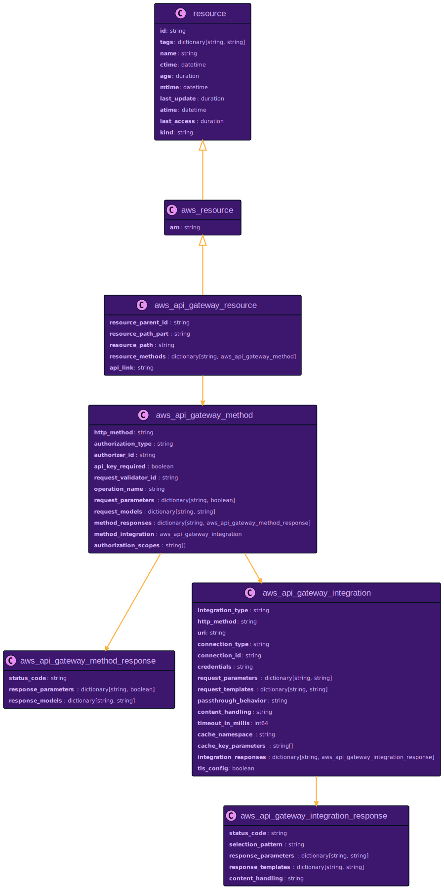

**Relationships in the graph that shows predecessors and successors of `aws_api_gateway_resource`:**

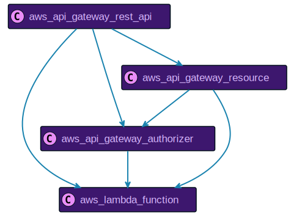

## `aws_api_gateway_rest_api`

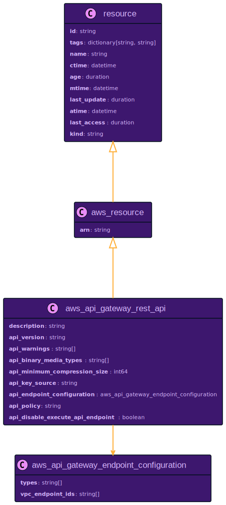

**Relationships in the graph that shows predecessors and successors of `aws_api_gateway_rest_api`:**

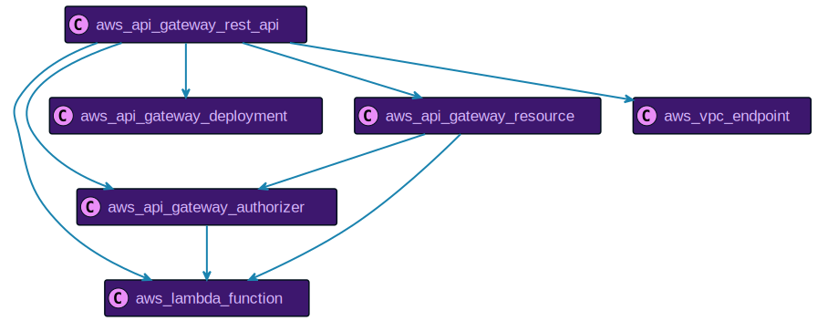

## `aws_api_gateway_stage`

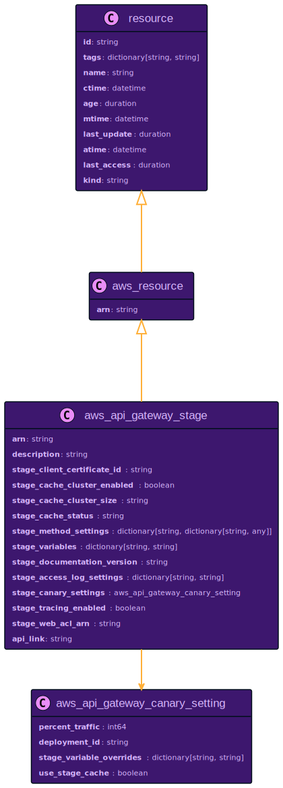

**Relationships in the graph that shows predecessors and successors of `aws_api_gateway_stage`:**

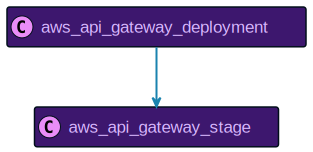

## `aws_athena_data_catalog`

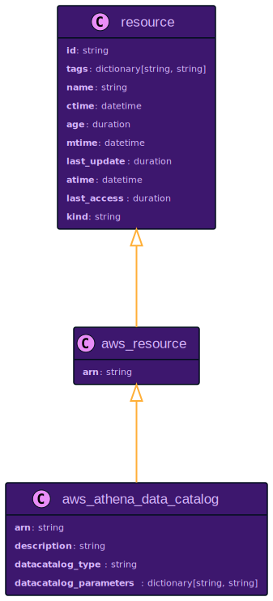

**Relationships in the graph that shows predecessors and successors of `aws_athena_data_catalog`:**

## `aws_athena_work_group`

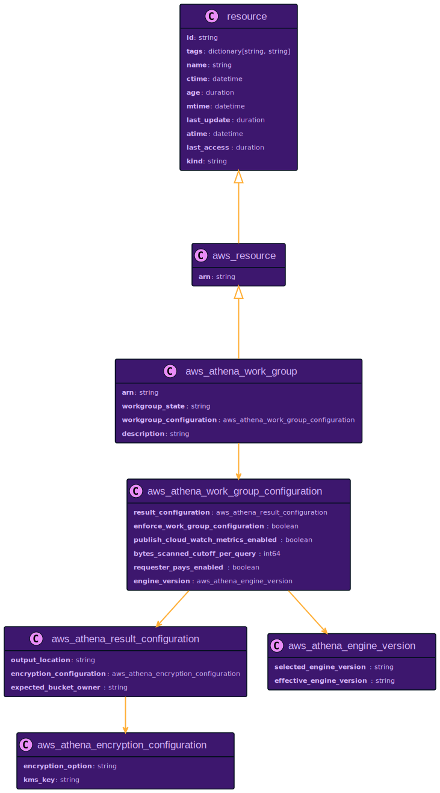

**Relationships in the graph that shows predecessors and successors of `aws_athena_work_group`:**

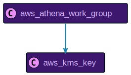

## `aws_autoscaling_group`

**Relationships in the graph that shows predecessors and successors of `aws_autoscaling_group`:**

## `aws_beanstalk_application`

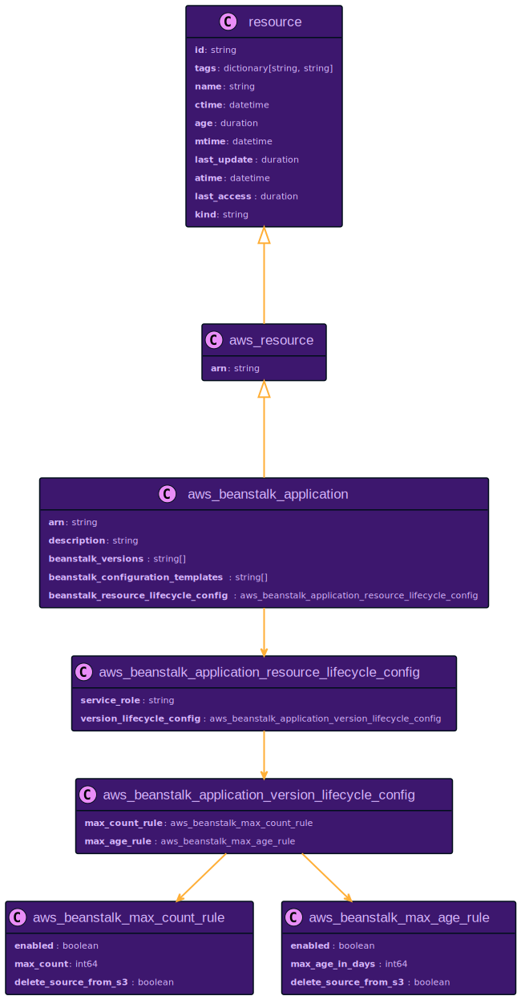

**Relationships in the graph that shows predecessors and successors of `aws_beanstalk_application`:**

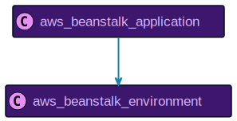

## `aws_beanstalk_environment`

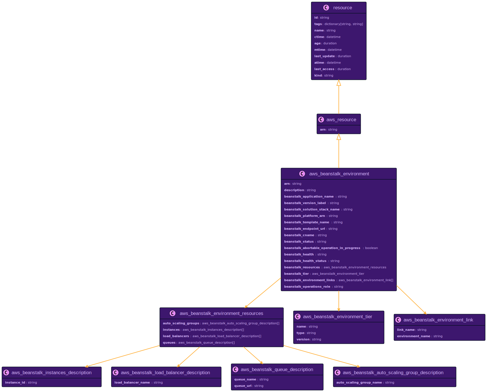

**Relationships in the graph that shows predecessors and successors of `aws_beanstalk_environment`:**

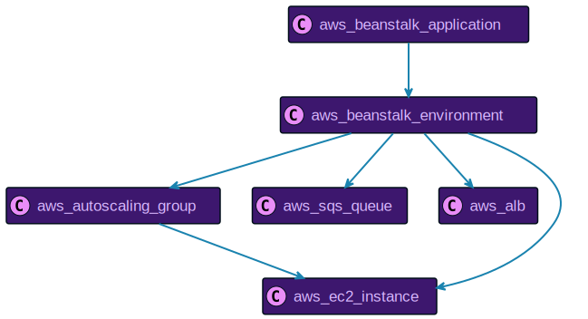

## `aws_cloudformation_stack`

**Relationships in the graph that shows predecessors and successors of `aws_cloudformation_stack`:**

## `aws_cloudformation_stack_set`

**Relationships in the graph that shows predecessors and successors of `aws_cloudformation_stack_set`:**

## `aws_cloudwatch_alarm`

**Relationships in the graph that shows predecessors and successors of `aws_cloudwatch_alarm`:**

## `aws_dynamo_db_global_table`

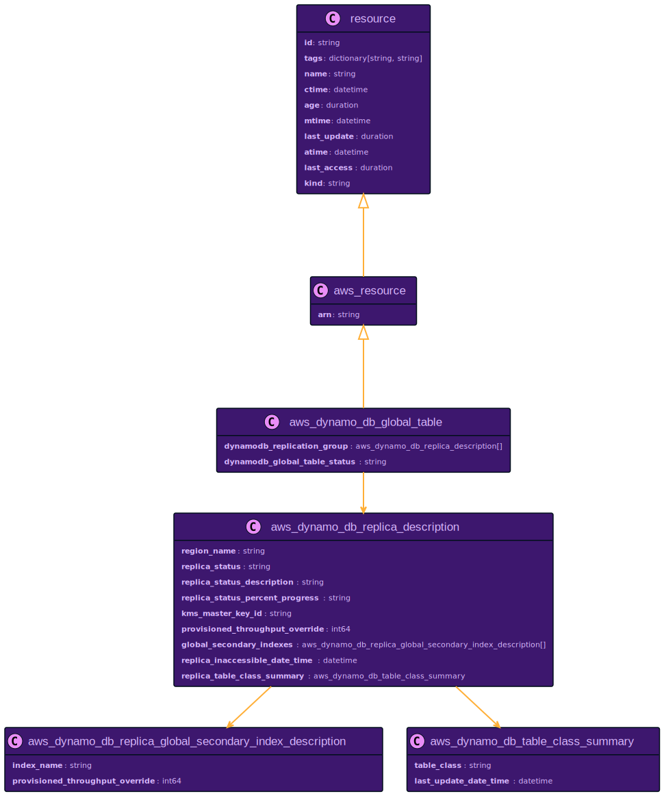

**Relationships in the graph that shows predecessors and successors of `aws_dynamo_db_global_table`:**

## `aws_dynamo_db_table`

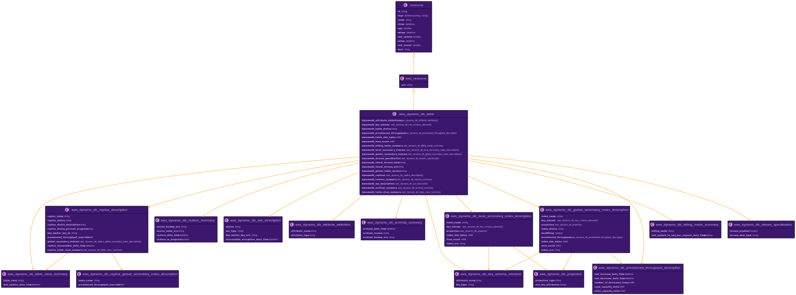

**Relationships in the graph that shows predecessors and successors of `aws_dynamo_db_table`:**

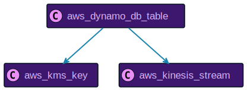

## `aws_ec2_elastic_ip`

**Relationships in the graph that shows predecessors and successors of `aws_ec2_elastic_ip`:**

## `aws_ec2_host`

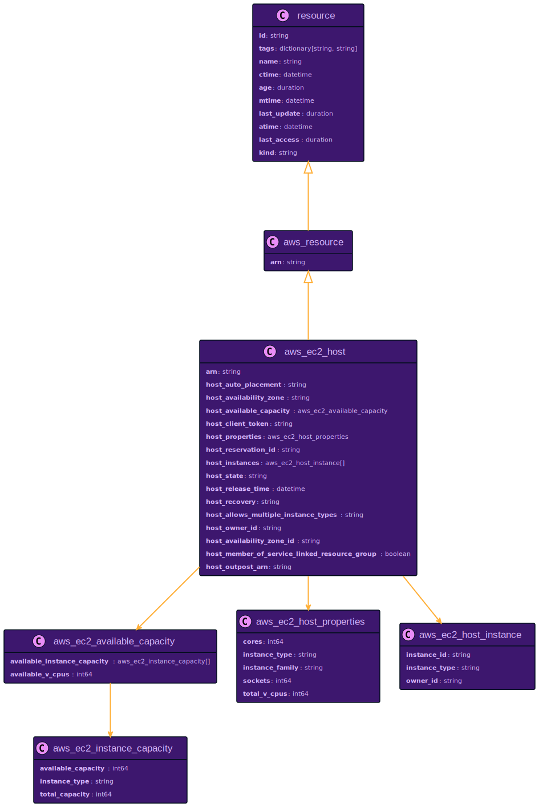

**Relationships in the graph that shows predecessors and successors of `aws_ec2_host`:**

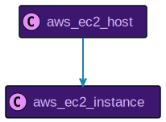

## `aws_ec2_instance`

**Relationships in the graph that shows predecessors and successors of `aws_ec2_instance`:**

## `aws_ec2_instance_type`

**Relationships in the graph that shows predecessors and successors of `aws_ec2_instance_type`:**

## `aws_ec2_internet_gateway`

**Relationships in the graph that shows predecessors and successors of `aws_ec2_internet_gateway`:**

## `aws_ec2_keypair`

**Relationships in the graph that shows predecessors and successors of `aws_ec2_keypair`:**

## `aws_ec2_nat_gateway`

**Relationships in the graph that shows predecessors and successors of `aws_ec2_nat_gateway`:**

## `aws_ec2_network_acl`

**Relationships in the graph that shows predecessors and successors of `aws_ec2_network_acl`:**

## `aws_ec2_network_interface`

**Relationships in the graph that shows predecessors and successors of `aws_ec2_network_interface`:**

## `aws_ec2_reserved_instances`

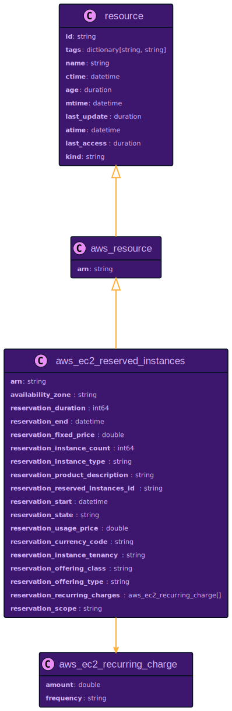

**Relationships in the graph that shows predecessors and successors of `aws_ec2_reserved_instances`:**

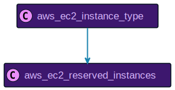

## `aws_ec2_route_table`

**Relationships in the graph that shows predecessors and successors of `aws_ec2_route_table`:**

## `aws_ec2_security_group`

**Relationships in the graph that shows predecessors and successors of `aws_ec2_security_group`:**

## `aws_ec2_snapshot`

**Relationships in the graph that shows predecessors and successors of `aws_ec2_snapshot`:**

## `aws_ec2_subnet`

**Relationships in the graph that shows predecessors and successors of `aws_ec2_subnet`:**

## `aws_ec2_volume`

**Relationships in the graph that shows predecessors and successors of `aws_ec2_volume`:**

## `aws_ec2_volume_type`

**Relationships in the graph that shows predecessors and successors of `aws_ec2_volume_type`:**

## `aws_ecs_capacity_provider`

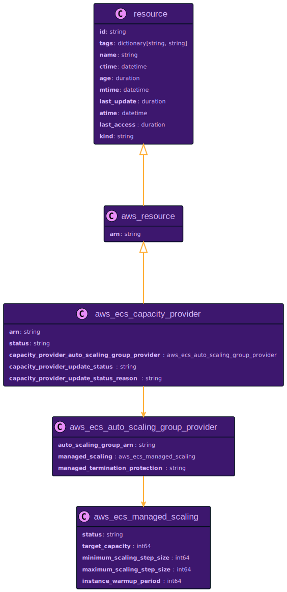

**Relationships in the graph that shows predecessors and successors of `aws_ecs_capacity_provider`:**

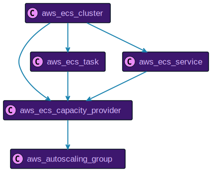

## `aws_ecs_cluster`

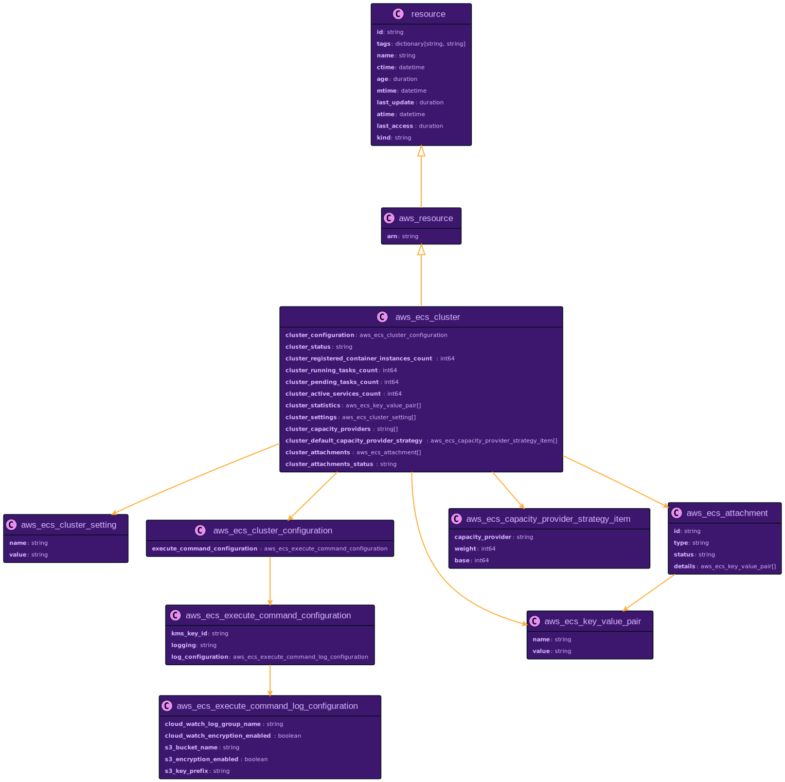

**Relationships in the graph that shows predecessors and successors of `aws_ecs_cluster`:**

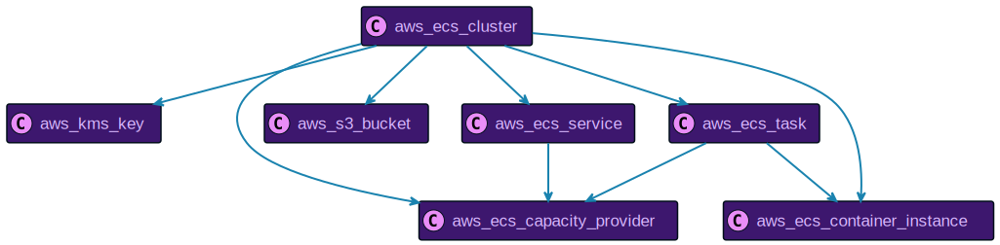

## `aws_ecs_container_instance`

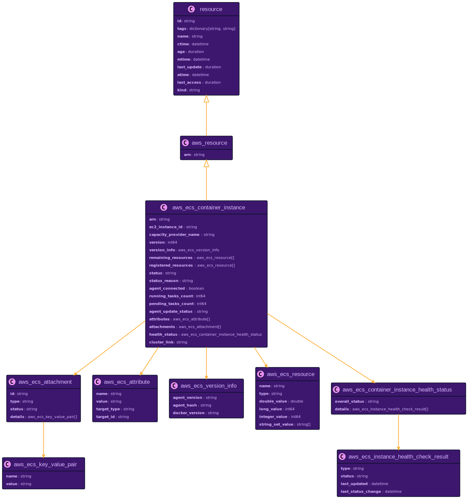

**Relationships in the graph that shows predecessors and successors of `aws_ecs_container_instance`:**

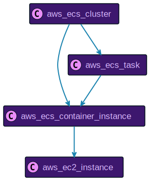

## `aws_ecs_service`

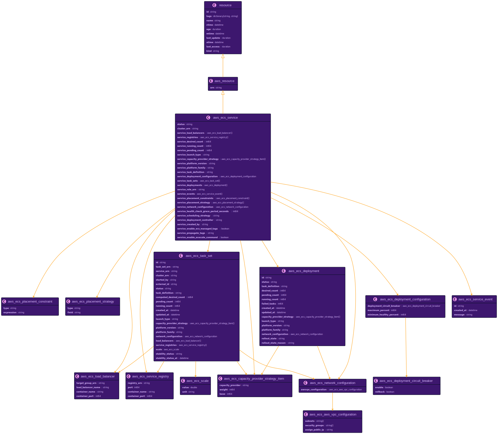

**Relationships in the graph that shows predecessors and successors of `aws_ecs_service`:**

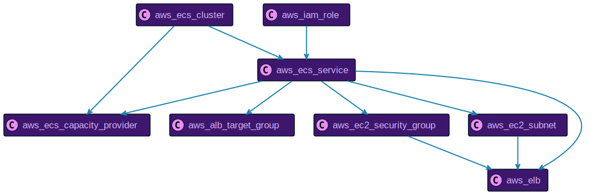

## `aws_ecs_task`

**Relationships in the graph that shows predecessors and successors of `aws_ecs_task`:**

## `aws_ecs_task_definition`

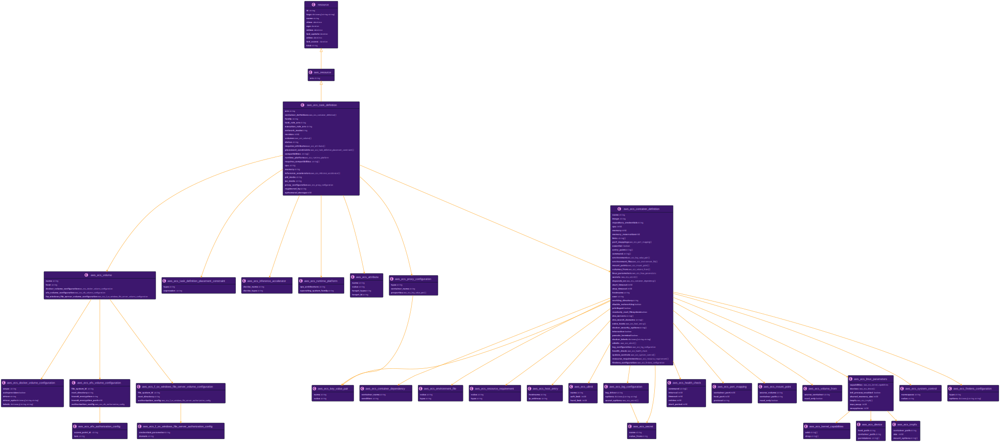

**Relationships in the graph that shows predecessors and successors of `aws_ecs_task_definition`:**

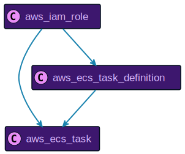

## `aws_eks_cluster`

**Relationships in the graph that shows predecessors and successors of `aws_eks_cluster`:**

## `aws_eks_nodegroup`

**Relationships in the graph that shows predecessors and successors of `aws_eks_nodegroup`:**

## `aws_elasticache_cache_cluster`

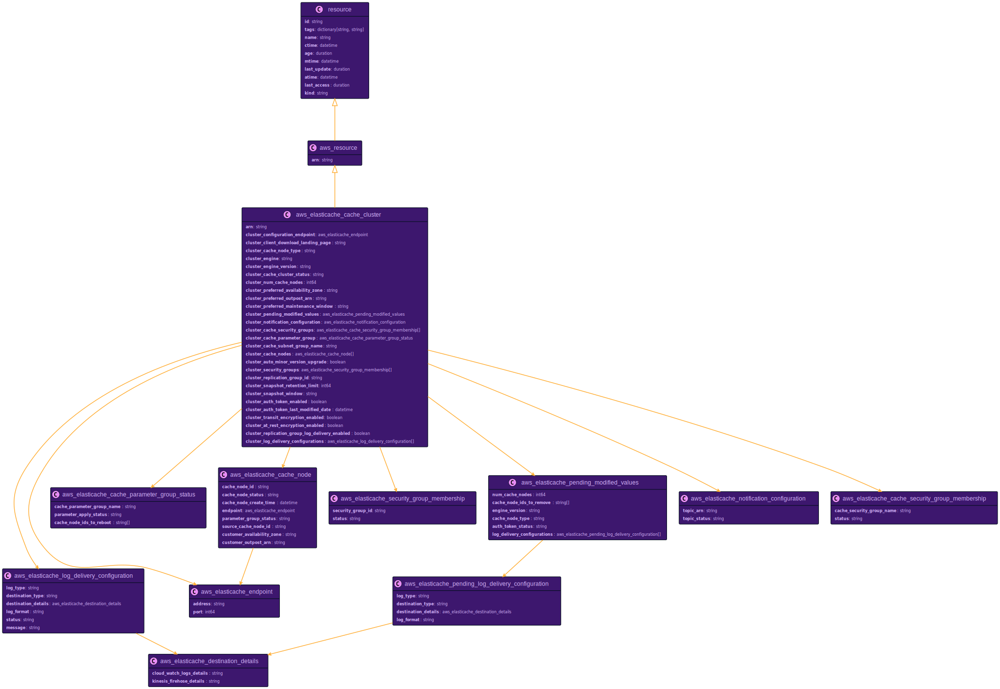

**Relationships in the graph that shows predecessors and successors of `aws_elasticache_cache_cluster`:**

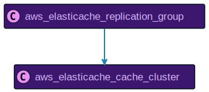

## `aws_elasticache_replication_group`

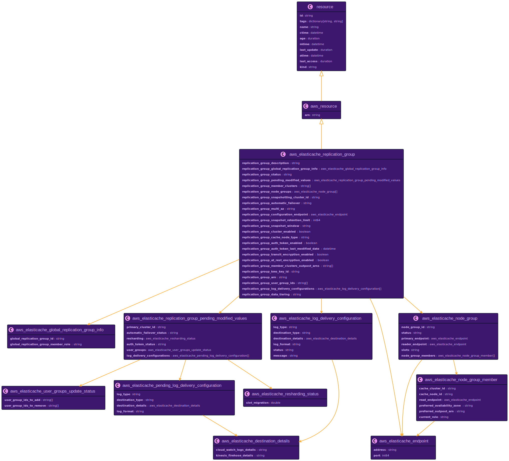

**Relationships in the graph that shows predecessors and successors of `aws_elasticache_replication_group`:**

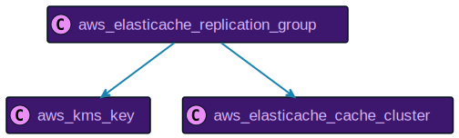

## `aws_elb`

**Relationships in the graph that shows predecessors and successors of `aws_elb`:**

## `aws_glacier_job`

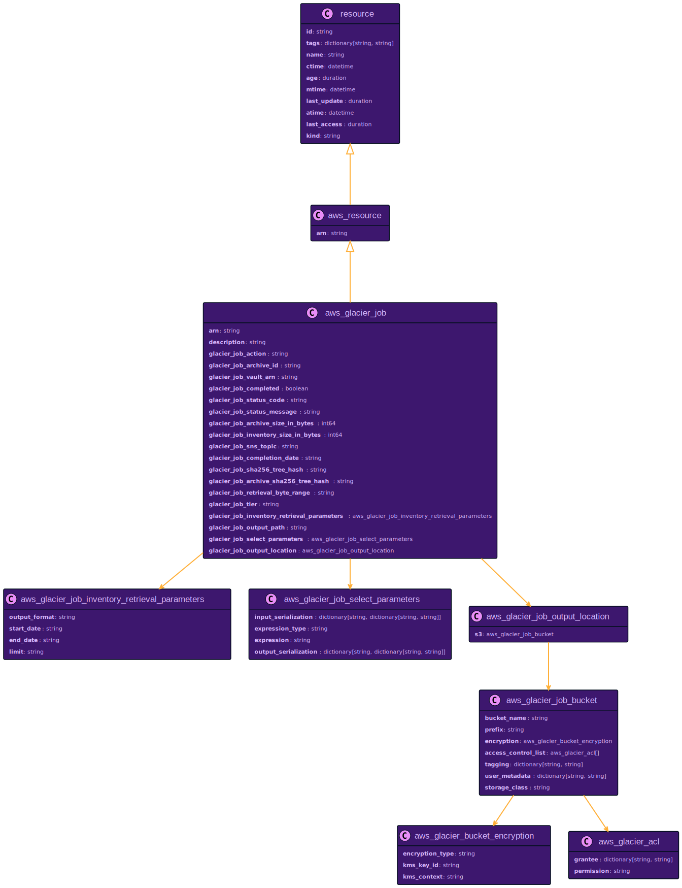

**Relationships in the graph that shows predecessors and successors of `aws_glacier_job`:**

## `aws_glacier_vault`

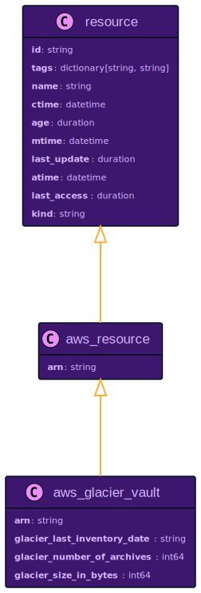

**Relationships in the graph that shows predecessors and successors of `aws_glacier_vault`:**

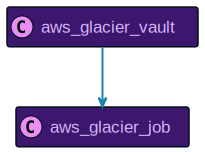

## `aws_iam_access_key`

**Relationships in the graph that shows predecessors and successors of `aws_iam_access_key`:**

## `aws_iam_group`

**Relationships in the graph that shows predecessors and successors of `aws_iam_group`:**

## `aws_iam_instance_profile`

**Relationships in the graph that shows predecessors and successors of `aws_iam_instance_profile`:**

## `aws_iam_policy`

**Relationships in the graph that shows predecessors and successors of `aws_iam_policy`:**

## `aws_iam_role`

**Relationships in the graph that shows predecessors and successors of `aws_iam_role`:**

## `aws_iam_server_certificate`

**Relationships in the graph that shows predecessors and successors of `aws_iam_server_certificate`:**

## `aws_iam_user`

**Relationships in the graph that shows predecessors and successors of `aws_iam_user`:**

## `aws_kinesis_stream`

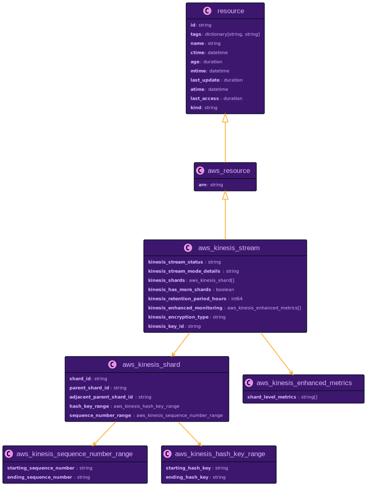

**Relationships in the graph that shows predecessors and successors of `aws_kinesis_stream`:**

## `aws_kms_key`

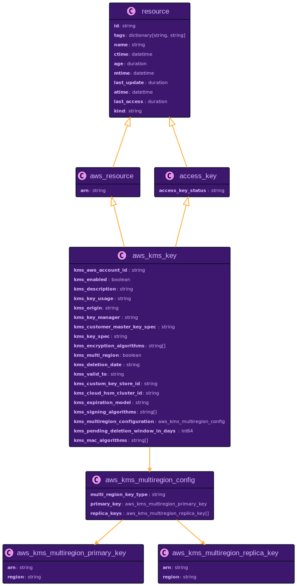

**Relationships in the graph that shows predecessors and successors of `aws_kms_key`:**

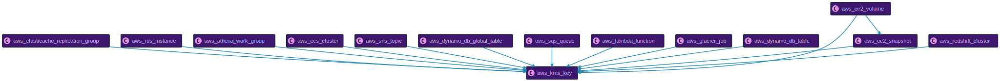

## `aws_lambda_function`

**Relationships in the graph that shows predecessors and successors of `aws_lambda_function`:**

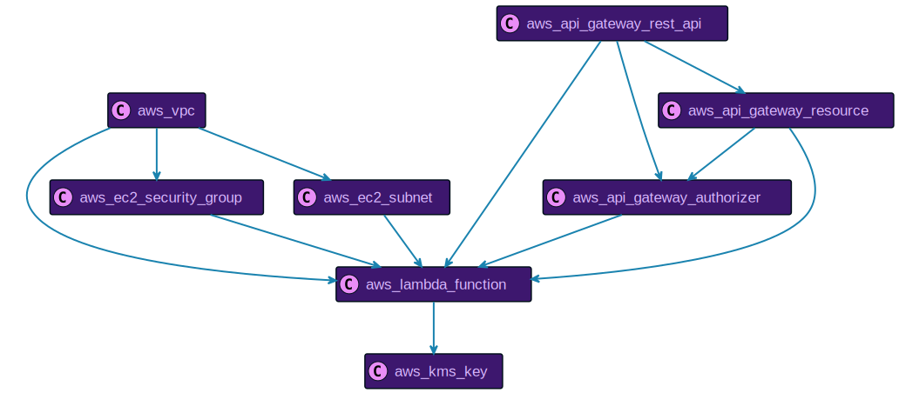

## `aws_rds_instance`

**Relationships in the graph that shows predecessors and successors of `aws_rds_instance`:**

## `aws_redshift_cluster`

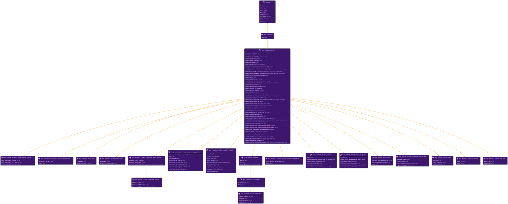

**Relationships in the graph that shows predecessors and successors of `aws_redshift_cluster`:**

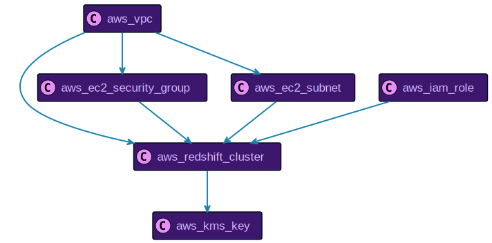

## `aws_region`

**Relationships in the graph that shows predecessors and successors of `aws_region`:**

## `aws_resource`

**Relationships in the graph that shows predecessors and successors of `aws_resource`:**

## `aws_route53_resource_record`

**Relationships in the graph that shows predecessors and successors of `aws_route53_resource_record`:**

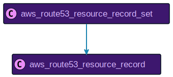

## `aws_route53_resource_record_set`


**Relationships in the graph that shows predecessors and successors of `aws_route53_resource_record_set`:**


## `aws_route53_zone`


**Relationships in the graph that shows predecessors and successors of `aws_route53_zone`:**


## `aws_s3_bucket`

**Relationships in the graph that shows predecessors and successors of `aws_s3_bucket`:**

## `aws_service_quota`


**Relationships in the graph that shows predecessors and successors of `aws_service_quota`:**


## `aws_sns_endpoint`


**Relationships in the graph that shows predecessors and successors of `aws_sns_endpoint`:**


## `aws_sns_platform_application`

**Relationships in the graph that shows predecessors and successors of `aws_sns_platform_application`:**


## `aws_sns_subscription`


**Relationships in the graph that shows predecessors and successors of `aws_sns_subscription`:**


## `aws_sns_topic`


**Relationships in the graph that shows predecessors and successors of `aws_sns_topic`:**


## `aws_sqs_queue`


**Relationships in the graph that shows predecessors and successors of `aws_sqs_queue`:**

## `aws_vpc`

**Relationships in the graph that shows predecessors and successors of `aws_vpc`:**

## `aws_vpc_endpoint`

**Relationships in the graph that shows predecessors and successors of `aws_vpc_endpoint`:**

## `aws_vpc_peering_connection`

**Relationships in the graph that shows predecessors and successors of `aws_vpc_peering_connection`:**

