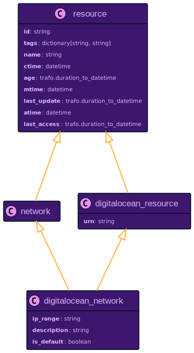

# DigitalOcean Resources

## `digitalocean_app`

## `digitalocean_cdn_endpoint`

## `digitalocean_certificate`

## `digitalocean_container_registry`

## `digitalocean_container_registry_repository`

## `digitalocean_container_registry_repository_tag`

## `digitalocean_database`

## `digitalocean_domain`

## `digitalocean_domain_record`

## `digitalocean_droplet`

## `digitalocean_firewall`

## `digitalocean_floating_ip`

## `digitalocean_image`

## `digitalocean_kubernetes_cluster`

## `digitalocean_load_balancer`

## `digitalocean_network`

## `digitalocean_project`

## `digitalocean_region`

## `digitalocean_resource`

## `digitalocean_snapshot`

## `digitalocean_space`

## `digitalocean_ssh_key`

## `digitalocean_tag`

## `digitalocean_team`

## `digitalocean_volume`

