# DigitalOcean Resource Data Models

```mdx-code-block
import ZoomPanPinch from '@site/src/components/ZoomPanPinch';
```

:::info

Please refer to [Configure DigitalOcean Access](../../../getting-started/configure-cloud-provider-access/digitalocean.md) for details on how to set up Resoto to collect [DigitalOcean](https://digitalocean.com) resources.

:::

## `digitalocean_alert_policy`

<ZoomPanPinch>

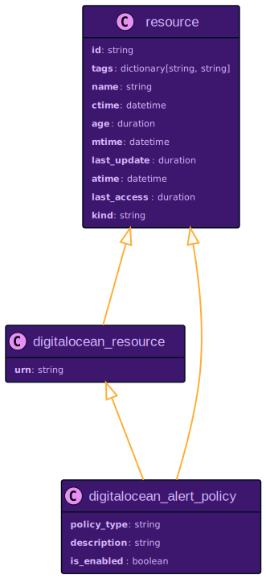

</ZoomPanPinch>

<details>
<summary>Relationships to Other Resources</summary>
<div>
<ZoomPanPinch>

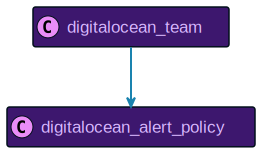

</ZoomPanPinch>
</div>
</details>

## `digitalocean_app`

<ZoomPanPinch>

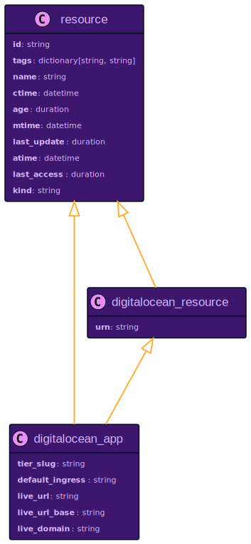

</ZoomPanPinch>

<details>
<summary>Relationships to Other Resources</summary>
<div>
<ZoomPanPinch>

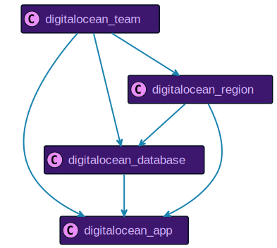

</ZoomPanPinch>
</div>
</details>

## `digitalocean_cdn_endpoint`

<ZoomPanPinch>

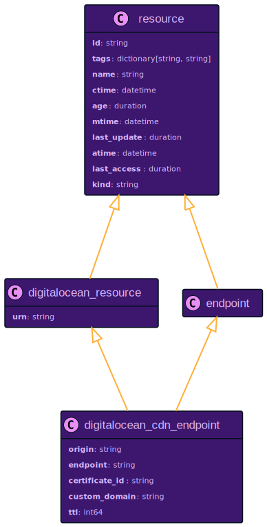

</ZoomPanPinch>

<details>
<summary>Relationships to Other Resources</summary>
<div>
<ZoomPanPinch>

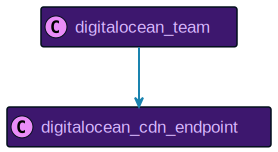

</ZoomPanPinch>
</div>
</details>

## `digitalocean_certificate`

<ZoomPanPinch>

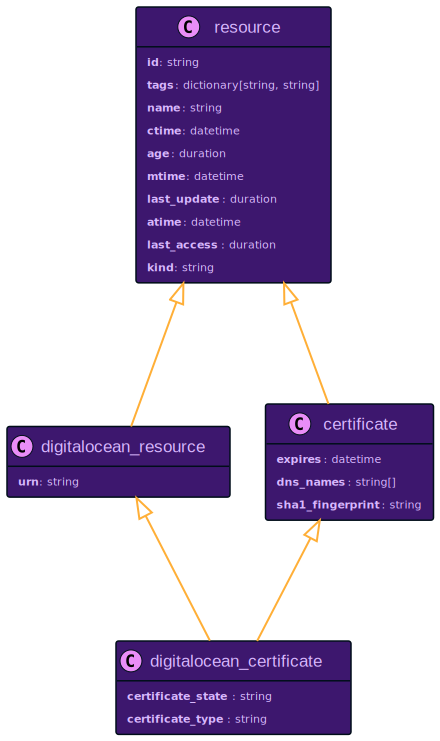

</ZoomPanPinch>

<details>
<summary>Relationships to Other Resources</summary>
<div>
<ZoomPanPinch>

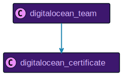

</ZoomPanPinch>
</div>
</details>

## `digitalocean_container_registry`

<ZoomPanPinch>

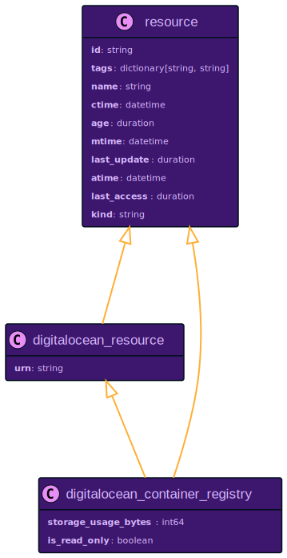

</ZoomPanPinch>

<details>
<summary>Relationships to Other Resources</summary>
<div>
<ZoomPanPinch>

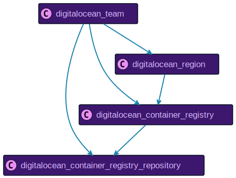

</ZoomPanPinch>
</div>
</details>

## `digitalocean_container_registry_repository`

<ZoomPanPinch>

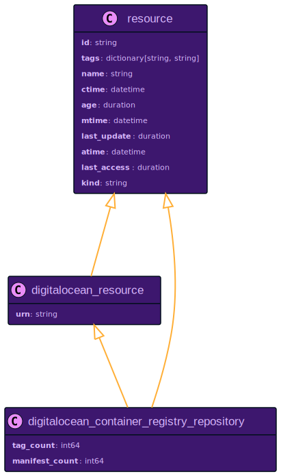

</ZoomPanPinch>

<details>
<summary>Relationships to Other Resources</summary>
<div>
<ZoomPanPinch>

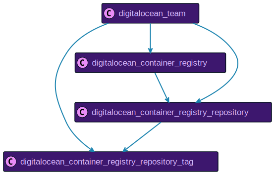

</ZoomPanPinch>
</div>
</details>

## `digitalocean_container_registry_repository_tag`

<ZoomPanPinch>

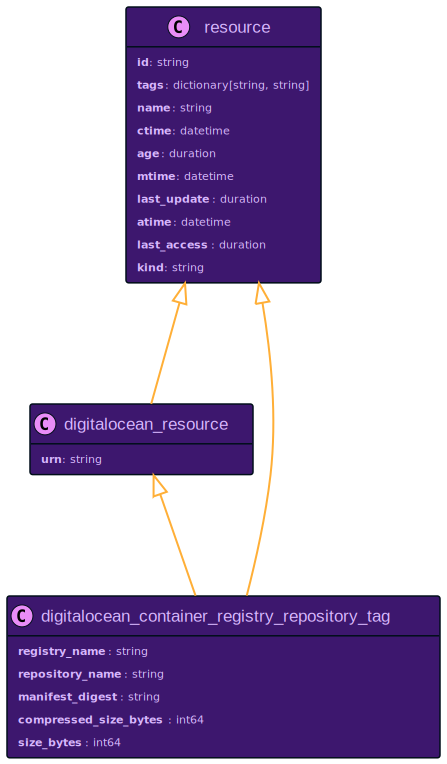

</ZoomPanPinch>

<details>
<summary>Relationships to Other Resources</summary>
<div>
<ZoomPanPinch>

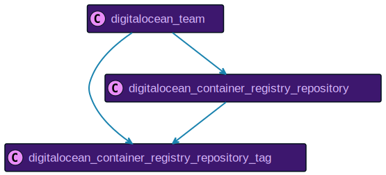

</ZoomPanPinch>
</div>
</details>

## `digitalocean_database`

<ZoomPanPinch>

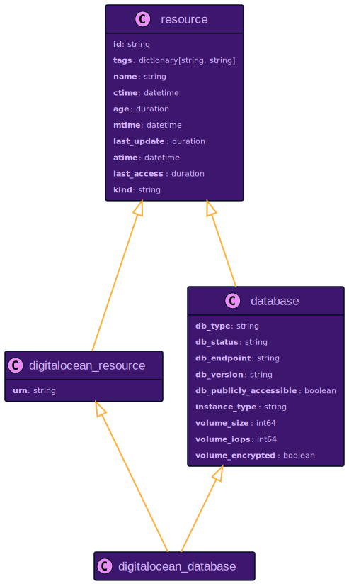

</ZoomPanPinch>

<details>
<summary>Relationships to Other Resources</summary>
<div>
<ZoomPanPinch>

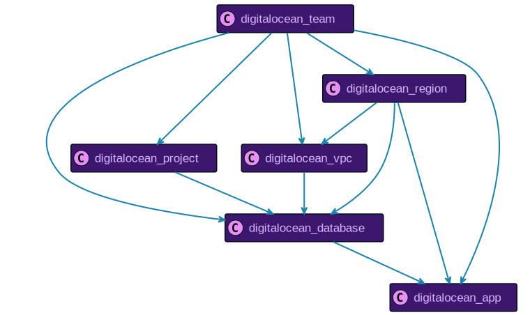

</ZoomPanPinch>
</div>
</details>

## `digitalocean_domain`

<ZoomPanPinch>

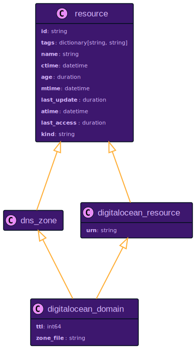

</ZoomPanPinch>

<details>
<summary>Relationships to Other Resources</summary>
<div>
<ZoomPanPinch>

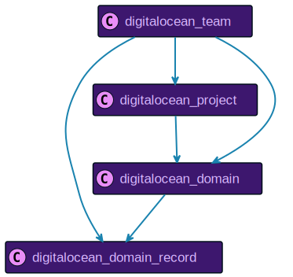

</ZoomPanPinch>
</div>
</details>

## `digitalocean_domain_record`

<ZoomPanPinch>

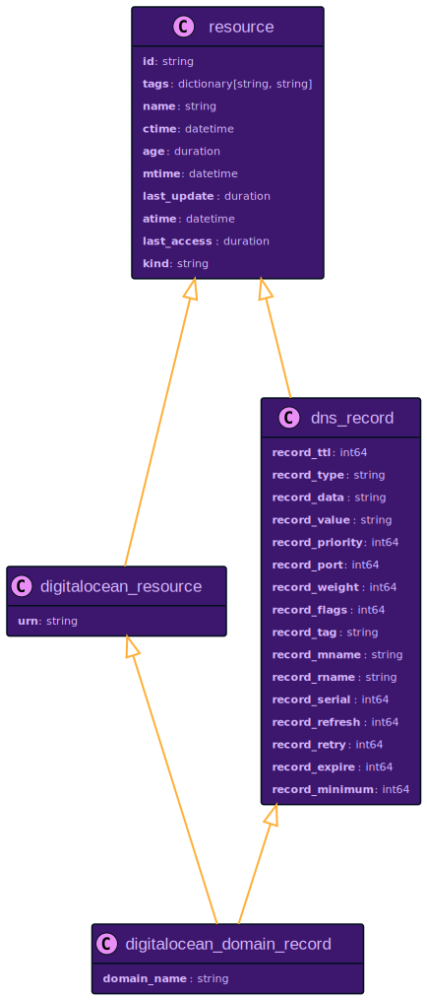

</ZoomPanPinch>

<details>
<summary>Relationships to Other Resources</summary>
<div>
<ZoomPanPinch>

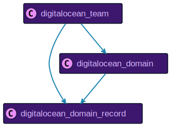

</ZoomPanPinch>
</div>
</details>

## `digitalocean_droplet`

<ZoomPanPinch>

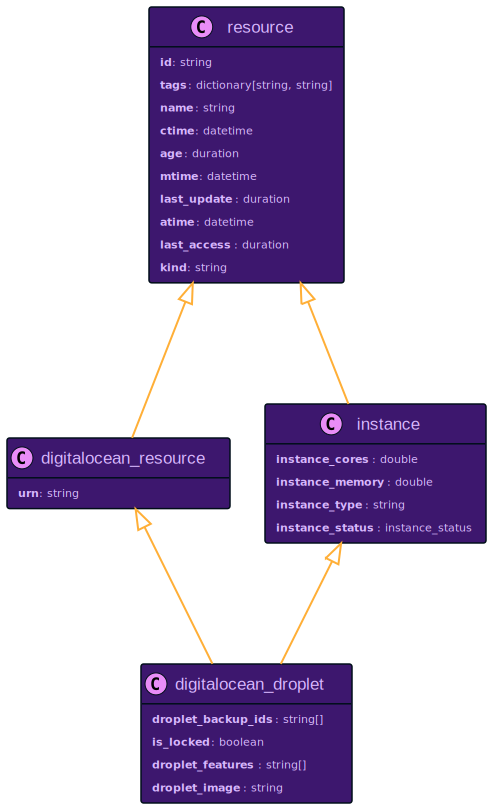

</ZoomPanPinch>

<details>
<summary>Relationships to Other Resources</summary>
<div>
<ZoomPanPinch>

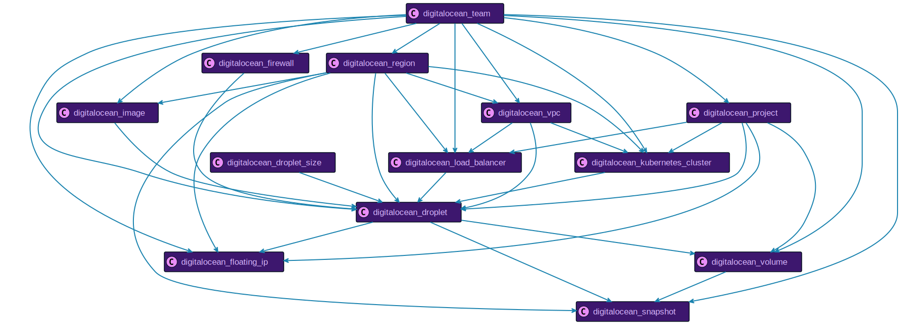

</ZoomPanPinch>
</div>
</details>

## `digitalocean_droplet_size`

<ZoomPanPinch>

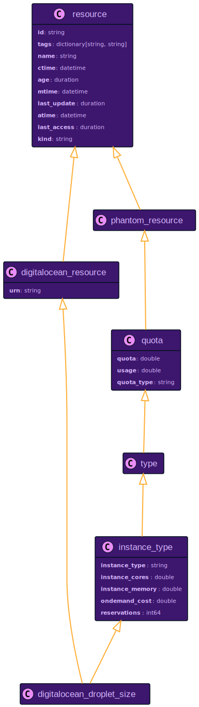

</ZoomPanPinch>

<details>
<summary>Relationships to Other Resources</summary>
<div>
<ZoomPanPinch>

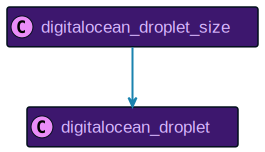

</ZoomPanPinch>
</div>
</details>

## `digitalocean_firewall`

<ZoomPanPinch>

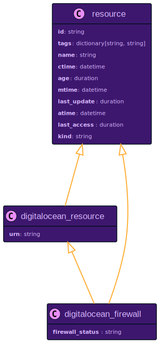

</ZoomPanPinch>

<details>
<summary>Relationships to Other Resources</summary>
<div>
<ZoomPanPinch>

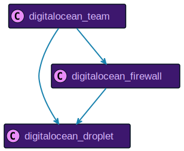

</ZoomPanPinch>
</div>
</details>

## `digitalocean_floating_ip`

<ZoomPanPinch>

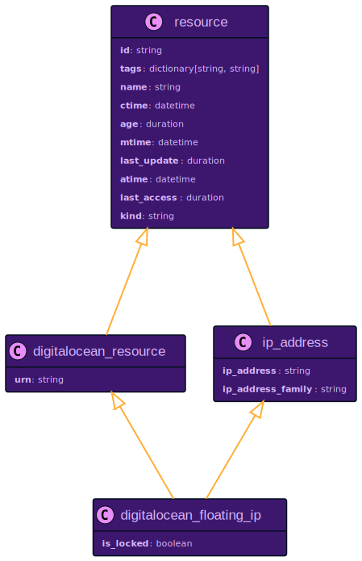

</ZoomPanPinch>

<details>
<summary>Relationships to Other Resources</summary>
<div>
<ZoomPanPinch>

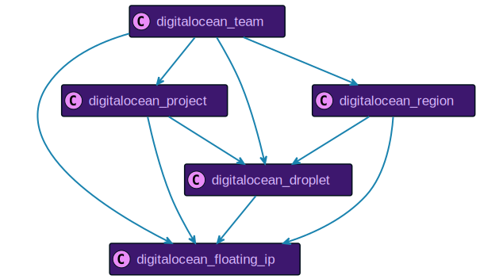

</ZoomPanPinch>
</div>
</details>

## `digitalocean_image`

<ZoomPanPinch>

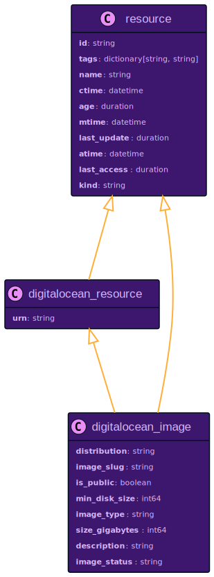

</ZoomPanPinch>

<details>
<summary>Relationships to Other Resources</summary>
<div>
<ZoomPanPinch>

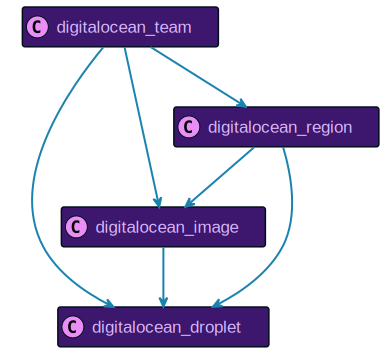

</ZoomPanPinch>
</div>
</details>

## `digitalocean_kubernetes_cluster`

<ZoomPanPinch>

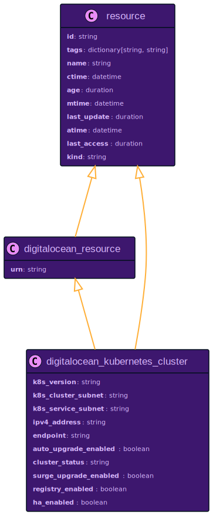

</ZoomPanPinch>

<details>
<summary>Relationships to Other Resources</summary>
<div>
<ZoomPanPinch>

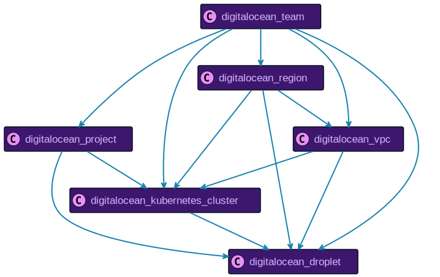

</ZoomPanPinch>
</div>
</details>

## `digitalocean_load_balancer`

<ZoomPanPinch>

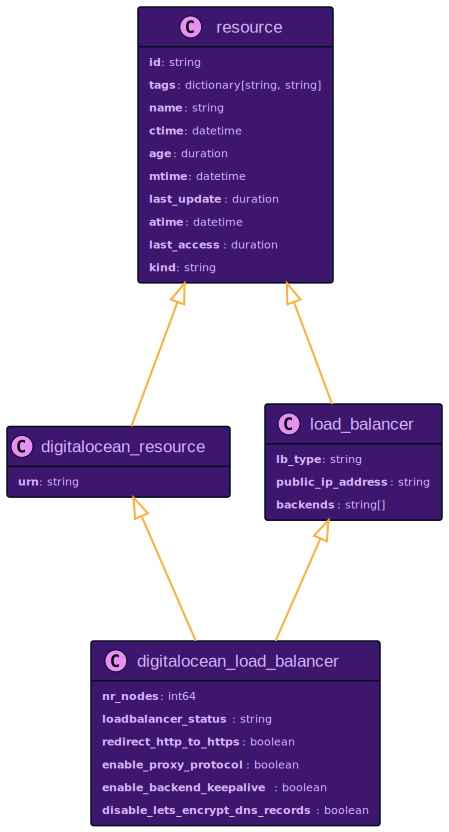

</ZoomPanPinch>

<details>
<summary>Relationships to Other Resources</summary>
<div>
<ZoomPanPinch>

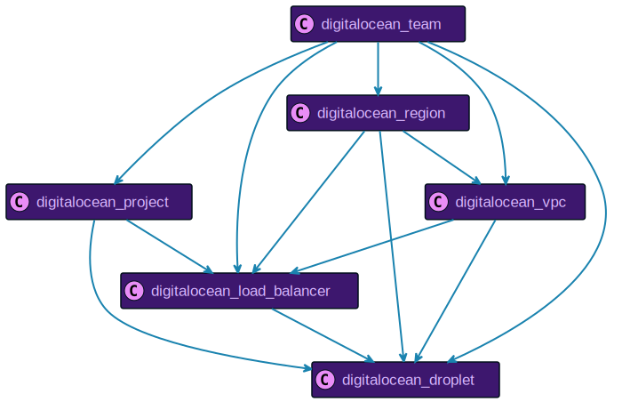

</ZoomPanPinch>
</div>
</details>

## `digitalocean_project`

<ZoomPanPinch>


</ZoomPanPinch>

<details>
<summary>Relationships to Other Resources</summary>
<div>
<ZoomPanPinch>

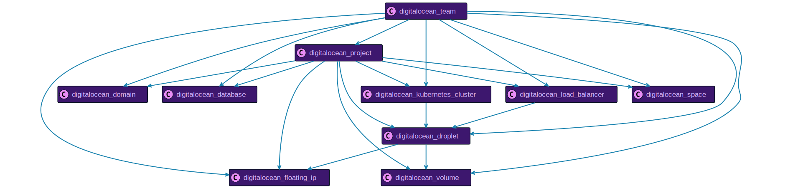

</ZoomPanPinch>
</div>
</details>

## `digitalocean_region`

<ZoomPanPinch>

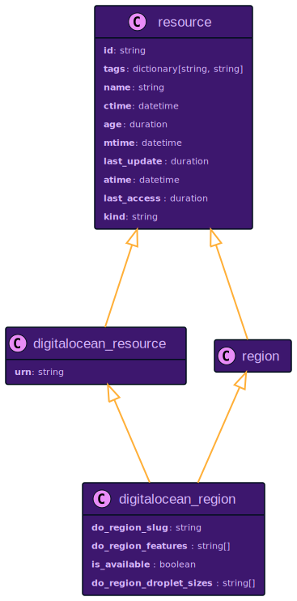

</ZoomPanPinch>

<details>
<summary>Relationships to Other Resources</summary>
<div>
<ZoomPanPinch>

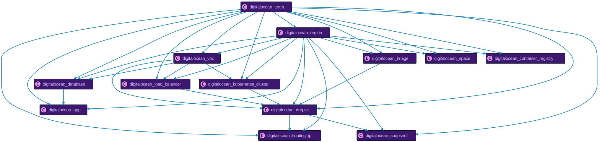

</ZoomPanPinch>
</div>
</details>

## `digitalocean_resource`

<ZoomPanPinch>

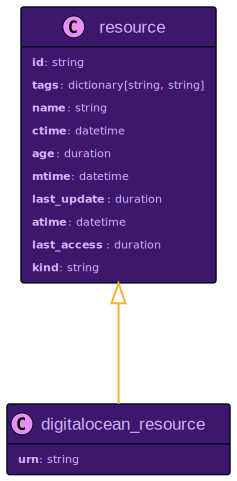

</ZoomPanPinch>

<details>
<summary>Relationships to Other Resources</summary>
<div>
<ZoomPanPinch>

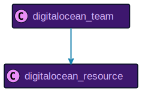

</ZoomPanPinch>
</div>
</details>

## `digitalocean_snapshot`

<ZoomPanPinch>

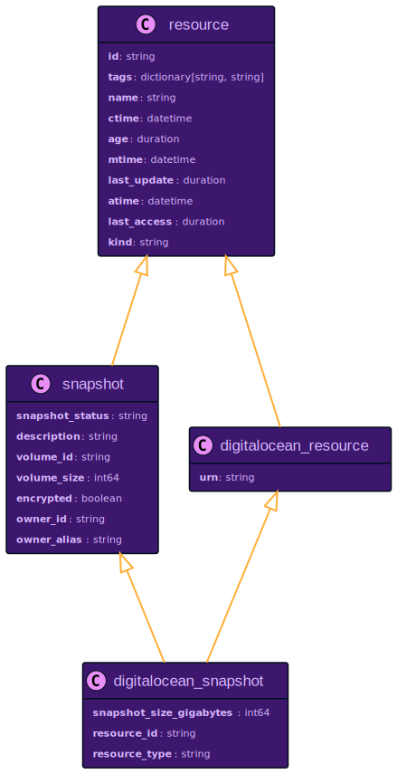

</ZoomPanPinch>

<details>
<summary>Relationships to Other Resources</summary>
<div>
<ZoomPanPinch>

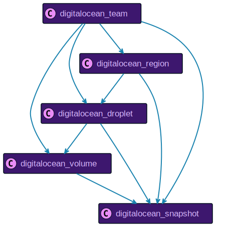

</ZoomPanPinch>
</div>
</details>

## `digitalocean_space`

<ZoomPanPinch>

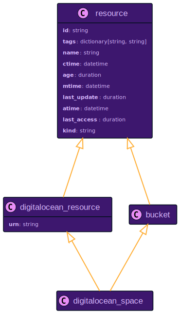

</ZoomPanPinch>

<details>
<summary>Relationships to Other Resources</summary>
<div>
<ZoomPanPinch>

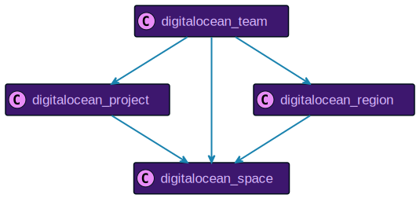

</ZoomPanPinch>
</div>
</details>

## `digitalocean_ssh_key`

<ZoomPanPinch>

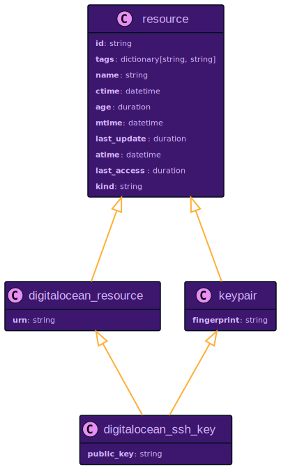

</ZoomPanPinch>

<details>
<summary>Relationships to Other Resources</summary>
<div>
<ZoomPanPinch>

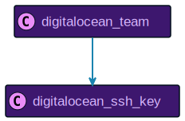

</ZoomPanPinch>
</div>
</details>

## `digitalocean_tag`

<ZoomPanPinch>

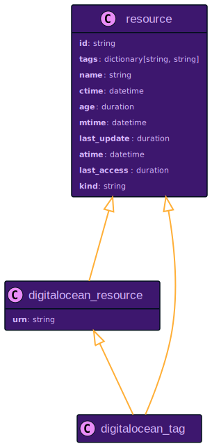

</ZoomPanPinch>

<details>
<summary>Relationships to Other Resources</summary>
<div>
<ZoomPanPinch>

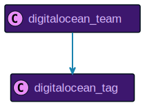

</ZoomPanPinch>
</div>
</details>

## `digitalocean_team`

<ZoomPanPinch>

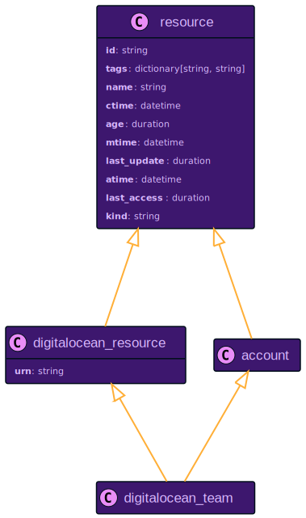

</ZoomPanPinch>

<details>
<summary>Relationships to Other Resources</summary>
<div>
<ZoomPanPinch>

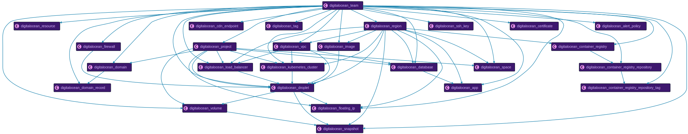

</ZoomPanPinch>
</div>
</details>

## `digitalocean_volume`

<ZoomPanPinch>

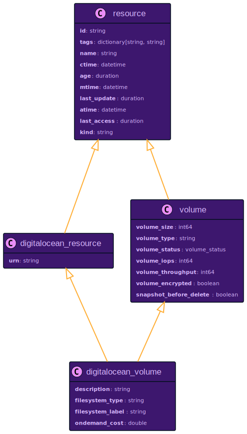

</ZoomPanPinch>

<details>
<summary>Relationships to Other Resources</summary>
<div>
<ZoomPanPinch>

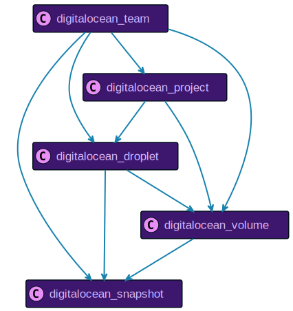

</ZoomPanPinch>
</div>
</details>

## `digitalocean_vpc`

<ZoomPanPinch>

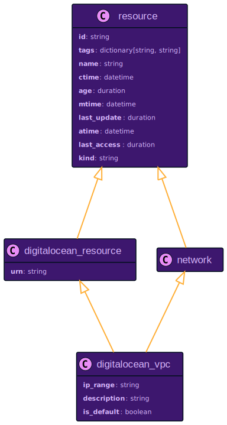

</ZoomPanPinch>

<details>
<summary>Relationships to Other Resources</summary>
<div>
<ZoomPanPinch>

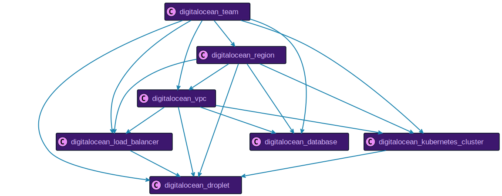

</ZoomPanPinch>
</div>
</details>
