# DigitalOcean Resource Data Models

```mdx-code-block
import ZoomPanPinch from '@site/src/components/ZoomPanPinch';
```

:::info

See [How to Collect DigitalOcean Resource Data](../../../how-to-guides/data-sources/collect-digitalocean-resource-data.md) for step-by-step directions to configure Resoto to collect [DigitalOcean](https://digitalocean.com) resources.

:::

## `digitalocean_alert_policy`

<ZoomPanPinch>

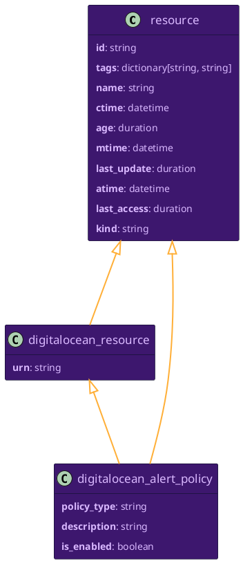

</ZoomPanPinch>

<details>
<summary>Relationships to Other Resources</summary>
<div>
<ZoomPanPinch>

```plantuml Diagram of digitalocean_alert_policy resource relationships
@startuml
hide empty members
skinparam ArrowColor #ffaf37
skinparam ArrowFontColor #ffaf37
skinparam ArrowFontName Helvetica
skinparam ArrowThickness 2
skinparam BackgroundColor transparent
skinparam ClassAttributeFontColor #d9b8ff
skinparam ClassBackgroundColor #3d176e
skinparam ClassBorderColor #000d19
skinparam ClassFontColor #d9b8ff
skinparam ClassFontName Helvetica
skinparam ClassFontSize 17
skinparam NoteBackgroundColor #d9b8ff
skinparam NoteBorderColor #000d19
skinparam NoteFontColor #3d176e
skinparam NoteFontName Helvetica
skinparam Padding 5
skinparam RoundCorner 5
skinparam Shadowing false
skinparam stereotypeCBackgroundColor #e98df7
skinparam stereotypeIBackgroundColor #e98df7

class digitalocean_alert_policy [[#digitalocean_alert_policy]] {

}
class digitalocean_team [[#digitalocean_team]] {

}
digitalocean_team -[#1A83AF]-> digitalocean_alert_policy

@enduml
```

</ZoomPanPinch>
</div>
</details>

## `digitalocean_app`

<ZoomPanPinch>

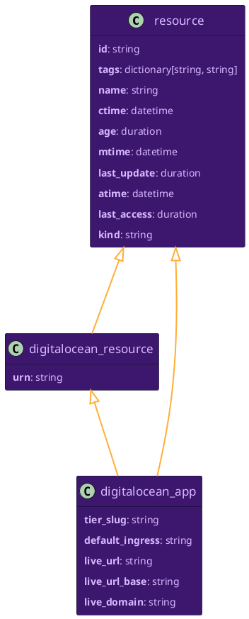

</ZoomPanPinch>

<details>
<summary>Relationships to Other Resources</summary>
<div>
<ZoomPanPinch>

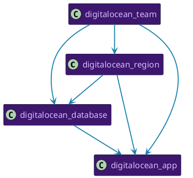

</ZoomPanPinch>
</div>
</details>

## `digitalocean_cdn_endpoint`

<ZoomPanPinch>

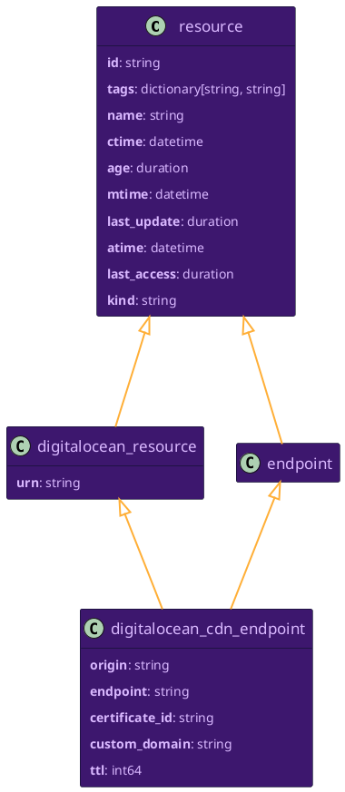

</ZoomPanPinch>

<details>
<summary>Relationships to Other Resources</summary>
<div>
<ZoomPanPinch>

```plantuml Diagram of digitalocean_cdn_endpoint resource relationships
@startuml
hide empty members
skinparam ArrowColor #ffaf37
skinparam ArrowFontColor #ffaf37
skinparam ArrowFontName Helvetica
skinparam ArrowThickness 2
skinparam BackgroundColor transparent
skinparam ClassAttributeFontColor #d9b8ff
skinparam ClassBackgroundColor #3d176e
skinparam ClassBorderColor #000d19
skinparam ClassFontColor #d9b8ff
skinparam ClassFontName Helvetica
skinparam ClassFontSize 17
skinparam NoteBackgroundColor #d9b8ff
skinparam NoteBorderColor #000d19
skinparam NoteFontColor #3d176e
skinparam NoteFontName Helvetica
skinparam Padding 5
skinparam RoundCorner 5
skinparam Shadowing false
skinparam stereotypeCBackgroundColor #e98df7
skinparam stereotypeIBackgroundColor #e98df7

class digitalocean_cdn_endpoint [[#digitalocean_cdn_endpoint]] {

}
class digitalocean_team [[#digitalocean_team]] {

}
digitalocean_team -[#1A83AF]-> digitalocean_cdn_endpoint

@enduml
```

</ZoomPanPinch>
</div>
</details>

## `digitalocean_certificate`

<ZoomPanPinch>

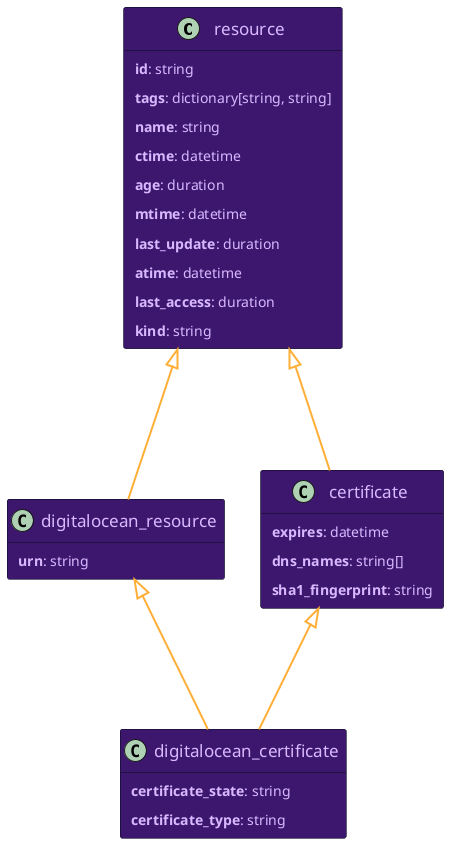

</ZoomPanPinch>

<details>
<summary>Relationships to Other Resources</summary>
<div>
<ZoomPanPinch>

```plantuml Diagram of digitalocean_certificate resource relationships
@startuml
hide empty members
skinparam ArrowColor #ffaf37
skinparam ArrowFontColor #ffaf37
skinparam ArrowFontName Helvetica
skinparam ArrowThickness 2
skinparam BackgroundColor transparent
skinparam ClassAttributeFontColor #d9b8ff
skinparam ClassBackgroundColor #3d176e
skinparam ClassBorderColor #000d19
skinparam ClassFontColor #d9b8ff
skinparam ClassFontName Helvetica
skinparam ClassFontSize 17
skinparam NoteBackgroundColor #d9b8ff
skinparam NoteBorderColor #000d19
skinparam NoteFontColor #3d176e
skinparam NoteFontName Helvetica
skinparam Padding 5
skinparam RoundCorner 5
skinparam Shadowing false
skinparam stereotypeCBackgroundColor #e98df7
skinparam stereotypeIBackgroundColor #e98df7

class digitalocean_certificate [[#digitalocean_certificate]] {

}
class digitalocean_team [[#digitalocean_team]] {

}
digitalocean_team -[#1A83AF]-> digitalocean_certificate

@enduml
```

</ZoomPanPinch>
</div>
</details>

## `digitalocean_container_registry`

<ZoomPanPinch>

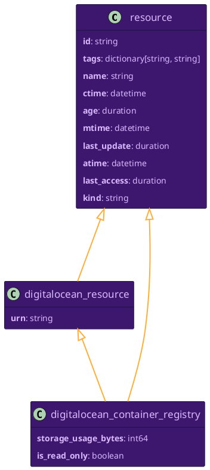

</ZoomPanPinch>

<details>
<summary>Relationships to Other Resources</summary>
<div>
<ZoomPanPinch>

```plantuml Diagram of digitalocean_container_registry resource relationships
@startuml
hide empty members
skinparam ArrowColor #ffaf37
skinparam ArrowFontColor #ffaf37
skinparam ArrowFontName Helvetica
skinparam ArrowThickness 2
skinparam BackgroundColor transparent
skinparam ClassAttributeFontColor #d9b8ff
skinparam ClassBackgroundColor #3d176e
skinparam ClassBorderColor #000d19
skinparam ClassFontColor #d9b8ff
skinparam ClassFontName Helvetica
skinparam ClassFontSize 17
skinparam NoteBackgroundColor #d9b8ff
skinparam NoteBorderColor #000d19
skinparam NoteFontColor #3d176e
skinparam NoteFontName Helvetica
skinparam Padding 5
skinparam RoundCorner 5
skinparam Shadowing false
skinparam stereotypeCBackgroundColor #e98df7
skinparam stereotypeIBackgroundColor #e98df7

class digitalocean_region [[#digitalocean_region]] {

}
class digitalocean_container_registry [[#digitalocean_container_registry]] {

}
class digitalocean_container_registry_repository [[#digitalocean_container_registry_repository]] {

}
class digitalocean_team [[#digitalocean_team]] {

}
digitalocean_region -[#1A83AF]-> digitalocean_container_registry
digitalocean_container_registry -[#1A83AF]-> digitalocean_container_registry_repository
digitalocean_team -[#1A83AF]-> digitalocean_container_registry
digitalocean_team -[#1A83AF]-> digitalocean_container_registry_repository
digitalocean_team -[#1A83AF]-> digitalocean_region

@enduml
```

</ZoomPanPinch>
</div>
</details>

## `digitalocean_container_registry_repository`

<ZoomPanPinch>

```plantuml Diagram of digitalocean_container_registry_repository data model
@startuml
hide empty members
skinparam ArrowColor #ffaf37
skinparam ArrowFontColor #ffaf37
skinparam ArrowFontName Helvetica
skinparam ArrowThickness 2
skinparam BackgroundColor transparent
skinparam ClassAttributeFontColor #d9b8ff
skinparam ClassBackgroundColor #3d176e
skinparam ClassBorderColor #000d19
skinparam ClassFontColor #d9b8ff
skinparam ClassFontName Helvetica
skinparam ClassFontSize 17
skinparam NoteBackgroundColor #d9b8ff
skinparam NoteBorderColor #000d19
skinparam NoteFontColor #3d176e
skinparam NoteFontName Helvetica
skinparam Padding 5
skinparam RoundCorner 5
skinparam Shadowing false
skinparam stereotypeCBackgroundColor #e98df7
skinparam stereotypeIBackgroundColor #e98df7

class resource [[#resource]] {
**id**: string
**tags**: dictionary[string, string]
**name**: string
**ctime**: datetime
**age**: duration
**mtime**: datetime
**last_update**: duration
**atime**: datetime
**last_access**: duration
**kind**: string
}
class digitalocean_resource [[#digitalocean_resource]] {
**urn**: string
}
class digitalocean_container_registry_repository [[#digitalocean_container_registry_repository]] {
**tag_count**: int64
**manifest_count**: int64
}
resource <|--- digitalocean_resource
digitalocean_resource <|--- digitalocean_container_registry_repository
resource <|--- digitalocean_container_registry_repository

@enduml
```

</ZoomPanPinch>

<details>
<summary>Relationships to Other Resources</summary>
<div>
<ZoomPanPinch>

```plantuml Diagram of digitalocean_container_registry_repository resource relationships
@startuml
hide empty members
skinparam ArrowColor #ffaf37
skinparam ArrowFontColor #ffaf37
skinparam ArrowFontName Helvetica
skinparam ArrowThickness 2
skinparam BackgroundColor transparent
skinparam ClassAttributeFontColor #d9b8ff
skinparam ClassBackgroundColor #3d176e
skinparam ClassBorderColor #000d19
skinparam ClassFontColor #d9b8ff
skinparam ClassFontName Helvetica
skinparam ClassFontSize 17
skinparam NoteBackgroundColor #d9b8ff
skinparam NoteBorderColor #000d19
skinparam NoteFontColor #3d176e
skinparam NoteFontName Helvetica
skinparam Padding 5
skinparam RoundCorner 5
skinparam Shadowing false
skinparam stereotypeCBackgroundColor #e98df7
skinparam stereotypeIBackgroundColor #e98df7

class digitalocean_container_registry [[#digitalocean_container_registry]] {

}
class digitalocean_container_registry_repository [[#digitalocean_container_registry_repository]] {

}
class digitalocean_container_registry_repository_tag [[#digitalocean_container_registry_repository_tag]] {

}
class digitalocean_team [[#digitalocean_team]] {

}
digitalocean_container_registry -[#1A83AF]-> digitalocean_container_registry_repository
digitalocean_container_registry_repository -[#1A83AF]-> digitalocean_container_registry_repository_tag
digitalocean_team -[#1A83AF]-> digitalocean_container_registry
digitalocean_team -[#1A83AF]-> digitalocean_container_registry_repository
digitalocean_team -[#1A83AF]-> digitalocean_container_registry_repository_tag

@enduml
```

</ZoomPanPinch>
</div>
</details>

## `digitalocean_container_registry_repository_tag`

<ZoomPanPinch>

```plantuml Diagram of digitalocean_container_registry_repository_tag data model
@startuml
hide empty members
skinparam ArrowColor #ffaf37
skinparam ArrowFontColor #ffaf37
skinparam ArrowFontName Helvetica
skinparam ArrowThickness 2
skinparam BackgroundColor transparent
skinparam ClassAttributeFontColor #d9b8ff
skinparam ClassBackgroundColor #3d176e
skinparam ClassBorderColor #000d19
skinparam ClassFontColor #d9b8ff
skinparam ClassFontName Helvetica
skinparam ClassFontSize 17
skinparam NoteBackgroundColor #d9b8ff
skinparam NoteBorderColor #000d19
skinparam NoteFontColor #3d176e
skinparam NoteFontName Helvetica
skinparam Padding 5
skinparam RoundCorner 5
skinparam Shadowing false
skinparam stereotypeCBackgroundColor #e98df7
skinparam stereotypeIBackgroundColor #e98df7

class resource [[#resource]] {
**id**: string
**tags**: dictionary[string, string]
**name**: string
**ctime**: datetime
**age**: duration
**mtime**: datetime
**last_update**: duration
**atime**: datetime
**last_access**: duration
**kind**: string
}
class digitalocean_resource [[#digitalocean_resource]] {
**urn**: string
}
class digitalocean_container_registry_repository_tag [[#digitalocean_container_registry_repository_tag]] {
**registry_name**: string
**repository_name**: string
**manifest_digest**: string
**compressed_size_bytes**: int64
**size_bytes**: int64
}
resource <|--- digitalocean_resource
digitalocean_resource <|--- digitalocean_container_registry_repository_tag
resource <|--- digitalocean_container_registry_repository_tag

@enduml
```

</ZoomPanPinch>

<details>
<summary>Relationships to Other Resources</summary>
<div>
<ZoomPanPinch>

```plantuml Diagram of digitalocean_container_registry_repository_tag resource relationships
@startuml
hide empty members
skinparam ArrowColor #ffaf37
skinparam ArrowFontColor #ffaf37
skinparam ArrowFontName Helvetica
skinparam ArrowThickness 2
skinparam BackgroundColor transparent
skinparam ClassAttributeFontColor #d9b8ff
skinparam ClassBackgroundColor #3d176e
skinparam ClassBorderColor #000d19
skinparam ClassFontColor #d9b8ff
skinparam ClassFontName Helvetica
skinparam ClassFontSize 17
skinparam NoteBackgroundColor #d9b8ff
skinparam NoteBorderColor #000d19
skinparam NoteFontColor #3d176e
skinparam NoteFontName Helvetica
skinparam Padding 5
skinparam RoundCorner 5
skinparam Shadowing false
skinparam stereotypeCBackgroundColor #e98df7
skinparam stereotypeIBackgroundColor #e98df7

class digitalocean_container_registry_repository [[#digitalocean_container_registry_repository]] {

}
class digitalocean_container_registry_repository_tag [[#digitalocean_container_registry_repository_tag]] {

}
class digitalocean_team [[#digitalocean_team]] {

}
digitalocean_container_registry_repository -[#1A83AF]-> digitalocean_container_registry_repository_tag
digitalocean_team -[#1A83AF]-> digitalocean_container_registry_repository
digitalocean_team -[#1A83AF]-> digitalocean_container_registry_repository_tag

@enduml
```

</ZoomPanPinch>
</div>
</details>

## `digitalocean_database`

<ZoomPanPinch>

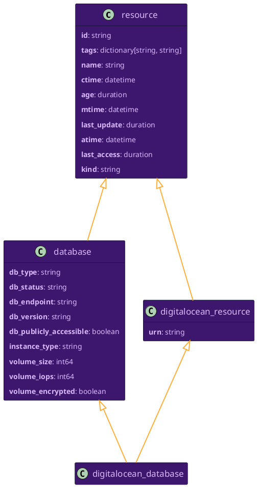

</ZoomPanPinch>

<details>
<summary>Relationships to Other Resources</summary>
<div>
<ZoomPanPinch>

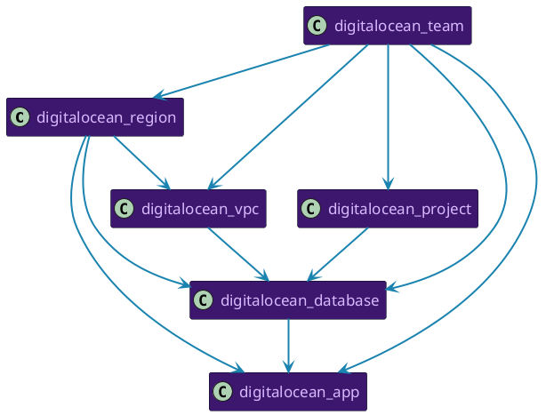

</ZoomPanPinch>
</div>
</details>

## `digitalocean_domain`

<ZoomPanPinch>

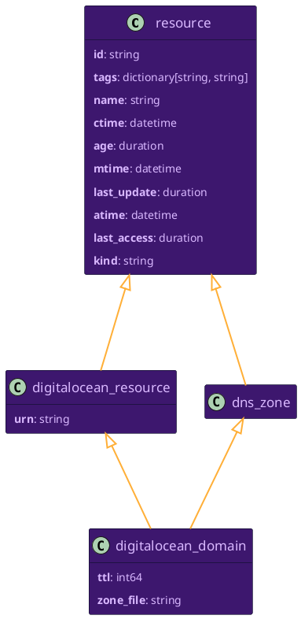

</ZoomPanPinch>

<details>
<summary>Relationships to Other Resources</summary>
<div>
<ZoomPanPinch>

```plantuml Diagram of digitalocean_domain resource relationships
@startuml
hide empty members
skinparam ArrowColor #ffaf37
skinparam ArrowFontColor #ffaf37
skinparam ArrowFontName Helvetica
skinparam ArrowThickness 2
skinparam BackgroundColor transparent
skinparam ClassAttributeFontColor #d9b8ff
skinparam ClassBackgroundColor #3d176e
skinparam ClassBorderColor #000d19
skinparam ClassFontColor #d9b8ff
skinparam ClassFontName Helvetica
skinparam ClassFontSize 17
skinparam NoteBackgroundColor #d9b8ff
skinparam NoteBorderColor #000d19
skinparam NoteFontColor #3d176e
skinparam NoteFontName Helvetica
skinparam Padding 5
skinparam RoundCorner 5
skinparam Shadowing false
skinparam stereotypeCBackgroundColor #e98df7
skinparam stereotypeIBackgroundColor #e98df7

class digitalocean_domain [[#digitalocean_domain]] {

}
class digitalocean_domain_record [[#digitalocean_domain_record]] {

}
class digitalocean_project [[#digitalocean_project]] {

}
class digitalocean_team [[#digitalocean_team]] {

}
digitalocean_domain -[#1A83AF]-> digitalocean_domain_record
digitalocean_project -[#1A83AF]-> digitalocean_domain
digitalocean_team -[#1A83AF]-> digitalocean_domain
digitalocean_team -[#1A83AF]-> digitalocean_project
digitalocean_team -[#1A83AF]-> digitalocean_domain_record

@enduml
```

</ZoomPanPinch>
</div>
</details>

## `digitalocean_domain_record`

<ZoomPanPinch>

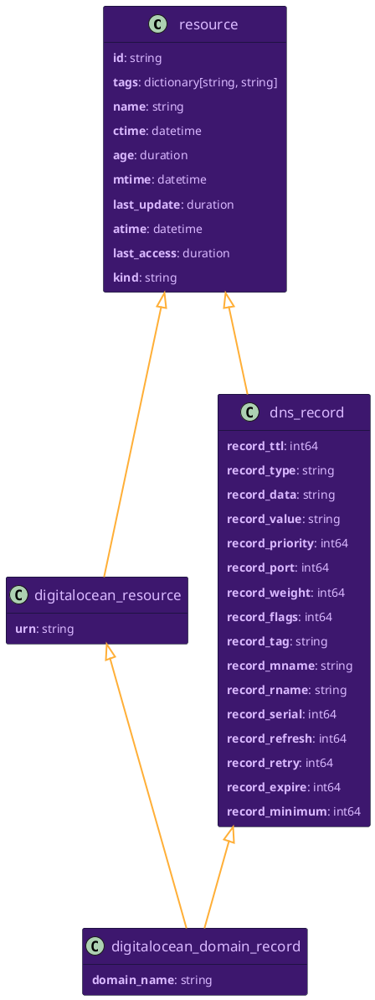

</ZoomPanPinch>

<details>
<summary>Relationships to Other Resources</summary>
<div>
<ZoomPanPinch>

```plantuml Diagram of digitalocean_domain_record resource relationships
@startuml
hide empty members
skinparam ArrowColor #ffaf37
skinparam ArrowFontColor #ffaf37
skinparam ArrowFontName Helvetica
skinparam ArrowThickness 2
skinparam BackgroundColor transparent
skinparam ClassAttributeFontColor #d9b8ff
skinparam ClassBackgroundColor #3d176e
skinparam ClassBorderColor #000d19
skinparam ClassFontColor #d9b8ff
skinparam ClassFontName Helvetica
skinparam ClassFontSize 17
skinparam NoteBackgroundColor #d9b8ff
skinparam NoteBorderColor #000d19
skinparam NoteFontColor #3d176e
skinparam NoteFontName Helvetica
skinparam Padding 5
skinparam RoundCorner 5
skinparam Shadowing false
skinparam stereotypeCBackgroundColor #e98df7
skinparam stereotypeIBackgroundColor #e98df7

class digitalocean_domain [[#digitalocean_domain]] {

}
class digitalocean_domain_record [[#digitalocean_domain_record]] {

}
class digitalocean_team [[#digitalocean_team]] {

}
digitalocean_domain -[#1A83AF]-> digitalocean_domain_record
digitalocean_team -[#1A83AF]-> digitalocean_domain
digitalocean_team -[#1A83AF]-> digitalocean_domain_record

@enduml
```

</ZoomPanPinch>
</div>
</details>

## `digitalocean_droplet`

<ZoomPanPinch>

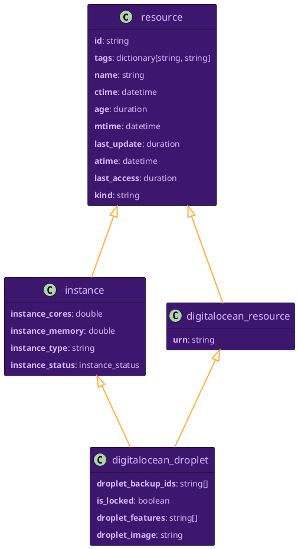

</ZoomPanPinch>

<details>
<summary>Relationships to Other Resources</summary>
<div>
<ZoomPanPinch>

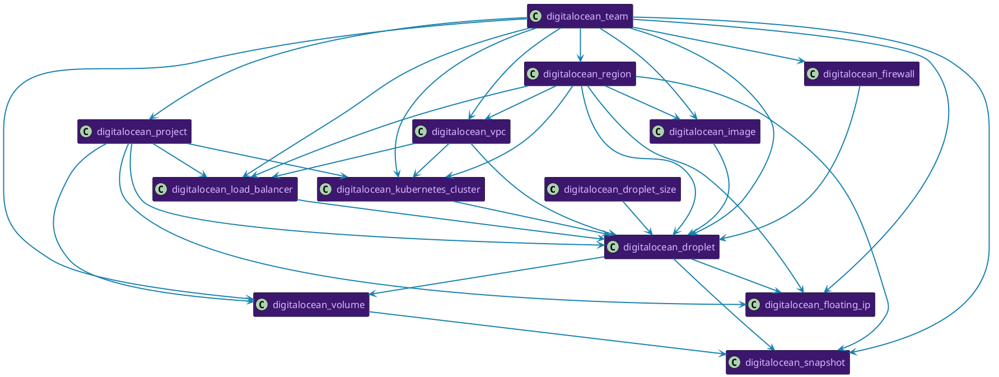

</ZoomPanPinch>
</div>
</details>

## `digitalocean_droplet_size`

<ZoomPanPinch>

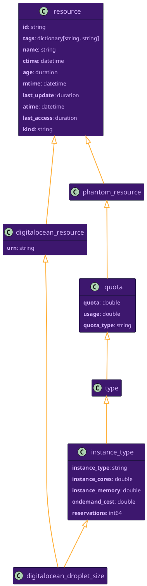

</ZoomPanPinch>

<details>
<summary>Relationships to Other Resources</summary>
<div>
<ZoomPanPinch>

```plantuml Diagram of digitalocean_droplet_size resource relationships
@startuml
hide empty members
skinparam ArrowColor #ffaf37
skinparam ArrowFontColor #ffaf37
skinparam ArrowFontName Helvetica
skinparam ArrowThickness 2
skinparam BackgroundColor transparent
skinparam ClassAttributeFontColor #d9b8ff
skinparam ClassBackgroundColor #3d176e
skinparam ClassBorderColor #000d19
skinparam ClassFontColor #d9b8ff
skinparam ClassFontName Helvetica
skinparam ClassFontSize 17
skinparam NoteBackgroundColor #d9b8ff
skinparam NoteBorderColor #000d19
skinparam NoteFontColor #3d176e
skinparam NoteFontName Helvetica
skinparam Padding 5
skinparam RoundCorner 5
skinparam Shadowing false
skinparam stereotypeCBackgroundColor #e98df7
skinparam stereotypeIBackgroundColor #e98df7

class digitalocean_droplet_size [[#digitalocean_droplet_size]] {

}
class digitalocean_droplet [[#digitalocean_droplet]] {

}
digitalocean_droplet_size -[#1A83AF]-> digitalocean_droplet

@enduml
```

</ZoomPanPinch>
</div>
</details>

## `digitalocean_firewall`

<ZoomPanPinch>

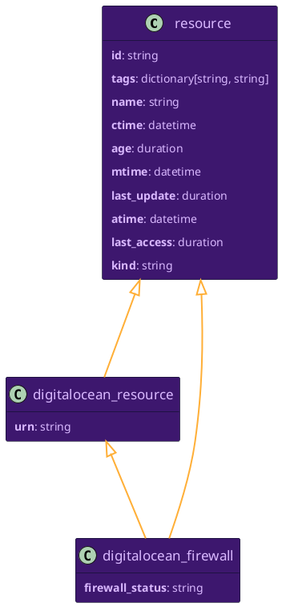

</ZoomPanPinch>

<details>
<summary>Relationships to Other Resources</summary>
<div>
<ZoomPanPinch>

```plantuml Diagram of digitalocean_firewall resource relationships
@startuml
hide empty members
skinparam ArrowColor #ffaf37
skinparam ArrowFontColor #ffaf37
skinparam ArrowFontName Helvetica
skinparam ArrowThickness 2
skinparam BackgroundColor transparent
skinparam ClassAttributeFontColor #d9b8ff
skinparam ClassBackgroundColor #3d176e
skinparam ClassBorderColor #000d19
skinparam ClassFontColor #d9b8ff
skinparam ClassFontName Helvetica
skinparam ClassFontSize 17
skinparam NoteBackgroundColor #d9b8ff
skinparam NoteBorderColor #000d19
skinparam NoteFontColor #3d176e
skinparam NoteFontName Helvetica
skinparam Padding 5
skinparam RoundCorner 5
skinparam Shadowing false
skinparam stereotypeCBackgroundColor #e98df7
skinparam stereotypeIBackgroundColor #e98df7

class digitalocean_droplet [[#digitalocean_droplet]] {

}
class digitalocean_firewall [[#digitalocean_firewall]] {

}
class digitalocean_team [[#digitalocean_team]] {

}
digitalocean_firewall -[#1A83AF]-> digitalocean_droplet
digitalocean_team -[#1A83AF]-> digitalocean_firewall
digitalocean_team -[#1A83AF]-> digitalocean_droplet

@enduml
```

</ZoomPanPinch>
</div>
</details>

## `digitalocean_floating_ip`

<ZoomPanPinch>

```plantuml Diagram of digitalocean_floating_ip data model
@startuml
hide empty members
skinparam ArrowColor #ffaf37
skinparam ArrowFontColor #ffaf37
skinparam ArrowFontName Helvetica
skinparam ArrowThickness 2
skinparam BackgroundColor transparent
skinparam ClassAttributeFontColor #d9b8ff
skinparam ClassBackgroundColor #3d176e
skinparam ClassBorderColor #000d19
skinparam ClassFontColor #d9b8ff
skinparam ClassFontName Helvetica
skinparam ClassFontSize 17
skinparam NoteBackgroundColor #d9b8ff
skinparam NoteBorderColor #000d19
skinparam NoteFontColor #3d176e
skinparam NoteFontName Helvetica
skinparam Padding 5
skinparam RoundCorner 5
skinparam Shadowing false
skinparam stereotypeCBackgroundColor #e98df7
skinparam stereotypeIBackgroundColor #e98df7

class resource [[#resource]] {
**id**: string
**tags**: dictionary[string, string]
**name**: string
**ctime**: datetime
**age**: duration
**mtime**: datetime
**last_update**: duration
**atime**: datetime
**last_access**: duration
**kind**: string
}
class digitalocean_resource [[#digitalocean_resource]] {
**urn**: string
}
class digitalocean_floating_ip [[#digitalocean_floating_ip]] {
**is_locked**: boolean
}
class ip_address [[#ip_address]] {
**ip_address**: string
**ip_address_family**: string
}
resource <|--- digitalocean_resource
digitalocean_resource <|--- digitalocean_floating_ip
ip_address <|--- digitalocean_floating_ip
resource <|--- ip_address

@enduml
```

</ZoomPanPinch>

<details>
<summary>Relationships to Other Resources</summary>
<div>
<ZoomPanPinch>

```plantuml Diagram of digitalocean_floating_ip resource relationships
@startuml
hide empty members
skinparam ArrowColor #ffaf37
skinparam ArrowFontColor #ffaf37
skinparam ArrowFontName Helvetica
skinparam ArrowThickness 2
skinparam BackgroundColor transparent
skinparam ClassAttributeFontColor #d9b8ff
skinparam ClassBackgroundColor #3d176e
skinparam ClassBorderColor #000d19
skinparam ClassFontColor #d9b8ff
skinparam ClassFontName Helvetica
skinparam ClassFontSize 17
skinparam NoteBackgroundColor #d9b8ff
skinparam NoteBorderColor #000d19
skinparam NoteFontColor #3d176e
skinparam NoteFontName Helvetica
skinparam Padding 5
skinparam RoundCorner 5
skinparam Shadowing false
skinparam stereotypeCBackgroundColor #e98df7
skinparam stereotypeIBackgroundColor #e98df7

class digitalocean_droplet [[#digitalocean_droplet]] {

}
class digitalocean_region [[#digitalocean_region]] {

}
class digitalocean_floating_ip [[#digitalocean_floating_ip]] {

}
class digitalocean_project [[#digitalocean_project]] {

}
class digitalocean_team [[#digitalocean_team]] {

}
digitalocean_droplet -[#1A83AF]-> digitalocean_floating_ip
digitalocean_region -[#1A83AF]-> digitalocean_droplet
digitalocean_region -[#1A83AF]-> digitalocean_floating_ip
digitalocean_project -[#1A83AF]-> digitalocean_droplet
digitalocean_project -[#1A83AF]-> digitalocean_floating_ip
digitalocean_team -[#1A83AF]-> digitalocean_floating_ip
digitalocean_team -[#1A83AF]-> digitalocean_droplet
digitalocean_team -[#1A83AF]-> digitalocean_project
digitalocean_team -[#1A83AF]-> digitalocean_region

@enduml
```

</ZoomPanPinch>
</div>
</details>

## `digitalocean_image`

<ZoomPanPinch>

```plantuml Diagram of digitalocean_image data model
@startuml
hide empty members
skinparam ArrowColor #ffaf37
skinparam ArrowFontColor #ffaf37
skinparam ArrowFontName Helvetica
skinparam ArrowThickness 2
skinparam BackgroundColor transparent
skinparam ClassAttributeFontColor #d9b8ff
skinparam ClassBackgroundColor #3d176e
skinparam ClassBorderColor #000d19
skinparam ClassFontColor #d9b8ff
skinparam ClassFontName Helvetica
skinparam ClassFontSize 17
skinparam NoteBackgroundColor #d9b8ff
skinparam NoteBorderColor #000d19
skinparam NoteFontColor #3d176e
skinparam NoteFontName Helvetica
skinparam Padding 5
skinparam RoundCorner 5
skinparam Shadowing false
skinparam stereotypeCBackgroundColor #e98df7
skinparam stereotypeIBackgroundColor #e98df7

class resource [[#resource]] {
**id**: string
**tags**: dictionary[string, string]
**name**: string
**ctime**: datetime
**age**: duration
**mtime**: datetime
**last_update**: duration
**atime**: datetime
**last_access**: duration
**kind**: string
}
class digitalocean_resource [[#digitalocean_resource]] {
**urn**: string
}
class digitalocean_image [[#digitalocean_image]] {
**distribution**: string
**image_slug**: string
**is_public**: boolean
**min_disk_size**: int64
**image_type**: string
**size_gigabytes**: int64
**description**: string
**image_status**: string
}
resource <|--- digitalocean_resource
digitalocean_resource <|--- digitalocean_image
resource <|--- digitalocean_image

@enduml
```

</ZoomPanPinch>

<details>
<summary>Relationships to Other Resources</summary>
<div>
<ZoomPanPinch>

```plantuml Diagram of digitalocean_image resource relationships
@startuml
hide empty members
skinparam ArrowColor #ffaf37
skinparam ArrowFontColor #ffaf37
skinparam ArrowFontName Helvetica
skinparam ArrowThickness 2
skinparam BackgroundColor transparent
skinparam ClassAttributeFontColor #d9b8ff
skinparam ClassBackgroundColor #3d176e
skinparam ClassBorderColor #000d19
skinparam ClassFontColor #d9b8ff
skinparam ClassFontName Helvetica
skinparam ClassFontSize 17
skinparam NoteBackgroundColor #d9b8ff
skinparam NoteBorderColor #000d19
skinparam NoteFontColor #3d176e
skinparam NoteFontName Helvetica
skinparam Padding 5
skinparam RoundCorner 5
skinparam Shadowing false
skinparam stereotypeCBackgroundColor #e98df7
skinparam stereotypeIBackgroundColor #e98df7

class digitalocean_droplet [[#digitalocean_droplet]] {

}
class digitalocean_region [[#digitalocean_region]] {

}
class digitalocean_image [[#digitalocean_image]] {

}
class digitalocean_team [[#digitalocean_team]] {

}
digitalocean_region -[#1A83AF]-> digitalocean_droplet
digitalocean_region -[#1A83AF]-> digitalocean_image
digitalocean_image -[#1A83AF]-> digitalocean_droplet
digitalocean_team -[#1A83AF]-> digitalocean_droplet
digitalocean_team -[#1A83AF]-> digitalocean_image
digitalocean_team -[#1A83AF]-> digitalocean_region

@enduml
```

</ZoomPanPinch>
</div>
</details>

## `digitalocean_kubernetes_cluster`

<ZoomPanPinch>

```plantuml Diagram of digitalocean_kubernetes_cluster data model
@startuml
hide empty members
skinparam ArrowColor #ffaf37
skinparam ArrowFontColor #ffaf37
skinparam ArrowFontName Helvetica
skinparam ArrowThickness 2
skinparam BackgroundColor transparent
skinparam ClassAttributeFontColor #d9b8ff
skinparam ClassBackgroundColor #3d176e
skinparam ClassBorderColor #000d19
skinparam ClassFontColor #d9b8ff
skinparam ClassFontName Helvetica
skinparam ClassFontSize 17
skinparam NoteBackgroundColor #d9b8ff
skinparam NoteBorderColor #000d19
skinparam NoteFontColor #3d176e
skinparam NoteFontName Helvetica
skinparam Padding 5
skinparam RoundCorner 5
skinparam Shadowing false
skinparam stereotypeCBackgroundColor #e98df7
skinparam stereotypeIBackgroundColor #e98df7

class resource [[#resource]] {
**id**: string
**tags**: dictionary[string, string]
**name**: string
**ctime**: datetime
**age**: duration
**mtime**: datetime
**last_update**: duration
**atime**: datetime
**last_access**: duration
**kind**: string
}
class digitalocean_resource [[#digitalocean_resource]] {
**urn**: string
}
class digitalocean_kubernetes_cluster [[#digitalocean_kubernetes_cluster]] {
**k8s_version**: string
**k8s_cluster_subnet**: string
**k8s_service_subnet**: string
**ipv4_address**: string
**endpoint**: string
**auto_upgrade_enabled**: boolean
**cluster_status**: string
**surge_upgrade_enabled**: boolean
**registry_enabled**: boolean
**ha_enabled**: boolean
}
resource <|--- digitalocean_resource
digitalocean_resource <|--- digitalocean_kubernetes_cluster
resource <|--- digitalocean_kubernetes_cluster

@enduml
```

</ZoomPanPinch>

<details>
<summary>Relationships to Other Resources</summary>
<div>
<ZoomPanPinch>

```plantuml Diagram of digitalocean_kubernetes_cluster resource relationships
@startuml
hide empty members
skinparam ArrowColor #ffaf37
skinparam ArrowFontColor #ffaf37
skinparam ArrowFontName Helvetica
skinparam ArrowThickness 2
skinparam BackgroundColor transparent
skinparam ClassAttributeFontColor #d9b8ff
skinparam ClassBackgroundColor #3d176e
skinparam ClassBorderColor #000d19
skinparam ClassFontColor #d9b8ff
skinparam ClassFontName Helvetica
skinparam ClassFontSize 17
skinparam NoteBackgroundColor #d9b8ff
skinparam NoteBorderColor #000d19
skinparam NoteFontColor #3d176e
skinparam NoteFontName Helvetica
skinparam Padding 5
skinparam RoundCorner 5
skinparam Shadowing false
skinparam stereotypeCBackgroundColor #e98df7
skinparam stereotypeIBackgroundColor #e98df7

class digitalocean_droplet [[#digitalocean_droplet]] {

}
class digitalocean_region [[#digitalocean_region]] {

}
class digitalocean_vpc [[#digitalocean_vpc]] {

}
class digitalocean_kubernetes_cluster [[#digitalocean_kubernetes_cluster]] {

}
class digitalocean_project [[#digitalocean_project]] {

}
class digitalocean_team [[#digitalocean_team]] {

}
digitalocean_region -[#1A83AF]-> digitalocean_droplet
digitalocean_region -[#1A83AF]-> digitalocean_vpc
digitalocean_region -[#1A83AF]-> digitalocean_kubernetes_cluster
digitalocean_vpc -[#1A83AF]-> digitalocean_droplet
digitalocean_vpc -[#1A83AF]-> digitalocean_kubernetes_cluster
digitalocean_kubernetes_cluster -[#1A83AF]-> digitalocean_droplet
digitalocean_project -[#1A83AF]-> digitalocean_droplet
digitalocean_project -[#1A83AF]-> digitalocean_kubernetes_cluster
digitalocean_team -[#1A83AF]-> digitalocean_droplet
digitalocean_team -[#1A83AF]-> digitalocean_kubernetes_cluster
digitalocean_team -[#1A83AF]-> digitalocean_project
digitalocean_team -[#1A83AF]-> digitalocean_region
digitalocean_team -[#1A83AF]-> digitalocean_vpc

@enduml
```

</ZoomPanPinch>
</div>
</details>

## `digitalocean_load_balancer`

<ZoomPanPinch>

```plantuml Diagram of digitalocean_load_balancer data model
@startuml
hide empty members
skinparam ArrowColor #ffaf37
skinparam ArrowFontColor #ffaf37
skinparam ArrowFontName Helvetica
skinparam ArrowThickness 2
skinparam BackgroundColor transparent
skinparam ClassAttributeFontColor #d9b8ff
skinparam ClassBackgroundColor #3d176e
skinparam ClassBorderColor #000d19
skinparam ClassFontColor #d9b8ff
skinparam ClassFontName Helvetica
skinparam ClassFontSize 17
skinparam NoteBackgroundColor #d9b8ff
skinparam NoteBorderColor #000d19
skinparam NoteFontColor #3d176e
skinparam NoteFontName Helvetica
skinparam Padding 5
skinparam RoundCorner 5
skinparam Shadowing false
skinparam stereotypeCBackgroundColor #e98df7
skinparam stereotypeIBackgroundColor #e98df7

class resource [[#resource]] {
**id**: string
**tags**: dictionary[string, string]
**name**: string
**ctime**: datetime
**age**: duration
**mtime**: datetime
**last_update**: duration
**atime**: datetime
**last_access**: duration
**kind**: string
}
class load_balancer [[#load_balancer]] {
**lb_type**: string
**public_ip_address**: string
**backends**: string[]
}
class digitalocean_resource [[#digitalocean_resource]] {
**urn**: string
}
class digitalocean_load_balancer [[#digitalocean_load_balancer]] {
**nr_nodes**: int64
**loadbalancer_status**: string
**redirect_http_to_https**: boolean
**enable_proxy_protocol**: boolean
**enable_backend_keepalive**: boolean
**disable_lets_encrypt_dns_records**: boolean
}
resource <|--- load_balancer
resource <|--- digitalocean_resource
digitalocean_resource <|--- digitalocean_load_balancer
load_balancer <|--- digitalocean_load_balancer

@enduml
```

</ZoomPanPinch>

<details>
<summary>Relationships to Other Resources</summary>
<div>
<ZoomPanPinch>

```plantuml Diagram of digitalocean_load_balancer resource relationships
@startuml
hide empty members
skinparam ArrowColor #ffaf37
skinparam ArrowFontColor #ffaf37
skinparam ArrowFontName Helvetica
skinparam ArrowThickness 2
skinparam BackgroundColor transparent
skinparam ClassAttributeFontColor #d9b8ff
skinparam ClassBackgroundColor #3d176e
skinparam ClassBorderColor #000d19
skinparam ClassFontColor #d9b8ff
skinparam ClassFontName Helvetica
skinparam ClassFontSize 17
skinparam NoteBackgroundColor #d9b8ff
skinparam NoteBorderColor #000d19
skinparam NoteFontColor #3d176e
skinparam NoteFontName Helvetica
skinparam Padding 5
skinparam RoundCorner 5
skinparam Shadowing false
skinparam stereotypeCBackgroundColor #e98df7
skinparam stereotypeIBackgroundColor #e98df7

class digitalocean_droplet [[#digitalocean_droplet]] {

}
class digitalocean_region [[#digitalocean_region]] {

}
class digitalocean_load_balancer [[#digitalocean_load_balancer]] {

}
class digitalocean_vpc [[#digitalocean_vpc]] {

}
class digitalocean_project [[#digitalocean_project]] {

}
class digitalocean_team [[#digitalocean_team]] {

}
digitalocean_region -[#1A83AF]-> digitalocean_droplet
digitalocean_region -[#1A83AF]-> digitalocean_load_balancer
digitalocean_region -[#1A83AF]-> digitalocean_vpc
digitalocean_load_balancer -[#1A83AF]-> digitalocean_droplet
digitalocean_vpc -[#1A83AF]-> digitalocean_droplet
digitalocean_vpc -[#1A83AF]-> digitalocean_load_balancer
digitalocean_project -[#1A83AF]-> digitalocean_droplet
digitalocean_project -[#1A83AF]-> digitalocean_load_balancer
digitalocean_team -[#1A83AF]-> digitalocean_droplet
digitalocean_team -[#1A83AF]-> digitalocean_load_balancer
digitalocean_team -[#1A83AF]-> digitalocean_project
digitalocean_team -[#1A83AF]-> digitalocean_region
digitalocean_team -[#1A83AF]-> digitalocean_vpc

@enduml
```

</ZoomPanPinch>
</div>
</details>

## `digitalocean_project`

<ZoomPanPinch>

```plantuml Diagram of digitalocean_project data model
@startuml
hide empty members
skinparam ArrowColor #ffaf37
skinparam ArrowFontColor #ffaf37
skinparam ArrowFontName Helvetica
skinparam ArrowThickness 2
skinparam BackgroundColor transparent
skinparam ClassAttributeFontColor #d9b8ff
skinparam ClassBackgroundColor #3d176e
skinparam ClassBorderColor #000d19
skinparam ClassFontColor #d9b8ff
skinparam ClassFontName Helvetica
skinparam ClassFontSize 17
skinparam NoteBackgroundColor #d9b8ff
skinparam NoteBorderColor #000d19
skinparam NoteFontColor #3d176e
skinparam NoteFontName Helvetica
skinparam Padding 5
skinparam RoundCorner 5
skinparam Shadowing false
skinparam stereotypeCBackgroundColor #e98df7
skinparam stereotypeIBackgroundColor #e98df7

class resource [[#resource]] {
**id**: string
**tags**: dictionary[string, string]
**name**: string
**ctime**: datetime
**age**: duration
**mtime**: datetime
**last_update**: duration
**atime**: datetime
**last_access**: duration
**kind**: string
}
class digitalocean_resource [[#digitalocean_resource]] {
**urn**: string
}
class digitalocean_project [[#digitalocean_project]] {
**owner_uuid**: string
**owner_id**: string
**description**: string
**purpose**: string
**environment**: string
**is_default**: boolean
}
resource <|--- digitalocean_resource
digitalocean_resource <|--- digitalocean_project
resource <|--- digitalocean_project

@enduml
```

</ZoomPanPinch>

<details>
<summary>Relationships to Other Resources</summary>
<div>
<ZoomPanPinch>

```plantuml Diagram of digitalocean_project resource relationships
@startuml
hide empty members
skinparam ArrowColor #ffaf37
skinparam ArrowFontColor #ffaf37
skinparam ArrowFontName Helvetica
skinparam ArrowThickness 2
skinparam BackgroundColor transparent
skinparam ClassAttributeFontColor #d9b8ff
skinparam ClassBackgroundColor #3d176e
skinparam ClassBorderColor #000d19
skinparam ClassFontColor #d9b8ff
skinparam ClassFontName Helvetica
skinparam ClassFontSize 17
skinparam NoteBackgroundColor #d9b8ff
skinparam NoteBorderColor #000d19
skinparam NoteFontColor #3d176e
skinparam NoteFontName Helvetica
skinparam Padding 5
skinparam RoundCorner 5
skinparam Shadowing false
skinparam stereotypeCBackgroundColor #e98df7
skinparam stereotypeIBackgroundColor #e98df7

class digitalocean_domain [[#digitalocean_domain]] {

}
class digitalocean_droplet [[#digitalocean_droplet]] {

}
class digitalocean_database [[#digitalocean_database]] {

}
class digitalocean_floating_ip [[#digitalocean_floating_ip]] {

}
class digitalocean_load_balancer [[#digitalocean_load_balancer]] {

}
class digitalocean_space [[#digitalocean_space]] {

}
class digitalocean_kubernetes_cluster [[#digitalocean_kubernetes_cluster]] {

}
class digitalocean_project [[#digitalocean_project]] {

}
class digitalocean_volume [[#digitalocean_volume]] {

}
class digitalocean_team [[#digitalocean_team]] {

}
digitalocean_droplet -[#1A83AF]-> digitalocean_volume
digitalocean_droplet -[#1A83AF]-> digitalocean_floating_ip
digitalocean_load_balancer -[#1A83AF]-> digitalocean_droplet
digitalocean_kubernetes_cluster -[#1A83AF]-> digitalocean_droplet
digitalocean_project -[#1A83AF]-> digitalocean_database
digitalocean_project -[#1A83AF]-> digitalocean_domain
digitalocean_project -[#1A83AF]-> digitalocean_droplet
digitalocean_project -[#1A83AF]-> digitalocean_floating_ip
digitalocean_project -[#1A83AF]-> digitalocean_volume
digitalocean_project -[#1A83AF]-> digitalocean_load_balancer
digitalocean_project -[#1A83AF]-> digitalocean_space
digitalocean_project -[#1A83AF]-> digitalocean_kubernetes_cluster
digitalocean_team -[#1A83AF]-> digitalocean_database
digitalocean_team -[#1A83AF]-> digitalocean_domain
digitalocean_team -[#1A83AF]-> digitalocean_floating_ip
digitalocean_team -[#1A83AF]-> digitalocean_space
digitalocean_team -[#1A83AF]-> digitalocean_droplet
digitalocean_team -[#1A83AF]-> digitalocean_kubernetes_cluster
digitalocean_team -[#1A83AF]-> digitalocean_volume
digitalocean_team -[#1A83AF]-> digitalocean_load_balancer
digitalocean_team -[#1A83AF]-> digitalocean_project

@enduml
```

</ZoomPanPinch>
</div>
</details>

## `digitalocean_region`

<ZoomPanPinch>

```plantuml Diagram of digitalocean_region data model
@startuml
hide empty members
skinparam ArrowColor #ffaf37
skinparam ArrowFontColor #ffaf37
skinparam ArrowFontName Helvetica
skinparam ArrowThickness 2
skinparam BackgroundColor transparent
skinparam ClassAttributeFontColor #d9b8ff
skinparam ClassBackgroundColor #3d176e
skinparam ClassBorderColor #000d19
skinparam ClassFontColor #d9b8ff
skinparam ClassFontName Helvetica
skinparam ClassFontSize 17
skinparam NoteBackgroundColor #d9b8ff
skinparam NoteBorderColor #000d19
skinparam NoteFontColor #3d176e
skinparam NoteFontName Helvetica
skinparam Padding 5
skinparam RoundCorner 5
skinparam Shadowing false
skinparam stereotypeCBackgroundColor #e98df7
skinparam stereotypeIBackgroundColor #e98df7

class resource [[#resource]] {
**id**: string
**tags**: dictionary[string, string]
**name**: string
**ctime**: datetime
**age**: duration
**mtime**: datetime
**last_update**: duration
**atime**: datetime
**last_access**: duration
**kind**: string
}
class region [[#region]] {

}
class digitalocean_resource [[#digitalocean_resource]] {
**urn**: string
}
class digitalocean_region [[#digitalocean_region]] {
**do_region_slug**: string
**do_region_features**: string[]
**is_available**: boolean
**do_region_droplet_sizes**: string[]
}
resource <|--- region
resource <|--- digitalocean_resource
digitalocean_resource <|--- digitalocean_region
region <|--- digitalocean_region

@enduml
```

</ZoomPanPinch>

<details>
<summary>Relationships to Other Resources</summary>
<div>
<ZoomPanPinch>

```plantuml Diagram of digitalocean_region resource relationships
@startuml
hide empty members
skinparam ArrowColor #ffaf37
skinparam ArrowFontColor #ffaf37
skinparam ArrowFontName Helvetica
skinparam ArrowThickness 2
skinparam BackgroundColor transparent
skinparam ClassAttributeFontColor #d9b8ff
skinparam ClassBackgroundColor #3d176e
skinparam ClassBorderColor #000d19
skinparam ClassFontColor #d9b8ff
skinparam ClassFontName Helvetica
skinparam ClassFontSize 17
skinparam NoteBackgroundColor #d9b8ff
skinparam NoteBorderColor #000d19
skinparam NoteFontColor #3d176e
skinparam NoteFontName Helvetica
skinparam Padding 5
skinparam RoundCorner 5
skinparam Shadowing false
skinparam stereotypeCBackgroundColor #e98df7
skinparam stereotypeIBackgroundColor #e98df7

class digitalocean_droplet [[#digitalocean_droplet]] {

}
class digitalocean_region [[#digitalocean_region]] {

}
class digitalocean_database [[#digitalocean_database]] {

}
class digitalocean_snapshot [[#digitalocean_snapshot]] {

}
class digitalocean_floating_ip [[#digitalocean_floating_ip]] {

}
class digitalocean_image [[#digitalocean_image]] {

}
class digitalocean_load_balancer [[#digitalocean_load_balancer]] {

}
class digitalocean_vpc [[#digitalocean_vpc]] {

}
class digitalocean_space [[#digitalocean_space]] {

}
class digitalocean_container_registry [[#digitalocean_container_registry]] {

}
class digitalocean_kubernetes_cluster [[#digitalocean_kubernetes_cluster]] {

}
class digitalocean_app [[#digitalocean_app]] {

}
class digitalocean_team [[#digitalocean_team]] {

}
digitalocean_droplet -[#1A83AF]-> digitalocean_floating_ip
digitalocean_droplet -[#1A83AF]-> digitalocean_snapshot
digitalocean_region -[#1A83AF]-> digitalocean_database
digitalocean_region -[#1A83AF]-> digitalocean_droplet
digitalocean_region -[#1A83AF]-> digitalocean_snapshot
digitalocean_region -[#1A83AF]-> digitalocean_floating_ip
digitalocean_region -[#1A83AF]-> digitalocean_image
digitalocean_region -[#1A83AF]-> digitalocean_load_balancer
digitalocean_region -[#1A83AF]-> digitalocean_vpc
digitalocean_region -[#1A83AF]-> digitalocean_space
digitalocean_region -[#1A83AF]-> digitalocean_container_registry
digitalocean_region -[#1A83AF]-> digitalocean_kubernetes_cluster
digitalocean_region -[#1A83AF]-> digitalocean_app
digitalocean_database -[#1A83AF]-> digitalocean_app
digitalocean_image -[#1A83AF]-> digitalocean_droplet
digitalocean_load_balancer -[#1A83AF]-> digitalocean_droplet
digitalocean_vpc -[#1A83AF]-> digitalocean_database
digitalocean_vpc -[#1A83AF]-> digitalocean_droplet
digitalocean_vpc -[#1A83AF]-> digitalocean_load_balancer
digitalocean_vpc -[#1A83AF]-> digitalocean_kubernetes_cluster
digitalocean_kubernetes_cluster -[#1A83AF]-> digitalocean_droplet
digitalocean_team -[#1A83AF]-> digitalocean_database
digitalocean_team -[#1A83AF]-> digitalocean_floating_ip
digitalocean_team -[#1A83AF]-> digitalocean_space
digitalocean_team -[#1A83AF]-> digitalocean_container_registry
digitalocean_team -[#1A83AF]-> digitalocean_droplet
digitalocean_team -[#1A83AF]-> digitalocean_kubernetes_cluster
digitalocean_team -[#1A83AF]-> digitalocean_snapshot
digitalocean_team -[#1A83AF]-> digitalocean_load_balancer
digitalocean_team -[#1A83AF]-> digitalocean_image
digitalocean_team -[#1A83AF]-> digitalocean_region
digitalocean_team -[#1A83AF]-> digitalocean_vpc
digitalocean_team -[#1A83AF]-> digitalocean_app

@enduml
```

</ZoomPanPinch>
</div>
</details>

## `digitalocean_resource`

<ZoomPanPinch>

```plantuml Diagram of digitalocean_resource data model
@startuml
hide empty members
skinparam ArrowColor #ffaf37
skinparam ArrowFontColor #ffaf37
skinparam ArrowFontName Helvetica
skinparam ArrowThickness 2
skinparam BackgroundColor transparent
skinparam ClassAttributeFontColor #d9b8ff
skinparam ClassBackgroundColor #3d176e
skinparam ClassBorderColor #000d19
skinparam ClassFontColor #d9b8ff
skinparam ClassFontName Helvetica
skinparam ClassFontSize 17
skinparam NoteBackgroundColor #d9b8ff
skinparam NoteBorderColor #000d19
skinparam NoteFontColor #3d176e
skinparam NoteFontName Helvetica
skinparam Padding 5
skinparam RoundCorner 5
skinparam Shadowing false
skinparam stereotypeCBackgroundColor #e98df7
skinparam stereotypeIBackgroundColor #e98df7

class resource [[#resource]] {
**id**: string
**tags**: dictionary[string, string]
**name**: string
**ctime**: datetime
**age**: duration
**mtime**: datetime
**last_update**: duration
**atime**: datetime
**last_access**: duration
**kind**: string
}
class digitalocean_resource [[#digitalocean_resource]] {
**urn**: string
}
resource <|--- digitalocean_resource

@enduml
```

</ZoomPanPinch>

<details>
<summary>Relationships to Other Resources</summary>
<div>
<ZoomPanPinch>

```plantuml Diagram of digitalocean_resource resource relationships
@startuml
hide empty members
skinparam ArrowColor #ffaf37
skinparam ArrowFontColor #ffaf37
skinparam ArrowFontName Helvetica
skinparam ArrowThickness 2
skinparam BackgroundColor transparent
skinparam ClassAttributeFontColor #d9b8ff
skinparam ClassBackgroundColor #3d176e
skinparam ClassBorderColor #000d19
skinparam ClassFontColor #d9b8ff
skinparam ClassFontName Helvetica
skinparam ClassFontSize 17
skinparam NoteBackgroundColor #d9b8ff
skinparam NoteBorderColor #000d19
skinparam NoteFontColor #3d176e
skinparam NoteFontName Helvetica
skinparam Padding 5
skinparam RoundCorner 5
skinparam Shadowing false
skinparam stereotypeCBackgroundColor #e98df7
skinparam stereotypeIBackgroundColor #e98df7

class digitalocean_resource [[#digitalocean_resource]] {

}
class digitalocean_team [[#digitalocean_team]] {

}
digitalocean_team -[#1A83AF]-> digitalocean_resource

@enduml
```

</ZoomPanPinch>
</div>
</details>

## `digitalocean_snapshot`

<ZoomPanPinch>

```plantuml Diagram of digitalocean_snapshot data model
@startuml
hide empty members
skinparam ArrowColor #ffaf37
skinparam ArrowFontColor #ffaf37
skinparam ArrowFontName Helvetica
skinparam ArrowThickness 2
skinparam BackgroundColor transparent
skinparam ClassAttributeFontColor #d9b8ff
skinparam ClassBackgroundColor #3d176e
skinparam ClassBorderColor #000d19
skinparam ClassFontColor #d9b8ff
skinparam ClassFontName Helvetica
skinparam ClassFontSize 17
skinparam NoteBackgroundColor #d9b8ff
skinparam NoteBorderColor #000d19
skinparam NoteFontColor #3d176e
skinparam NoteFontName Helvetica
skinparam Padding 5
skinparam RoundCorner 5
skinparam Shadowing false
skinparam stereotypeCBackgroundColor #e98df7
skinparam stereotypeIBackgroundColor #e98df7

class resource [[#resource]] {
**id**: string
**tags**: dictionary[string, string]
**name**: string
**ctime**: datetime
**age**: duration
**mtime**: datetime
**last_update**: duration
**atime**: datetime
**last_access**: duration
**kind**: string
}
class digitalocean_resource [[#digitalocean_resource]] {
**urn**: string
}
class snapshot [[#snapshot]] {
**snapshot_status**: string
**description**: string
**volume_id**: string
**volume_size**: int64
**encrypted**: boolean
**owner_id**: string
**owner_alias**: string
}
class digitalocean_snapshot [[#digitalocean_snapshot]] {
**snapshot_size_gigabytes**: int64
**resource_id**: string
**resource_type**: string
}
resource <|--- digitalocean_resource
resource <|--- snapshot
digitalocean_resource <|--- digitalocean_snapshot
snapshot <|--- digitalocean_snapshot

@enduml
```

</ZoomPanPinch>

<details>
<summary>Relationships to Other Resources</summary>
<div>
<ZoomPanPinch>

```plantuml Diagram of digitalocean_snapshot resource relationships
@startuml
hide empty members
skinparam ArrowColor #ffaf37
skinparam ArrowFontColor #ffaf37
skinparam ArrowFontName Helvetica
skinparam ArrowThickness 2
skinparam BackgroundColor transparent
skinparam ClassAttributeFontColor #d9b8ff
skinparam ClassBackgroundColor #3d176e
skinparam ClassBorderColor #000d19
skinparam ClassFontColor #d9b8ff
skinparam ClassFontName Helvetica
skinparam ClassFontSize 17
skinparam NoteBackgroundColor #d9b8ff
skinparam NoteBorderColor #000d19
skinparam NoteFontColor #3d176e
skinparam NoteFontName Helvetica
skinparam Padding 5
skinparam RoundCorner 5
skinparam Shadowing false
skinparam stereotypeCBackgroundColor #e98df7
skinparam stereotypeIBackgroundColor #e98df7

class digitalocean_droplet [[#digitalocean_droplet]] {

}
class digitalocean_region [[#digitalocean_region]] {

}
class digitalocean_snapshot [[#digitalocean_snapshot]] {

}
class digitalocean_volume [[#digitalocean_volume]] {

}
class digitalocean_team [[#digitalocean_team]] {

}
digitalocean_droplet -[#1A83AF]-> digitalocean_volume
digitalocean_droplet -[#1A83AF]-> digitalocean_snapshot
digitalocean_region -[#1A83AF]-> digitalocean_droplet
digitalocean_region -[#1A83AF]-> digitalocean_snapshot
digitalocean_volume -[#1A83AF]-> digitalocean_snapshot
digitalocean_team -[#1A83AF]-> digitalocean_droplet
digitalocean_team -[#1A83AF]-> digitalocean_snapshot
digitalocean_team -[#1A83AF]-> digitalocean_volume
digitalocean_team -[#1A83AF]-> digitalocean_region

@enduml
```

</ZoomPanPinch>
</div>
</details>

## `digitalocean_space`

<ZoomPanPinch>

```plantuml Diagram of digitalocean_space data model
@startuml
hide empty members
skinparam ArrowColor #ffaf37
skinparam ArrowFontColor #ffaf37
skinparam ArrowFontName Helvetica
skinparam ArrowThickness 2
skinparam BackgroundColor transparent
skinparam ClassAttributeFontColor #d9b8ff
skinparam ClassBackgroundColor #3d176e
skinparam ClassBorderColor #000d19
skinparam ClassFontColor #d9b8ff
skinparam ClassFontName Helvetica
skinparam ClassFontSize 17
skinparam NoteBackgroundColor #d9b8ff
skinparam NoteBorderColor #000d19
skinparam NoteFontColor #3d176e
skinparam NoteFontName Helvetica
skinparam Padding 5
skinparam RoundCorner 5
skinparam Shadowing false
skinparam stereotypeCBackgroundColor #e98df7
skinparam stereotypeIBackgroundColor #e98df7

class resource [[#resource]] {
**id**: string
**tags**: dictionary[string, string]
**name**: string
**ctime**: datetime
**age**: duration
**mtime**: datetime
**last_update**: duration
**atime**: datetime
**last_access**: duration
**kind**: string
}
class digitalocean_resource [[#digitalocean_resource]] {
**urn**: string
}
class digitalocean_space [[#digitalocean_space]] {

}
class bucket [[#bucket]] {

}
resource <|--- digitalocean_resource
digitalocean_resource <|--- digitalocean_space
bucket <|--- digitalocean_space
resource <|--- bucket

@enduml
```

</ZoomPanPinch>

<details>
<summary>Relationships to Other Resources</summary>
<div>
<ZoomPanPinch>

```plantuml Diagram of digitalocean_space resource relationships
@startuml
hide empty members
skinparam ArrowColor #ffaf37
skinparam ArrowFontColor #ffaf37
skinparam ArrowFontName Helvetica
skinparam ArrowThickness 2
skinparam BackgroundColor transparent
skinparam ClassAttributeFontColor #d9b8ff
skinparam ClassBackgroundColor #3d176e
skinparam ClassBorderColor #000d19
skinparam ClassFontColor #d9b8ff
skinparam ClassFontName Helvetica
skinparam ClassFontSize 17
skinparam NoteBackgroundColor #d9b8ff
skinparam NoteBorderColor #000d19
skinparam NoteFontColor #3d176e
skinparam NoteFontName Helvetica
skinparam Padding 5
skinparam RoundCorner 5
skinparam Shadowing false
skinparam stereotypeCBackgroundColor #e98df7
skinparam stereotypeIBackgroundColor #e98df7

class digitalocean_region [[#digitalocean_region]] {

}
class digitalocean_space [[#digitalocean_space]] {

}
class digitalocean_project [[#digitalocean_project]] {

}
class digitalocean_team [[#digitalocean_team]] {

}
digitalocean_region -[#1A83AF]-> digitalocean_space
digitalocean_project -[#1A83AF]-> digitalocean_space
digitalocean_team -[#1A83AF]-> digitalocean_space
digitalocean_team -[#1A83AF]-> digitalocean_project
digitalocean_team -[#1A83AF]-> digitalocean_region

@enduml
```

</ZoomPanPinch>
</div>
</details>

## `digitalocean_ssh_key`

<ZoomPanPinch>

```plantuml Diagram of digitalocean_ssh_key data model
@startuml
hide empty members
skinparam ArrowColor #ffaf37
skinparam ArrowFontColor #ffaf37
skinparam ArrowFontName Helvetica
skinparam ArrowThickness 2
skinparam BackgroundColor transparent
skinparam ClassAttributeFontColor #d9b8ff
skinparam ClassBackgroundColor #3d176e
skinparam ClassBorderColor #000d19
skinparam ClassFontColor #d9b8ff
skinparam ClassFontName Helvetica
skinparam ClassFontSize 17
skinparam NoteBackgroundColor #d9b8ff
skinparam NoteBorderColor #000d19
skinparam NoteFontColor #3d176e
skinparam NoteFontName Helvetica
skinparam Padding 5
skinparam RoundCorner 5
skinparam Shadowing false
skinparam stereotypeCBackgroundColor #e98df7
skinparam stereotypeIBackgroundColor #e98df7

class resource [[#resource]] {
**id**: string
**tags**: dictionary[string, string]
**name**: string
**ctime**: datetime
**age**: duration
**mtime**: datetime
**last_update**: duration
**atime**: datetime
**last_access**: duration
**kind**: string
}
class digitalocean_resource [[#digitalocean_resource]] {
**urn**: string
}
class keypair [[#keypair]] {
**fingerprint**: string
}
class digitalocean_ssh_key [[#digitalocean_ssh_key]] {
**public_key**: string
}
resource <|--- digitalocean_resource
resource <|--- keypair
digitalocean_resource <|--- digitalocean_ssh_key
keypair <|--- digitalocean_ssh_key

@enduml
```

</ZoomPanPinch>

<details>
<summary>Relationships to Other Resources</summary>
<div>
<ZoomPanPinch>

```plantuml Diagram of digitalocean_ssh_key resource relationships
@startuml
hide empty members
skinparam ArrowColor #ffaf37
skinparam ArrowFontColor #ffaf37
skinparam ArrowFontName Helvetica
skinparam ArrowThickness 2
skinparam BackgroundColor transparent
skinparam ClassAttributeFontColor #d9b8ff
skinparam ClassBackgroundColor #3d176e
skinparam ClassBorderColor #000d19
skinparam ClassFontColor #d9b8ff
skinparam ClassFontName Helvetica
skinparam ClassFontSize 17
skinparam NoteBackgroundColor #d9b8ff
skinparam NoteBorderColor #000d19
skinparam NoteFontColor #3d176e
skinparam NoteFontName Helvetica
skinparam Padding 5
skinparam RoundCorner 5
skinparam Shadowing false
skinparam stereotypeCBackgroundColor #e98df7
skinparam stereotypeIBackgroundColor #e98df7

class digitalocean_team [[#digitalocean_team]] {

}
class digitalocean_ssh_key [[#digitalocean_ssh_key]] {

}
digitalocean_team -[#1A83AF]-> digitalocean_ssh_key

@enduml
```

</ZoomPanPinch>
</div>
</details>

## `digitalocean_tag`

<ZoomPanPinch>

```plantuml Diagram of digitalocean_tag data model
@startuml
hide empty members
skinparam ArrowColor #ffaf37
skinparam ArrowFontColor #ffaf37
skinparam ArrowFontName Helvetica
skinparam ArrowThickness 2
skinparam BackgroundColor transparent
skinparam ClassAttributeFontColor #d9b8ff
skinparam ClassBackgroundColor #3d176e
skinparam ClassBorderColor #000d19
skinparam ClassFontColor #d9b8ff
skinparam ClassFontName Helvetica
skinparam ClassFontSize 17
skinparam NoteBackgroundColor #d9b8ff
skinparam NoteBorderColor #000d19
skinparam NoteFontColor #3d176e
skinparam NoteFontName Helvetica
skinparam Padding 5
skinparam RoundCorner 5
skinparam Shadowing false
skinparam stereotypeCBackgroundColor #e98df7
skinparam stereotypeIBackgroundColor #e98df7

class resource [[#resource]] {
**id**: string
**tags**: dictionary[string, string]
**name**: string
**ctime**: datetime
**age**: duration
**mtime**: datetime
**last_update**: duration
**atime**: datetime
**last_access**: duration
**kind**: string
}
class digitalocean_resource [[#digitalocean_resource]] {
**urn**: string
}
class digitalocean_tag [[#digitalocean_tag]] {

}
resource <|--- digitalocean_resource
digitalocean_resource <|--- digitalocean_tag
resource <|--- digitalocean_tag

@enduml
```

</ZoomPanPinch>

<details>
<summary>Relationships to Other Resources</summary>
<div>
<ZoomPanPinch>

```plantuml Diagram of digitalocean_tag resource relationships
@startuml
hide empty members
skinparam ArrowColor #ffaf37
skinparam ArrowFontColor #ffaf37
skinparam ArrowFontName Helvetica
skinparam ArrowThickness 2
skinparam BackgroundColor transparent
skinparam ClassAttributeFontColor #d9b8ff
skinparam ClassBackgroundColor #3d176e
skinparam ClassBorderColor #000d19
skinparam ClassFontColor #d9b8ff
skinparam ClassFontName Helvetica
skinparam ClassFontSize 17
skinparam NoteBackgroundColor #d9b8ff
skinparam NoteBorderColor #000d19
skinparam NoteFontColor #3d176e
skinparam NoteFontName Helvetica
skinparam Padding 5
skinparam RoundCorner 5
skinparam Shadowing false
skinparam stereotypeCBackgroundColor #e98df7
skinparam stereotypeIBackgroundColor #e98df7

class digitalocean_tag [[#digitalocean_tag]] {

}
class digitalocean_team [[#digitalocean_team]] {

}
digitalocean_team -[#1A83AF]-> digitalocean_tag

@enduml
```

</ZoomPanPinch>
</div>
</details>

## `digitalocean_team`

<ZoomPanPinch>

```plantuml Diagram of digitalocean_team data model
@startuml
hide empty members
skinparam ArrowColor #ffaf37
skinparam ArrowFontColor #ffaf37
skinparam ArrowFontName Helvetica
skinparam ArrowThickness 2
skinparam BackgroundColor transparent
skinparam ClassAttributeFontColor #d9b8ff
skinparam ClassBackgroundColor #3d176e
skinparam ClassBorderColor #000d19
skinparam ClassFontColor #d9b8ff
skinparam ClassFontName Helvetica
skinparam ClassFontSize 17
skinparam NoteBackgroundColor #d9b8ff
skinparam NoteBorderColor #000d19
skinparam NoteFontColor #3d176e
skinparam NoteFontName Helvetica
skinparam Padding 5
skinparam RoundCorner 5
skinparam Shadowing false
skinparam stereotypeCBackgroundColor #e98df7
skinparam stereotypeIBackgroundColor #e98df7

class account [[#account]] {

}
class resource [[#resource]] {
**id**: string
**tags**: dictionary[string, string]
**name**: string
**ctime**: datetime
**age**: duration
**mtime**: datetime
**last_update**: duration
**atime**: datetime
**last_access**: duration
**kind**: string
}
class digitalocean_resource [[#digitalocean_resource]] {
**urn**: string
}
class digitalocean_team [[#digitalocean_team]] {

}
resource <|--- account
resource <|--- digitalocean_resource
digitalocean_resource <|--- digitalocean_team
account <|--- digitalocean_team

@enduml
```

</ZoomPanPinch>

<details>
<summary>Relationships to Other Resources</summary>
<div>
<ZoomPanPinch>

```plantuml Diagram of digitalocean_team resource relationships
@startuml
hide empty members
skinparam ArrowColor #ffaf37
skinparam ArrowFontColor #ffaf37
skinparam ArrowFontName Helvetica
skinparam ArrowThickness 2
skinparam BackgroundColor transparent
skinparam ClassAttributeFontColor #d9b8ff
skinparam ClassBackgroundColor #3d176e
skinparam ClassBorderColor #000d19
skinparam ClassFontColor #d9b8ff
skinparam ClassFontName Helvetica
skinparam ClassFontSize 17
skinparam NoteBackgroundColor #d9b8ff
skinparam NoteBorderColor #000d19
skinparam NoteFontColor #3d176e
skinparam NoteFontName Helvetica
skinparam Padding 5
skinparam RoundCorner 5
skinparam Shadowing false
skinparam stereotypeCBackgroundColor #e98df7
skinparam stereotypeIBackgroundColor #e98df7

class digitalocean_domain [[#digitalocean_domain]] {

}
class digitalocean_resource [[#digitalocean_resource]] {

}
class digitalocean_domain_record [[#digitalocean_domain_record]] {

}
class digitalocean_droplet [[#digitalocean_droplet]] {

}
class digitalocean_firewall [[#digitalocean_firewall]] {

}
class digitalocean_region [[#digitalocean_region]] {

}
class digitalocean_database [[#digitalocean_database]] {

}
class digitalocean_snapshot [[#digitalocean_snapshot]] {

}
class digitalocean_floating_ip [[#digitalocean_floating_ip]] {

}
class digitalocean_image [[#digitalocean_image]] {

}
class digitalocean_load_balancer [[#digitalocean_load_balancer]] {

}
class digitalocean_vpc [[#digitalocean_vpc]] {

}
class digitalocean_space [[#digitalocean_space]] {

}
class digitalocean_container_registry [[#digitalocean_container_registry]] {

}
class digitalocean_kubernetes_cluster [[#digitalocean_kubernetes_cluster]] {

}
class digitalocean_app [[#digitalocean_app]] {

}
class digitalocean_container_registry_repository [[#digitalocean_container_registry_repository]] {

}
class digitalocean_container_registry_repository_tag [[#digitalocean_container_registry_repository_tag]] {

}
class digitalocean_alert_policy [[#digitalocean_alert_policy]] {

}
class digitalocean_cdn_endpoint [[#digitalocean_cdn_endpoint]] {

}
class digitalocean_project [[#digitalocean_project]] {

}
class digitalocean_volume [[#digitalocean_volume]] {

}
class digitalocean_certificate [[#digitalocean_certificate]] {

}
class digitalocean_tag [[#digitalocean_tag]] {

}
class digitalocean_team [[#digitalocean_team]] {

}
class digitalocean_ssh_key [[#digitalocean_ssh_key]] {

}
digitalocean_domain -[#1A83AF]-> digitalocean_domain_record
digitalocean_droplet -[#1A83AF]-> digitalocean_volume
digitalocean_droplet -[#1A83AF]-> digitalocean_floating_ip
digitalocean_droplet -[#1A83AF]-> digitalocean_snapshot
digitalocean_firewall -[#1A83AF]-> digitalocean_droplet
digitalocean_region -[#1A83AF]-> digitalocean_database
digitalocean_region -[#1A83AF]-> digitalocean_droplet
digitalocean_region -[#1A83AF]-> digitalocean_snapshot
digitalocean_region -[#1A83AF]-> digitalocean_floating_ip
digitalocean_region -[#1A83AF]-> digitalocean_image
digitalocean_region -[#1A83AF]-> digitalocean_load_balancer
digitalocean_region -[#1A83AF]-> digitalocean_vpc
digitalocean_region -[#1A83AF]-> digitalocean_space
digitalocean_region -[#1A83AF]-> digitalocean_container_registry
digitalocean_region -[#1A83AF]-> digitalocean_kubernetes_cluster
digitalocean_region -[#1A83AF]-> digitalocean_app
digitalocean_database -[#1A83AF]-> digitalocean_app
digitalocean_image -[#1A83AF]-> digitalocean_droplet
digitalocean_load_balancer -[#1A83AF]-> digitalocean_droplet
digitalocean_vpc -[#1A83AF]-> digitalocean_database
digitalocean_vpc -[#1A83AF]-> digitalocean_droplet
digitalocean_vpc -[#1A83AF]-> digitalocean_load_balancer
digitalocean_vpc -[#1A83AF]-> digitalocean_kubernetes_cluster
digitalocean_container_registry -[#1A83AF]-> digitalocean_container_registry_repository
digitalocean_kubernetes_cluster -[#1A83AF]-> digitalocean_droplet
digitalocean_container_registry_repository -[#1A83AF]-> digitalocean_container_registry_repository_tag
digitalocean_project -[#1A83AF]-> digitalocean_database
digitalocean_project -[#1A83AF]-> digitalocean_domain
digitalocean_project -[#1A83AF]-> digitalocean_droplet
digitalocean_project -[#1A83AF]-> digitalocean_floating_ip
digitalocean_project -[#1A83AF]-> digitalocean_volume
digitalocean_project -[#1A83AF]-> digitalocean_load_balancer
digitalocean_project -[#1A83AF]-> digitalocean_space
digitalocean_project -[#1A83AF]-> digitalocean_kubernetes_cluster
digitalocean_volume -[#1A83AF]-> digitalocean_snapshot
digitalocean_team -[#1A83AF]-> digitalocean_resource
digitalocean_team -[#1A83AF]-> digitalocean_database
digitalocean_team -[#1A83AF]-> digitalocean_domain
digitalocean_team -[#1A83AF]-> digitalocean_floating_ip
digitalocean_team -[#1A83AF]-> digitalocean_ssh_key
digitalocean_team -[#1A83AF]-> digitalocean_firewall
digitalocean_team -[#1A83AF]-> digitalocean_space
digitalocean_team -[#1A83AF]-> digitalocean_container_registry
digitalocean_team -[#1A83AF]-> digitalocean_certificate
digitalocean_team -[#1A83AF]-> digitalocean_droplet
digitalocean_team -[#1A83AF]-> digitalocean_alert_policy
digitalocean_team -[#1A83AF]-> digitalocean_kubernetes_cluster
digitalocean_team -[#1A83AF]-> digitalocean_snapshot
digitalocean_team -[#1A83AF]-> digitalocean_volume
digitalocean_team -[#1A83AF]-> digitalocean_load_balancer
digitalocean_team -[#1A83AF]-> digitalocean_project
digitalocean_team -[#1A83AF]-> digitalocean_tag
digitalocean_team -[#1A83AF]-> digitalocean_cdn_endpoint
digitalocean_team -[#1A83AF]-> digitalocean_domain_record
digitalocean_team -[#1A83AF]-> digitalocean_container_registry_repository
digitalocean_team -[#1A83AF]-> digitalocean_container_registry_repository_tag
digitalocean_team -[#1A83AF]-> digitalocean_image
digitalocean_team -[#1A83AF]-> digitalocean_region
digitalocean_team -[#1A83AF]-> digitalocean_vpc
digitalocean_team -[#1A83AF]-> digitalocean_app

@enduml
```

</ZoomPanPinch>
</div>
</details>

## `digitalocean_volume`

<ZoomPanPinch>

```plantuml Diagram of digitalocean_volume data model
@startuml
hide empty members
skinparam ArrowColor #ffaf37
skinparam ArrowFontColor #ffaf37
skinparam ArrowFontName Helvetica
skinparam ArrowThickness 2
skinparam BackgroundColor transparent
skinparam ClassAttributeFontColor #d9b8ff
skinparam ClassBackgroundColor #3d176e
skinparam ClassBorderColor #000d19
skinparam ClassFontColor #d9b8ff
skinparam ClassFontName Helvetica
skinparam ClassFontSize 17
skinparam NoteBackgroundColor #d9b8ff
skinparam NoteBorderColor #000d19
skinparam NoteFontColor #3d176e
skinparam NoteFontName Helvetica
skinparam Padding 5
skinparam RoundCorner 5
skinparam Shadowing false
skinparam stereotypeCBackgroundColor #e98df7
skinparam stereotypeIBackgroundColor #e98df7

class resource [[#resource]] {
**id**: string
**tags**: dictionary[string, string]
**name**: string
**ctime**: datetime
**age**: duration
**mtime**: datetime
**last_update**: duration
**atime**: datetime
**last_access**: duration
**kind**: string
}
class volume [[#volume]] {
**volume_size**: int64
**volume_type**: string
**volume_status**: volume_status
**volume_iops**: int64
**volume_throughput**: int64
**volume_encrypted**: boolean
**snapshot_before_delete**: boolean
}
class digitalocean_resource [[#digitalocean_resource]] {
**urn**: string
}
class digitalocean_volume [[#digitalocean_volume]] {
**description**: string
**filesystem_type**: string
**filesystem_label**: string
**ondemand_cost**: double
}
resource <|--- volume
resource <|--- digitalocean_resource
digitalocean_resource <|--- digitalocean_volume
volume <|--- digitalocean_volume

@enduml
```

</ZoomPanPinch>

<details>
<summary>Relationships to Other Resources</summary>
<div>
<ZoomPanPinch>

```plantuml Diagram of digitalocean_volume resource relationships
@startuml
hide empty members
skinparam ArrowColor #ffaf37
skinparam ArrowFontColor #ffaf37
skinparam ArrowFontName Helvetica
skinparam ArrowThickness 2
skinparam BackgroundColor transparent
skinparam ClassAttributeFontColor #d9b8ff
skinparam ClassBackgroundColor #3d176e
skinparam ClassBorderColor #000d19
skinparam ClassFontColor #d9b8ff
skinparam ClassFontName Helvetica
skinparam ClassFontSize 17
skinparam NoteBackgroundColor #d9b8ff
skinparam NoteBorderColor #000d19
skinparam NoteFontColor #3d176e
skinparam NoteFontName Helvetica
skinparam Padding 5
skinparam RoundCorner 5
skinparam Shadowing false
skinparam stereotypeCBackgroundColor #e98df7
skinparam stereotypeIBackgroundColor #e98df7

class digitalocean_droplet [[#digitalocean_droplet]] {

}
class digitalocean_snapshot [[#digitalocean_snapshot]] {

}
class digitalocean_project [[#digitalocean_project]] {

}
class digitalocean_volume [[#digitalocean_volume]] {

}
class digitalocean_team [[#digitalocean_team]] {

}
digitalocean_droplet -[#1A83AF]-> digitalocean_volume
digitalocean_droplet -[#1A83AF]-> digitalocean_snapshot
digitalocean_project -[#1A83AF]-> digitalocean_droplet
digitalocean_project -[#1A83AF]-> digitalocean_volume
digitalocean_volume -[#1A83AF]-> digitalocean_snapshot
digitalocean_team -[#1A83AF]-> digitalocean_droplet
digitalocean_team -[#1A83AF]-> digitalocean_snapshot
digitalocean_team -[#1A83AF]-> digitalocean_volume
digitalocean_team -[#1A83AF]-> digitalocean_project

@enduml
```

</ZoomPanPinch>
</div>
</details>

## `digitalocean_vpc`

<ZoomPanPinch>

```plantuml Diagram of digitalocean_vpc data model
@startuml
hide empty members
skinparam ArrowColor #ffaf37
skinparam ArrowFontColor #ffaf37
skinparam ArrowFontName Helvetica
skinparam ArrowThickness 2
skinparam BackgroundColor transparent
skinparam ClassAttributeFontColor #d9b8ff
skinparam ClassBackgroundColor #3d176e
skinparam ClassBorderColor #000d19
skinparam ClassFontColor #d9b8ff
skinparam ClassFontName Helvetica
skinparam ClassFontSize 17
skinparam NoteBackgroundColor #d9b8ff
skinparam NoteBorderColor #000d19
skinparam NoteFontColor #3d176e
skinparam NoteFontName Helvetica
skinparam Padding 5
skinparam RoundCorner 5
skinparam Shadowing false
skinparam stereotypeCBackgroundColor #e98df7
skinparam stereotypeIBackgroundColor #e98df7

class resource [[#resource]] {
**id**: string
**tags**: dictionary[string, string]
**name**: string
**ctime**: datetime
**age**: duration
**mtime**: datetime
**last_update**: duration
**atime**: datetime
**last_access**: duration
**kind**: string
}
class network [[#network]] {

}
class digitalocean_resource [[#digitalocean_resource]] {
**urn**: string
}
class digitalocean_vpc [[#digitalocean_vpc]] {
**ip_range**: string
**description**: string
**is_default**: boolean
}
resource <|--- network
resource <|--- digitalocean_resource
digitalocean_resource <|--- digitalocean_vpc
network <|--- digitalocean_vpc

@enduml
```

</ZoomPanPinch>

<details>
<summary>Relationships to Other Resources</summary>
<div>
<ZoomPanPinch>

```plantuml Diagram of digitalocean_vpc resource relationships
@startuml
hide empty members
skinparam ArrowColor #ffaf37
skinparam ArrowFontColor #ffaf37
skinparam ArrowFontName Helvetica
skinparam ArrowThickness 2
skinparam BackgroundColor transparent
skinparam ClassAttributeFontColor #d9b8ff
skinparam ClassBackgroundColor #3d176e
skinparam ClassBorderColor #000d19
skinparam ClassFontColor #d9b8ff
skinparam ClassFontName Helvetica
skinparam ClassFontSize 17
skinparam NoteBackgroundColor #d9b8ff
skinparam NoteBorderColor #000d19
skinparam NoteFontColor #3d176e
skinparam NoteFontName Helvetica
skinparam Padding 5
skinparam RoundCorner 5
skinparam Shadowing false
skinparam stereotypeCBackgroundColor #e98df7
skinparam stereotypeIBackgroundColor #e98df7

class digitalocean_droplet [[#digitalocean_droplet]] {

}
class digitalocean_region [[#digitalocean_region]] {

}
class digitalocean_database [[#digitalocean_database]] {

}
class digitalocean_load_balancer [[#digitalocean_load_balancer]] {

}
class digitalocean_vpc [[#digitalocean_vpc]] {

}
class digitalocean_kubernetes_cluster [[#digitalocean_kubernetes_cluster]] {

}
class digitalocean_team [[#digitalocean_team]] {

}
digitalocean_region -[#1A83AF]-> digitalocean_database
digitalocean_region -[#1A83AF]-> digitalocean_droplet
digitalocean_region -[#1A83AF]-> digitalocean_load_balancer
digitalocean_region -[#1A83AF]-> digitalocean_vpc
digitalocean_region -[#1A83AF]-> digitalocean_kubernetes_cluster
digitalocean_load_balancer -[#1A83AF]-> digitalocean_droplet
digitalocean_vpc -[#1A83AF]-> digitalocean_database
digitalocean_vpc -[#1A83AF]-> digitalocean_droplet
digitalocean_vpc -[#1A83AF]-> digitalocean_load_balancer
digitalocean_vpc -[#1A83AF]-> digitalocean_kubernetes_cluster
digitalocean_kubernetes_cluster -[#1A83AF]-> digitalocean_droplet
digitalocean_team -[#1A83AF]-> digitalocean_database
digitalocean_team -[#1A83AF]-> digitalocean_droplet
digitalocean_team -[#1A83AF]-> digitalocean_kubernetes_cluster
digitalocean_team -[#1A83AF]-> digitalocean_load_balancer
digitalocean_team -[#1A83AF]-> digitalocean_region
digitalocean_team -[#1A83AF]-> digitalocean_vpc

@enduml
```

</ZoomPanPinch>
</div>
</details>
