# Google Cloud Platform Resources

## Configuration

:::info

Please refer to [Configure Google Cloud Platform Access](../../getting-started/configure-cloud-provider-access/gcp.md) for details on how to set up Resoto to collect [Google Cloud Platform (GCP)](https://cloud.google.com) resources.

:::

## `gcp_autoscaler`

**Relationships in the graph that shows predecessors and successors of `gcp_autoscaler`:**

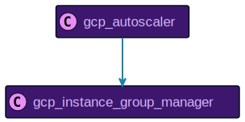

## `gcp_backend_service`

**Relationships in the graph that shows predecessors and successors of `gcp_backend_service`:**

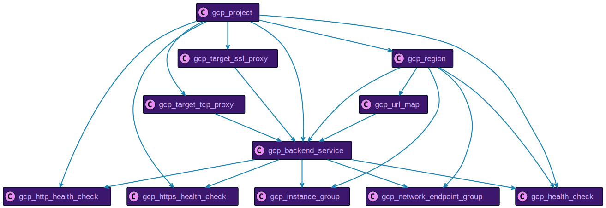

## `gcp_bucket`

**Relationships in the graph that shows predecessors and successors of `gcp_bucket`:**

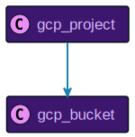

## `gcp_database`

**Relationships in the graph that shows predecessors and successors of `gcp_database`:**

## `gcp_disk`

**Relationships in the graph that shows predecessors and successors of `gcp_disk`:**

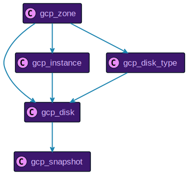

## `gcp_disk_type`

**Relationships in the graph that shows predecessors and successors of `gcp_disk_type`:**

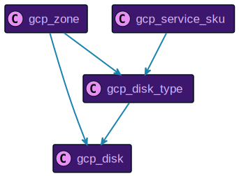

## `gcp_forwarding_rule`

**Relationships in the graph that shows predecessors and successors of `gcp_forwarding_rule`:**

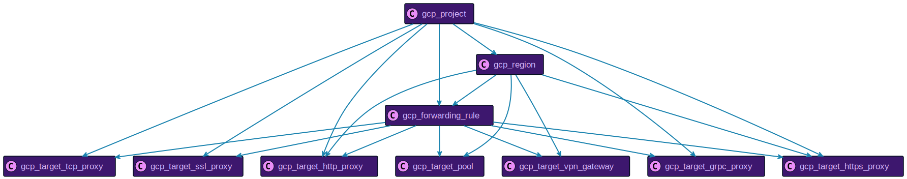

## `gcp_gke_cluster`

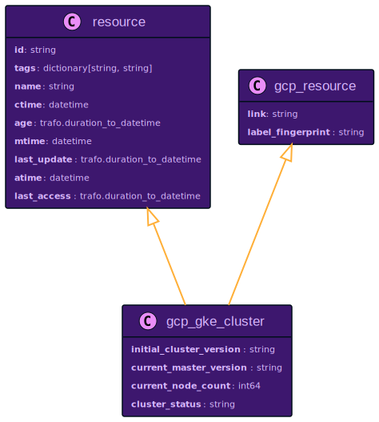

**Relationships in the graph that shows predecessors and successors of `gcp_gke_cluster`:**

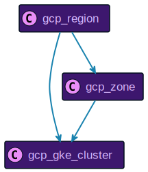

## `gcp_global_forwarding_rule`

**Relationships in the graph that shows predecessors and successors of `gcp_global_forwarding_rule`:**

## `gcp_global_network_endpoint_group`

**Relationships in the graph that shows predecessors and successors of `gcp_global_network_endpoint_group`:**

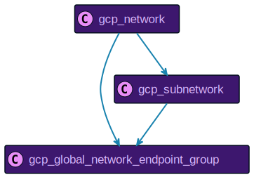

## `gcp_health_check`

**Relationships in the graph that shows predecessors and successors of `gcp_health_check`:**

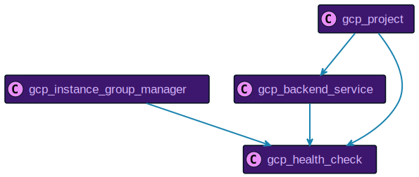

## `gcp_http_health_check`

**Relationships in the graph that shows predecessors and successors of `gcp_http_health_check`:**

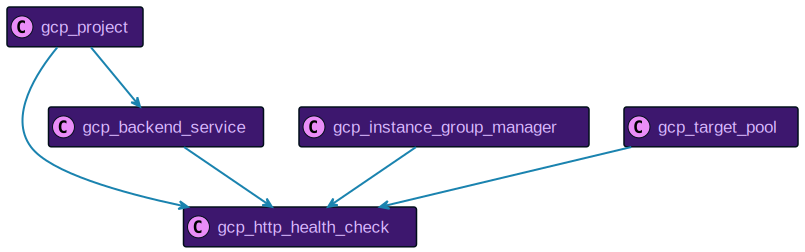

## `gcp_https_health_check`

**Relationships in the graph that shows predecessors and successors of `gcp_https_health_check`:**

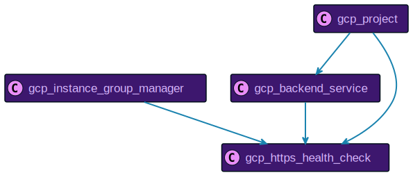

## `gcp_instance`

**Relationships in the graph that shows predecessors and successors of `gcp_instance`:**

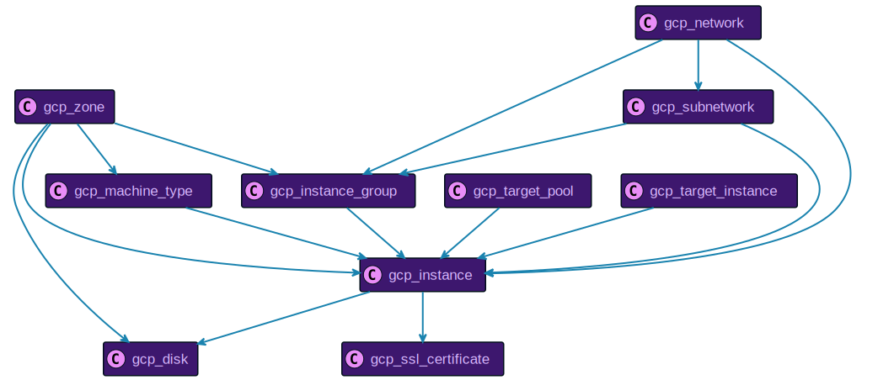

## `gcp_instance_group`

**Relationships in the graph that shows predecessors and successors of `gcp_instance_group`:**

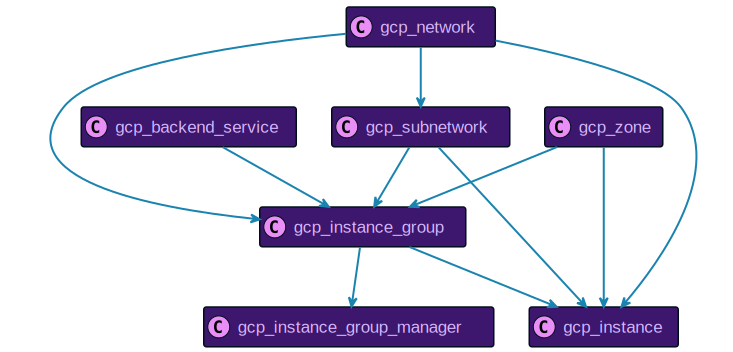

## `gcp_instance_group_manager`

**Relationships in the graph that shows predecessors and successors of `gcp_instance_group_manager`:**

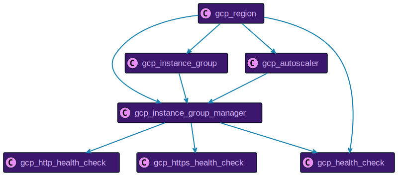

## `gcp_instance_template`

**Relationships in the graph that shows predecessors and successors of `gcp_instance_template`:**

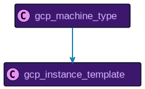

## `gcp_machine_type`

**Relationships in the graph that shows predecessors and successors of `gcp_machine_type`:**

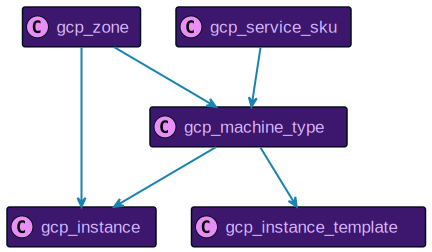

## `gcp_network`

**Relationships in the graph that shows predecessors and successors of `gcp_network`:**

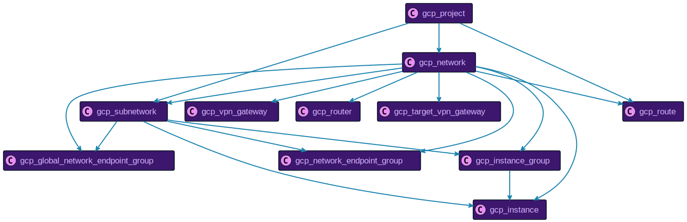

## `gcp_network_endpoint_group`

**Relationships in the graph that shows predecessors and successors of `gcp_network_endpoint_group`:**

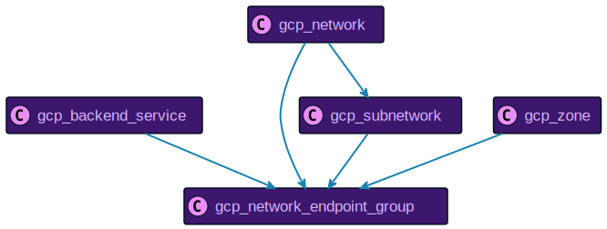

## `gcp_project`

**Relationships in the graph that shows predecessors and successors of `gcp_project`:**

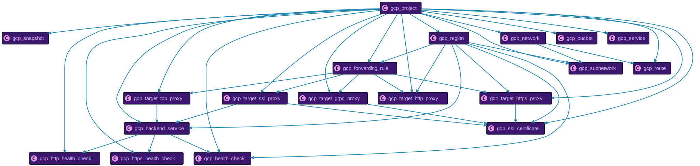

## `gcp_quota`

**Relationships in the graph that shows predecessors and successors of `gcp_quota`:**

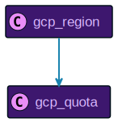

## `gcp_region`

**Relationships in the graph that shows predecessors and successors of `gcp_region`:**

## `gcp_resource`

**Relationships in the graph that shows predecessors and successors of `gcp_resource`:**

## `gcp_route`

**Relationships in the graph that shows predecessors and successors of `gcp_route`:**

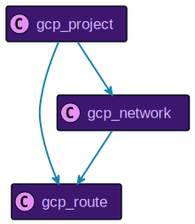

## `gcp_router`

**Relationships in the graph that shows predecessors and successors of `gcp_router`:**

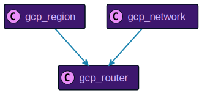

## `gcp_security_policy`

**Relationships in the graph that shows predecessors and successors of `gcp_security_policy`:**

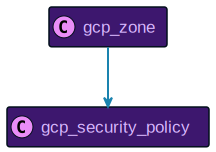

## `gcp_service`

**Relationships in the graph that shows predecessors and successors of `gcp_service`:**

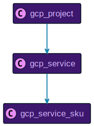

## `gcp_service_sku`

**Relationships in the graph that shows predecessors and successors of `gcp_service_sku`:**

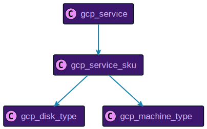

## `gcp_snapshot`

**Relationships in the graph that shows predecessors and successors of `gcp_snapshot`:**

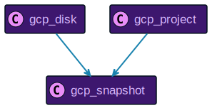

## `gcp_ssl_certificate`

**Relationships in the graph that shows predecessors and successors of `gcp_ssl_certificate`:**

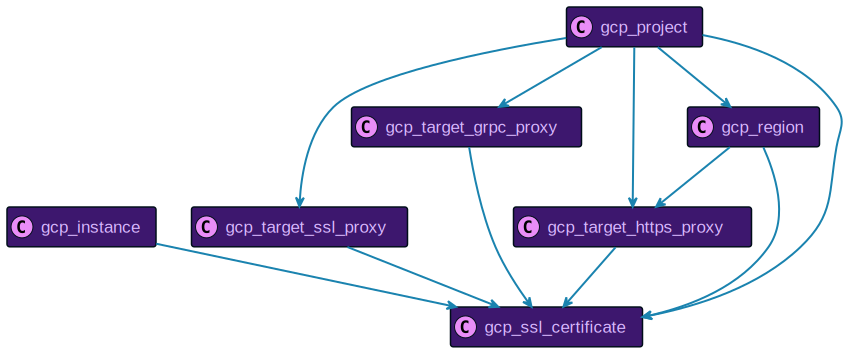

## `gcp_subnetwork`

**Relationships in the graph that shows predecessors and successors of `gcp_subnetwork`:**

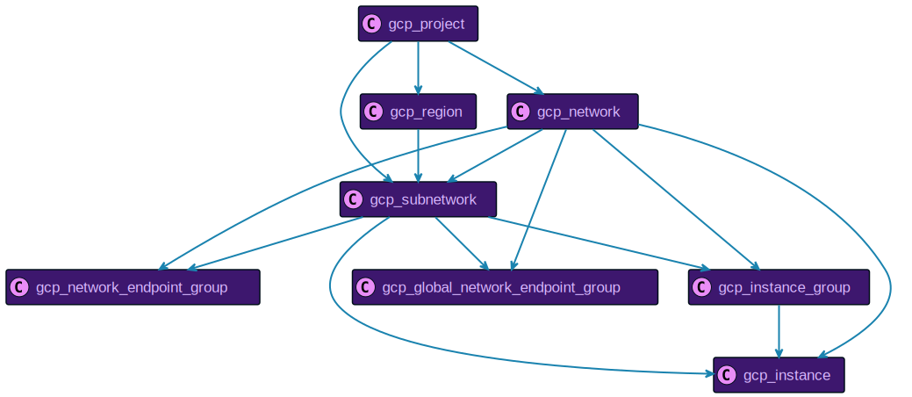

## `gcp_target_grpc_proxy`

**Relationships in the graph that shows predecessors and successors of `gcp_target_grpc_proxy`:**

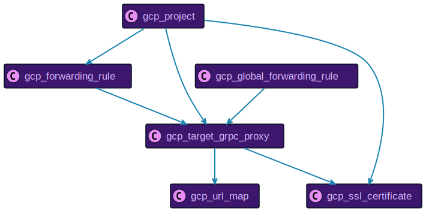

## `gcp_target_http_proxy`

**Relationships in the graph that shows predecessors and successors of `gcp_target_http_proxy`:**

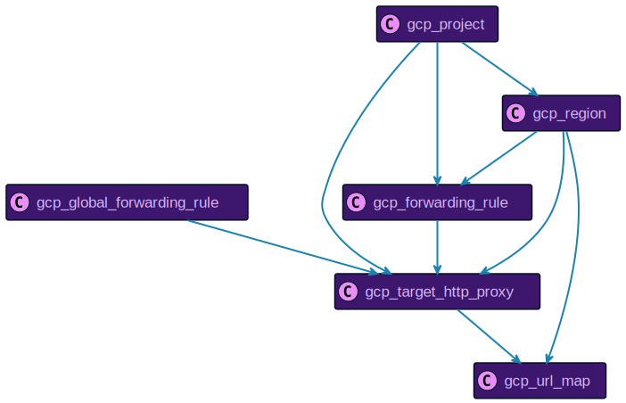

## `gcp_target_https_proxy`

**Relationships in the graph that shows predecessors and successors of `gcp_target_https_proxy`:**

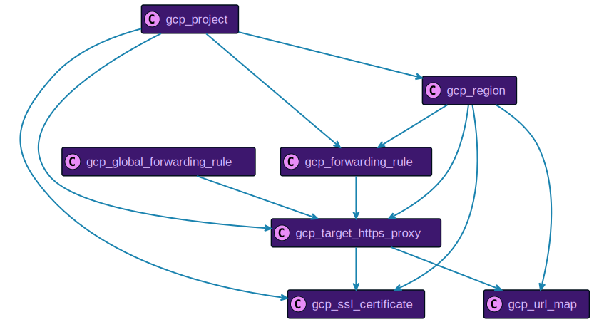

## `gcp_target_instance`

**Relationships in the graph that shows predecessors and successors of `gcp_target_instance`:**

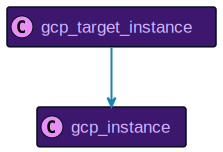

## `gcp_target_pool`

**Relationships in the graph that shows predecessors and successors of `gcp_target_pool`:**

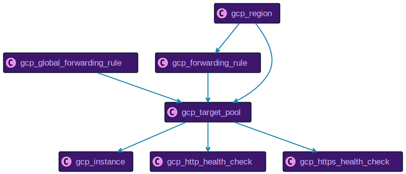

## `gcp_target_ssl_proxy`

**Relationships in the graph that shows predecessors and successors of `gcp_target_ssl_proxy`:**

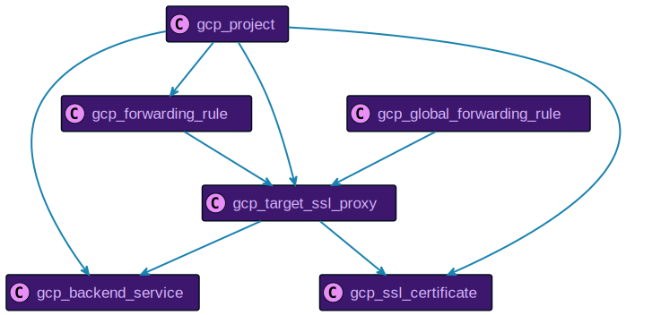

## `gcp_target_tcp_proxy`

**Relationships in the graph that shows predecessors and successors of `gcp_target_tcp_proxy`:**

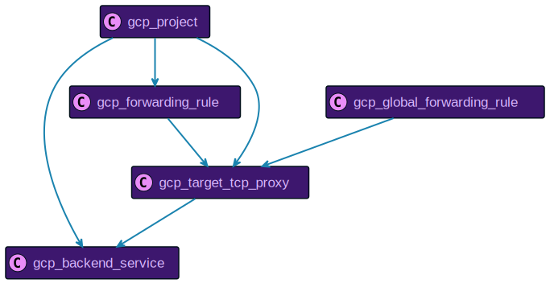

## `gcp_target_vpn_gateway`

**Relationships in the graph that shows predecessors and successors of `gcp_target_vpn_gateway`:**

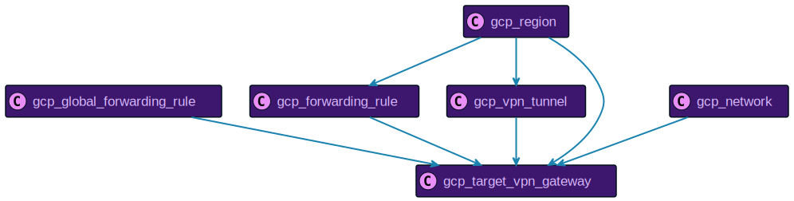

## `gcp_url_map`

**Relationships in the graph that shows predecessors and successors of `gcp_url_map`:**

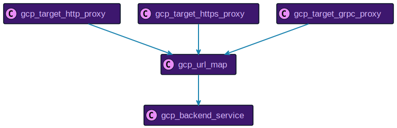

## `gcp_vpn_gateway`

**Relationships in the graph that shows predecessors and successors of `gcp_vpn_gateway`:**

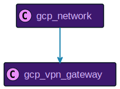

## `gcp_vpn_tunnel`

**Relationships in the graph that shows predecessors and successors of `gcp_vpn_tunnel`:**

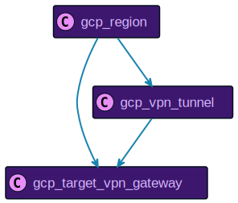

## `gcp_zone`

**Relationships in the graph that shows predecessors and successors of `gcp_zone`:**

