# Google Cloud Platform Resources

## `gcp_autoscaler`

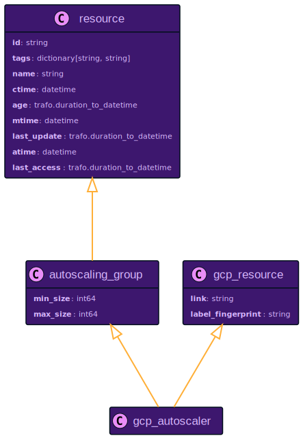

## `gcp_backend_service`

## `gcp_bucket`

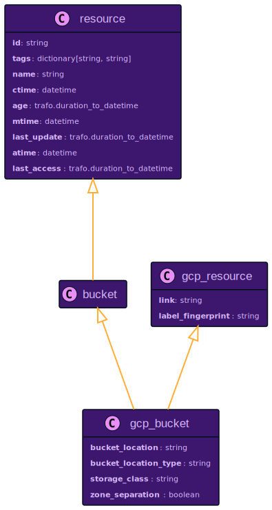

## `gcp_database`

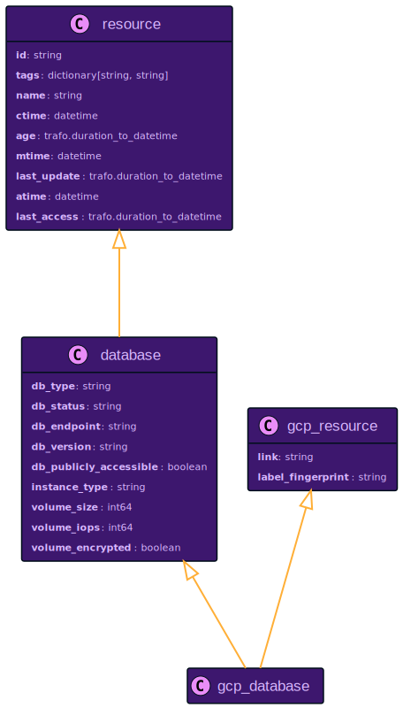

## `gcp_disk`

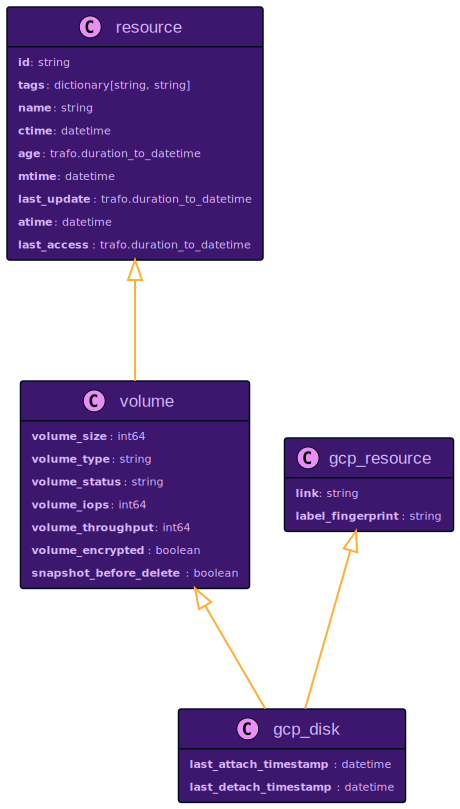

## `gcp_disk_type`

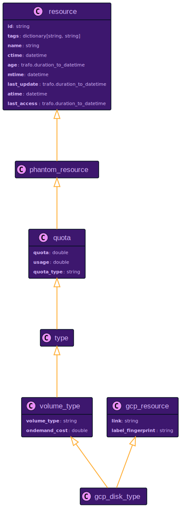

## `gcp_forwarding_rule`

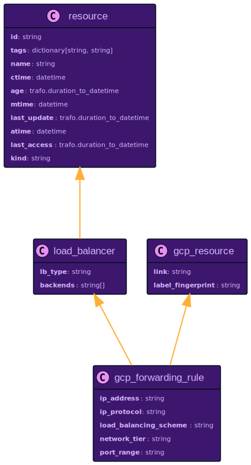

## `gcp_global_forwarding_rule`

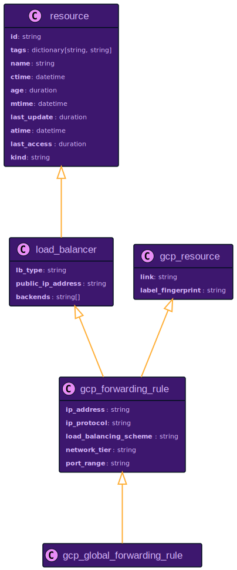

## `gcp_global_network_endpoint_group`

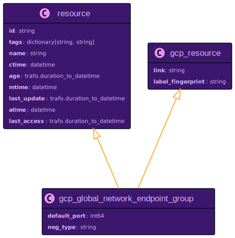

## `gcp_health_check`

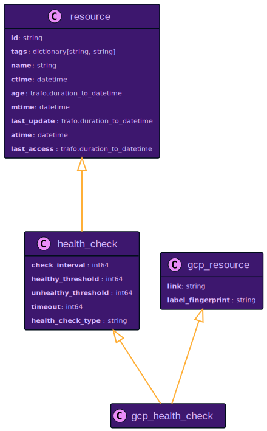

## `gcp_http_health_check`

## `gcp_https_health_check`

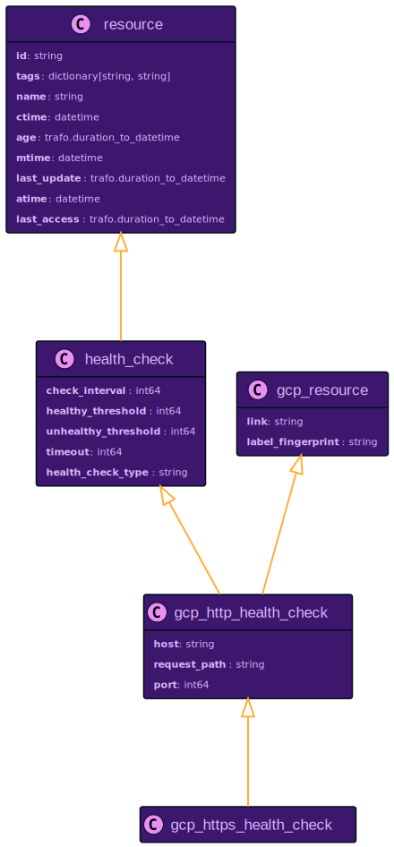

## `gcp_instance`

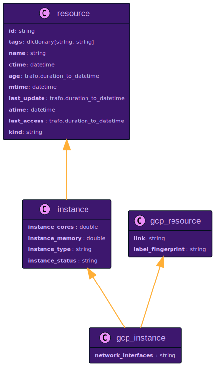

## `gcp_instance_group`

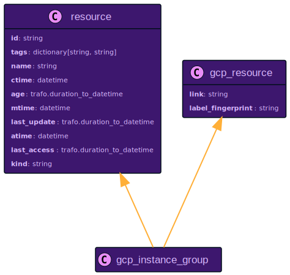

## `gcp_instance_group_manager`

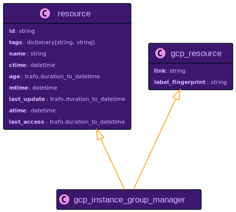

## `gcp_instance_template`

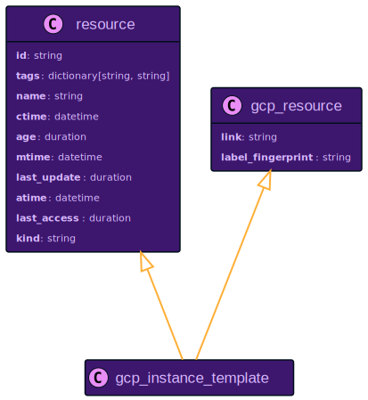

## `gcp_machine_type`

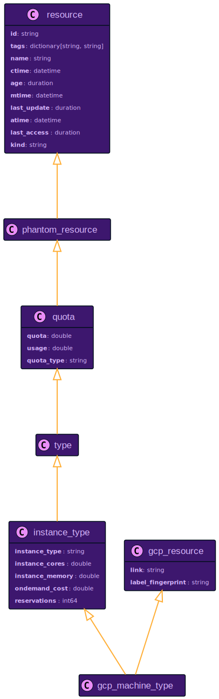

## `gcp_network`

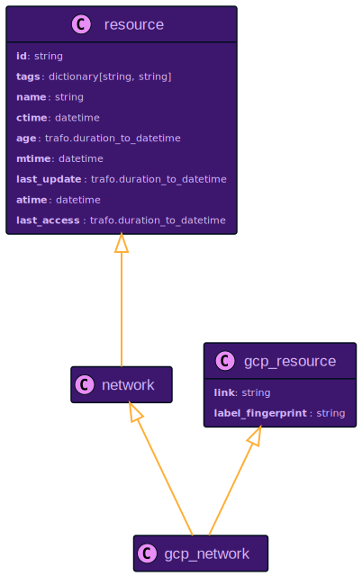

## `gcp_network_endpoint_group`

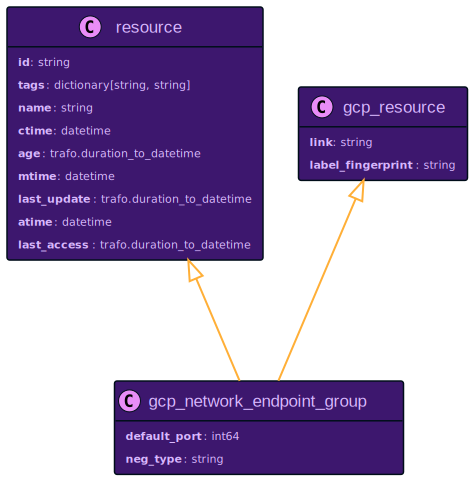

## `gcp_project`

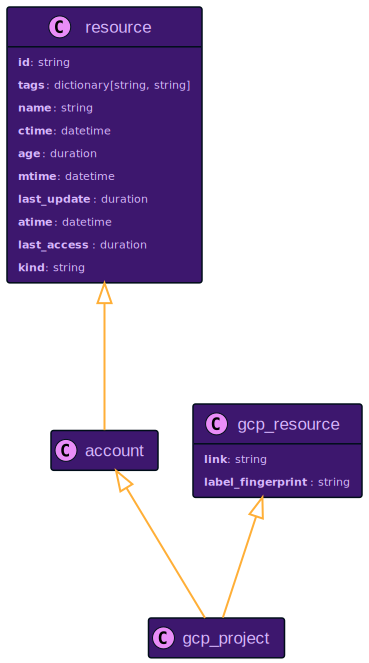

## `gcp_quota`

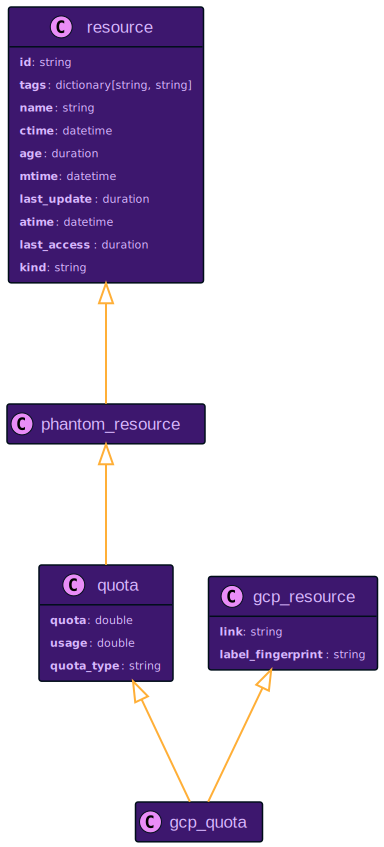

## `gcp_region`

## `gcp_resource`

## `gcp_route`

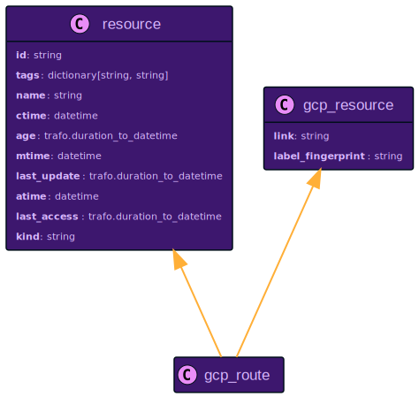

## `gcp_router`

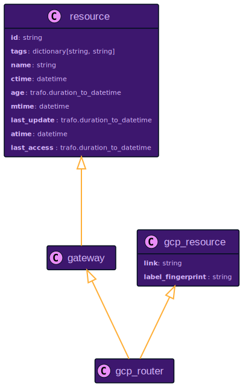

## `gcp_security_policy`

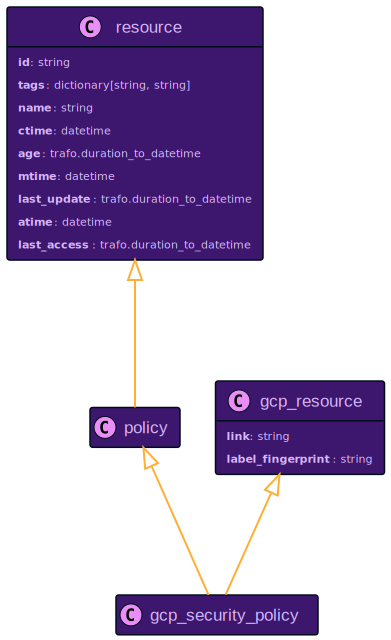

## `gcp_service`

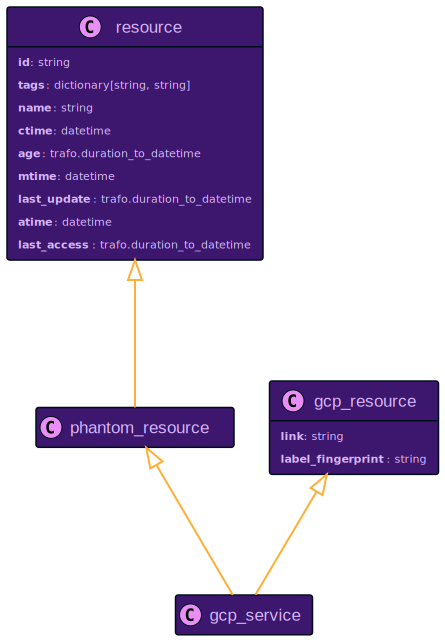

## `gcp_service_sku`

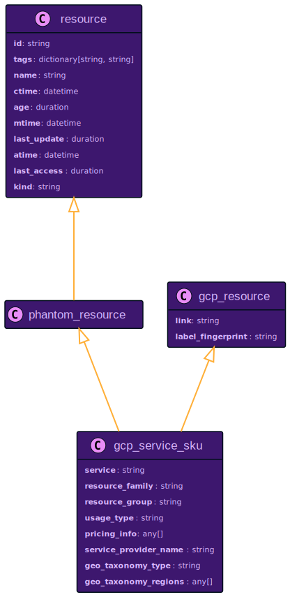

## `gcp_snapshot`

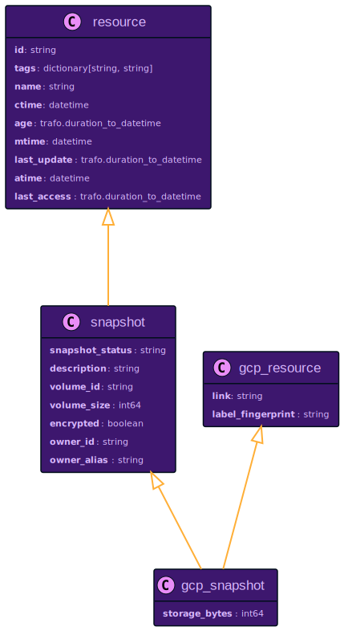

## `gcp_ssl_certificate`

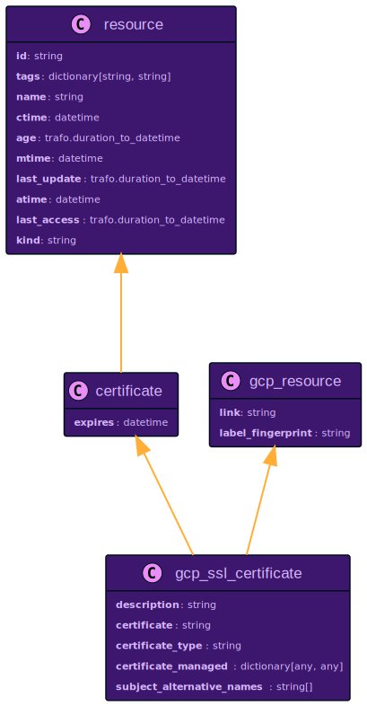

## `gcp_subnetwork`

## `gcp_target_grpc_proxy`

## `gcp_target_http_proxy`

## `gcp_target_https_proxy`

## `gcp_target_instance`

## `gcp_target_pool`

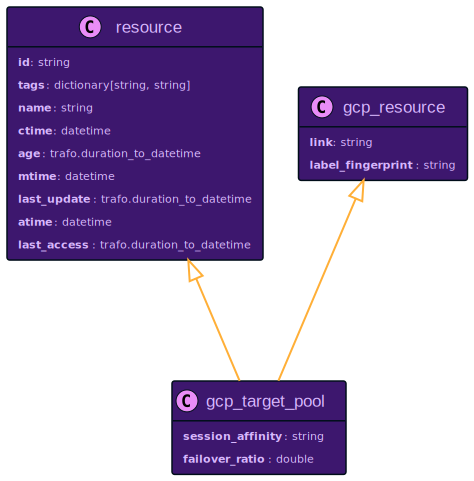

## `gcp_target_ssl_proxy`

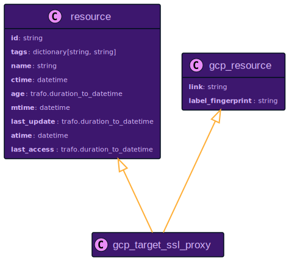

## `gcp_target_tcp_proxy`

## `gcp_target_vpn_gateway`

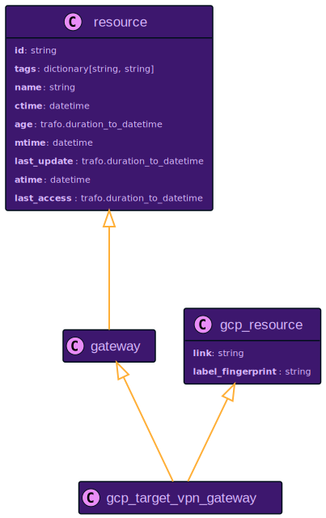

## `gcp_url_map`

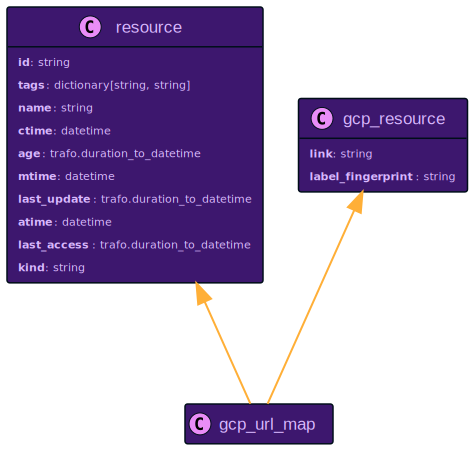

## `gcp_vpn_gateway`

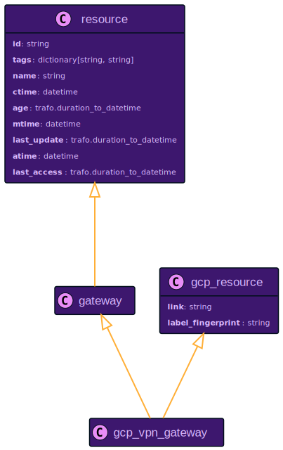

## `gcp_vpn_tunnel`

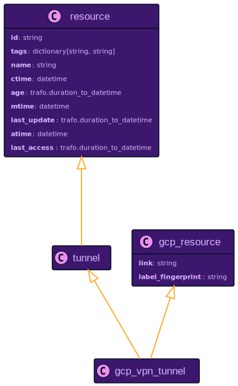

## `gcp_zone`

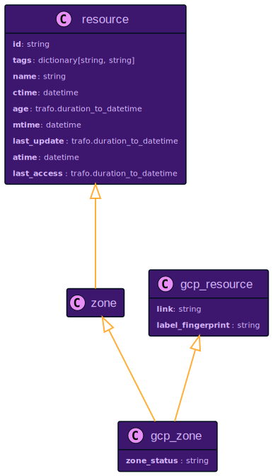
