# Google Cloud Platform Resource Data Models

```mdx-code-block
import ZoomPanPinch from '@site/src/components/ZoomPanPinch';
```

:::info

Please refer to [Configure Google Cloud Platform Access](../../../getting-started/configure-cloud-provider-access/gcp.md) for details on how to set up Resoto to collect [Google Cloud Platform (GCP)](https://cloud.google.com) resources.

:::

## `gcp_autoscaler`

<ZoomPanPinch>

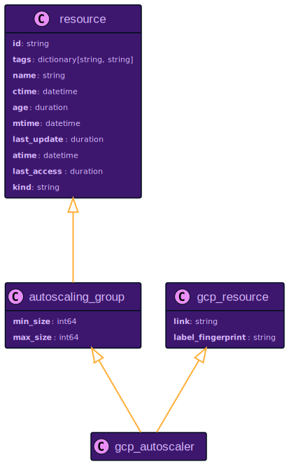

</ZoomPanPinch>

<details>
<summary>Relationship to Other Resources</summary>
<div>
<ZoomPanPinch>

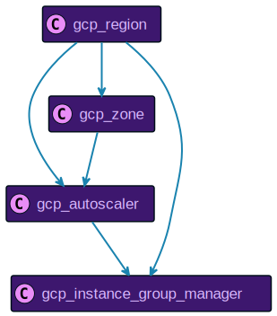

</ZoomPanPinch>
</div>
</details>

## `gcp_backend_service`

<ZoomPanPinch>


</ZoomPanPinch>

<details>
<summary>Relationship to Other Resources</summary>
<div>
<ZoomPanPinch>

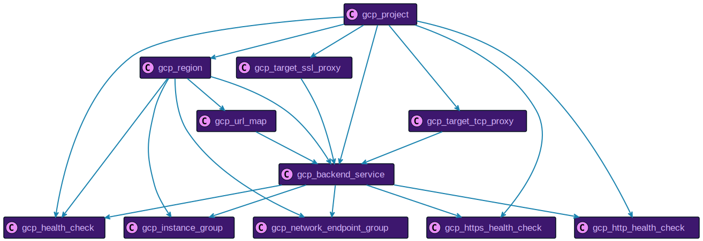

</ZoomPanPinch>
</div>
</details>

## `gcp_bucket`

<ZoomPanPinch>

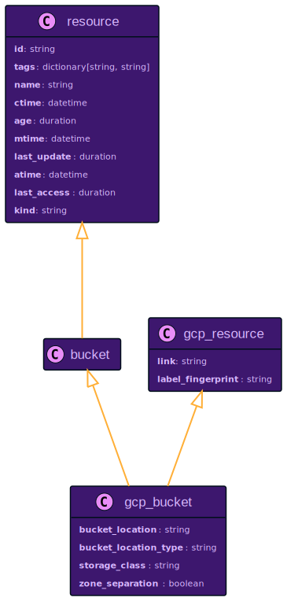

</ZoomPanPinch>

<details>
<summary>Relationship to Other Resources</summary>
<div>
<ZoomPanPinch>

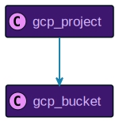

</ZoomPanPinch>
</div>
</details>

## `gcp_database`

<ZoomPanPinch>

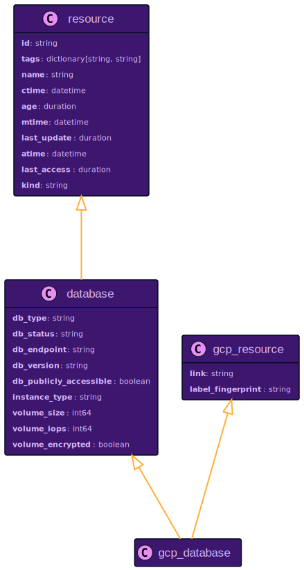

</ZoomPanPinch>

<details>
<summary>Relationship to Other Resources</summary>
<div>
<ZoomPanPinch>

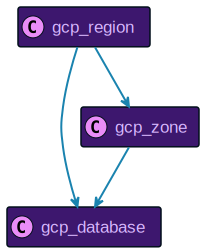

</ZoomPanPinch>
</div>
</details>

## `gcp_disk`

<ZoomPanPinch>

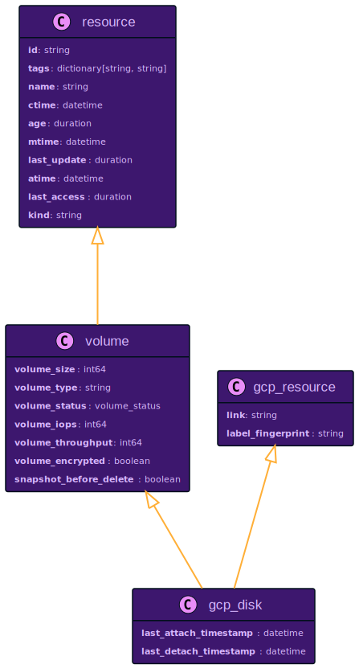

</ZoomPanPinch>

<details>
<summary>Relationship to Other Resources</summary>
<div>
<ZoomPanPinch>

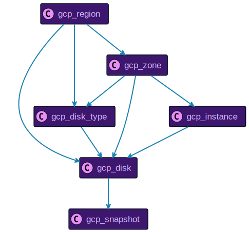

</ZoomPanPinch>
</div>
</details>

## `gcp_disk_type`

<ZoomPanPinch>

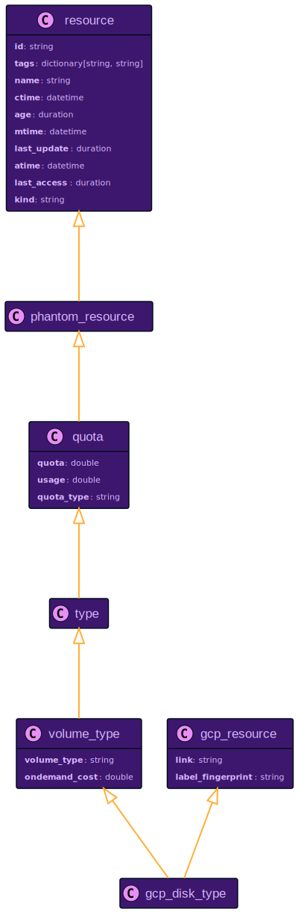

</ZoomPanPinch>

<details>
<summary>Relationship to Other Resources</summary>
<div>
<ZoomPanPinch>

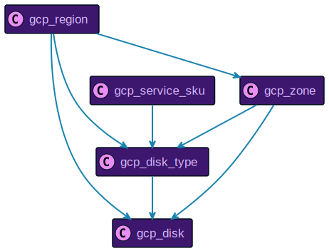

</ZoomPanPinch>
</div>
</details>

## `gcp_forwarding_rule`

<ZoomPanPinch>


</ZoomPanPinch>

<details>
<summary>Relationship to Other Resources</summary>
<div>
<ZoomPanPinch>


</ZoomPanPinch>
</div>
</details>

## `gcp_gke_cluster`

<ZoomPanPinch>

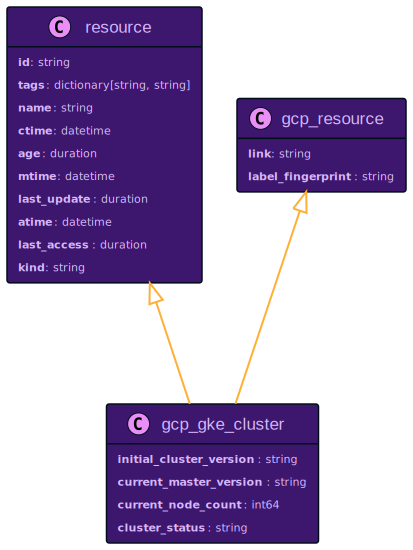

</ZoomPanPinch>

<details>
<summary>Relationship to Other Resources</summary>
<div>
<ZoomPanPinch>

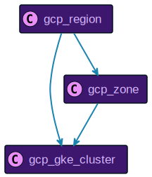

</ZoomPanPinch>
</div>
</details>

## `gcp_global_forwarding_rule`

<ZoomPanPinch>


</ZoomPanPinch>

<details>
<summary>Relationship to Other Resources</summary>
<div>
<ZoomPanPinch>


</ZoomPanPinch>
</div>
</details>

## `gcp_global_network_endpoint_group`

<ZoomPanPinch>

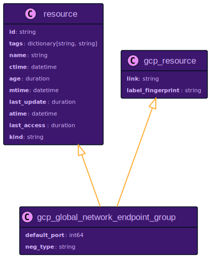

</ZoomPanPinch>

<details>
<summary>Relationship to Other Resources</summary>
<div>
<ZoomPanPinch>

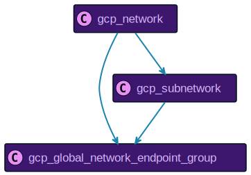

</ZoomPanPinch>
</div>
</details>

## `gcp_health_check`

<ZoomPanPinch>

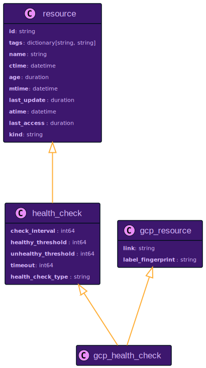

</ZoomPanPinch>

<details>
<summary>Relationship to Other Resources</summary>
<div>
<ZoomPanPinch>

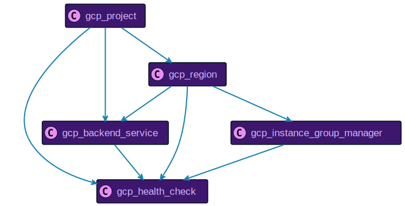

</ZoomPanPinch>
</div>
</details>

## `gcp_http_health_check`

<ZoomPanPinch>

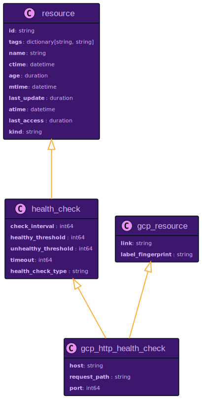

</ZoomPanPinch>

<details>
<summary>Relationship to Other Resources</summary>
<div>
<ZoomPanPinch>

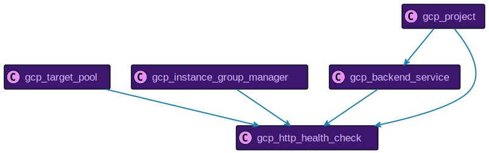

</ZoomPanPinch>
</div>
</details>

## `gcp_https_health_check`

<ZoomPanPinch>

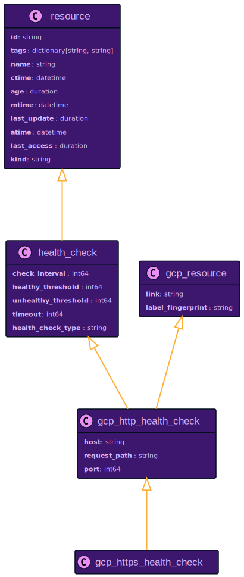

</ZoomPanPinch>

<details>
<summary>Relationship to Other Resources</summary>
<div>
<ZoomPanPinch>


</ZoomPanPinch>
</div>
</details>

## `gcp_instance`

<ZoomPanPinch>

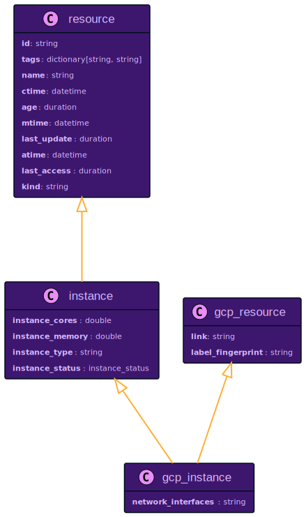

</ZoomPanPinch>

<details>
<summary>Relationship to Other Resources</summary>
<div>
<ZoomPanPinch>

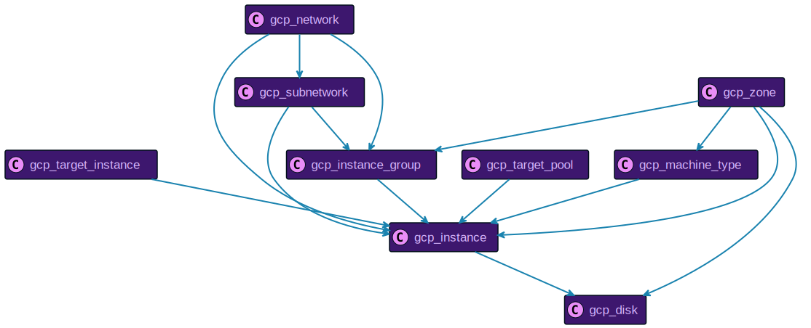

</ZoomPanPinch>
</div>
</details>

## `gcp_instance_group`

<ZoomPanPinch>

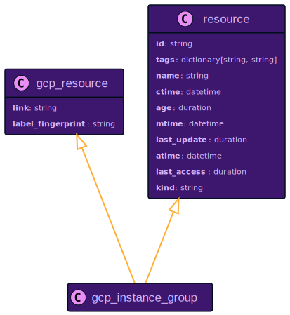

</ZoomPanPinch>

<details>
<summary>Relationship to Other Resources</summary>
<div>
<ZoomPanPinch>

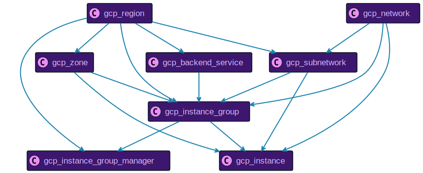

</ZoomPanPinch>
</div>
</details>

## `gcp_instance_group_manager`

<ZoomPanPinch>

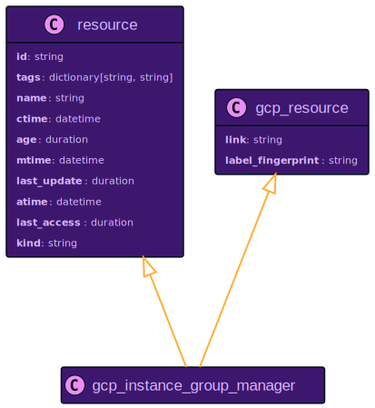

</ZoomPanPinch>

<details>
<summary>Relationship to Other Resources</summary>
<div>
<ZoomPanPinch>

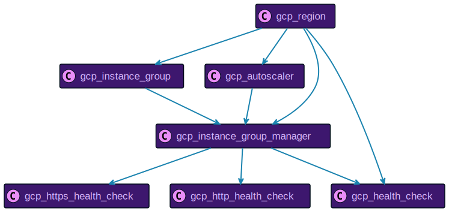

</ZoomPanPinch>
</div>
</details>

## `gcp_instance_template`

<ZoomPanPinch>


</ZoomPanPinch>

<details>
<summary>Relationship to Other Resources</summary>
<div>
<ZoomPanPinch>


</ZoomPanPinch>
</div>
</details>

## `gcp_machine_type`

<ZoomPanPinch>

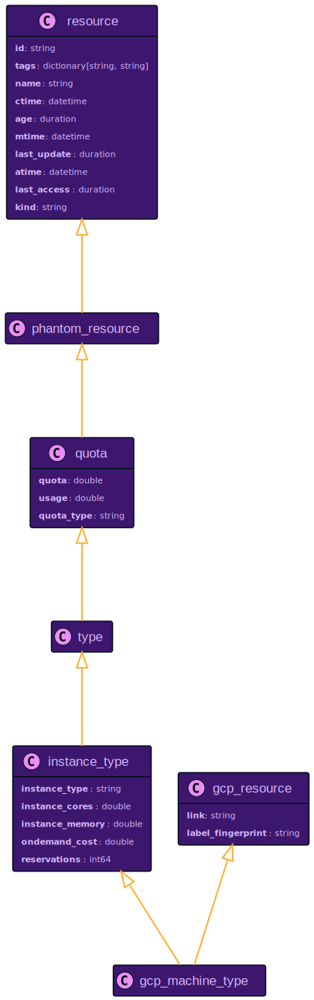

</ZoomPanPinch>

<details>
<summary>Relationship to Other Resources</summary>
<div>
<ZoomPanPinch>

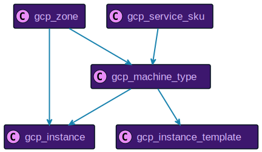

</ZoomPanPinch>
</div>
</details>

## `gcp_network`

<ZoomPanPinch>

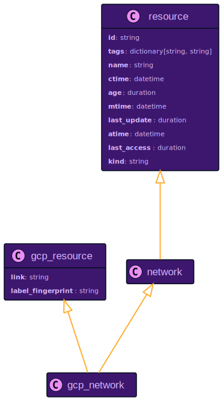

</ZoomPanPinch>

<details>
<summary>Relationship to Other Resources</summary>
<div>
<ZoomPanPinch>

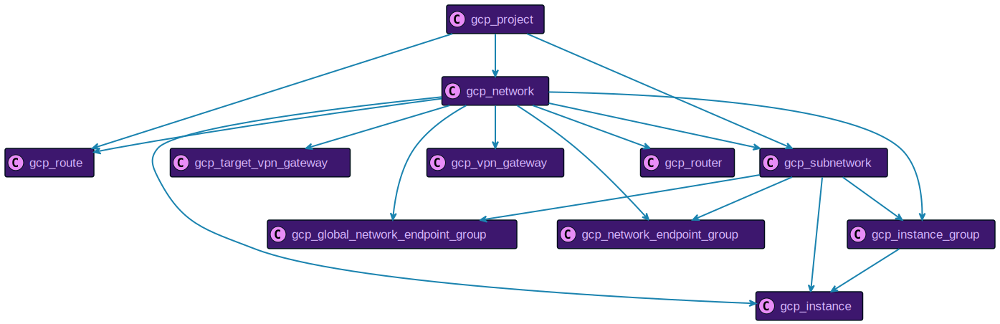

</ZoomPanPinch>
</div>
</details>

## `gcp_network_endpoint_group`

<ZoomPanPinch>

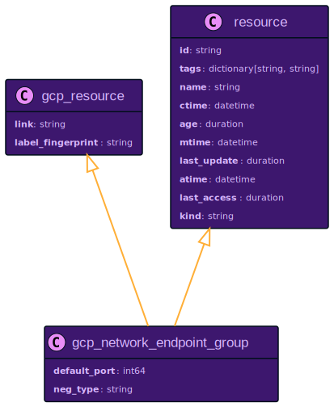

</ZoomPanPinch>

<details>
<summary>Relationship to Other Resources</summary>
<div>
<ZoomPanPinch>

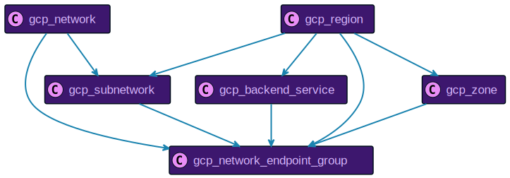

</ZoomPanPinch>
</div>
</details>

## `gcp_project`

<ZoomPanPinch>

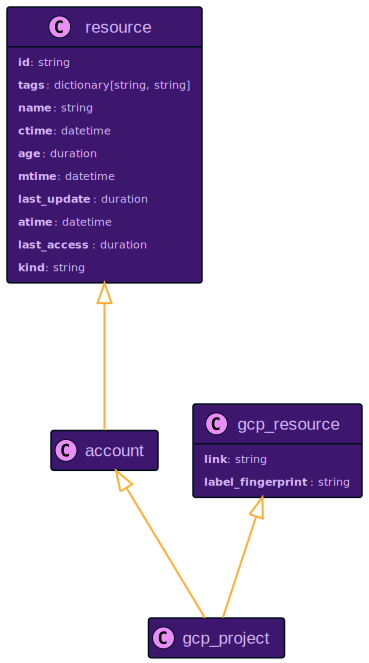

</ZoomPanPinch>

<details>
<summary>Relationship to Other Resources</summary>
<div>
<ZoomPanPinch>

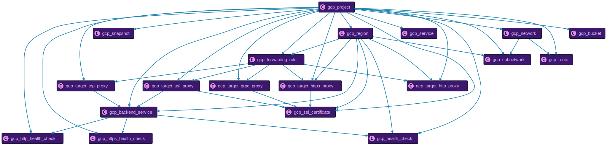

</ZoomPanPinch>
</div>
</details>

## `gcp_quota`

<ZoomPanPinch>

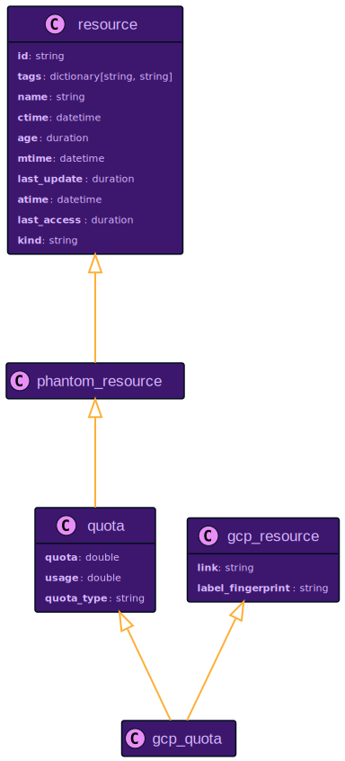

</ZoomPanPinch>

<details>
<summary>Relationship to Other Resources</summary>
<div>
<ZoomPanPinch>

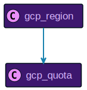

</ZoomPanPinch>
</div>
</details>

## `gcp_region`

<ZoomPanPinch>

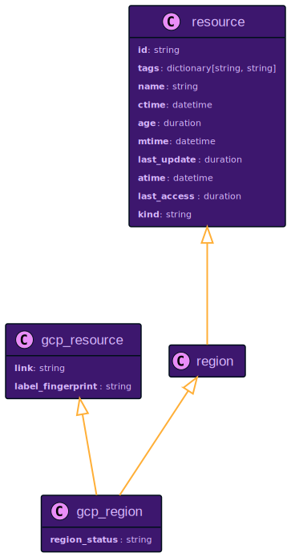

</ZoomPanPinch>

<details>
<summary>Relationship to Other Resources</summary>
<div>
<ZoomPanPinch>

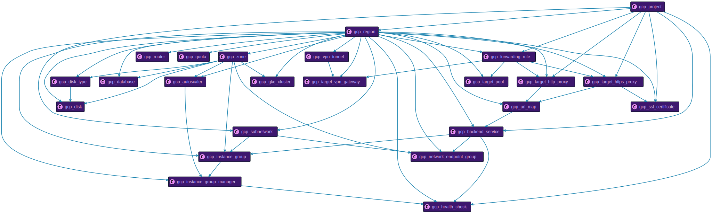

</ZoomPanPinch>
</div>
</details>

## `gcp_route`

<ZoomPanPinch>

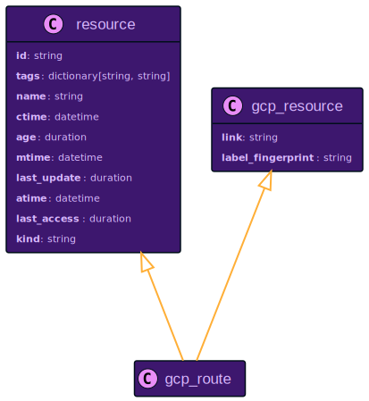

</ZoomPanPinch>

<details>
<summary>Relationship to Other Resources</summary>
<div>
<ZoomPanPinch>

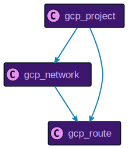

</ZoomPanPinch>
</div>
</details>

## `gcp_router`

<ZoomPanPinch>

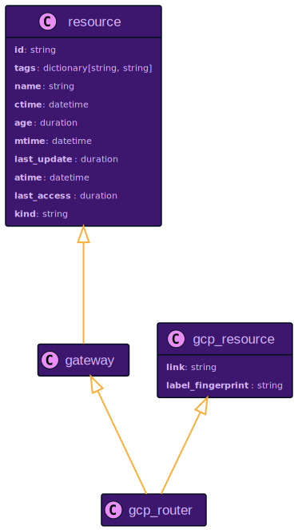

</ZoomPanPinch>

<details>
<summary>Relationship to Other Resources</summary>
<div>
<ZoomPanPinch>

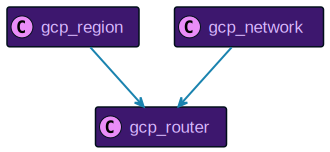

</ZoomPanPinch>
</div>
</details>

## `gcp_security_policy`

<ZoomPanPinch>

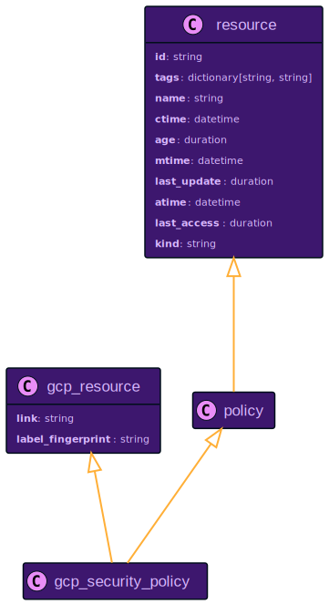

</ZoomPanPinch>

<details>
<summary>Relationship to Other Resources</summary>
<div>
<ZoomPanPinch>

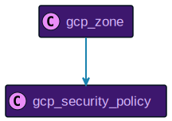

</ZoomPanPinch>
</div>
</details>

## `gcp_service`

<ZoomPanPinch>

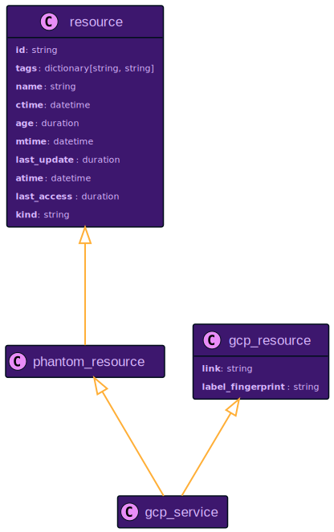

</ZoomPanPinch>

<details>
<summary>Relationship to Other Resources</summary>
<div>
<ZoomPanPinch>

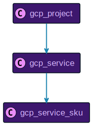

</ZoomPanPinch>
</div>
</details>

## `gcp_service_sku`

<ZoomPanPinch>

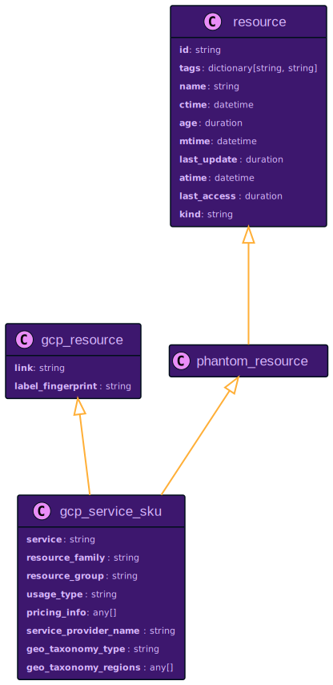

</ZoomPanPinch>

<details>
<summary>Relationship to Other Resources</summary>
<div>
<ZoomPanPinch>

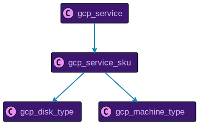

</ZoomPanPinch>
</div>
</details>

## `gcp_snapshot`

<ZoomPanPinch>

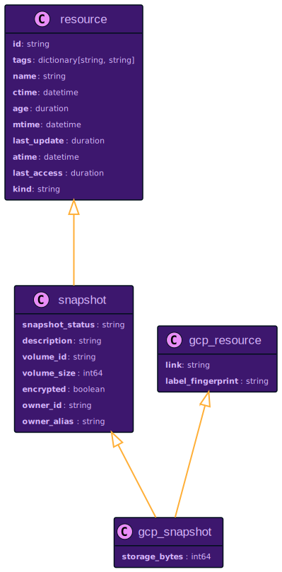

</ZoomPanPinch>

<details>
<summary>Relationship to Other Resources</summary>
<div>
<ZoomPanPinch>

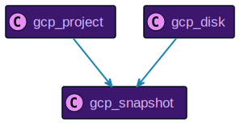

</ZoomPanPinch>
</div>
</details>

## `gcp_ssl_certificate`

<ZoomPanPinch>

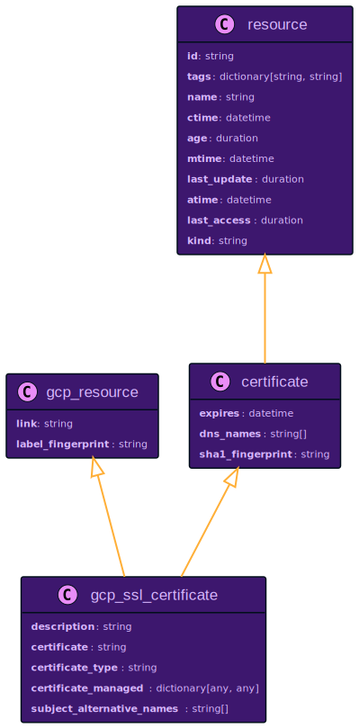

</ZoomPanPinch>

<details>
<summary>Relationship to Other Resources</summary>
<div>
<ZoomPanPinch>

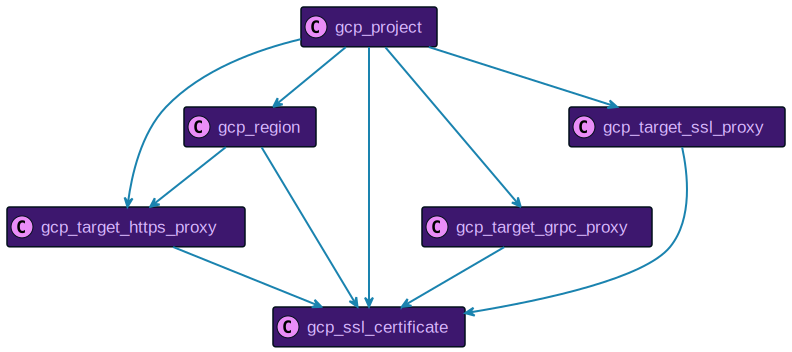

</ZoomPanPinch>
</div>
</details>

## `gcp_subnetwork`

<ZoomPanPinch>


</ZoomPanPinch>

<details>
<summary>Relationship to Other Resources</summary>
<div>
<ZoomPanPinch>

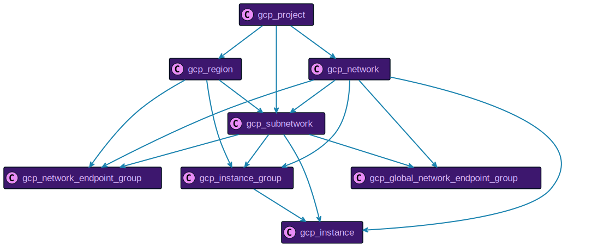

</ZoomPanPinch>
</div>
</details>

## `gcp_target_grpc_proxy`

<ZoomPanPinch>


</ZoomPanPinch>

<details>
<summary>Relationship to Other Resources</summary>
<div>
<ZoomPanPinch>

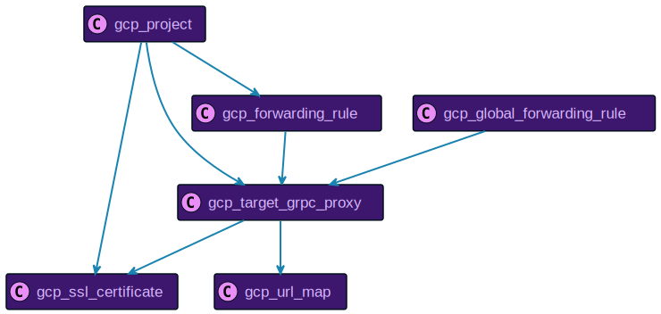

</ZoomPanPinch>
</div>
</details>

## `gcp_target_http_proxy`

<ZoomPanPinch>

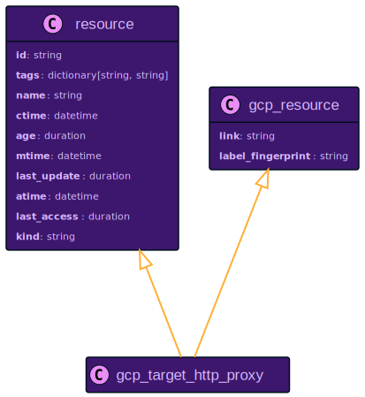

</ZoomPanPinch>

<details>
<summary>Relationship to Other Resources</summary>
<div>
<ZoomPanPinch>

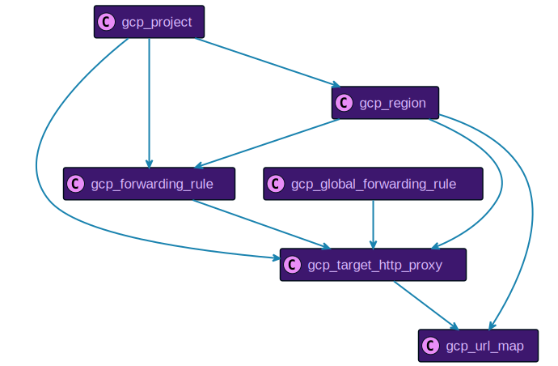

</ZoomPanPinch>
</div>
</details>

## `gcp_target_https_proxy`

<ZoomPanPinch>


</ZoomPanPinch>

<details>
<summary>Relationship to Other Resources</summary>
<div>
<ZoomPanPinch>

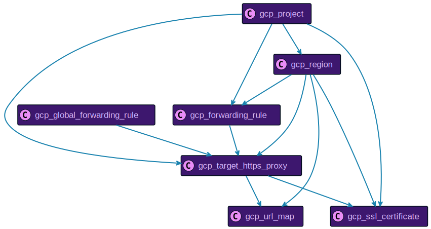

</ZoomPanPinch>
</div>
</details>

## `gcp_target_instance`

<ZoomPanPinch>


</ZoomPanPinch>

<details>
<summary>Relationship to Other Resources</summary>
<div>
<ZoomPanPinch>


</ZoomPanPinch>
</div>
</details>

## `gcp_target_pool`

<ZoomPanPinch>

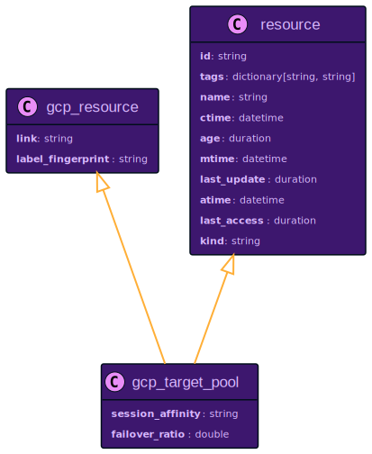

</ZoomPanPinch>

<details>
<summary>Relationship to Other Resources</summary>
<div>
<ZoomPanPinch>

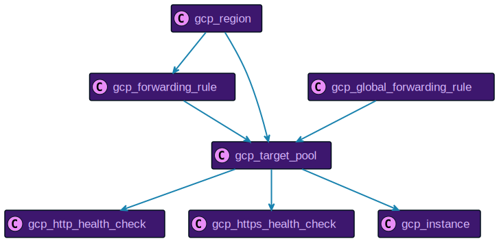

</ZoomPanPinch>
</div>
</details>

## `gcp_target_ssl_proxy`

<ZoomPanPinch>


</ZoomPanPinch>

<details>
<summary>Relationship to Other Resources</summary>
<div>
<ZoomPanPinch>

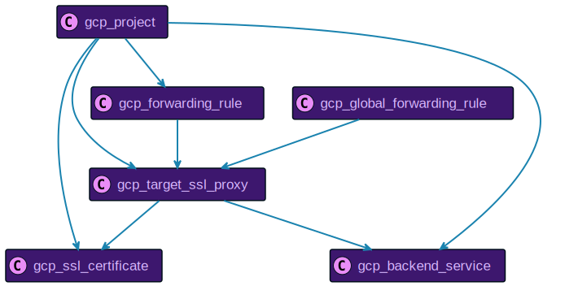

</ZoomPanPinch>
</div>
</details>

## `gcp_target_tcp_proxy`

<ZoomPanPinch>

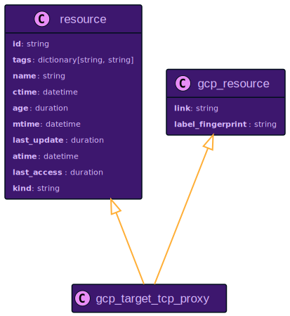

</ZoomPanPinch>

<details>
<summary>Relationship to Other Resources</summary>
<div>
<ZoomPanPinch>

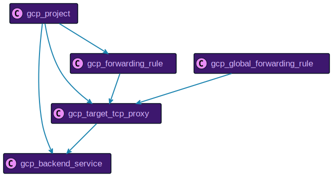

</ZoomPanPinch>
</div>
</details>

## `gcp_target_vpn_gateway`

<ZoomPanPinch>

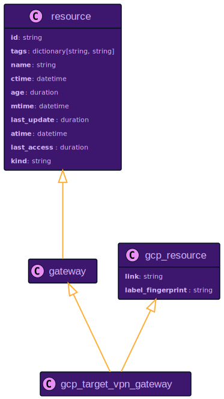

</ZoomPanPinch>

<details>
<summary>Relationship to Other Resources</summary>
<div>
<ZoomPanPinch>

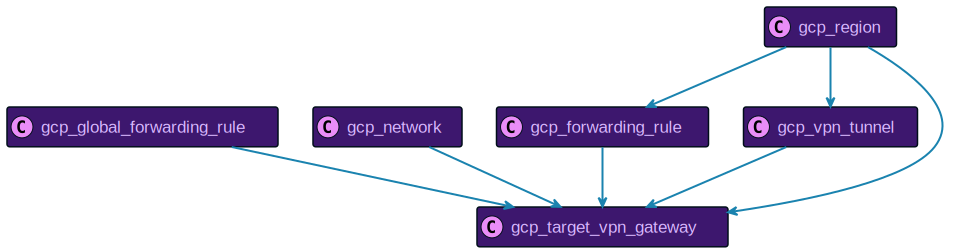

</ZoomPanPinch>
</div>
</details>

## `gcp_url_map`

<ZoomPanPinch>

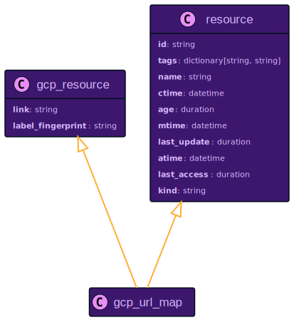

</ZoomPanPinch>

<details>
<summary>Relationship to Other Resources</summary>
<div>
<ZoomPanPinch>

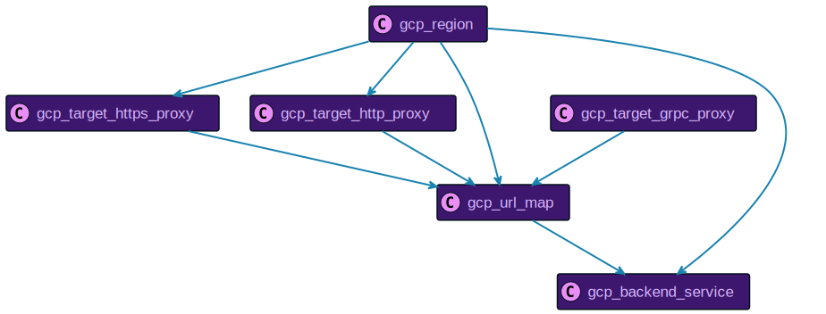

</ZoomPanPinch>
</div>
</details>

## `gcp_vpn_gateway`

<ZoomPanPinch>


</ZoomPanPinch>

<details>
<summary>Relationship to Other Resources</summary>
<div>
<ZoomPanPinch>

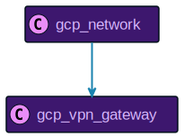

</ZoomPanPinch>
</div>
</details>

## `gcp_vpn_tunnel`

<ZoomPanPinch>

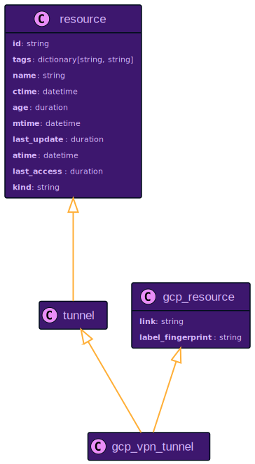

</ZoomPanPinch>

<details>
<summary>Relationship to Other Resources</summary>
<div>
<ZoomPanPinch>

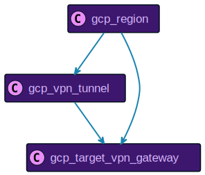

</ZoomPanPinch>
</div>
</details>

## `gcp_zone`

<ZoomPanPinch>

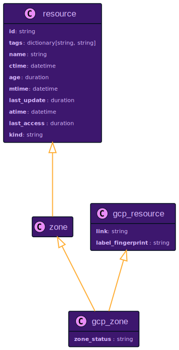

</ZoomPanPinch>

<details>
<summary>Relationship to Other Resources</summary>
<div>
<ZoomPanPinch>

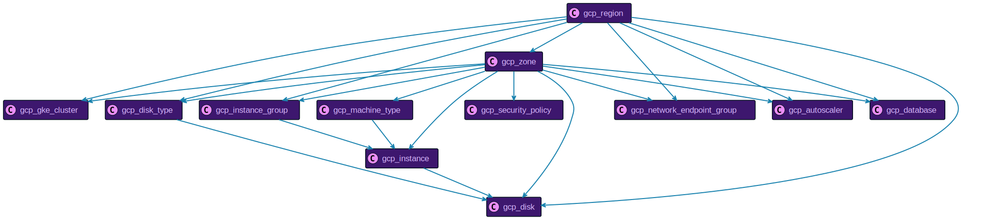

</ZoomPanPinch>
</div>
</details>
