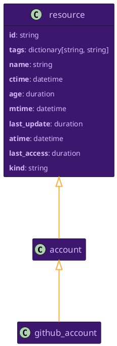
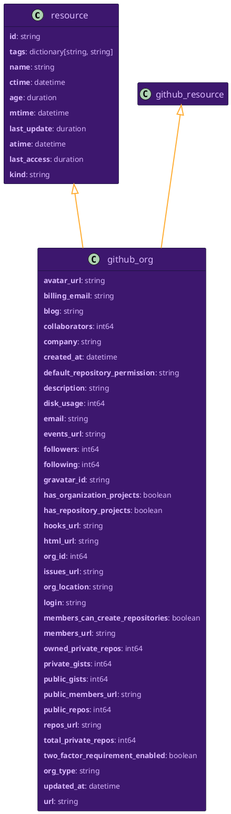
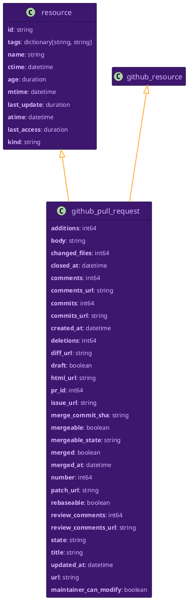
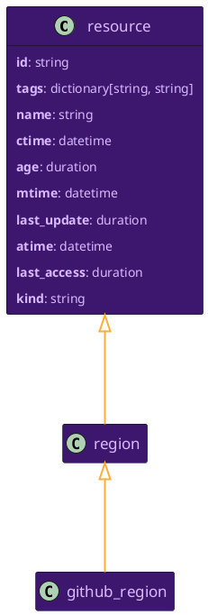

# GitHub Resource Data Models

```mdx-code-block
import ZoomPanPinch from '@site/src/components/ZoomPanPinch';
```

## `github_account`

<ZoomPanPinch>



</ZoomPanPinch>

<details>
<summary>Relationships to Other Resources</summary>
<div>
<ZoomPanPinch>


</ZoomPanPinch>
</div>
</details>

## `github_org`

<ZoomPanPinch>



</ZoomPanPinch>

<details>
<summary>Relationships to Other Resources</summary>
<div>
<ZoomPanPinch>


</ZoomPanPinch>
</div>
</details>

## `github_pull_request`

<ZoomPanPinch>



</ZoomPanPinch>

<details>
<summary>Relationships to Other Resources</summary>
<div>
<ZoomPanPinch>


</ZoomPanPinch>
</div>
</details>

## `github_region`

<ZoomPanPinch>



</ZoomPanPinch>

<details>
<summary>Relationships to Other Resources</summary>
<div>
<ZoomPanPinch>


</ZoomPanPinch>
</div>
</details>

## `github_repo`

```plantuml Diagram of github_repo data model
@startuml
hide empty members
skinparam ArrowColor #ffaf37
skinparam ArrowFontColor #ffaf37
skinparam ArrowFontName Helvetica
skinparam ArrowThickness 2
skinparam BackgroundColor transparent
skinparam ClassAttributeFontColor #d9b8ff
skinparam ClassBackgroundColor #3d176e
skinparam ClassBorderColor #000d19
skinparam ClassFontColor #d9b8ff
skinparam ClassFontName Helvetica
skinparam ClassFontSize 17
skinparam NoteBackgroundColor #d9b8ff
skinparam NoteBorderColor #000d19
skinparam NoteFontColor #3d176e
skinparam NoteFontName Helvetica
skinparam Padding 5
skinparam RoundCorner 5
skinparam Shadowing false
skinparam stereotypeCBackgroundColor #e98df7
skinparam stereotypeIBackgroundColor #e98df7

class github_repo_top_path [[#github_repo_top_path]] {
**title**: string
**path**: string
**count**: int64
**uniques**: int64
}
class resource [[#resource]] {
**id**: string
**tags**: dictionary[string, string]
**name**: string
**ctime**: datetime
**age**: duration
**mtime**: datetime
**last_update**: duration
**atime**: datetime
**last_access**: duration
**kind**: string
}
class github_resource [[#github_resource]] {

}
class github_repo_clones_traffic [[#github_repo_clones_traffic]] {
**count**: int64
**uniques**: int64
**clones**: github_repo_clones[]
}
class github_repo_clones [[#github_repo_clones]] {
**timestamp**: datetime
**count**: int64
**uniques**: int64
}
class github_repo_views_traffic [[#github_repo_views_traffic]] {
**count**: int64
**uniques**: int64
**views**: github_repo_view[]
}
class github_repo_view [[#github_repo_view]] {
**timestamp**: datetime
**count**: int64
**uniques**: int64
}
class github_repo [[#github_repo]] {
**allow_merge_commit**: boolean
**allow_rebase_merge**: boolean
**allow_squash_merge**: boolean
**archived**: boolean
**archive_url**: string
**assignees_url**: string
**blobs_url**: string
**branches_url**: string
**clone_url**: string
**clones_traffic**: github_repo_clones_traffic
**collaborators_url**: string
**comments_url**: string
**commits_url**: string
**compare_url**: string
**contents_url**: string
**contributors_count**: int64
**contributors_url**: string
**created_at**: datetime
**default_branch**: string
**delete_branch_on_merge**: boolean
**deployments_url**: string
**description**: string
**downloads_url**: string
**events_url**: string
**fork**: boolean
**forks**: int64
**forks_count**: int64
**forks_url**: string
**full_name**: string
**git_commits_url**: string
**git_refs_url**: string
**git_tags_url**: string
**git_url**: string
**has_downloads**: boolean
**has_issues**: boolean
**has_pages**: boolean
**has_projects**: boolean
**has_wiki**: boolean
**homepage**: string
**hooks_url**: string
**html_url**: string
**repo_id**: int64
**issue_comment_url**: string
**issue_events_url**: string
**issues_url**: string
**keys_url**: string
**labels_url**: string
**language**: string
**languages_url**: string
**master_branch**: string
**merges_url**: string
**milestones_url**: string
**mirror_url**: string
**name**: string
**network_count**: int64
**notifications_url**: string
**open_issues**: int64
**open_issues_count**: int64
**private**: boolean
**pulls_url**: string
**pushed_at**: datetime
**releases_url**: string
**size**: int64
**ssh_url**: string
**stargazers_count**: int64
**stargazers_url**: string
**statuses_url**: string
**subscribers_count**: int64
**subscribers_url**: string
**subscription_url**: string
**svn_url**: string
**tags_url**: string
**teams_url**: string
**top_paths**: github_repo_top_path[]
**top_referrers**: github_repo_top_referrer[]
**trees_url**: string
**updated_at**: datetime
**url**: string
**watchers**: int64
**watchers_count**: int64
**views_traffic**: github_repo_views_traffic
}
class github_repo_top_referrer [[#github_repo_top_referrer]] {
**referrer**: string
**count**: int64
**uniques**: int64
}
github_repo_clones_traffic --> github_repo_clones
github_repo_views_traffic --> github_repo_view
github_resource <|--- github_repo
resource <|--- github_repo
github_repo --> github_repo_clones_traffic
github_repo --> github_repo_top_path
github_repo --> github_repo_top_referrer
github_repo --> github_repo_views_traffic

@enduml
```

<ZoomPanPinch>



</ZoomPanPinch>

<details>
<summary>Relationships to Other Resources</summary>
<div>
<ZoomPanPinch>


</ZoomPanPinch>
</div>
</details>

## `github_user`

```plantuml Diagram of github_user data model
@startuml
hide empty members
skinparam ArrowColor #ffaf37
skinparam ArrowFontColor #ffaf37
skinparam ArrowFontName Helvetica
skinparam ArrowThickness 2
skinparam BackgroundColor transparent
skinparam ClassAttributeFontColor #d9b8ff
skinparam ClassBackgroundColor #3d176e
skinparam ClassBorderColor #000d19
skinparam ClassFontColor #d9b8ff
skinparam ClassFontName Helvetica
skinparam ClassFontSize 17
skinparam NoteBackgroundColor #d9b8ff
skinparam NoteBorderColor #000d19
skinparam NoteFontColor #3d176e
skinparam NoteFontName Helvetica
skinparam Padding 5
skinparam RoundCorner 5
skinparam Shadowing false
skinparam stereotypeCBackgroundColor #e98df7
skinparam stereotypeIBackgroundColor #e98df7

class resource [[#resource]] {
**id**: string
**tags**: dictionary[string, string]
**name**: string
**ctime**: datetime
**age**: duration
**mtime**: datetime
**last_update**: duration
**atime**: datetime
**last_access**: duration
**kind**: string
}
class user [[#user]] {

}
class github_resource [[#github_resource]] {

}
class github_user [[#github_user]] {
**avatar_url**: string
**bio**: string
**blog**: string
**collaborators**: int64
**company**: string
**contributions**: int64
**created_at**: datetime
**disk_usage**: int64
**email**: string
**events_url**: string
**followers**: int64
**followers_url**: string
**following**: int64
**following_url**: string
**gists_url**: string
**gravatar_id**: string
**hireable**: boolean
**html_url**: string
**user_id**: int64
**invitation_teams_url**: string
**user_location**: string
**login**: string
**name**: string
**node_id**: int64
**organizations_url**: string
**owned_private_repos**: int64
**private_gists**: int64
**public_gists**: int64
**public_repos**: int64
**received_events_url**: string
**repos_url**: string
**role**: string
**site_admin**: boolean
**starred_url**: string
**subscriptions_url**: string
**suspended_at**: datetime
**team_count**: int64
**total_private_repos**: int64
**twitter_username**: string
**user_type**: string
**updated_at**: datetime
**url**: string
}
resource <|--- user
github_resource <|--- github_user
user <|--- github_user

@enduml
```

<ZoomPanPinch>



</ZoomPanPinch>

<details>
<summary>Relationships to Other Resources</summary>
<div>
<ZoomPanPinch>


</ZoomPanPinch>
</div>
</details>
