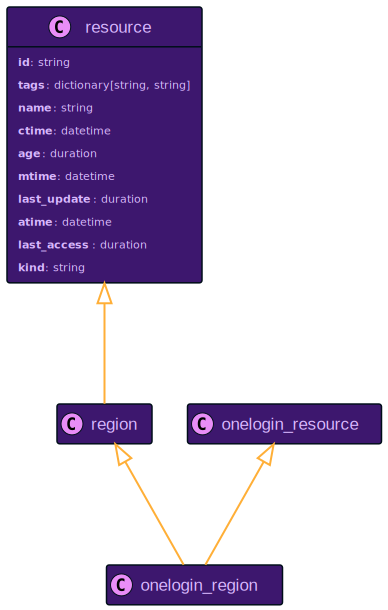
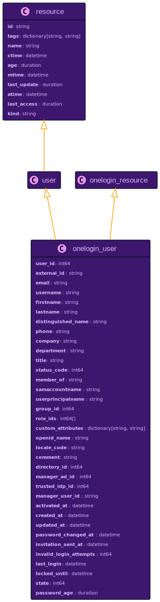

# OneLogin Resource Data Models

## `onelogin_account`

Relationship to Other Resources

## `onelogin_region`

Relationship to Other Resources

## `onelogin_user`

Relationship to Other Resources

