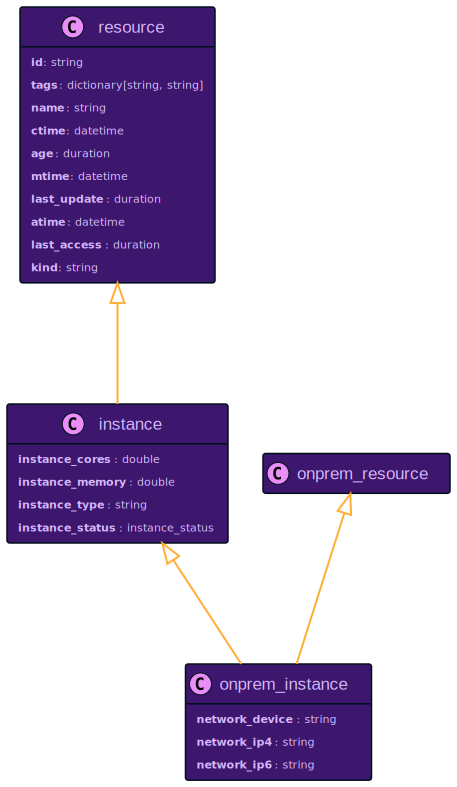
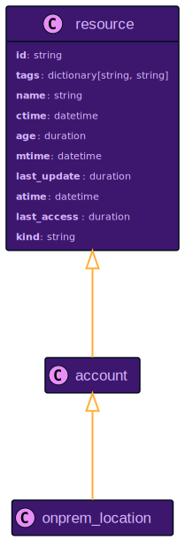
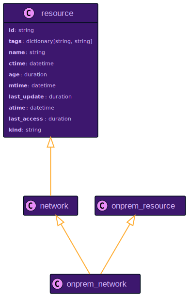
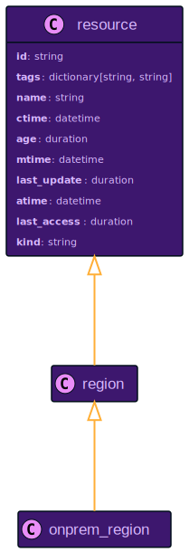

# On-Premises Resource Data Models

## `onprem_instance`

Relationship to Other Resources

## `onprem_location`

Relationship to Other Resources

## `onprem_network`

Relationship to Other Resources

## `onprem_region`

Relationship to Other Resources

