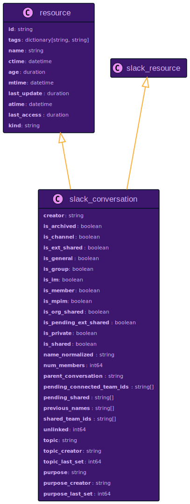
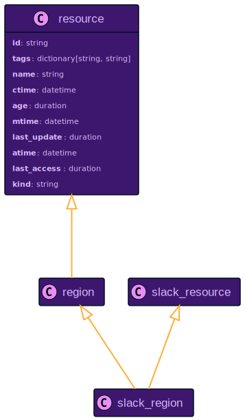
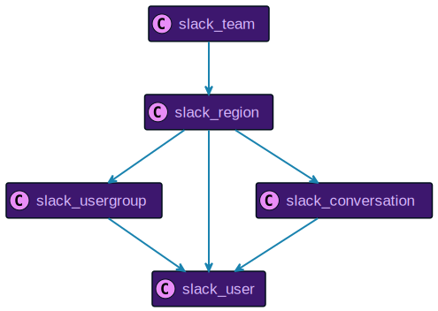
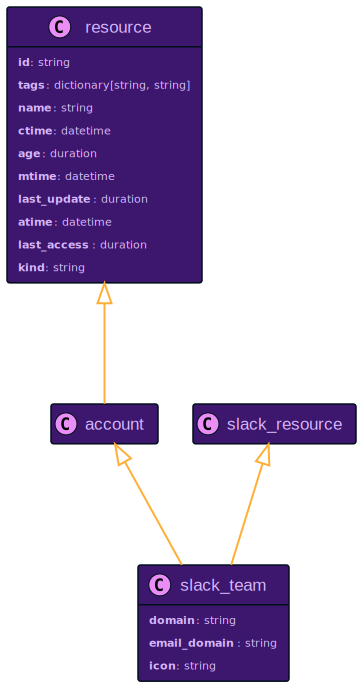
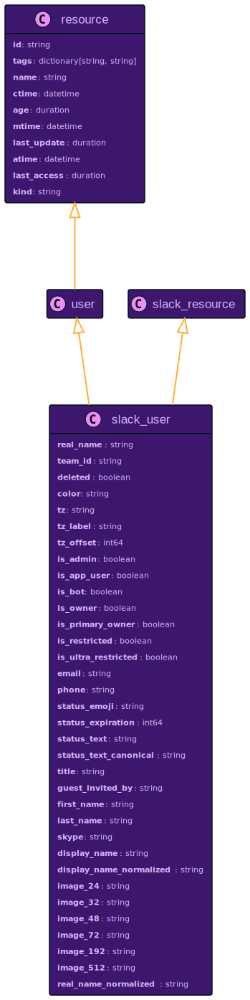
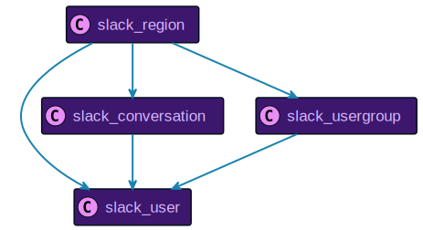
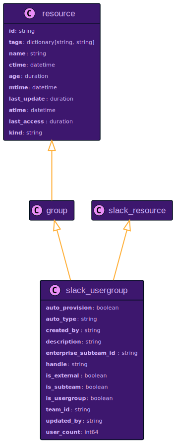
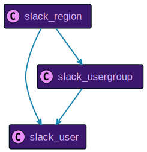

# Slack Resource Data Models

## `slack_conversation`

Relationship to Other Resources

## `slack_region`

Relationship to Other Resources

## `slack_team`

Relationship to Other Resources

## `slack_user`

Relationship to Other Resources

## `slack_usergroup`

Relationship to Other Resources

