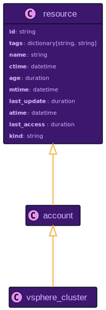
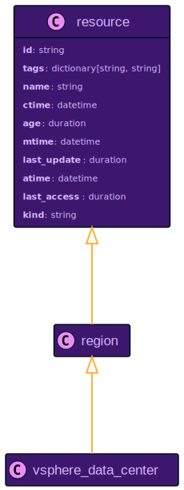
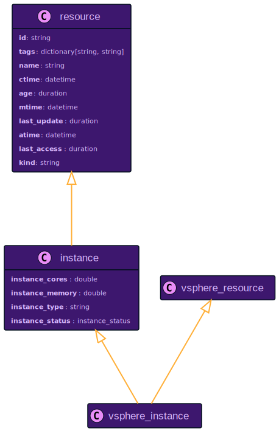

# VMware vSphere Resource Data Models

```mdx-code-block
import ZoomPanPinch from '@site/src/components/ZoomPanPinch';
```

## `vsphere_cluster`

<ZoomPanPinch>



</ZoomPanPinch>

<details>
<summary>Relationships to Other Resources</summary>
<div>
<ZoomPanPinch>


</ZoomPanPinch>
</div>
</details>

## `vsphere_data_center`

<ZoomPanPinch>



</ZoomPanPinch>

<details>
<summary>Relationships to Other Resources</summary>
<div>
<ZoomPanPinch>


</ZoomPanPinch>
</div>
</details>

## `vsphere_instance`

<ZoomPanPinch>



</ZoomPanPinch>

<details>
<summary>Relationships to Other Resources</summary>
<div>
<ZoomPanPinch>


</ZoomPanPinch>
</div>
</details>
