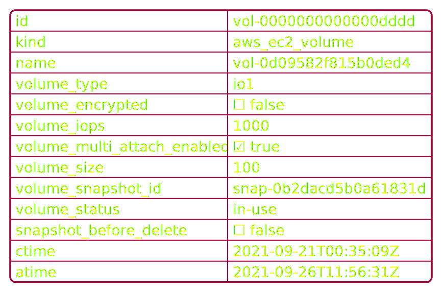

# Data Models

Resoto is able to collect data from different data sources that is maintained in a graph. It has a pluggable API to interface with different cloud providers.

The data model of the cloud providers is naturally defined by the cloud provider, so Resoto needs to deal with different data sources and different data models.

To make your life easier, Resoto introduces a model abstraction. Every resource collected by Resoto is described by a data model and checked for consistency during import time.

## `resource`

Every resource collected by Resoto has the kind `resource` as a base.

Here we see properties that are common to every resource, no matter the resource or cloud provider:


- `id`: identifier of this cloud specific resource.

  This identifier does not need to be unique over all resources.

- `name`: the cloud specific name of this resource.
- `kind`: this property is synthesized by Resoto and defines the concrete kind of this resource.

  **Example:** All collected [AWS EC2 Volumes](https://docs.aws.amazon.com/AWSCloudFormation/latest/UserGuide/aws-properties-ec2-ebs-volume.html) would be of kind `aws_ec2_volume`.

- `tags`: most cloud providers offer the ability to define tags on resources.

  Tags are simple key value pairs of type string that are held in a dictionary.

- `ctime`: the point in time when the resource has been created.

  :::note

  When the cloud provider does not provide this information, Resoto will set this property to the time, when it has discovered this resource the first time.

  :::

- `atime`: the last collected point in time when the resource has been accessed.

  :::note

  This this time is not available on all resources for all cloud providers. Resoto tries to do its best to synthesize the last access time based on the resource type.

  :::

  **Example:** AWS CloudWatch to detect last usage

- `mtime`: the last collected point in time when the resource has been modified.

  :::note

  This this time is not available on all resources for all cloud providers. Resoto tries to do its best to synthesize the last modification time based on the resource type.

  :::

## Resource Hierarchy

Resoto introduces a resource hierarchy. This hierarchy tries to do its best to abstract over the different data models from different cloud providers, delivering a consistent model to retrieve data from your different clouds.

Every concrete resource in Resoto has the `resource` kind as root.

Resoto introduces abstract model classes for almost all different resources that are collected.


Let us make this very clear by showing a specific example: [AWS EC2 Volume](https://docs.aws.amazon.com/AWSCloudFormation/latest/UserGuide/aws-properties-ec2-ebs-volume.html) is modeled as `aws_ec2_volume`. As you can see, the `aws_ec2_volume` introduces four properties.

It inherits from the base kind `volume`, which itself inherits all properties from base kind `resource`.

The complete data that is collected and stored would look like the following:



You might have noticed, that not only `aws_ec2_instance` is a subtype of `volume`, but also `gcp_disk`. A google cloud resource of type [Disk](https://cloud.google.com/compute/docs/reference/rest/v1/disks) is conceptually similar to an AWS EC2 Volume and shares quite some properties.

The model makes it easy to query conceptually common data and also to retrieve and reason about this data.

## `kind` CLI command

If you want to see all available kinds in the system, you can use the `kind` CLI command in `resh`.

```bash title="Example"
$> kind

- access_key
- account
- any
- autoscaling_group
- aws_account
  .
  .
```

If you want to see the properties of a specific kind use `kind <name>`:

```bash title="Example"
    > kind aws_ec2_volume
    name: aws_ec2_volume
    bases:
    - resource
    - volume
    - aws_ec2_volume
    properties:
    - name: id
      kind: string
    .
    .
```

## Complex and Simple Kinds

We have looked at complex kinds so far: a complex kind has a name and a set of properties.

Each property has a name and also a kind. The kind of such a property can be a complex or a simple kind.

There are several simple kinds that are available in Resoto out of the box:

| Kind       | JSON Type        | Example                                           |
| ---------- | ---------------- | ------------------------------------------------- |
| `string`   | `string`         | `"foo"`, `"bla"`, `"some long string"`            |
| `boolean`  | `boolean`        | `true`, `false`                                   |
| `null`     | `null`           | `null`                                            |
| `int32`    | `number`         | `1234`, `4321`, `-123`                            |
| `int64`    | `number`         | `1234`, `4321`, `-123`                            |
| `float`    | `number`         | `12`, `12.1234`, `-23.123`                        |
| `double`   | `number`         | `12, 12.1234, -23.123`                            |
| `datetime` | `string`         | `"2021-03-15T23:04:56Z"`, `"2021-03-15"`, `"-3d"` |
| `date`     | `string`         | `"2021-03-15"`, `"03/15/2021"`, `"-3d"`           |
| `any`      | any of the above | `null`, `true`, `"test"`, `123`, `-12.43`         |

Since Resoto uses JSON in order to exchange data, all the different simple types have to be expressed as simple type.

Resoto also introduces some additional simple types like `datetime` or `date`. The reason for this is the ability to coerce proper values from values given to Resoto.

Example: Let us assume a user want to query a resource by creation time. According to the model we would need to filter for the `ctime` property. Since Resoto knows the type of `ctime` (which is of kind datetime), it can do its best to interpret the value given by the user.

```
query ctime < "2018-09-28"
```

`ctime` is of type datetime. datetime is stored in Resoto always as ISO formatted datetime string. To make this query effective, the term `"2018-09-28"` is coerced into a valid datetime. Depending on the server time the value would be evaluated to something like:

```
query ctime < "2021-09-28T22:00:00Z"
```

This also allows the usage of relative times, when the type of the property is known as datetime. If we want to query resources, that have been created in the last 3 days, we could express this with a relative datetime.

```
query ctime > "-3d"
```

This translates the term `"-3d"` using the current server time into a valid datetime. On my machine this translates into:

```
query ctime > "2021-09-26T08:13:56Z"
```

The special type `any` is only used in scenarios, when the type is really not known and could be anything. Coercing is not possible for such a type.
