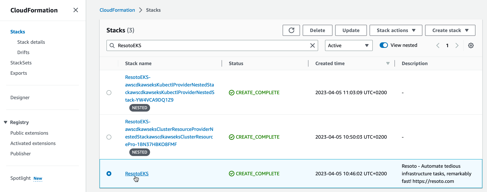

# Uninstall Resoto

```mdx-code-block
import LatestRelease from '@site/src/components/LatestRelease';
import VersionOnly from '@site/src/components/VersionOnly';
import TabItem from '@theme/TabItem';
import Tabs from '@theme/Tabs';
```

Not happy with Resoto? Tell us why! We'd love to hear your feedback.

Here are the steps to uninstall Resoto.

<Tabs groupId="install-method">
<TabItem value="aws" label="Amazon Web Services">

To remove the Resoto deployment and all associated resources:

1. Log in to the [AWS console](https://console.aws.amazon.com).

2. Select the region where you deployed Resoto, and open the CloudFormation service.

3. Select the `ResotoEKS` stack and click **Delete** button.

   

</TabItem>
<TabItem value="docker" label="Docker">

## Prerequisites

- [Docker](https://docs.docker.com/get-started#download-and-install-docker)
- [Docker Compose >= 1.29](https://docs.docker.com/compose/install)

## Steps

In the same directory where you ran `docker-compose up -d`, run the following command:

```bash
$ docker-compose down
```

</TabItem>
<TabItem value="kubernetes" label="Kubernetes">

## Prerequisites

- [Helm](https://helm.sh) (version 3 or above)

## Steps

Helm charts allow you to easily install, upgrade, and delete applications on Kubernetes. To uninstall Resoto, run the following command:

```bash
$ helm uninstall resoto
```

</TabItem>

</Tabs>
