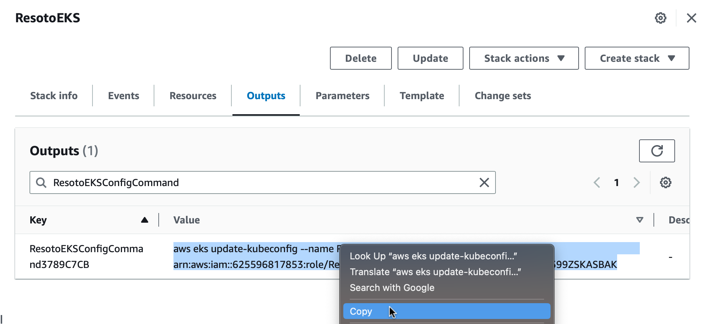

# Update Resoto

```mdx-code-block
import LatestRelease from '@site/src/components/LatestRelease';
import VersionOnly from '@site/src/components/VersionOnly';
import TabItem from '@theme/TabItem';
import Tabs from '@theme/Tabs';
```

We ship [new versions of Resoto](/news) regularly and recommend to update your installation.

To update your instance, follow the steps below.

<Tabs groupId="install-method">
<TabItem value="aws" label="Amazon Web Services">

## Prerequisites

- [AWS command-line interface](https://aws.amazon.com/cli)
- [Helm](https://helm.sh) (version 3 or above)

## Steps

1. Log in to the [AWS CloudFormation console](https://console.aws.amazon.com/cloudformation).

2. Click **Stacks**.

3. Enter `ResotoEKS` into the search box, and click on the stack you would like to upgrade.

   

4. Click the **Outputs** tab.

5. Enter `ResotoEKSConfigCommand` into the search box. There should be exactly one entry. Copy the value (`aws eks ...`).

   

6. Open a terminal and execute the copied command.

   

7. List installed Helm charts:

   ```bash
   $ helm list
   ​NAME  	NAMESPACE	CHART       	APP VERSION
   ​resoto	resoto   	resoto-0.7.4	3.3.1
   ```

   :::note

   The `APP VERSION` column displays the currently installed version of Resoto.

   :::

8. Add the [Some Engineering Helm chart repository](https://helm.some.engineering):

   ```bash
   $ helm repo add someengineering https://helm.some.engineering
   ```

9. Update cached chart information:

   ```bash
   $ helm repo update
   ```

10. Upgrade the `resoto` chart:

    ```bash
    $ helm upgrade resoto someengineering/resoto --atomic --reuse-values --set image.tag={{imageTag}}
    ```

</TabItem>
<TabItem value="docker" label="Docker">

## Prerequisites

- [Docker](https://docs.docker.com/get-started#download-and-install-docker)
- [Docker Compose >= 1.29](https://docs.docker.com/compose/install)

## Steps

1. Fetch the `docker-compose.yaml` file for the latest Resoto version. See the [list of versions](https://github.com/someengineering/resoto/releases) if you want to use a specific version.

   ```bash
   $ curl -Lo docker-compose.yaml {{dockerComposeUrl}}
   ```

2. Restart the services defined in the `docker-compose.yaml` file:

   ```bash
   $ docker-compose up -d
   ```

   :::note

   [Docker Compose V2 integrated compose functions in to the Docker platform.](https://docs.docker.com/compose/#compose-v2-and-the-new-docker-compose-command)

   In Docker Compose V2, the command is `docker compose` (no hyphen) instead of `docker-compose`.

   :::

   <VersionOnly allowed="current">

   :::info

   Resoto publishes packages for both x86 and ARM architectures for stable releases, but `edge` versions are only available for x86.

   If you have an Apple Silicon or other ARM-based machine, please use the latest stable release (<LatestRelease /> or `latest`).

   :::

   </VersionOnly>

</TabItem>
<TabItem value="kubernetes" label="Kubernetes">

## Prerequisites

- [Helm](https://helm.sh) (version 3 or above)

## Steps

1. List installed Helm charts:

   ```bash
   $ helm list
   ​NAME  	NAMESPACE	CHART       	APP VERSION
   ​resoto	resoto   	resoto-0.7.4	3.3.1
   ```

:::note

The `APP VERSION` column displays the currently installed version of Resoto.

:::

2. Add the [Some Engineering Helm chart repository](https://helm.some.engineering):

   ```bash
   $ helm repo add someengineering https://helm.some.engineering
   ```

3. Update cached chart information:

   ```bash
   $ helm repo update
   ```

4. Upgrade the `resoto` chart:

   ```bash
   $ helm upgrade resoto someengineering/resoto --atomic --reuse-values --set image.tag={{imageTag}}
   ```

</TabItem>

</Tabs>
